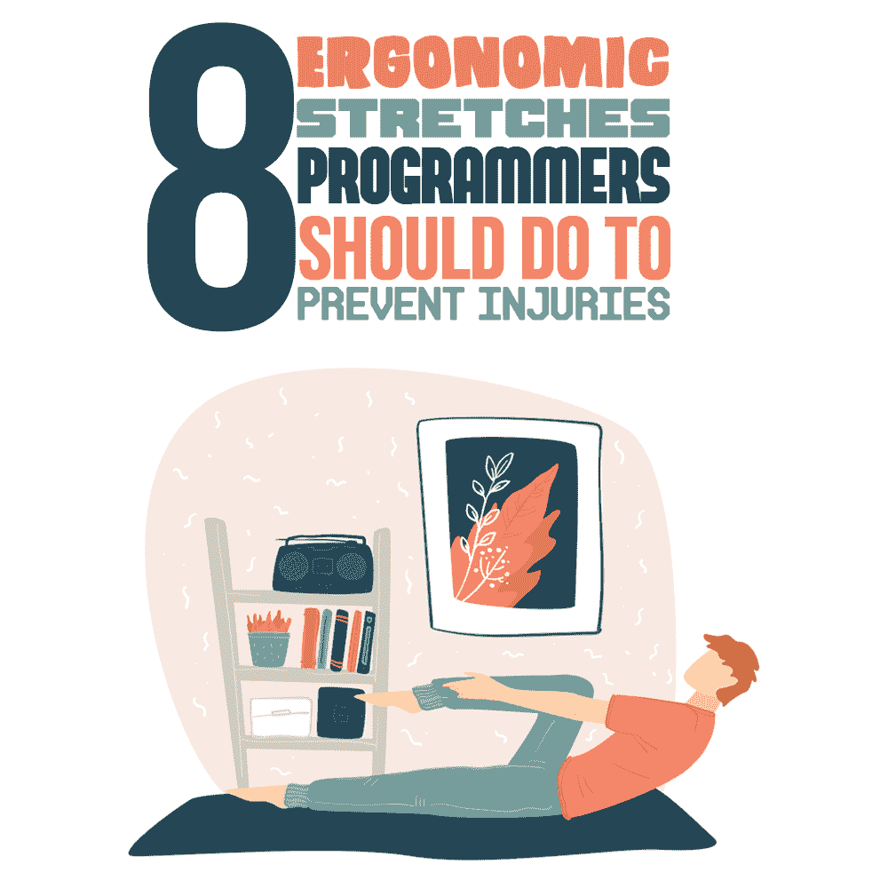
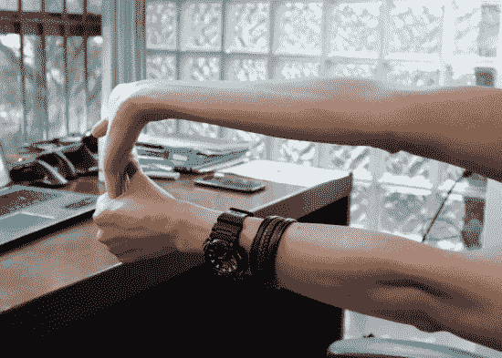
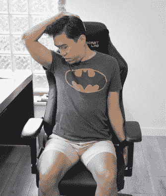
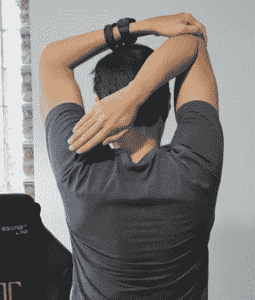
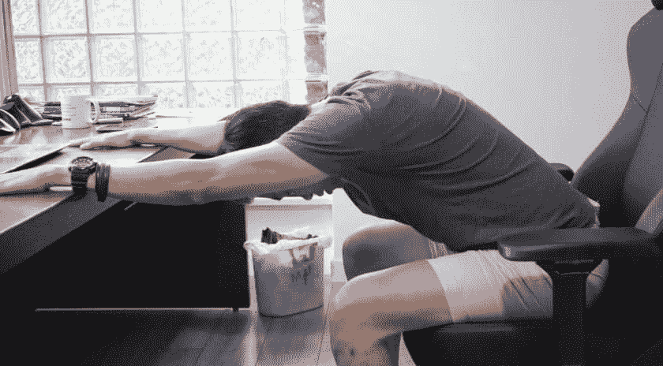
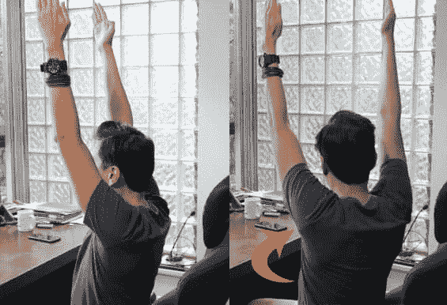
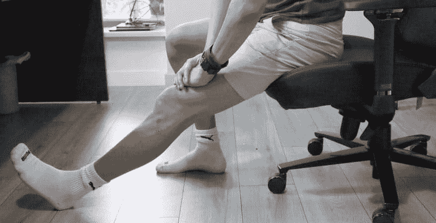
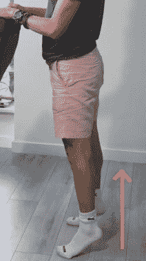

# 程序员应该做的防止受伤的 8 个人体工程学伸展动作

> 原文：<https://simpleprogrammer.com/ergonomic-stretches-for-programmers/>

Programming is one of the most rewarding yet potentially hazardous professions out there. I should know; I used to be a programmer before assuming my current role as an ergonomic consultant.

当你解决一个又一个的“谜语”时，时间过得飞快，直到所有的拼图都拼在一起。不知不觉中，你已经盯着电脑看了 10 个小时了。虽然它很少感觉那么长，但你的身体记录着它的每一秒钟。

不足为奇的是，根据统计数据，在以计算机为中心的工作中，多达四分之一的员工患有某种类型的重复性劳损，如腕管综合症和背痛。在《健康的程序员[一书中，作者乔·考特纳将 RSI 列为程序员职业生涯的最大威胁。](https://www.amazon.com/Healthy-Programmer-Better-Pragmatic-Programmers/dp/1937785319/r)

除了[定期休息](https://simpleprogrammer.com/healthy-software-programmer/)之外，防止 RSI 的最有效方法之一是经常使用过度使用或停滞的肌肉，以平衡和加强周围组织。为此，没有什么比定期拉伸更好的了。

在这篇文章中，我将分享程序员和广大计算机用户可以练习的八个最佳伸展动作，以减少受伤的机会，同时提高工作效率。

## 手和手腕练习

对于程序员来说，手和手腕处于承受压力的最前线，因为他们要编写 Python 函数或 JavaScript 循环的每个字母。由于这一事实，定期休息和伸展身体部位尤为重要。

根据一项涉及 92 名患者的研究,发现锻炼可以显著缓解腕部相关的重复性劳损，如腕管综合征。

这里有两种手部伸展运动，我总是告诉我的办公桌前的客户每天至少练习两次，但你可以在手指或手腕开始感到不适的时候做。关键是要听从你的身体。

### 基本手腕伸展

在长时间打字后，基本的手腕伸展是重新平衡手腕运动范围的最简单方法。

*   向前伸出手臂，手掌面向天花板。
*   用你的另一只手，轻轻地将伸出的手臂上的手指拉向你的身体，直到你感觉到拉伸。保持这个姿势至少五秒钟。
*   从头开始重复这个练习，用另一只手做。
*   做三到四组基本的手腕伸展运动。

### 手腕圈

这项运动是我最喜欢的恢复整个手腕的运动之一。要执行手腕转圈，请执行以下操作:

*   双臂向前伸直。
*   用你的双手握紧拳头。
*   当你用手腕转圈时，顺时针旋转你的右手腕，反方向旋转你的左手腕。做这个动作三到四圈。
*   现在交替方向(右手腕逆时针，左手腕顺时针)再转三到四圈。

## 颈部和肩部伸展

作为一名程序员，在长时间的编码会话后，您可能经常会感到脖子被掐或肩膀紧绷。研究证实了这些抱怨的高患病率，它表明高达 45.5%的办公室职员经历过颈部疼痛。

编码时感到脖子疼有很多原因，但主要原因是长时间盯着笔记本电脑屏幕。向下的角度给颈椎(颈部)带来巨大的压力，对颈部和肩部都有负面影响。

这里有两个很好的颈部和肩部伸展运动。

### 肩胛提肌伸展

肩胛提肌是连接颈部和肩部的肌肉；你脖子两边各有一个。如果你在这个区域感到疼痛或僵硬，做肩胛提肌拉伸真的有帮助。它可以站着或坐着进行。下面是如何做坐式的:

*   坐直，双手放在身体两侧。
*   伸直左手抓住座椅底部，打开胸部。
*   将你的头转向右边，将你的目光转向你的腋窝或者右边的口袋。
*   左手举过头顶，扣住后脑勺。轻轻下压，让头部更靠近腋下。
*   当你保持这个姿势五秒钟时，感觉你的颈椎后部有拉伸感。
*   在另一侧重复拉伸动作。

### 屈臂伸肩

这项运动是缓解紧张的肩膀并促进血液循环的最佳伸展运动之一。我说的是胳膊弯曲肩膀伸展:

*   以站立姿势开始，双脚与臀部同宽。
*   将右臂举过头顶，然后在肘部向左侧弯曲。
*   用左手抓住右肘，向左肩方向拉。
*   保持这个姿势大约 30 秒，然后在另一侧重复这个练习。

## 背部伸展

所有程序员都应该知道一个令人清醒的事实:根据美国脊椎治疗协会的调查，背痛是全球范围内导致残疾的唯一主要原因。事实上，背痛促使我在做了 10 多年程序员后转行。

防止背痛的一个重要部分是经常接触该区域，以加强肌肉并带来一些急需的血液循环。这里有两个背部伸展运动可以做到这一点。

### 面向下犬式伸展

当谈到背痛时，瑜伽在许多文献中被提到是一种对抗甚至治愈背痛的有效方法。关于这个主题，我最喜欢的书之一是罗兰·菲什曼的《背痛瑜伽》。

每个瑜伽爱好者都知道著名的下犬式伸展，但你知道这项运动也可以坐着进行吗？怎么样怎么样:

*   从坐在椅子上开始，背部挺直。
*   将你的手向上举向天花板，手掌背对着你。
*   腰部逐渐向前弯曲，直到双手和前臂平放在面前的桌子上。确保在整个过程中保持背部挺直。
*   保持你的脖子活动，这样它就不会掉下来。保持这个姿势 10 秒钟，然后慢慢恢复。

### 脊柱扭转

这项运动不仅有助于缓解下背部的疼痛，还能促进脊柱的灵活性和良好的消化能力。请遵循以下步骤:

*   当你坐在椅子上时，向上举起你的手臂，这样你的手掌就会彼此面对。
*   尽可能向右旋转上半身，同时保持双臂在空中。
*   (可选)当你呼气时，放下你的手臂，使它们与你的肩膀同高。
*   恢复你的起始姿势，在另一边表演。你最多可以做五组，每边交替进行。

## 腿部伸展

长时间坐着也会对你的腿造成损害。如此长时间的坐着会导致血液聚集在你的腿部，对你的血管施加不必要的压力，导致疼痛和麻木。

事实上，久坐会导致静脉曲张，这是一种影响超过 3000 万美国人的疾病。为了避免这种不愉快的情况，经常起来伸展双腿是至关重要的。

做这些伸展运动来缓解腿脚的疼痛和麻木。

### 腘绳肌伸展

这项运动对放松腿筋肌肉和释放长时间坐着后大腿下面的压力很有帮助。

*   坐在座位边上，双脚平放在地板上。
*   在你的柔韧性允许的情况下，伸直你的左腿，膝盖伸直。
*   腰部弯曲，逐渐向前伸。用手臂轻轻下压左大腿或膝盖，进一步伸直活动腿。保持背部和脊柱挺直。
*   保持这个向前的姿势至少 10 秒钟。从头开始再重复这个过程三次，然后在你的左侧也这样做。

### 小腿抬高

抬高小腿是一个简单易行的动作，可以有效地拉伸你的小腿肌肉。我每天在办公椅后面做一次。

*   从站立姿势开始。你可以站在你的桌子或椅子后面，但是要确保你有东西可以抓着支撑
*   尽可能抬高你的脚跟，用五个脚趾保持稳定。
*   逐渐放低身体，让脚后跟再次接触地面。
*   目标是做三组 10 次的小腿提举，以确保你充分伸展你的双腿。

## 简单而有效的解决方案

作为一名程序员，很容易迷失在工作中。这是一把双刃剑，一方面会带来巨大的满足感，但另一方面，也会对你的身心健康造成潜在的严重损害。

伸展运动是抵消每天长时间在电脑前工作的负面影响的最简单也是最有效的方法之一。关键是坚持不懈:努力每天至少伸展身体两次，至少每小时起来活动一次。

我认为，在短短几天内，你不仅会感觉身体更好，而且会注意到你的注意力和更快完成工作的能力有所提高。它为我做了这个。