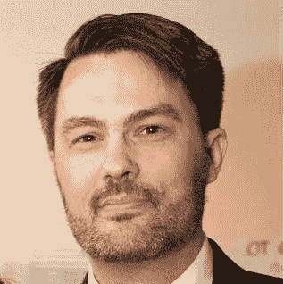

# 埃里克·格罗斯正在教人们如何编码

> 原文:[https://simple programmer . com/Erik-gross-is-teaching-people-how-to-code/](https://simpleprogrammer.com/erik-gross-is-teaching-people-how-to-code/)

开发者训练营是当今非常热门的话题。

开发者训练营的想法有很多神秘之处，很难判断它是否值得追求。

例如，如果你今天刚刚开始，你是去训练营还是去传统大学更好？

哪个会让你为未来做更好的准备，哪个会让你找到更好的工作？

我有机会采访了科技学院的埃里克·格罗斯，了解了新兵训练营的总体情况，尤其是他的新兵训练营。

该技术学院的创始人埃里克格罗斯是一个熟练的。NET 开发人员、顾问和导师，在波特兰 IT 社区有多年的经验。

埃里克分享了丰富的知识和一个有趣的故事，关于他如何开始他的新兵训练营。你可以在这里找到采访视频。

我还让 Erik 写下了一些问题的答案，你可以在下面找到。

你可能想知道我是否在科技学院有某种形式的财务利益，因为我在这里推广它，但完全公开的是，我没有。我只是碰巧喜欢 Erik 正在做的事情，并觉得他正在以正确的方式做训练营的事情，这将真正有益于人们，我想分享他的故事。

希望你喜欢。

## 问:你的技术背景是什么？

我从 11 岁开始就一直和电脑打交道。我父亲在 20 世纪 60 年代为 IBM 大型机编程，他告诉我他和他的伙伴们过去常常围坐在一起，谈论如果有一台小到你可以放在办公桌上的电脑，那该有多酷。所以，当个人电脑在 80 年代初问世时，爸爸马上买了一台。

我记得他拿着一把 VIC-20 走进来的时候。如果我记得的话，它大约是 300 美元，那是我的家庭当时确实负担不起的。我不知道他是怎么做到的，但我永远感激我的父亲。

爸爸做的第一件事就是打开机器，给我看里面的东西。因此，我立刻学会了这些机器如何工作的基本原理。事后看来，这是一个关键时刻——它带走了这个神奇设备的所有神秘色彩。我了解了计算机在最基本的层面上在做什么，因此在此基础上的任何复杂层次都变得容易理解了。这种理解帮助了我一生——也是我们技术学院新兵训练营项目的基础。

正如我想通过高中，我学习了各种语言和技术 BASIC，Pascal，DBase 和更多。事实上，我在当地的 Radio Shack 商店自学了基础知识——他们有一台华丽的 TRS-80，没人会碰它。它被放在一个基座上。我几乎每天下午放学后都去那里，翻阅手册，直到我能给电脑编程。

步入成年后，我加入了美国海军的核推进计划，并接受了电子技师的培训。培训的一部分包括深入研究摩托罗拉 68000 芯片的硬件和软件。这进一步强化了技术的基础。正因为如此，多年来发生的每一项技术变革对我来说都很容易接受和运用。

在海军，我第一次有机会教授技术——数字电路、计算机体系结构、物理、电子、核能等课程的课堂教学。我还有幸参加了一个竞争激烈的电子故障排除课程——每年可能有 10 到 20 人被录取。实际上，我在那里学到了很多关于如何像一个开发者一样思考的东西。这是非常实际和现实的-我们得到了一些最具挑战性的缺陷的复制品，这些缺陷实际上已经在车队中出现，我们必须修复它们。我每天都在使用这些课程——这是大约 25 年前的事了！

当我离开海军时，我成为了本世纪初网络泡沫之前科技繁荣的一部分。我学习了 Java，Visual Basic，web 开发(男孩已经走了很长的路！)等等。

当。Net 框架击中现场，我印象深刻。微软在快速应用程序开发方面的工作一直很努力，我特别高兴看到他们现在的情况——拥抱开源，为开发者服务。

我目前的堆栈包括一套非常多样化的技术——c#/。NET、MVC、Python、Angular、Node 等等。作为让我们的课程保持最新和全面的主要力量，我是一个幸运的极客，可以查看最新和最棒的东西。在科技学院，我们在课程方面可以相当灵活，所以我一直在关注市场，看看什么在增加吸引力。

## 问:你是如何涉足编码训练营行业的？

我在海军的教学经历让我看到了教学中的快乐和满足。从那以后，我一直担任导师和培训角色。

就新兵训练营而言，当我开始培训初级开发人员时，我还没有听说过它。实际上，我只是需要更多的入门级开发人员来完成我自己的副业项目——所以我开始研究如何培训聪明人，让他们掌握处理项目中一些繁重工作所需的技能。

事情进展得很顺利，有一天，我最小的儿子从高中回家，告诉我他想去一个开发者训练营。我说，“什么是开发者训练营？”我想，这是 2012 年末或 2013 年初的某个时候。所以我谷歌了一下，差点就疯了。我看到纽约湾区的人们在做什么，我说“就是这样。就在那里——这就是我想做的。”所以我坐在厨房的桌子旁，把它画了出来——整个培训模型、技术栈等等。当然，从那以后它已经成长了很多，但这只是开始。

事实证明，我从 11 岁开始所做的一切都是为这个行业做的完美准备——强大的技术基础知识，经验教学和指导，工作软件开发人员的务实态度——所以我们在技术学院创建的培训计划反映了所有这些。

当我请来了我的联合创始人杰克·斯坦利时，我们才真正开始起步。他带来了必要的商业经验和纪律，使这项活动变得稳定、成熟和可行，并在此基础上发展壮大。

因此，我们现在发现自己处于一个很好的位置——我们实际上是年轻新兵训练营行业的资深成员，我们正在产生惊人的结果(我们培养的每一个毕业生都在技术领域获得了聘用),我们已经准备好利用我们的完全远程培训系统进行扩展。

## 问:你如何解释编码训练营行业的快速成功？

我看到了几个关键因素，这些因素让我们认识到，这种非正统的进入该行业的方式已经变得可行。

首当其冲的是技术人才的短缺。虽然这在其他地方有充分的记录，但一个显而易见的事实是，我们有更多的技术工作岗位，而我们没有足够的人才来填补这些岗位。我有时会看到一些文章，试图说明实际上并不存在短缺。我把这归因于一种不加掩饰的制造争议的企图。我的经验表明，我们确实存在短缺，而且该行业正开始面对这样一个事实:不寻常的情况可能需要不寻常的解决方案。所以我们有了这些成功的新兵训练营。

另一个因素是改变技术领域多样性的强大推动力。在这方面已经做了大量的工作，我完全支持。由于新兵训练营可以提供一种快速进入该领域的方式，我认为他们比传统的大学路线更有吸引力，因为那些人不一定在早期教育中将技术视为合理或可行的职业道路。

最后，新兵训练营可以为职业人士或家庭主妇提供一种职业转型的方式，他们不必在工作或维持家庭的同时想办法获得四年制学位。如果新兵训练营提供兼职选择，这一点尤其有效——学生可以在学习技能的同时继续工作，并向技术转型。

## 问:什么样的人应该考虑参加新兵训练营？

我们看到的那些在新兵训练营模式中取得成功的人有一些共同的特征。

通常，他们已经尝试了一两个学习编码的在线培训资源——足以让他们意识到他们喜欢挑战，并对这个主题有一些亲切感。

我们还看到，他们是愿意学习的人——也就是说，他们不会自动拒绝他们看到的任何新数据或方法，坚持认为他们“已经知道了一切”。我们都认识这样的人。在技术学院，我们通常不接受这样的人——我们喜欢毕业的人，我们很乐意和他们一起工作，我真的不喜欢和这样的人一起工作。所以就应该考虑这条路线的人而言，我认为最基本的品质应该是友好和乐于助人。

当然，你应该是一个相当聪明的人。有一种误解认为计算机程序员需要有点数学天才。这与事实相去甚远。大多数计算机编程只需要你能想到的最基本的数学技能。如果你会加减乘除，你会做得很好。可以肯定的是，一些编程任务可能需要高级数学知识——但通常情况是，驱动软件创建的业务需求依赖于高级数学——在这种情况下，开发人员通常会与拥有所需数学技能的行业专家携手工作。

## 问:有兴趣的人应该在新兵训练营中寻找什么？

我建议寻找这些东西:

自下而上的方法。这基本上意味着培训计划将从建立计算机基础、编程基础和技术本身的坚实基础开始，然后才继续教授特定的复杂计算机语言和技术。

与此相反的是自上而下的方法，在这种方法中，学生将直接使用复杂的计算机语言或一套技术，试图用它来制作软件。我们的期望是，在这个过程中，学生将能够解决他们正在使用的技术的基础问题。一些人可以做到这一点，许多人不能——与此同时，你正在被误解的技术词汇、复杂的理论、没有相对重要性指导的数据以及其他非常真实的理解挑战的海洋中游泳。

这种方法在新兵训练营中太常见了——我差点就掉进去了。像科技学院一样，大多数训练营都是由经验丰富的科技专业人士创建的。对我们来说，抓住一些新兴的语言或框架并投入进去，在周末做一个项目并不是真正的挑战。我们可以在这方面取得成功，因为我们有多年的知识和经验来帮助我们应对学习的挑战。一个缺乏深度知识和经验的人将会过得很艰难。

我还会推荐一种基于熟练程度的培训模式——也就是说，完成你的新兵训练营学习的标准，或者新兵训练营本身，是你是否理解你所学的内容并能够应用。我们大多数人成长过程中的传统学术模式是我们用时间换取分数——就像我们说的，“学习化学 12 周等于对化学的 B 级理解”。这种模式越来越受到教育界的质疑，而且理由充分。我不会想开车经过一个学习成绩为 C 的工程师建造的桥。

如果新兵训练营有一种训练方法，可以确保学生真正理解所教的每一个科目，并且学生可以在实际工作中应用这些科目，那么你就是一个新兵训练营的好学生。毕竟，新兵训练营的主要优势之一是，他们应该能够让你获得市场想要招聘的热门语言和技术的实用技能。

最后，看看你是否喜欢新兵训练营的人。你将与他们合作，最终目标是帮助你打入这个领域——与你喜欢的人一起工作很愉快。