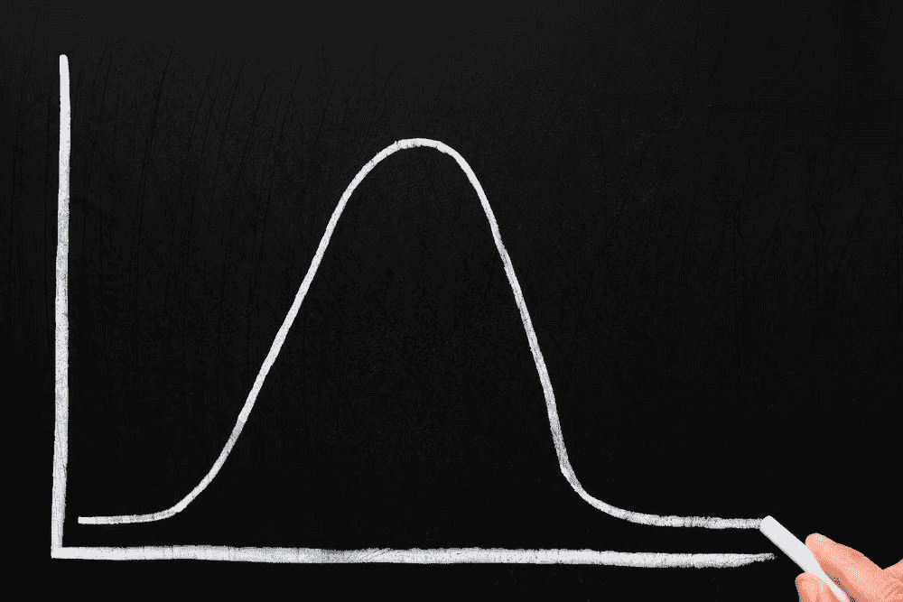

# 逃离局部极大值

> 原文：<https://simpleprogrammer.com/escaping-local-maxima/>

在数学中，一个函数有一个最大值和最小值。这意味着存在函数值最高或最低的点。单词 maxima 是 maximum 的复数形式。对于某些给定的函数，最大值可能不止一个。极小也是如此。

像数学函数一样，软件开发团队的生产力和产出随着系统输入的变化而有最大值和最小值。这些输入可以包括团队的规模、成员的经验、使用的工具以及用于交付产品的过程。

用不同的方法处理团队面临的问题，团队的影响和成功会有所不同。一些实践、平台和语言比其他的更适合团队、个人和问题。

## 数学课

最大值和最小值是函数中的点，当用图形表示时，它们是曲线上的波峰和波谷。

这些感兴趣的点是函数具有最大值和最小值的地方，至少在由给定点的邻域界定的区域中。

局部最大值是有界区域内最大函数输出的点。全局最大值是整个函数域的最大函数输出点。如果一个函数在多个点上具有相等的输出，并且该输出是该函数在其整个定义域上的最大值，则该函数只能有一个以上的全局最大值(对于常数函数，每个点都是全局最大值)。

任何小于全局最大值的最大值仅仅是局部最大值。它是一系列输入值中最大输出值的点。它是代表函数值的曲线上的一个峰值。

这有点像那句古老的谚语“小池塘里的大鱼”。局部最大值是在一个有限的区域内你能做的最好的，但是在其他地方可能有更大更高的峰值。

## 软件创建者生产力作为一种功能

现在考虑一下，软件团队交付的价值。会有一些函数将团队的输出描述为组成团队的许多输入的函数。投入包括团队的规模、才能、经验、领导力、专业知识、奉献精神和同志情谊。其他重要的输入包括团队使用的平台、语言和工具。

为了简单起见，我们可以想象保持所有其他事情不变，并专注于一些事情，如我们用给定语言提供的结构处理问题的方式。生产力和交付可以被认为是一个数量(尽管很难测量)，它是思维方式和所用方法的函数(尤其是在语言如何实现关于问题的思考方式的帮助下)。

如果你愿意的话，画一个有波峰和波谷的函数图。它是一个不规则的形状，在水平轴上代表您的[编程](https://simpleprogrammer.com/2010/08/10/book-review-the-pragmatic-programmer/)方法(带有完全教条地遵循给定方法的离散位置，以及中间混合的连续体)。在纵轴上，我们的因变量是执行和交付能力。

我承认这个图表在处理不同类型的问题时会有不同的特征和价值，但我想保持简单，忽略这个论点，以避免偏离中心点。

这个图表将显示在不同的解决问题的方法的领域中许多局部最大值和最小值的点。一些最大值会比其他的更高。

在决定我们如何交付软件，从他人的例子中学习，并在职业生涯中进行试验的过程中，我们正在穿越这条曲线。有了适当的反馈循环，我们经常可以看到我们正在爬上一个斜坡，以提高生产率，或者下降到较低的交付价值。

敏捷宣言的一个重点是思考什么可行，什么不可行。这是关于使用来自交付机器的反馈来纠正过程，并随着时间的推移变得更好。

然而，这种方法有一个危险。知道你在爬山是好的，但是你怎么知道你在爬正确的山呢？你怎么知道你没有错过一座山？可能你已经或者即将到达一个顶峰。然而，你可能会到达一个更高的顶峰。

## PragDave 提供观点

在我的播客《开发商着火了》的一集[中，我与](http://developeronfire.com/Podcast/Episodes/dave-thomas-programmer-first)[迪夫·托马斯](https://pragprog.com/about)进行了交谈。Dave 是一位杰出的开发人员、作家、出版商，也是一位令人印象深刻的人。他和他在编程、写作和出版领域的合作伙伴[安迪·亨特](http://toolshed.com/about.html)，作为传奇软件圣经的作者[，务实的程序员](https://pragprog.com/book/tpp/the-pragmatic-programmer)而闻名。

Dave 拥有几十年的训练实践和语言与实践实验的智慧。当我问及[他现在对长生不老药的感觉与他多年前用 Ruby 催化的革命有什么相似之处时](http://gotocon.com/chicago-2014/presentation/Elixir:%20The%20Power%20of%20Erlang,%20the%20Joy%20of%20Ruby)，他强调了传递新的思维方式的东西的兴奋。其中的原因令人惊讶且精彩。

这段对话开始于节目的 34:55 分。

“我发现长生不老药打开了我的思维，就像我第一次开始使用 Ruby 打开我的思维一样，对我来说，这是一种愉快的体验。我喜欢学习新东西。我喜欢用不同的方式把东西放在一起。当你学到一些东西的时候，你就把你已经知道的所有这些不同的东西联系起来，这就是协同作用的来源；这就是啊哈时刻到来的地方。有了长生不老药，他们来的更快，因为对我来说，这是新的，他们谈论的许多技术都是新的。”

他继续分享为什么新的思维方式如此有价值，并让我们朝着更好的方向前进。除了与众不同的工作带来的兴奋和乐趣之外，还有一个更大的原因来扩展你处理问题的专业范围。

“一部分是光明闪亮的新事物，但另一部分是这种潜在的感觉，即我们现在做得不对，我不知道正确是什么意思。这是一种探索，试图找到比我们现在做的更好的方法，因为我们现在做得不对让我很恼火。”

Dave 在认识到他所做的事情是次优的过程中找到了快乐(我更喜欢说次优而不是“做错了”，因为我们所做的事情可能很好，而指责某人做错了可能会引起分歧——关键是我们可以做得更好)。这是看待形势的一种独特方式。人们很容易把对某件事不如预期的认识视为沮丧的来源。

迪夫·托马斯认为这是一个提高软件开发实践水平的机会。

他认识到，我们现在所处的位置和我们可能达到的位置之间的这些差距，是通过寻找从一个进展缓慢的地方前进到一个新的斜坡上去的方法来提高的机会。

他想让未来解决问题变得更容易，而不是仅仅试图解决当前的问题。

他强调要逃离局部最大值，去寻找另一个比你目前所处的最大值更高的最大值。

多么伟大的看待事物的方式。

## 识别局部最大值

## 

T2】

当项目进展顺利时，团队成员可能很难意识到还可以更好。局部最大值通常是一个点，在这个点上，事情已经变得尽可能好了。

虽然在你目前的状态下尽你所能并不是一场灾难，但知道你可以做得更好应该是努力寻找更好的经营方式的动力。

知道自己做得很好，但没有提高，这通常是你处于最佳状态的标志。不可能知道那个地方是否真的是全球最大值，或者是否有更好的地方。可以有把握地假设，尽管我们可以尝试接近理想的实践，但我们永远也不会到达那里。同样可以肯定的是，总有改进的空间。

鉴于你可以提高，你在当地的最大值。你可能有机会变得更好。

你要避免像《星球大战》传奇中的阿克巴上将一样，他认为只有在叛军完全投入且没有任何应急措施的情况下，对令人生畏的帝国战斗站的攻击才等同于落入陷阱。

## 逃离陷阱

如果你发现你的工作场所在交付过程方面没有改善，这可能是一个尝试不同东西的好时机。

即使你没有发现一个局部的最大值和一个改变以成长的需要，你也可以总是尝试新事物，以防你偶然发现了可以改善一切的东西。

以下是一些例子，你可以尝试跳出局部最大值，改变你的大脑处理问题的方式:

T2】

*   尝试不同类型的技术
*   如果这不是你已经在做的事情，试试[结对编程](https://en.wikipedia.org/wiki/Pair_programming)。当你这么做的时候，深入挖掘肯特·贝克的经典[极限编程](http://www.amazon.com/exec/obidos/ASIN/0321278658/makithecompsi-20)中提供的所有思想。
*   将结对编程发挥到极致——尝试 [mob 编程](https://en.wikipedia.org/wiki/Mob_programming)
*   突出一个没有被请求的特性来决定它是否能提供价值(要清楚这是一个实验，而不是交付，有一个合适的实验时间表)
*   和你的团队一起尝试[行为驱动开发(BDD)](http://dannorth.net/introducing-bdd/)(BDD 不仅仅是一种工具的选择，就像它经常被描绘的那样，而是一种与团队合作并融合技术和非技术团队成员的方式。)要获得将这一方法应用于团队的好资源，可以试试戈杰科·阿季奇的[弥合沟通鸿沟](http://www.amazon.com/exec/obidos/ASIN/0955683610/makithecompsi-20)。尽管他更多地使用术语敏捷验收测试而不是 BDD，但是概念是相同的。
*   采取不同的测试方法——如果你教条地实践测试驱动开发(TDD ),试着放松你的方法——如果你不 TDD，给它一个机会——通过你的用户界面做更多或更少的测试，看看结果如何
*   [使用不同的语言](https://simpleprogrammer.com/2015/09/25/do-you-need-to-know-more-than-one-language/)–如果你以前只使用过面向对象的语言，就使用函数式语言，反之亦然
*   使用运行不同操作系统的开发机器，并学习如何使用键盘操作该系统
*   尝试使用不同于通常使用的数据存储类型

即使你实现的东西从来没有融入到你的应用程序中，也没有被任何人使用，你已经让自己接触到了一些新的东西，拓展了你的思维。找到不同的方法会让你更有价值，更有能力处理不同的问题。此外，你可能会发现另一个更高的生产力/质量的高峰。

## 继续谈论它

我邀请你继续这个对话。请评论你的想法，如何确定你处于局部最大值，并有可能找到一个更高的值。也请添加您对如何实施这一举措以及寻找更新更好的运营方式的想法。