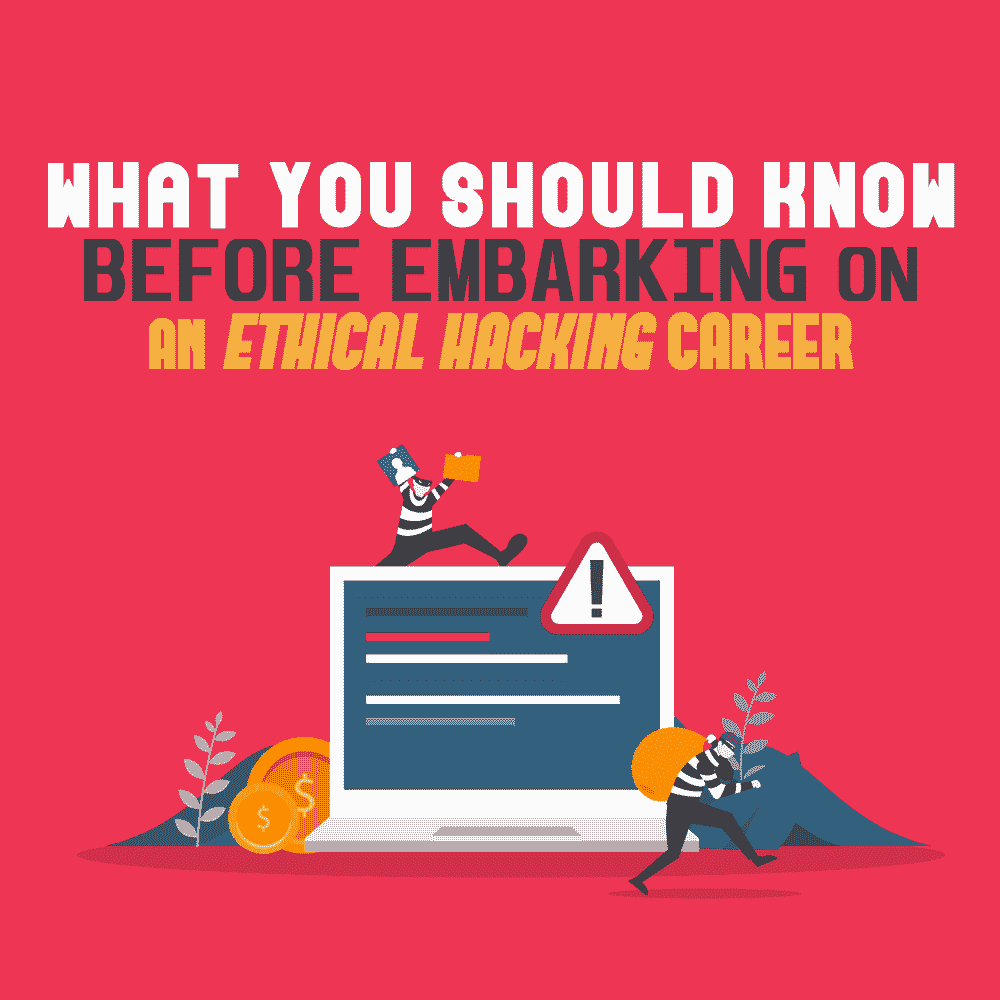

# 在开始职业黑客生涯之前，你应该知道什么

> 原文：<https://simpleprogrammer.com/ethical-hacking-career/>

The word “hacker” conjures up images of individuals in dark, dingy basements, breaking into servers or initiating ransomware attacks. It’s an exaggerated image that’s been portrayed time and again by the media, but it’s just one part of the hacking world.

一般来说，有三种类型的黑客:

*   黑帽黑客(或者你应该警惕的网络罪犯)
*   Greyhat 黑客(或者激进分子和以黑客为乐的人)
*   怀特哈特黑客(或帮助企业更好地保护其基础设施的道德黑客)

随着数据泄露事件层出不穷，加强企业基础设施需要创造性思维和非正统方法。这就是道德黑客的用武之地。

道德黑客可能是一个令人兴奋的职业选择，有很多机会。但是在你开始职业黑客生涯之前，有一些事情你应该知道。这正是我将在这篇文章中与你分享的，所以请继续阅读！

## 什么是道德黑客？

[道德黑客](https://artmotion.eu/en/insights/blog/whats-the-difference-between-a-whitehat-hacker-and-a-blackhat-hacker.html)是由企业雇佣的[网络安全专家](https://simpleprogrammer.com/cybersecurity-basics-for-new-programmers/)来故意破坏他们的系统。他们专门从事[渗透测试](https://www.amazon.com/dp/1119684307/makithecompsi-20)来找出如何破解一些东西。

这种方法有助于在威胁参与者利用潜在弱点之前识别和纠正它们。如果你认为这都是语义学，那你就对了。怀特哈特的黑客行为之所以“合乎道德”,是因为企业雇佣了一名专业人士来攻击它们的基础设施。

随着连接到互联网的设备数量和在线存储的数据量的增加，道德黑客现在对于确保隐私、安全和法规遵从性至关重要。一些流行的道德黑客方法包括云安全测试、基础设施测试和渗透测试。

## 如何成为一名有道德的黑客？

道德黑客之路并不平坦。对许多人来说，它开始于生命的早期，有时是出于需要。道德黑客、 [Citadelo](https://citadelo.com/en/) 董事会成员马丁·哈尼奇说他从事黑客工作“因为在拨号调制解调器时代，每个人都必须是黑客”

他的主要动机不是金钱利益，而是学习。这一切都是从他通过手机短信免费使用诺基亚 7110 在 IRC 上聊天开始的。然而，在企业界呆了 15 年后，他才开始认真对待道德黑客行为。

Hanic 加入 whitehat hacking 是因为他对 IT 安全状况不满。他和他的朋友使用的技术产品的安全缺陷加剧了这种感觉。他想用自己的技能去帮助别人，并在这个过程中获得乐趣。

“职业道德黑客生涯的主要好处是你每天都能学到新东西。你必须这么做。你必须开始创造性地思考，有时甚至会想出一些疯狂的想法。但我最喜欢的是打破东西获得报酬，”哈尼奇补充道。

有时软件工程师出于需要成为道德黑客。例如，为了降低风险，他们的任务是识别企业基础设施中的弱点，并且乐在其中，永不回头。

然而，职业道德黑客也有不利的一面。例如，看到到处都是安全漏洞会令人沮丧。你也可能会发现使用新产品很困难，因为你对风险的意识太强了。和传统的保安工作一样，你不能和朋友家人讨论你的工作。

## 如何像黑客一样思考？

道德黑客不依赖于学位或证书。在很大程度上，这归结于实践技能和知识。“以我的经验来看，你真的必须知道如何建立一个东西，才能理解如何打破它，”哈尼克说。成为一名高效、有道德的黑客的关键是深入了解软件和相关技术是如何工作的。

要像黑帽黑客一样思考，你必须决定你要专注于哪一类。无论是移动应用、企业网络还是云技术，它都将有助于缩小你的关注范围，积累专业知识。然而，你需要熟悉技术的所有方面。

Hanic 认为熟悉所有编程语言(或者至少是最流行的语言)及其基本概念是很重要的。例如，如果你想开始黑网站，你必须知道 JavaScript。当您扩大攻击范围时，学习 Bash、Python 和 Golang 也会有所帮助。

Hanic 生活中典型的一天是这样的:“我会阅读新闻，喝杯咖啡，盯着屏幕，试图理解测试目标是如何工作的。然后我会喝更多的咖啡，看更多的文档，开始用棍子戳 app。我会做一些笔记，喝更多的咖啡，做更多的笔记，盯着屏幕看更多的时间。然后我会有一个灵光一现的时刻，我开始大喊。这时，我终于找到了一个漏洞来利用。然后整个过程重复。”

## 道德黑客使用的工具有哪些？

有道德的黑客和坏人使用同样的工具。黑暗之网充满了他们，但这还不够。您还必须根据您的具体黑客任务构建自己的工具。

一些领先的黑客工具如下:

*   Acunetix
*   专业打嗝套装
*   开膛手约翰
*   命运
*   渗透测试指南
*   侦测程式
*   网络映射器
*   涅索斯
*   Nikto
*   麋鹿
*   Wireshark

The tools listed above help breach enterprise systems in different ways. For example, Acunetix is a vulnerability scanner, and Kismet is a network detector and packet sniffer. On the other hand, John the Ripper is a free and open-source password-cracking tool.

根据 Hanic 的说法，黑客攻击的阶段是“侦察、信息收集、利用、权限提升、后期利用、在其他网络中的旋转”。工作量很大啊！”

然而，不管你使用什么工具或做什么，道德黑客都是关于日常工作的学习。这是一场猫捉老鼠的游戏，我们需要玩下去。在这种情况下，黑帽黑客占了上风，因为他们只需要找出一个弱点。但是如果你给他们制造困难，利润就会减少，吸引力也会降低。

## 想成为一名有道德的黑客？

一个合乎道德的黑客职业可以令人满意。在当前的威胁形势下，非常需要您的专业知识。然而，要想取得成功，你需要的不仅仅是黑客工具和技术知识来更好地保护 IT 基础设施。您必须在旅途中解决问题，进行批判性和创造性的思考，并与技术和试图破坏它们的威胁参与者一起发展。

对于那些考虑开始职业道德黑客生涯的人，Hanic 有以下建议。“有许多书籍、视频和培训手册。但它们大多涵盖特定的主题，没有通用指南。重要的是你的心态。到头来，读书不会教你。你需要边做边学。你必须先知道如何建造东西，然后才能打碎它。这很重要。但要做好全天不停学习的准备，每一天。”