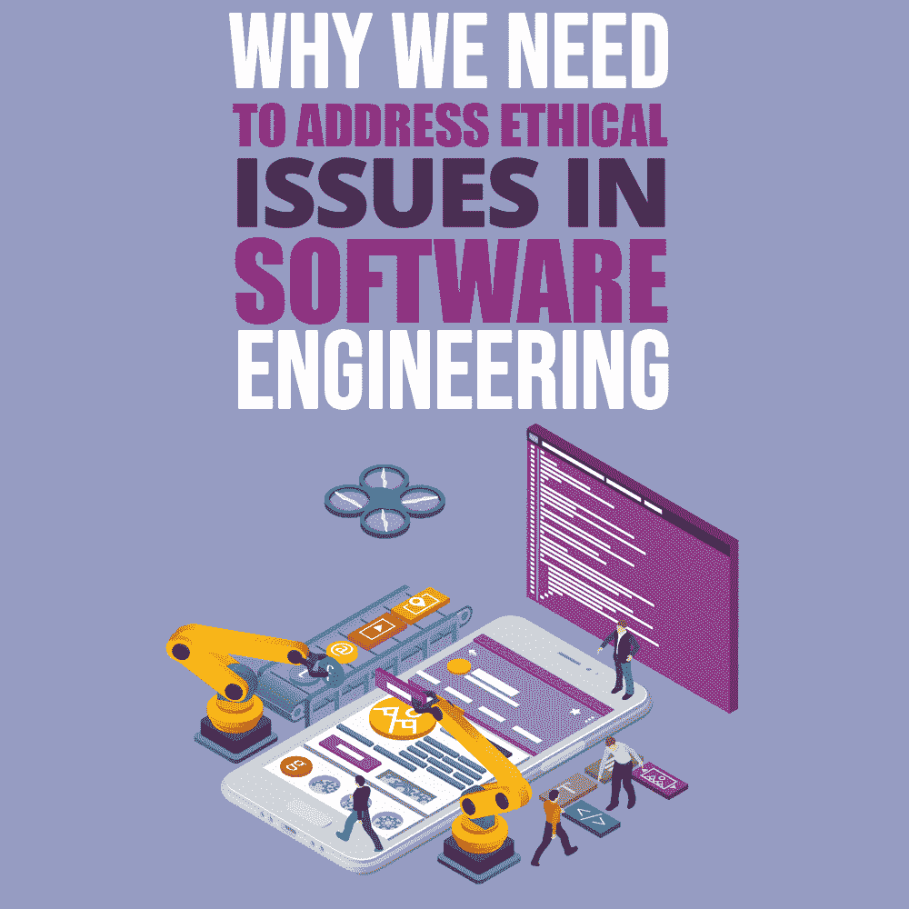

# 为什么我们需要解决软件工程中的伦理问题

> 原文:[https://simple programmer . com/ethical-issues-software-engineering/](https://simpleprogrammer.com/ethical-issues-software-engineering/)

<figure class="alignright is-resized">

</figure>

当我们考虑软件开发时，伦理并不总是第一个出现在我们脑海中的。毕竟，当创建软件时，作为开发人员，您应该解决诸如功能和项目规范之类的技术问题。但我们通常没有意识到的是，软件和技术在个人层面上影响着人们的生活，并有能力让他们变得更好或更坏。

今天人们做的每件事都涉及某种软件。开车、买食物、交流、通勤、看电视、网上购物——清单还在继续。这些技术为我们的生活提供动力，与人类生活密不可分。

技术甚至改变了企业的运营方式。为了成为第一个向市场推出产品、发展最好、产品和服务最具创新性的企业，许多企业忽视了其风险投资的副作用以及它们可能给人们的生活带来的问题。

让我们面对现实吧——有些公司不遵守规则。我不是在这里指指点点，但这是一个[的事实](https://www.forbes.com/sites/larryalton/2017/09/12/how-much-do-a-companys-ethics-matter-in-the-modern-professional-climate/)，渴望利润的公司确实忽视了共同的道德商业标准。软件开发人员通过为欺骗公司工作而卷入不道德的行为，这些公司将自己的利润置于人们的生命之上，并对后果视而不见。

随着技术成为我们日常生活的重要组成部分，你无法将它与影响日常生活的道德规范分开。它们塑造了我们消费和创造的方式。

也就是说，为用户提供一个他们可以信任的安全透明的程序是软件工程师的责任。毕竟，权力越大，责任越大。

## 软件开发者面临的伦理挑战

乍一看，很容易认为开发的技术部分与人们的生活没有直接关系。毕竟，真正影响用户的是商业行为。然而，软件开发人员知道他们的产品能做什么。

作为消费者，我们相信软件提供商能够帮助我们优化和改善日常生活，并以此来交换我们的姓名和电子邮件地址等信息。作为软件开发人员，我们相信软件提供商会很好地利用我们的创造。这种信任是由模糊的法规支撑的，如果你知道去哪里找，这些法规仍然有很多漏洞。没有人能完全免受软件提供商不公平做法的影响。

以下是软件开发人员在开发产品和选择为哪些公司工作时应该注意的一些道德问题。

### 客户数据的保护

众多网站的服务在很大程度上是为了收集你的信息。

以谷歌为例。这里是一些关于你的信息:你去过哪里，你的搜索历史，你用过的应用程序，你和谁一起用，你的 YouTube 历史，等等。谷歌甚至允许你下载他们拥有的关于你的所有数据——老实说，这将填满大量的 Word 文档！

如果政府或其他法律实体要求从您用自己开发的软件收集的信息中获取客户信息，会发生什么情况？你的道德承诺在哪里？你是否向你的客户清楚地传达了你的策略，你如何保护他们的信息？

个人数据安全是数字世界中最大的问题之一，因为您的客户信任您的敏感信息。从国家安全到网络犯罪，许多组织都对个人信息感兴趣。对于如何在这种情况下采取行动，没有适当政策的公司没有告知他们的客户他们的数据将如何被处理，从而将他们置于风险之中。

### 知识产权

<figure class="alignright is-resized">

</figure>

在快速发展且极具侵略性的创新产业中，软件工程师和所有者应该谨慎行事，以保证他们的创造在创新权利体系内得到适当的保护。

软件开发处理相互关联的问题，包括版权、专利、商标和竞争优势法的混合。为了确保客户免于不道德的商业行为，软件开发业务中的人员应该熟悉所有这些因素以及如何有效地实现它们。由于缺乏知识而导致的不道德行为不能成为软件开发人员为他们的行为如何影响人们的生活质量而承担责任的借口。

### 版权所有权

理论上，作为一名软件开发者，你拥有你的软件创作的版权，没有人可以未经你的允许复制、分发、展示或修改它。当它由第三方工程师或开发机构创建时，在协作过程中应始终涉及版权协议，以定义和保护代码创建者和最初有该想法的客户的权利。注册版权可以防止你的企业在所有权问题上陷入困境。

典型地，在产品已经被商业出版之后，源代码被保密以保护它不被非法复制和分发。使用版权保护您的源代码对公司有利，因为它提供了一种保护知识产权的便捷方式。

### 许可证协议

如果客户要求软件工程师传达源代码，双方应澄清客户是否需要声明源代码，或者只是在以后修改或更新产品。

如果双方同意产品许可协议，其中要求披露源代码以重做或更新产品，工程师可以纳入一项安排，根据该安排，客户承诺对源代码保密。

这些并不是唯一需要注意的道德问题。从黑客和网络罪犯到忽视错误的公司，这些都属于对软件工程世界道德状况的担忧。

这些问题可能看起来很遥远，不切实际，直到你真正面对它们。事实是，没有人是 100%受保护的，这正是为什么确保公司遵循软件开发道德规范并避免不正当行为应该关系到从消费者到开发者自己的每个人。

## 道德解决方案

伦理问题的棘手之处在于，它们涉及一个人自己的道德准则，这种道德准则是通过多年的教育、家庭和社会影响形成的。此外，生活并不总是非黑即白的，你也有一个很好的脑筋急转弯。

尽管作为软件开发人员，面对这些道德困境似乎有些棘手，但我们可以采取一些解决方案和步骤来做得更好。

### 伦理教育

最重要的一步是让你自己和其他软件工程师了解你的工作道德。开发训练营通常会跳过这一部分，而倾向于可以在工作中直接使用的实用知识。

技术不是中性的。在这一点上，让人们了解道德问题和他们行为的后果变得至关重要。“现在就做，以后再请求原谅”的思维定势不能主导商业行为。

公司如何运作是由管理层决定的，而不是软件工程师，即使你不同意，你也可以被迫遵循选择的行动方针。让软件工程师了解商业和软件开发道德的通用标准，可以提高他们对社会责任的理解，以及如何履行这一责任。它还可以帮助你决定为哪些公司工作，或者在你自己的企业中如何合乎道德。

### 遵循道德准则

<figure class="alignright is-resized">

</figure>

有一套非常有用的规则叫做软件工程道德准则，它表明了软件工程师的道德和职业承诺。这个代码是由一个由机械、政府、军事和教育专家组成的全球团队创建的。

以下是 ACM 职业道德委员会制定的八项原则:

1.公共:软件工程师的行为应该与公共利益一致。

2.**客户和雇主:**软件工程师的行为应符合客户和雇主的最佳利益，并符合公共利益。

3.**产品:**软件工程师应确保他们的产品和相关修改符合最高的专业标准。

4.**判断:**软件工程师在职业判断中应保持完整性和独立性。

5.**管理:**软件工程经理和领导者应认同并促进软件开发和维护管理的道德方法。

6.**职业:**软件工程师应在符合公共利益的前提下提升职业的诚信和声誉。

7.软件工程师应该公平对待并支持他们的同事。

8. **Self:** 软件工程师应参与关于其职业实践的终身学习，并应促进职业实践的道德方法。

## 从你开始

有时，软件开发人员可能没有意识到他们通过自己创造的产品对人们的生活产生了多大的影响。知道人们的生活质量可能取决于他们日常生活中使用的移动和网络应用程序中的软件是如何创建的，这很好地提醒了软件开发商在全球流程中的作用。

商业道德从来都不是非黑即白的，但是每个开发人员都有自己的责任来看看他们在开发过程中从事某种实践的决定如何影响未来的其他人。即使你可能不在公司的决策层，但是每个人的个人选择可以改变公司对待消费者的方式。认为不道德行为与你无关是完全错误的——如果你知道一家公司的不公平行为，却不采取任何行动，你就成了它的帮凶。