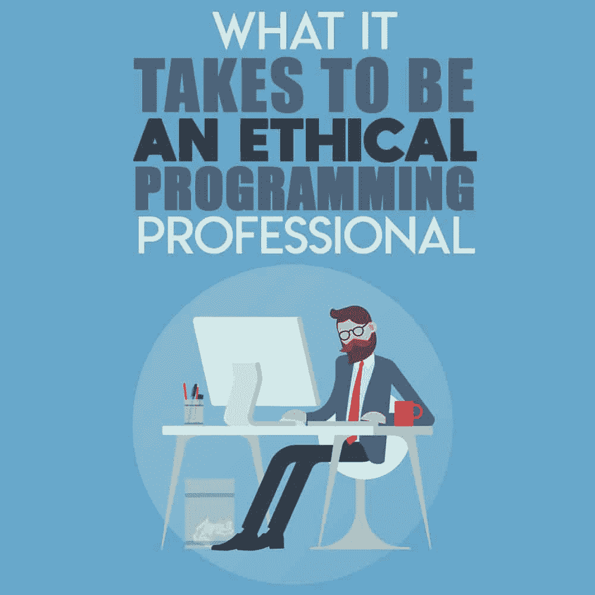
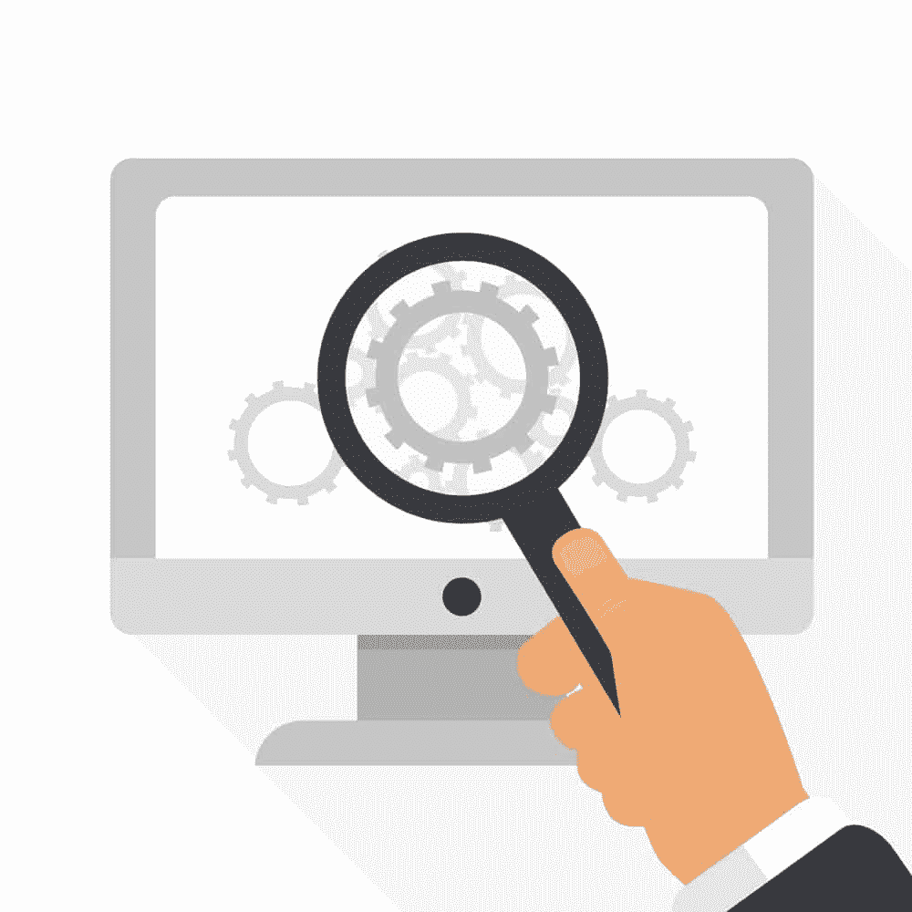

# 成为一名职业道德编程人员需要什么

> 原文:[https://simple programmer . com/ethical-programming-professional/](https://simpleprogrammer.com/ethical-programming-professional/)

For most programmers and software engineering professionals, a love of technology, logic, and problem-solving serve as primary motivators. As a result, we can’t resist taking on complex projects that would drive others mad. What results is a kind of myopia that is unique to people in the software industry; a single-minded pursuit of solutions that means we don’t always take the time to think about the long-term ethical ramifications of the code we produce.

这是一个比你想象的更大的问题。在当今世界，软件几乎涉及到我们生活的每一个部分。它管理着复杂的供应链，将食品放在超市的货架上。它有助于急救人员在发生紧急情况时找到我们。它甚至做出决定，影响我们在街上行走的自由。

作为程序员，我们在工作中不会过多考虑这些事情，这是可以理解的。这些问题似乎远远超出了我们的能力范围。但现实是，我们创建的每一行代码都有后果，而且可能很严重。要找到证据，只需看看导致两架波音 737 Max 喷气式飞机坠毁的[明显的控制软件缺陷](https://www.cnbc.com/2020/02/06/faa-chief-says-regulators-seem-set-to-agree-on-737-max-design-fix.html)就够了，那场事故夺走了 346 条生命。

很容易认为这样的情况是由整个组织的一连串失败造成的，这当然是事实。

对于普通的独立程序员来说，也很容易将这种场景视为不适用于他们的东西，因为他们不为生产生死攸关的软件的公司工作，这也可能是真的。

但是当你考虑到一些有问题的软件可能来自外包编程公司的[,而该公司没有必要的专业知识来完成这项工作，这就开始变得清晰起来，作为一个行业，我们不能继续推卸责任。没有办法知道我们什么时候会面临对我们正在做的事情所涉及的道德问题做出决定。](https://www.bloomberg.com/news/articles/2019-06-28/boeing-s-737-max-software-outsourced-to-9-an-hour-engineers)

因此，对于所有程序员、开发人员和软件工程师来说，提前采取措施定义一些道德界限是很重要的。作为一个行业，我们必须寻找正确的知识，并决定在挣工资和晚上睡个好觉之间划一条线。这里有一些关于从哪里开始这段旅程以及如何确保成为一名职业道德编程人员的提示。

## 理解什么是道德(什么不是)

作为程序员，我们都是从某处开始的。对于我们中的一些人来说，这是修补代码和涉足在线课程，以了解事情是如何工作的。对另一些人来说，那是在大学里，努力完成作业，努力攻读计算机科学学位。不管走哪条路，我们(几乎)都有一个共同点，那就是没有人花时间来教我们伦理道德。

如果你问几乎任何一个程序员，他们是否在工作中遇到了道德问题，他们很可能会说没有。但是如果你问得更具体一些——比如问雇主是否曾经要求他们为了时间的利益放弃单元测试，或者他们是否感到有压力向客户谎报项目的某个部分的状态——你得到的答案很可能会改变。

其原因是很难确定[什么是编程特有的道德问题](https://simpleprogrammer.com/ethical-issues-software-engineering/)，即使它就在你面前。尽管如此，今天工作的程序员没有一个不面临一两个这样的问题。当某些代码显然是从另一个项目中剽窃来的，或者客户坚持在没有任何对外披露的情况下进行侵入性的活动日志记录，这样的事情就会浮现在脑海中。大多数时候，它们是如此普通的实践，以至于它们并不突出——除非你知道你在寻找什么。

为了有所帮助，每个编程专业人员都应该花一些时间来研究伦理的概念，并获得该领域的一些知识。这很容易做到。一个很好的起点是简单地反思一下你自己的是非观。想想你过去做过的一些工作，问问自己:“如果我在屏幕的另一边，我会接受吗？”

你甚至可以做一些独立的研究来温习你的应用伦理学知识。关于这个话题的网上资源肯定不少。麻省理工学院甚至提供免费的道德在线课程，其他几所知名大学也是如此。

如果你有时间，买一本作者莎拉·贝斯的书 *[《火的礼物:计算技术的社会、法律和伦理问题](http://www.amazon.com/exec/obidos/ASIN/0132492679/makithecompsi-20)* 。它深入探究了伦理问题与现代技术相互交叉的无数方式，并包含大量真实世界的例子来说明所有的概念。只要确保购买该书的正版即可。尽管它可能在网上其他地方免费提供，但走这条路本身是非常不道德的。

## 不要掩盖别人的过失

Since programming tends to be an iterative process, it’s not uncommon to work on projects that involve building on or extending existing code. When doing so, we all have our head-scratching moments when we encounter things that range from the confusing to the completely outrageous. Sometimes, we’ll find sloppy code. Other times, we’ll see things that are just, well, wrong.

这就是发生在媒体用户 dCFO 身上的事情，他继承了一个医疗保险计费软件，发现它被[编程来欺骗政府](https://medium.com/@dCFO/been-there-done-that-722bced60363)。在这种特殊情况下，解决办法是向有关当局举报欺诈行为。在每一个这样的例子中，放任自流总是错误的。

作为一名程序员，坚持高道德标准意味着无论在哪里发现不合标准或不合适的代码，都要大声说出来。如果可能的话，你应该向你的直属上司报告任何异常情况。如果他们不听，继续向上级汇报，直到你找到愿意采取行动的人。如果你是一名自由职业者，你应该直接和你的客户交流你的担忧。

如果你所处的情况是，你上面的人似乎满足于掩盖道德问题，或者更糟糕的是，他们是问题的同谋，你可能需要寻找另一种方式来引起对这种情况的注意。在报告上写上你自己的名字并不总是必要的(就像上面的例子，程序员匿名向当局通风报信)，但是让人们注意到你自己不能解决的任何可疑的事情是很重要的。否则就意味着你在推卸责任，下一个遇到这个问题的程序员会认为你也有份。如果你做了记录在案的努力来解决问题，无论情况最终如何，你都是对的。

## 不要害怕说不

程序员，尤其是独立的程序员，靠从一个项目转移到另一个项目来谋生。这就带来了一种紧迫感，不管是什么工作，都要去做。不用说，这会导致各种道德冲突。毕竟，自由程序员通常不知道他们将要做什么的所有细节，直到他们埋头于代码之中。

一旦发生这种情况，为了获得已经付出的所有努力的报酬，保持对客户说“是”的巨大压力就会产生。但是，当你已经投入了无数小时的工作，而客户要求一个不道德的特性或改变时，会发生什么呢？如果你在项目中坚定地确立了你的道德底线，答案是你必须坚定地说不。

事实上，你还必须弄清楚*为什么*你要说不。尽管这样的谈话可能会让人不愉快，但有必要让客户知道你明白他们的要求是不道德的。当你不得不这样做时，重要的是开始对话时不要有对抗性。不要以为客户知道他们是错的。向他们提出一个问题，以“你知道吗……”或“我认为这是一个问题，但你能向我解释一下为什么你不这么看吗？”这样的短语开头

大多数情况下，当以这种方式被叫出来时，客户会退缩。有时，他们甚至会报以真正的惊讶——毕竟，非程序员通常看不到他们要求你做的事情的道德含义；他们只想要结果。如果他们不这样做，下一步就是走开。尽管这可能会造成经济损失，但这是正确的做法。

## 与其他专业人士进行道德讨论

如果有一件事情是程序员经常做的，那就是谈论他们的项目。这就是为什么有如此多的博客和社区致力于各种形式的编程。事实证明，这些也是讨论我们所从事工作的伦理意义的绝佳论坛。

首先，养成一种习惯，当其他专业人士面临具有挑战性的道德困境时，问问他们是怎么想的。你可能会惊讶于有多少人面临类似的问题，他们可能会提供宝贵的建议。即使你的情况是独特的，向能够理解你所谈论的问题的人反映这个问题仍然是值得的。

You should also share your ethical failings with others when they happen. Longtime programmer Bill Sourour did just that when he published a blog post entitled “[The Code I’m Still Ashamed Of](https://www.freecodecamp.org/news/the-code-im-still-ashamed-of-e4c021dff55e/).” In it, he related the story of a project he worked on early in his career that involved building a misleading online quiz for a pharmaceutical company. It turned out that the medication it promoted had some side effects that drove some patients using it to kill themselves.

尽管这一事件令人痛苦，但这是一次学习经历，[引发了一场围绕编程伦理的对话](https://news.ycombinator.com/item?id=12965589)，鼓励其他人分享他们遇到的伦理问题。就像一股巨大的洪流被释放出来一样，关于[栈交换](https://stackexchange.com/)、[栈溢出](https://stackoverflow.com/questions)、Reddit 的 [r/programming](https://www.reddit.com/r/programming/) 论坛以及其他地方的讨论同时涌现，无数程序员分享了他们的经验。即使在今天，这些地方仍然是遭遇道德困境的程序员的一个很好的共鸣板。越多的人花时间讲述他们的故事，我们作为一个行业就会变得越好。

## 保证尽力而为

虽然没有多少专业组织为程序员加入提供道德框架，但有一些[公布的承诺](http://www.softwareethics.org/)可以作为普通程序员生活的基本准则。罗伯特·马丁的书 *[《干净的程序员:职业程序员的行为准则](http://www.amazon.com/exec/obidos/ASIN/0137081073/makithecompsi-20)* 》是一本非常棒的指南。它充满了大量可行的建议，可以帮助任何程序员拥抱道德实践并提升他们的技能。它们都是很好的起点。

记住，罗马不是一天建成的。期望你在遇到的每种情况下都做出正确的道德决定是不合理的。你需要大量的时间来习惯坚守你的道德界限，并把它们应用到你做的每一件事上。你也不能指望和你一起工作的程序员突然接受道德编程标准。不管你周围的人如何行动，关键是要坚定立场。最终，你的态度会影响到你周围的人。

最重要的是始终用敏锐的眼光对待每个项目，并留意每个项目的需求或涉及的现有代码中任何不太光明正大的地方。然后，一定要尽你最大的努力去做正确的事情，保持你的正直。

如果你已经做好了适当的准备，并采取措施提前阐明你自己的道德界限，你就不必担心当有问题的事情摆在你面前时该怎么办。你将能够及早发现有问题的情况，并能够专注于你的反应。当这种情况发生时，你的反应会更加坚定，并有可能产生积极的道德结果。

这不会总是容易的。不会一直对你的底线有好处。但是，保持高道德标准是所有程序员的共同责任，随着我们的工作在我们周围的世界中变得更加根深蒂固，风险也越来越高。记住，我们所有工作的结果都在我们周围。生活和生计取决于此。没有办法知道你今天做出的道德判断会在未来产生什么样的后果。

所以，最重要的是现在就花时间去拓展你的道德边界，并学会如何处理出现的复杂的道德状况。这比努力更值得。请记住，在一天结束时，我们都在一起。如果我们都尽自己的一份力量，我们的行业将迎接挑战，推动深思熟虑的、道德的、无懈可击的代码为未来提供动力。一切都取决于我们。