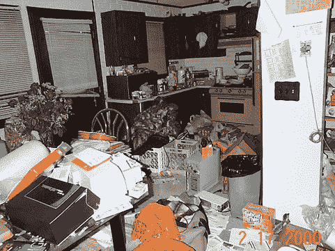

# 即使积压的工作也需要整理

> 原文：<https://simpleprogrammer.com/even-backlogs-need-grooming/>

如果你愿意，想象一下这个常见的场景。

你的一个朋友打电话给你说:

“嘿，你介意周六帮我搬家吗，我要召集 4 到 5 个人，我们要把我的东西搬到我的新房子里去。”

你当然会回答:

"我当然能帮忙，你想让我什么时候到？"

"我们将在上午 10 点整开始！"

你可能已经猜到接下来会发生什么。你出现在你朋友家，期望所有东西都被很好地包装在箱子里，你只是要把一些箱子和家具搬进一辆 U 型拖车，但是你看到的却是这个:

真的吗？

他不可能在 5 个人出现在他家搬东西之前把房子打扫干净，至少把东西放进箱子里？

因此，本来应该是两个小时的工作变成了两天的折磨，因为你和其他四个朋友坐在一起，等待搬家朋友收拾他的东西，以便你可以把它放在卡车上。

你们 5 个人实际上不能帮助打包东西和扔垃圾，因为只有一个人知道什么是垃圾，什么东西需要放在什么盒子里。

如果你的朋友在你们 5 个人过来帮忙之前就清理好垃圾，把所有东西都打包好，事情会进展得更快！

## 你的积压清单就是你的公寓

当你给你的 5 个开发人员和 QA
“伙伴”打电话，让他们为 sprint 完成一些工作时，也会发生同样的事情。

如果团队试图找出什么需要做，什么是垃圾，什么东西需要放在什么盒子里，他们实际完成工作的速度会慢得多。

你看，你的未整理的积压清单就像流浪汉一样。通常它需要好好洗一洗，刮一刮胡子。

当我在这里谈论积压整理时，我甚至不是在谈论召开一个计划会议，在那里你计划你下一步要做什么。

安吉拉·德鲁克曼很好地描述了梳理毛发的过程。

这个想法是，你定期整理你的积压工作的前 x%,这样当团队拿起它们时，它们就在干净漂亮的盒子里准备工作了。

这里重要的是，这是一个团队活动，每个人都应该参与到待办事项的整理中来。然而，在大多数情况下，业务实际上拥有积压订单，所以他们应该指导团队将哪些东西放入哪些盒子中。

## 及时积压整理怎么样？

为什么要工作到最后一分钟？

好问题。

为了找到答案，我把你带回到我在这篇文章开始时的感人场景。

在你的朋友收拾好所有东西并扔掉垃圾之前，让所有人都过来并试图移动他是如此低效的原因是，你最终有大量的空闲时间等待一个人。

想想当 8 个开发人员的团队同时开始处理一个迭代的积压工作时会发生什么。

如果所有的积压都没有被“整理”,而是大小和部分不匹配的一团乱麻，那么每个开发人员将不得不与同一个业务人员谈论开发人员正在处理的积压。

当这个业务人员不在办公室时会发生什么？

当这个业务人员试图回答 8 个开发人员的问题时会发生什么？

当有机会就积压的问题回到开发人员那里时，会发生什么呢？

现在将这与场景进行对比，在场景中，将在迭代中处理的所有积压工作都很好地打包在整洁的小盒子中。

积压工作可能不包含将要实现的所有技术细节，但是它们被分解成团队非常容易理解的小块。

在这种情况下，团队将能够收拾积压的工作并开始工作。当然，他们仍将不得不询问关于积压的业务问题，但是被询问的问题类型发生了根本的变化。

对比这类问题:

> *那么，这些积压具体是关于什么的呢？我们想要构建什么样的东西来报告这些数据？*

对这类问题:

> 正如我们之前讨论过的，我在 backlog 中看到的，我们正在为这位客户创建一份定制报告。我还看到我们已经定义了 A 列应该做什么。我应该使用计算 X 还是计算 Y 来计算这个列？

第一种问题最好在所有合适的人参加的大型会议上回答。回答第一种问题可能需要一些研究。第一种问题会阻碍待办事项的完成，因为它不容易回答。这需要思考，可能还需要询问其他人，与顾客交谈等等。

第二种问题是特定的。这是通常由一个人就能弄明白的事情。最重要的是，它不会耽误工作。开发人员可以继续实现解决方案的一部分，并在以后加入算法来计算一些值。