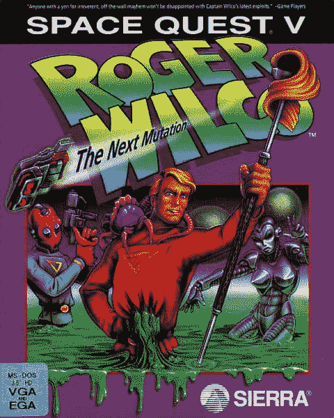
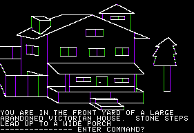
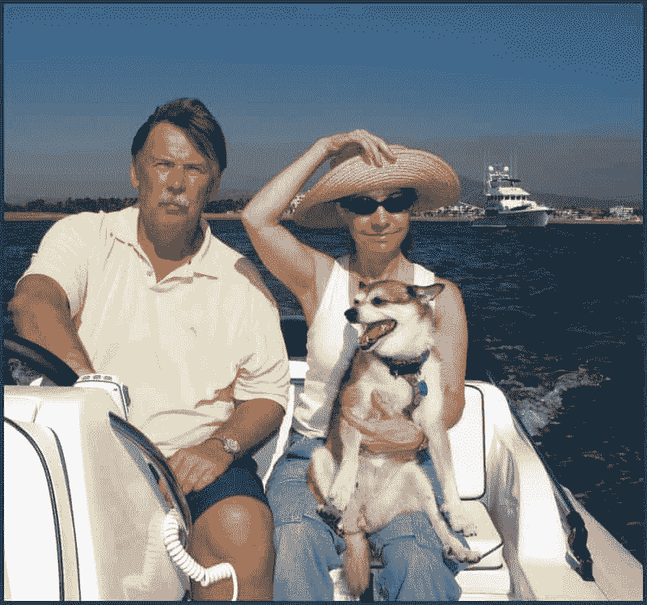
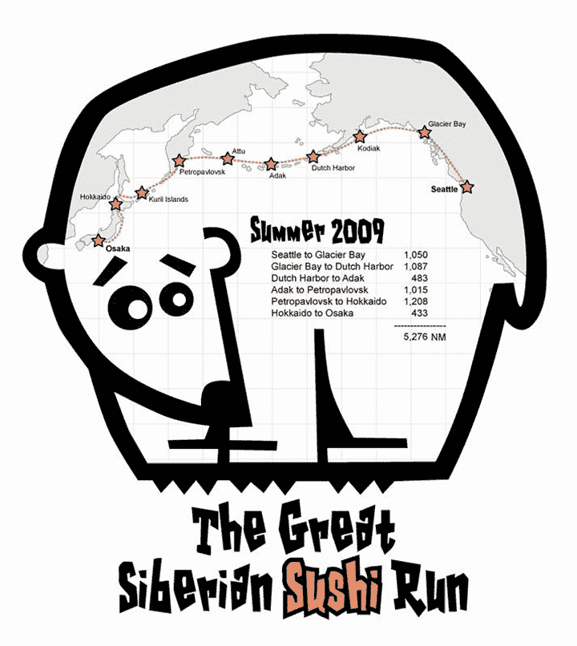
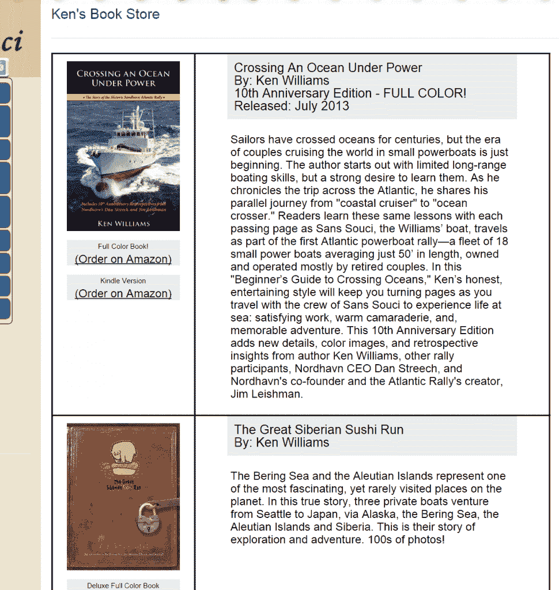
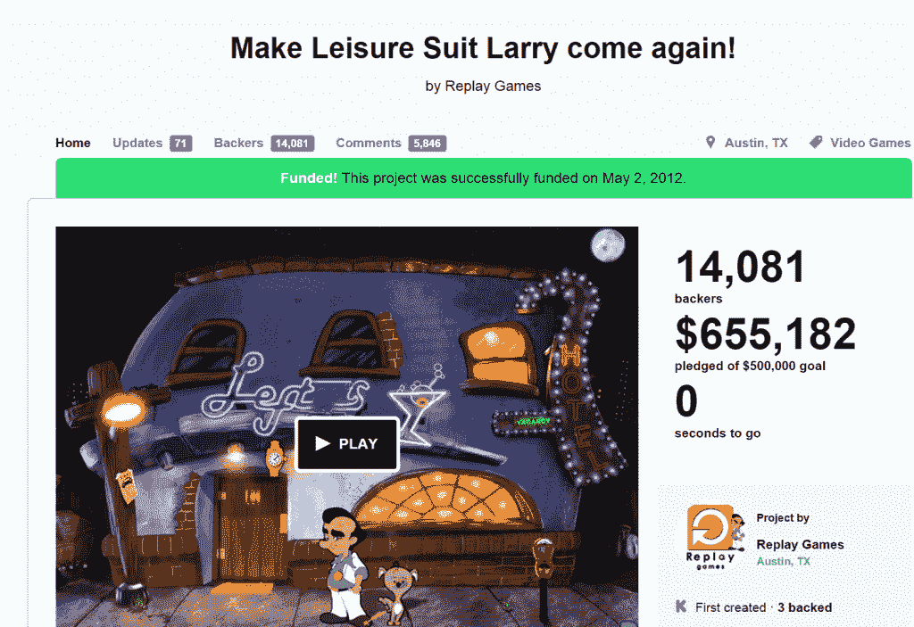
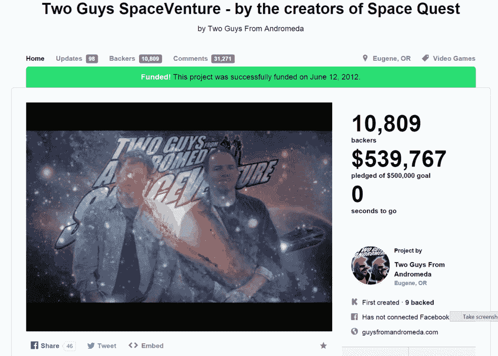

# 塞拉在线的创始人后来怎么样了？

> 原文：<https://simpleprogrammer.com/ever-happened-founders-sierra-online/>

我童年最美好的回忆包括玩冒险游戏，如[太空探索、](http://guysfromandromeda.com/)T2、国王探索、T3 和[荣耀探索。](http://en.wikipedia.org/wiki/Quest_for_Glory)

我记得花了无数个小时从保存点重新加载，并试图找出一个难题。我记得当我的 486 装载一个冒险游戏时，Sierra 标志闪现在屏幕上的那种激动人心的期待感。

那是电脑游戏的黄金时代，我们可能再也看不到了。

出于一丝怀旧，我决定在 Sierra Online 上搜索一下。我很想知道公司发生了什么，创始人肯和罗贝塔·威廉姆斯发生了什么。

## 塞拉在线怎么了

但是，首先让我们谈谈塞拉在线发生了什么。为什么他们不再推出令人敬畏的冒险游戏？

Sierra Online 是在 IBM 的程序员肯·威廉斯有了一台 Apple II 电脑后成立的，当时他的妻子罗伯塔正在玩文本冒险游戏，她意识到如果冒险游戏中包含一些图形，会好得多。

罗伯塔意识到 Apple II 不仅仅能够显示文本冒险游戏的图形，所以她开始探索制作自己的文本冒险游戏，并辅以一些静态图形。

肯在晚上帮罗伯塔组装她的第一个游戏《神秘之家》，同时在 IBM 工作。

这款游戏非常成功，卖出了 15000 多份，赚了 167000 美元。不错的开始。

从那以后，事情真的开始起飞了。肯和罗伯塔直接参与了大多数早期塞拉游戏的创作。当 IBM 雇佣他们开发第一个国王的任务游戏，并提供整个游戏的资金、广告和支付版税时，他们得到了一个很好的机会。不错的交易。

国王的探索非常成功，作为创建游戏的一部分，它涉及到彩色图形和声音，冒险游戏解释系统诞生了，它被用来创建更多的塞拉冒险游戏。

从那里诞生了许多受欢迎的游戏系列，如《太空探索》、《警察探索》、《休闲西装拉里》和《荣耀探索》。肯和罗伯塔雇佣了不同的程序员和设计师来开发这些游戏。

然而，所有美好的事物最终都会结束。1996 年，CUC 国际公司出价约 15 亿美元收购塞拉在线。是的，没错，我也会卖那个价钱。所以你不能真的责怪肯或罗伯塔。

但是，从那时起，事情似乎真的分崩离析了。一旦肯和罗伯塔离开，希拉就不再是希拉了。更多的游戏被生产出来，但是大冒险游戏时代已经结束了。加布里埃尔·奈特系列确实做得很好，1998 年塞拉也出版了《半条命》(虽然是 Valve 创作的。)

如果你对所有的细节感兴趣，你可以在维基百科的页面上找到大部分的细节，但是我认为发生在肯和罗伯塔身上的事情更有意思。

## 肯和罗伯塔怎么了

我的第一个线索是肯在 2003 年张贴在 SierraGamers.com 的那封信。

在信中，肯谈到了他和罗伯塔从 1979 年到 1996 年是如何创建并拥有塞拉的。当他们卖掉公司后，他们决定退休，分别在墨西哥(Cabo 圣卢卡斯)、西雅图和法国共处。

我觉得有趣的一件事是，肯说:

> 我的大部分时间都花在打高尔夫球上，除了这个网站，我已经很久没有想过塞拉或者电脑游戏了。

我震惊地想到，也许我花在塞拉游戏上的时间比肯还多。不知何故，在我的脑海中，我无法想象塞拉在线的创作者不会以某种方式参与电子游戏。这个想法对我来说太陌生了。这真的让我很好奇。

在信中，肯继续谈论更多关于塞拉的历史，以及它是如何成为我们的全部历史的。他提到，Sierra 恰好出现在历史的正确时间，因为计算机真正开始在社会中占据一席之地。他还说，他真的没有写一本关于那段历史的书的天赋或意图。

浏览网站是一种奇怪的体验。当然，这封信已经有 10 年的历史了，网站也明显过时了。论坛上有一些新消息，Sierra 游戏列表和一些游戏盒的图片非常有趣。肯定有几个标题我已经忘记了，我甚至不知道是由塞拉制作的。

在网站的 FAQ 部分，我找到了 Ken 个人博客的链接。作为一个爱管闲事的人，我不得不去核实一下。

## 航行世界！

原来肯和罗伯塔一直在环游世界。他们于 2004 年横渡大西洋，2009 年横渡太平洋。肯还创建了一家新公司，帮助你创建自己的网站，名为“TalkSpot”(虽然，从网站上看博客，我看到最新的条目是 2014 年 1 月的，所以我不确定这家公司有多活跃。)

浏览肯的博客，我可以看到他们仍然在世界各地航行冒险。航行的时间太长了。我惊讶地看到错综复杂的博客帖子，详细描述了他们冒险的所有部分，包括他们在 Cabo 圣卢卡斯的住所被刚刚经过那里的 4 级飓风摧毁。

阅读肯详述他们航海冒险经历的博客帖子很有意思。有趣的是，看到两个一定把一生都献给了编程和电脑游戏的人，现在却如此疏远。很诡异；我认为我们大多数人都过着同样的生活，并且在大部分时间里都参与同样的事情。想想一个人的生活怎么会与过去完全不同，一个人的关注点怎么会发生如此巨大的变化，这让我着迷。

我会一直做程序员吗？在某个时候，我会和软件开发没有任何关系吗？不知道，不过想想也挺有意思的。

问题是，你真的可以从他的帖子的细节和所有图片中看出他关心他现在在做什么。

不仅如此，肯还写了一些书，只不过是关于航海的！

我不知道你是怎么想的，但想到《塞拉在线》的创作者，我小时候玩过的一些最好的电脑游戏的负责人之一，正在写关于航海的书，这真是有点奇怪和不可思议；过着和我想象中完全不同的生活。

哦，如果你想知道他们开的是哪种船，那是 Nordhaven 62。一艘价格合理的二手游艇，售价在 100 万至 200 万美元之间。(据我所知，虽然我不太喜欢买游艇。)

如果你有兴趣，[看看他的博客文章](http://www.kensblog.com/)，真的很有趣的东西。

## Sierra 的其他成员呢？

我也有点好奇，想知道与 Sierra 有关的其他一些人发生了什么事。我找到了两个设计师/程序员，他们仍然在这个行业工作，并且有一些复活的游戏已经出来了。

**阿尔洛**

艾尔主要负责创作休闲西装拉里。我实际上从来没有玩过这个系列的任何一款游戏——当时我还太小，我的父母也没有在这一点上让步。

原来，一个新的休闲西装拉里游戏实际上是 Kickstarted 和发货-我必须检查一下。

艾尔现在有一个喜剧网站，非常有趣。

来自仙女座的两个家伙

但是《太空探索》系列背后的那两个人呢？太空探索绝对是我最喜欢的塞拉属性。

马克·克罗和斯科特·墨菲，更广为人知的是来自仙女座的两个家伙实际上[在 Kickstarter 上创建了一个新的类似太空探索的特许经营公司 SpaceVenture。](https://www.kickstarter.com/projects/spaceventure/two-guys-spaceventure-by-the-creators-of-space-que)

[不幸的是，看着他们的网站，我看不到很多最近的更新](http://guysfromandromeda.com/)，但我对游戏真的会发布抱有希望。他们甚至开始了一个关于即将到来的游戏的播客。

## 塞拉的未来

不过，未来还是有一些好消息。看来塞拉正在卷土重来。至少他们会复活国王的任务专营权。

如果你去 sierra.com，你会发现一个新的介绍预告片和一些即将到来的游戏的信息，包括国王的任务。

如果所有那些老的 Sierra 游戏继续下去，或者在好的冒险游戏中有一个真正的复兴，那会有多棒？也许它不会和那时一样，但我充满希望。

好了，这就是我的回忆之旅。这篇博文有点不同，但我想很多玩过 Sierra 游戏的人会觉得它很有趣。

如果你喜欢这篇文章，我邀请你加入 5000 多名已经加入简单程序员社区的软件开发人员。