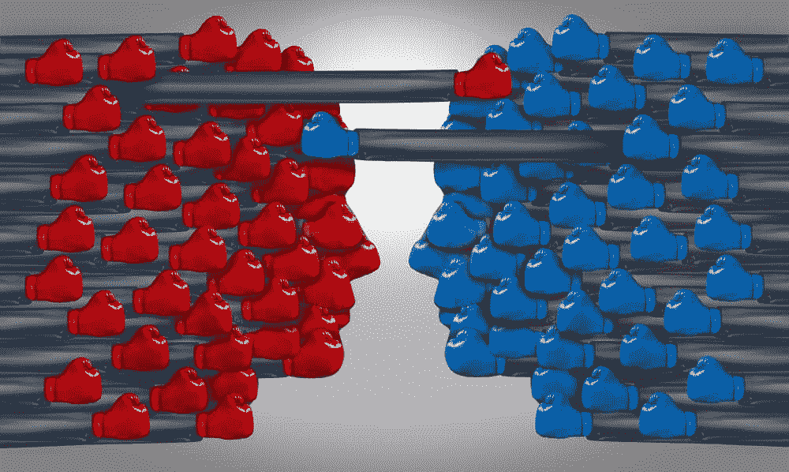
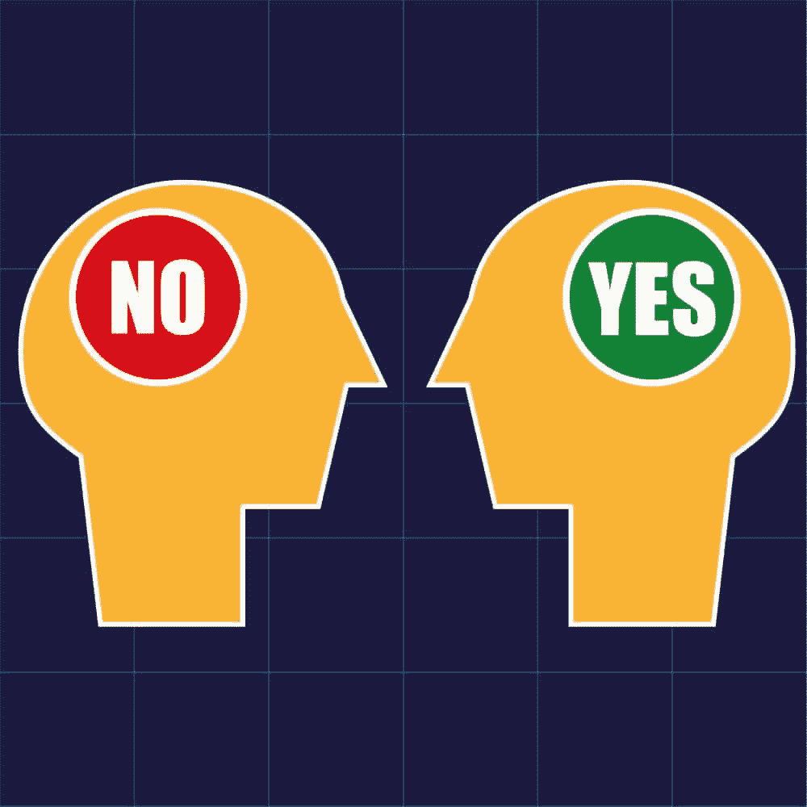

# 你所知道的关于如何变得有说服力的一切可能都是错的

> 原文:[https://simple programmer . com/everything-know-impulsive-may-wrong/](https://simpleprogrammer.com/everything-know-persuasive-might-wrong/)

他们说生活中的一切都是买卖。

从说服你的另一半把他们的袜子从地板上捡起来，到在办公室实施一种新的测试模式，再到实际销售你的产品和想法，你一直处于一种对话或情况中，这将涉及到你谈判你的立场，以[把其他人](http://www.amazon.com/exec/obidos/ASIN/006124189X/makithecompsi-20)带到你的解决方案一边。

我明白了。这听起来已经如此愤世嫉俗和操纵，以至于任何有灵魂和/或头脑正常的人都绝对想点击离开这个网站，再也不会阅读另一篇关于简单程序员的帖子。

这些人处于不幸的不利地位，可能得不到他们生活中想要的那么多东西。

他们为自己“不走运”的事实感到难过，并经常抱怨无论他们如何努力，他们就是无法取得成功。用他们的事业；以他们的财力；在日常生活中。

这并不是说他们是坏人，也不是说他们不配获得和我们一样的成功和胜利。

相反，他们拒绝承认，为了得到你想要的东西，你不仅要愿意提出要求，还要努力向你的配偶/同事/客户表明，你的选择是一个显而易见的选择，会给所有参与者带来双赢。

因为在一天结束的时候，这就是目标。一个所有人都是赢家的解决方案。

那么，一个人如何从一生中从未赢过到可以完成任何销售，无论是个人销售还是职业销售，而不会出卖自己，成为一个十足的泼妇呢？有着十多年的销售和培训经验(我在 24 岁时成功地向家庭和企业家销售了人寿保险……没有人*希望*购买人寿保险，更不用说从一个 24 岁的傻瓜那里购买了！)以下是我每天用来说服同事和老板的一些策略。

## 知道你想要什么

有没有和试图“弄明白”的人交谈过？

有没有用头撞过砖墙？

有没有经历过如此深刻的迷幻之旅，以至于你感觉到了颜色，或者和卡通森林生物交了朋友？

所有这些经历可能感觉相似。

当你走进一个对话，你甚至不确定你在尝试什么，这个对话会很快变得痛苦和复杂。

如果你想引导一个人做某事，你必须在头脑中有一个解决方案或最终结果。否则，你不是在进行一场有说服力的谈话，而是在进行一场理智的讨论。或者，就像经常发生的那样，你在玩精神羽毛球，在你的两个球拍之间击球。

### 你如何改变这一点？

我喜欢在开始尝试决策过程之前就知道我所有的选择。

我们来举一个大家一生都在纠结的简单例子。

> 我们应该去哪里吃晚餐？

无论是你的伴侣、同事还是朋友，现实生活中都有关于这个问题的血缘匹配(我确定…我没有这种对话的证据，但这个话题会变得很快！)

在这种情况下，你需要决定的简单事情就是:**你想要什么？你想吃什么特别的食物吗？你知道的任何你喜欢的舒适的地方会让你得到你想要的吗？还是想尝试新鲜刺激的东西？**

花点时间自私一下，我们都是自私的，尽管大多数人不愿意承认。然后开始说服过程…

## 有备而来

有时候，比不知道自己想要什么的人更糟糕的，是不知道自己为什么想要某样东西的人。

这就像那个同事一直告诉你，你必须以一种特定的方式完成你的 scrum 周期。当你问为什么，试图洞察他们如此坚信的辉煌过程，他们会回答“哦，因为。”

任何父母都知道，这个答案对三岁的孩子无效，对成年人也很少有效。

当你在劝说的过程中，你不想被误导。你的意见会立刻失去可信度，对方反驳你就太容易了。了解你解决的理由，[了解反对](https://simpleprogrammer.com/2013/05/12/5-agile-development-failure-signs/)的理由。

### 你如何改变这一点？

在这种情况下，您需要考虑一些试探性的问题，以确定最佳结果可能是什么。许多人称之为“权衡利弊”。考虑这样的事情:

*   大家有多饿？要等多长时间？
*   你吃饭时想要饮料吗？
*   有什么特别的预算吗？

一旦你考虑到这些初步的问题，你可以选择几个不同的地点，这些地点符合要求，你知道你想去(从第一步开始)并准备好继续前进，完全知情。

## 用一些吻让它变得甜蜜

谁不喜欢被亲吻呢？

虽然嘴唇柔软的吻总是好的，但这不是那种交流。

相反，[是一个首字母缩略词](https://simpleprogrammer.com/2015/08/19/kiss-one-best-practice-to-rule-them-all/)，提醒你关注最重要的事情。有很多变体，有些不那么亲切(**K**eep**I**t**S**imple， **S** tupid)，有些更外交一点(**K**eep**I**t**S**super**S**imple)。

无论你选择采纳哪一个作为你的口头禅，你都想让关于一个决定的辩论保持在主题上，不要让它偏离轨道。

当你开始提出不相关的观点，或漫谈不相关的数据时，你就失去了控制。如果你今天试图在办公室实施的解决方案不能立即应用，没有人希望被发现在听你以前公司的做事方式。

你的思路可能会发现其中的联系，但是除非你能让人们快速地走完这段精神旅程，否则他们永远也不会到达车站。

### 你如何改变这一点？

你知道你想去哪里吃饭，你也知道你为什么要去那里吃饭。将这些数据整理成一个项目列表，解释你是如何做出决定的。准备好有利的和不利的方面，展示你是如何考虑的。

*   什么使你的决定对所有参与的人来说是最好的决定？
*   是否有任何与选择相关的背景信息或有趣的事实？

现在不是解释你看的关于库里历史的惊天动地的纪录片的时候，除非你知道你对一些印度名字和 naan 有兴趣，并愿意与每个人分享你在挖掘一些 tikka masala 时学到的东西。即使这是你决定要走的路线，也要打亮点。

## 态度决定高度

卑鄙的精神不会赢得人们的支持，令人恼火的防御性只会把人们拒之门外。

娜娜的建议在这里很合适:“用蜂蜜比用醋能抓到更多的苍蝇。”

或者，吻你一下，确保微笑。

这一个简单的改变可能会改变你谈话和讨论的整个基调和口径。

作为人类，我们讨厌输掉战斗。或者辩论。或者一个决定。当你输给一个混蛋的时候，感觉更糟。通常，我们会在我们意见一致的事情上与人争吵，*只是* *因为*有人太难相处了。

### 你如何改变这一点？

你的晚餐朋友想去酒吧吃汉堡，而你却渴望与他们分享来自 1000 年代早期香料之路的辣椒粉和孜然粉的异国故事。

告诉他们，他们的想法是愚蠢的，他们会因为吃红肉而死于心脏病，或者交叉你的手臂，拒绝去一个不是你选择的地方，这不会说服你选择的人也可能是美味的。

随便问问素食主义者。(我开玩笑！我喜欢吃好的素食或纯素餐。)

相反，微笑点头，听听他们要说什么。即使他们的想法*是愚蠢的，他们每周摄入的大量红肉 ***是*** 将他们的胆固醇飙升至平流层。*

## *给他们一个说法

* 

*类似于接吻这个苛刻的概念，在你的说服过程中，你要采用的另一个短语是“坐下，闭嘴”*

*当然，你不一定要坐下。*

*当你试图赢得一些东西时，闭嘴的想法通常是人们最难克服的，这也是为什么许多人在试图说服别人站在他们一边时失败了。*

*当我们对某件事充满热情，当我们知道自己是对的，当我们真的想吃咖喱时，我们倾向于通过最长时间地握住说话棒来试图控制事情。*

*不过，这并不总是管用。如果你面对的是像你一样固执或坚决的人，他们会觉得他们的想法没人听，你不重视他们的意见。*

*就像没人愿意接受一个混蛋的观点一样，原则上，人们不喜欢被忽视和不被重视的感觉。*

### *你如何改变这一点？*

*让对方说去吧。*

*听听他们为什么会做出这样的决定。了解他们的专业知识和经验教会了他们什么，以及这不仅适用于他们的观点，也适用于你自己的观点。*

*允许他们问你问题。回答他们，反过来提问。给他们一个机会告诉你，无论是直接还是间接的反对，为什么他们不同意。*

*你有办法找到一个折中的办法吗？也许你家附近有一家英国啤酒馆？咖喱最近取代鱼和薯条成为伦敦头号外卖订单，这些人的菜单上一定有一些汉堡和印度食物的化身。*

## *生活中的一切都不是买卖*

*是的，我在开始的时候说过，但我试图向你推销这些策略对你获得生活中想要的东西有多重要。*

*成功了吗？在接下来的几段中，我基本上主张你应该努力在所有的人际交往中成为一个善于操纵的反社会者，你成功地做到了吗？*

*好了，现在是我离开演讲台一会儿的时候了，我要提醒你们最后一个重要的想法:*

### *你永远不应该努力成为一个反社会的操纵者。*

*这是一种可怕而危险的疾病，我知道《简单程序员》的所有读者显然都是好人，他们不想变得可怕而危险。至少不是以 ***那种*** 的方式。可怕危险可怕的编码技能完全是一款*不同的球类游戏！**

**当你正在练习把袜子从地板上拿下来，或者尝试一个新的工作系统，这个系统将消除对程序从 2003 年继承的一百多行冗余代码的需要时，绝对要发挥你新发现的说服力。你可以在约翰的 [*软技能*书](https://simpleprogrammer.com/softskills)中找到更多编程和职业的具体例子，这本书总是简单程序员读者的最爱。**

**但是有些战斗不值得去战斗。要么是因为它们让人筋疲力尽，要么是因为太多会疏远你关心的人。或者也许，仅仅是也许，别人的说服力会让你意识到你以前没有意识到那个观点，你可能只是更赞同它。**

**不要总是挑起争斗，争论由来已久的牧场与蓝纹奶酪调料对辣鸡翅争议的精髓人生价值。**

**如果某件事对你来说并不重要，就让它去吧。深呼吸，微笑，让对方拥有它。**

**因为他们的生活中也需要一些胜利。**

**或者，你可以妥协。**

**就我个人而言，热辣辣调味酱(蓝纹奶酪碎混合牧场调味酱)是我的首选。**

**但是我总是在尝试新事物。**

**你有多擅长说服别人去做你想做的事情？我们错过了什么建议吗？你是否因为不知道如何分享你的观点而错过了一些机会，而这种分享的方式最终会让所有人都受益？让我在下面的评论中知道。T3】**