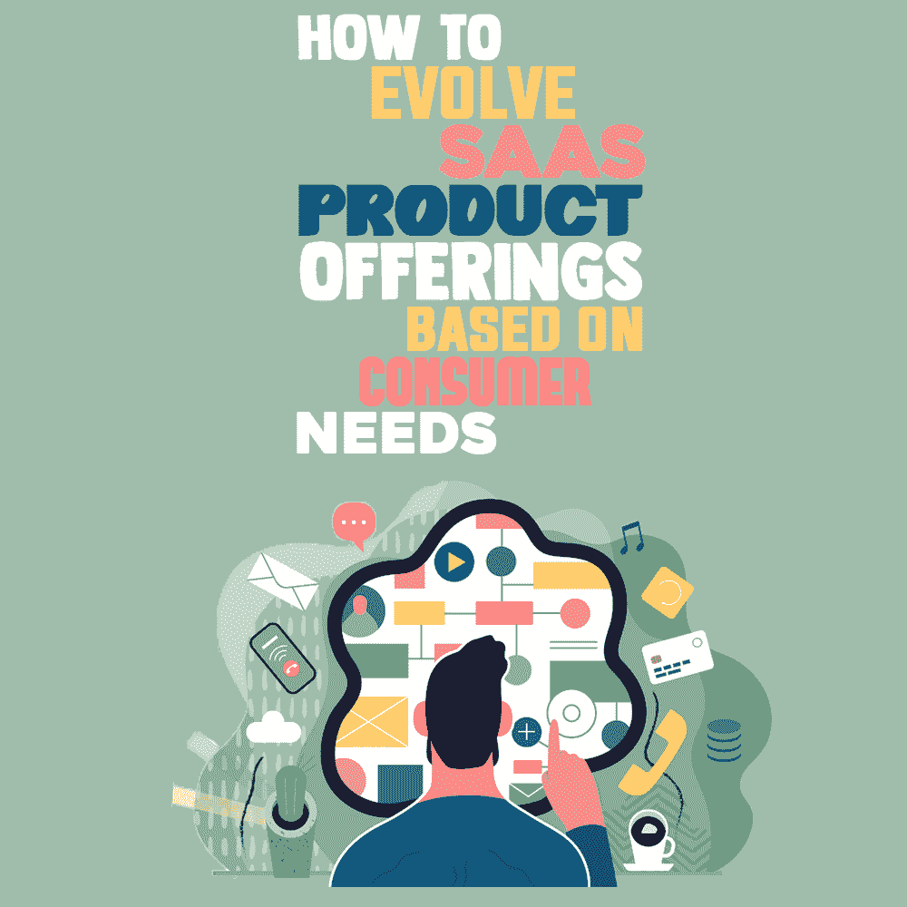
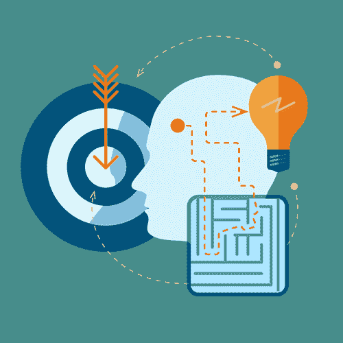

# 如何根据消费者需求开发 SaaS 产品

> 原文：<https://simpleprogrammer.com/evolve-saas-product-offerings/>

Too often, product engineering teams either struggle to align with audiences or find themselves burdened by a growing list of supposed top-priority needs assigned by different stakeholders. Ultimately, the best SaaS offerings are those which anticipate customer desires and changing prerequisites, and respond in kind.

然而，这说起来容易做起来难。用户和内部反馈可能会在不方便的时候以不方便的方式出现，造成混乱，除非正式的系统到位。此外，并不是所有的客户要求都同等重要，确定哪种产品需要首先采取行动可能很棘手。

下面这篇文章借鉴了我作为高级产品经理所学到的知识和 17 年的相关经验，帮助产品工程师系统地收集客户反馈并对其进行优先排序，以获得清晰、有目的的[产品开发路线图](https://simpleprogrammer.com/product-roadmap-software-development-project/)。反过来，你将能够把注意力集中在对最终用户和你自己公司的底线产生最大影响的项目上。

## 洞察客户需求

产品工程师最糟糕的事情就是脱离最终用户。虽然您的团队可能有自己的改进想法，但他们必须掌握现有客户体验的脉搏和整个行业的优先事项。

### 协作获得有意义的见解

由于其角色的性质，通常是[客户成功经理(CSM)](https://blog.hubspot.com/service/customer-success-manager)收到关于可能的改进和增强的有价值的、坦率的反馈。此外，他们分析客户的软件使用情况以提供个性化的指导，但也可以利用这个机会收集观察结果并与产品工程共享。

我和我的产品工程同事建议创建一个指定的电子邮件地址，供 CSM 发送反馈信息，然后分发给我们的整个团队。根据我们的经验，我们发现为 CSM 创建一个稳固而方便的流程有助于防止客户反馈被遗忘或搁置。

一个很好的经验法则要遵循:产品工程和 CSM 之间必须有公开的、定期的沟通。

电子邮件的广泛分发是有益的，因为这意味着我们更快的响应时间。毕竟，在一些场景中，我们对软件的深入了解可以帮助 CSM 更好地为客户服务。例如，如果用户寻求一个已经存在的解决方案，我们可以向他们的联系人提及，提供快速解决方案。

### 在实施新的变革之前收集反馈

从构思到实施是一个漫长的过程。作为一名开发人员，你的目标是尽可能早地收集用户和其他团队的意见，以减少资源浪费。您应该准备的有用材料包括:

*   **设计文档或交互设计。**这些蓝图工具的细节更新*在执行中没有大量投资*。产品团队可以向客户或利益相关者展示材料，听取他们的印象并收集反馈。产品工程师努力获得关于设计、可用性、是否充分有效地解决问题以及他们可以改进的其他领域的反馈。
*   **进行[可用性](https://simpleprogrammer.com/6-best-usability-testing-methods-for-mobile-apps/)和 [A/B 测试](https://www.amazon.com/Trustworthy-Online-Controlled-Experiments-Practical/dp/1108724264/ref=sr_1_1?crid=2CYKGERFD55WA&keywords=AB+test&qid=1657217466&s=books&sprefix=ab+test%2Cstripbooks%2C67&sr=1-1)的测试程序。**在本练习中，产品工程师为愿意参与测试项目的用户提前开启了一项功能。早期的测试组通常是那些对特定的增强功能感兴趣的人，然后扩展到包括其他现有客户，同时跟踪使用情况并收集反馈。

虽然 CSM 对于收集定性输入是必不可少的，但产品工程师也希望通过向所有 beta 用户分发调查来积累定量反馈。通过使用这两种形式的数据收集，您可以更全面地了解所有反馈。

### 一致文档的价值

一致的文档也有助于产品更新的许多阶段的可追溯性，因此多个团队成员可以返回到同一个参考点(例如 JIRA 门票、Google sheets 等)。).将内部交流集中在同一个论坛上，可以让每个人都更容易获得信息，最大限度地减少项目参与者之间的混淆。

如果没有一个正式的系统来积累和组织反馈，重要的观察结果无疑会丢失或被遗忘。这是因为大量的客户和内部输入可以被交流(电子邮件，聊天机器人，Slack，调查，像 G2 这样的非现场审查网站等)。).

此外，可能不清楚您的产品团队的哪个成员负责记录和评估这样的观察。因此，您应该概述一个在整个团队中统一应用的编目反馈的逐步方法。

不可能立即对每一条反馈采取行动。然而，如果你的产品工程团队决定推迟或跳过潜在的项目，不要删除任何相关的文档(如客户投诉、产品审计等)。).相反，保存这些笔记，并注明你决定不进行相关软件更新的原因。这样，如果你的团队改变了主意，你可以在将来使用这些材料。

## 战略优先项目

Collecting customer feedback is only half the story. Product Engineering leadership needs to sort and prioritize suggestions to create a logic-driven roadmap that aligns with the overall company strategy and provides the most value to the customer.

一种这样的方法是通过 **R-I-C-E** (范围、影响、信心和努力)的透镜来评估每个预期项目。

*   **到达。**确定新功能或升级是否适用于大多数当前或潜在受众。毕竟，SaaS 产品工程不想从事为个人用户创造定制解决方案的业务。
*   **影响。**修改对产品和业务的影响有多大？在光谱的一端，你会有被大多数人忽视的计划，并且产生最小的可测量的结果。另一方面，一些软件更新可能会完全改变业务的元素，从我们向新受众销售的能力到改进的工具功能。
*   **自信。**团队对理解请求并执行它的信心如何？信心不足的原因有很多，比如一个远远超出产品预期用途的请求，或者在进行进一步分析之前可能需要解决的[技术债务](https://www.amazon.com/Tech-Debt-2-0TM-Business-Improve-ebook/dp/B086PZ5FK3/ref=sr_1_1?crid=26ZUEK16B1AC7&keywords=tech+debt&qid=1657217267&s=books&sprefix=tech+debt%2Cstripbooks%2C189&sr=1-1)。
*   **努力。**有些计划可能需要数小时，有些可能需要数年。在这个练习中，你不需要确定具体的时间表，相反，[使用通用的 t 恤尺码](https://asana.com/resources/t-shirt-sizing)，比如“超小号、小号、中号、大号或超大号”，来衡量*的相对努力。*请记住，这适用于前期工程和持续维护。

当您考虑 R-I-C-E 的所有元素时，您就能够比较一个项目与另一个项目的感知 ROI，并相应地进行优先级排序。影响项目优先级的其他因素可能包括**评估紧迫性和随后的“技术债务”**以及**其他利益相关方对 R-I-C-E 的解释**

在评估紧急程度方面，产品工程专业人员经常面临是找到*快速*解决方案还是*正确*解决方案的决定。在团队迅速推出一个隐喻的“创可贴”的场景中，这只是一个临时的解决方案，为他们赢得时间来找到一个更永久的答案，并可能随着时间的推移创造更多的*累积工作*(技术债务)。

在其他内部利益相关者的帮助下，思考更新的紧急程度*和*创建短期和长期解决方案的额外工作，以确定正确的行动方案。

至于其他利益相关者对 R-I-C-E 的解释，与客户成功和其他团队分享您最初的执行顺序，以获得他们的认可。他们可能对潜在项目的范围和影响有不同的见解，从而进一步影响优先级别。

这些项目元素可以指导团队的年度或季度路线图，以及确定这样的产品修复是否足够小和/或足够紧急，以证明立即采取行动是正确的。

## 衡量更新的结果

成功发布更新后，产品工程并未结束。使用专门的分析工具来跟踪交互(在测试阶段和发布后阶段)，寻找用户及其行为的模式。直接比较更新前和更新后的参与度，以形成(或验证)关于原因的假设。

如果产品更新达到了预期的效果，那太好了！如果没有，你应该再次开始收集反馈和数据的循环，以创建新的假设，为更多的更新提供信息。

通过系统化客户反馈、优先级和影响测量，您的团队将提高运营效率和决策背后的战略。结果呢？SaaS 的产品在战术上不断发展，以更好地满足客户和市场的需求。