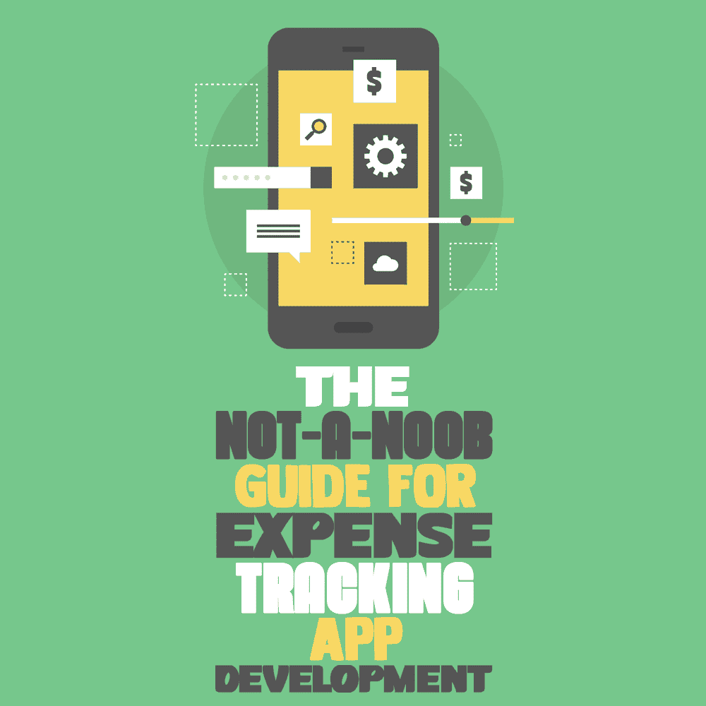
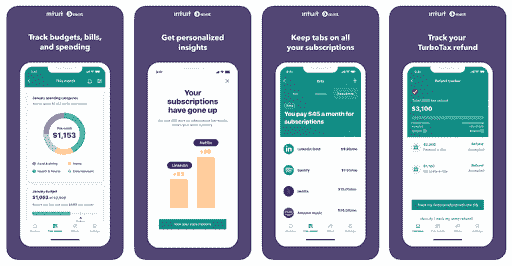
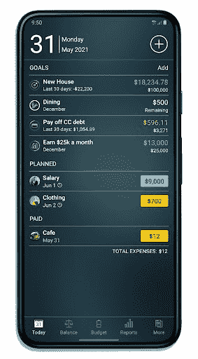

# 费用追踪应用程序开发指南

> 原文：<https://simpleprogrammer.com/expense-tracking-app-development/>

Mobile apps play a key role in simplifying our lives. From shopping for clothes to purchasing groceries, everything can be done through a mobile application. The process of managing your personal spending is not untouched by this digital revolution—if you can buy it, you can track it with an app.

技术进步的速度越来越快，市场上出现了大量的费用跟踪应用程序。《福布斯》公布了美国 2022 年最佳理财应用排行榜。这些应用程序中的大多数都有理想的框架、功能和订阅计划，可以激励美国人很好地利用它们来管理现金流。

对于需要帮助管理个人财务的人来说，费用跟踪应用程序是完美的，特别是因为应用程序自动化了这一过程。(不需要火箭科学！)

如果你想开发一个[费用管理应用](https://www.resourcifi.com/blog/app-development/?utm_source=simpleprogrammer.com&utm_medium=offsite)，我会帮你搞定。接下来，您将了解开发费用跟踪应用程序的一些主要原因以及一些重要功能。

更不用说，您将深入了解创建费用跟踪应用程序开发软件的总支出。

## 为什么需要费用跟踪应用程序

你可能会想，“市场上有这么多跟踪实时现金流的费用跟踪应用程序。我的费用追踪器如何竞争？”

而我在这里告诉你，“那是真的！”但我也为你准备了一些具体的建议。

谷歌 Play 商店和苹果应用商店上有许多资金管理应用。大部分都有上千的下载量和三星级以上的评分。

那么，你的应用程序将如何与其潜在的竞争对手展开竞争呢？

这是很多 app 开发者遇到的问题。瞬间压倒竞争对手的应用并不容易。一个好的起点是一些“额外”的东西，比如超越已经设定的标准的功能。打破这个障碍可能会减少竞争。

但是，应用程序功能不是限制。性能和稳定性等其他因素也在决定费用跟踪应用程序的成功方面发挥着关键作用。

让我们考虑一下计算费用的例子。追踪资金的流入和流出在数字化的情况下变得简单了。当费用追踪器被引入市场后，人工计算受到了限制。

用户现在可以同步数据，随心所欲地添加和删除，最重要的是，保持一切安全。在不同功能的装饰下，[费用管理应用](https://www.amazon.com/dp/1949395375/makithecompsi-20)在商业中的受欢迎程度大幅上升。

## 费用跟踪应用程序中包含的主要功能

Bankrate 报告称，63%的美国人使用至少一个费用跟踪系统来管理他们的预算。用户渴望费用跟踪应用程序具有允许业务和个人财务管理顺利运行的功能。

人们寻求一个预算应用程序，它提供免费注册，并包括总结费用的所有基本功能。

在列出应该集成到你的费用跟踪应用中的功能之前，让我们来看看所有资金管理应用都包含的一些标准功能。用户需要能够:

*   使用直观易用的界面快速添加新记录
*   在易于阅读的图表上查看他们的支出分布，或者从记录列表中获取详细信息
*   使用他们自己的 Google Drive 或 Dropbox 帐户安全地同步
*   使用方便的小工具轻松访问他们的支出跟踪器
*   一键备份和导出个人财务数据
*   用预算跟踪器省钱
*   使用多个帐户

除了以上的共同特点，还应该有一些独特的特点。这些关键特性将有助于你的应用在市场中脱颖而出。

现有的金融科技应用可以给你一些想法。你可能希望集成一个目前市场上活跃的金融科技应用程序中可能缺少的新功能。

让我们来看看资金管理应用程序的一些突出特性。

[来源](https://cdn.dbusiness.com/wp-content/uploads/sites/33/2021/03/RocketCosMint.png)

### 数据安全

费用跟踪应用应该始终保护用户的数据。由于这种应用程序通常包含与用户的银行账户和借记卡/信用卡相关的详细信息和信息，因此它们经常成为黑客的目标。

因此，金融科技应用的安全性永远不应该受到损害。开发人员应该集成多层身份验证流程、数据加密、防火墙和智能云计算解决方案来降低风险。

当风险系数降低时，用户在使用应用程序时会感到安全，因为他们知道自己的所有信息都将保密。

### 报表生成

[报告生成是资金管理应用](https://www.amazon.com/dp/0143457454/makithecompsi-20)的关键特性之一。预算应用程序有助于将费用相关数据与资产负债表、损益表等组织在一起。

此外，数据在云存储中保持安全。无论是账单发票还是付款收据，个人都可以根据需要进行检索。

[来源:钱亲](https://money.pro/img/moneypro_android_today.jpg)

### 信用评分跟踪

费用跟踪应用程序的另一个重要功能是跟踪信用评分。当信用卡与费用跟踪器应用程序关联时，它会同步帐户信息并提供用户的信用评分。

[费用跟踪应用](https://simpleprogrammer.com/become-fintech-developer-2018-trends/)提供每周/每月信用报告以及提高信用评分的建议。当用户拥有良好或优秀的信用评分时，他们会在账单按时结清时获得奖励。

### 监督预算

如果你的费用追踪应用程序可以告诉你什么时候你超支了，这不是很神奇吗？具有预算跟踪功能的资金管理应用程序有助于深入了解收入和支出。

如果个人的费用超过了实时设置的限制，应用程序将通知用户并建议可以减少的费用。

### 生物识别

密码和 pin 曾经是解锁应用程序的常用方法，但随着技术升级，生物识别变得流行起来。这是一种只需指纹就可以访问费用跟踪应用程序的方法。

许多费用跟踪应用程序开发人员正在将生物特征集成到移动应用程序中。这样做只是为了增强用户数据的安全性。

### 人工智能集成

通过集成人工智能(AI)，可以预测未来的支出时间线。判断费用行为，可以生成费用波动、节约等报告，对于不同费用行为的用户来说，可以是卓有成效的。

### 简化税收减免

随着新功能的引入，预算应用也在不断发展。由于用户需要报税，他们需要维护一个盈余表。具有税类别功能的费用跟踪器可以自动将支出归类到相关的税类别中。

## 构建费用跟踪应用程序的成本

开发一个提供费用报告并预装上述各种功能的应用程序既费时又费力。

由于费用追踪器是使用不同的功能构建的，因此考虑不同的因素变得至关重要:

*   应用程序功能:集成新功能或升级现有功能
*   平台:费用追踪器是为单一平台还是跨平台(iOS/Android)开发的？
*   第三方集成:为支持服务而集成的第三方 API 的数量
*   测试阶段:应用程序将经历的测试阶段数
*   维护和支持:应用程序的年度维护和支持费用

## 2022 年流行的费用跟踪应用

不是每个[个人理财 app](https://simpleprogrammer.com/handle-finances-freelance-developer/) 都适合所有人。用户对储蓄、开支和投资有不同的要求。为了简化选择合适应用的过程，我们编制了一些流行的费用报告和实时资金管理应用的列表。

开发者可以评估这些应用——从线框到功能和漏洞——并创建一个更好的版本。

### 铸造

Mint 是由 Intuit 创建的一款费用管理应用。该应用程序配备了预算工具和信用监控服务，可供投资者、个体户和受薪个人使用。

如果用户拥有小型金融机构的账户，Mint 可以与不同的银行和信用卡提供商关联。它在全球拥有超过 1000 万用户。

### 蜂蜜到期

Honeydue 是一款针对情侣的理财 app。这个费用追踪器被 Mission Lane 收购，帮助一对夫妇根据需要计划他们的预算。这对夫妇需要同步他们的银行账户和信用卡信息，以便进行财务规划。截至 2022 年 5 月，Honeydue 全球用户超过百万。

### 简化

Quicken 开发的 Simplifi 是一款费用追踪应用。它之所以上榜，是因为它拥有预算现金流跟踪工具。它提供实时更新的个性化费用计划。用户可以通过在应用程序中添加他们的银行账户来获得支出计划。Simplifi 在全球拥有超过 100 万用户。

### 口袋护板

如果你挥霍无度，并希望削减不必要的开支，口袋卫士应用程序非常适合你！这个应用程序有一个跟踪日常收入和支出的算法。当用户连接他们的银行账户和信用卡详细信息时，该应用程序工作。

该应用程序会生成一份月度报告，以及有助于削减不必要支出的储蓄目标。口袋卫士截至 2022 年 5 月拥有 1000 万用户。

## 底线

[个人理财 app 开发](https://www.resourcifi.com/blog/app-development/)不是火箭科学。你只需要合适的技术组合和一系列功能，就能帮助这款应用在竞争中脱颖而出。

为了与类似的应用竞争，费用跟踪应用程序开发人员现在专注于上面讨论的功能。这些特殊功能现在出现在少数金融科技应用中，并将很快在金融科技领域变得越来越受欢迎。