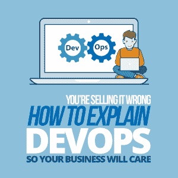
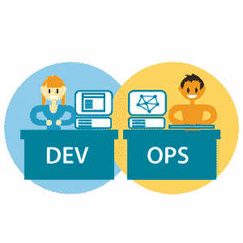

# 您的销售方式是错误的—如何解释 DevOps 以便您的企业关注

> 原文：<https://simpleprogrammer.com/explain-devops-business/>

We were struggling to get our features out into production. There were lots of defects and firefighting aplenty. All this and the company was but a few months old. What was working here going to be like in a year? We were all staying as late as we could and even working weekends to try and fix issues that would appear, seemingly, from nowhere. It was hell.

沮丧和疲惫之余，我决定向首席技术官(CTO)推销 DevOps 的想法。我读过一些关于 DevOps 运动的书，我想我们可以从我学到的一些东西中受益。我是说，我别无选择。事情不能再这样下去了。

在那一刻，事业的成功(和我的理智！)很可能依赖于我解决问题的能力。

首席技术官转向我，带着沉思的、有些困惑的表情说，“devo PS……我听过这个短语几次，但我不确定它的真正含义。是什么意思？”。

可以肯定地说，我笨手笨脚地试图证明和解释“DevOps”这个默认术语的真正含义，以及关键的是，为什么它对业务很重要，但失败得很惨。

我对什么是 [DevOps](https://simpleprogrammer.com/dbas-devops/) *实际上*没有足够强的理解，我肯定不能清楚地解释它以及我们为什么需要它。我能看出这个问题，但无论如何我也说不出解决的办法。我厌倦了晚上和周末的工作，我*真的*希望生意成功。呃。

作为程序员，这是很常见的情况。

我敢打赌你也有过类似的困境。

事情是这样的:你对一项改进发表评论，也许是你在网上读到的，在你有机会喘口气之前，它就发生了。

这就像你在“龙穴”(或“鲨鱼池”)上推销一个想法。所有的灯都对着你，你只有一次机会:推销这个想法。要么做，要么死。

在这一点上，太容易锁死了。

在压力下屈服，你会忍不住去寻找此刻你拥有的最好的理由:

“嗯……—插入大型技术公司——做吧。”

或者更糟:*“这是行业标准。”*

但是，虽然这些答案似乎是合理的，但它们实际上不是答案。它们根本就不是逻辑或有力的理由。它们没有展示你的解决方案是如何解决问题并创造出真正有价值的结果的。

但是，什么是更有吸引力的选择呢？嗯，我很高兴你问了，因为这就是我们今天要谈论的话题。

So if you’re trapped, running about with your hair on fire and you need some DevOps help, you’re in luck. Because today, I'm going to take you through how to truly understand the DevOps movement, and better still: how to pitch it so that your business will care.

首先，我们将看看诊断您的业务是否需要 DevOps。在那之后，我们将解决大多数人试图解释 DevOps 的方式，我们将看看*为什么*它最终不了了之。最后，我们将通过*这种*最好的方式来解释 DevOps，以便您的企业能够关注。

现在，在你的头发完全烤焦之前，让我们开始吧。

## 企业如何知道自己是否需要 DevOps？

为了理解我们是否需要 DevOps，我们应该看看它解决的一些问题。

作为一名医生，我们将通过首先观察症状来开始理解问题(希望能开出解决方案)。

那么，当企业需要 DevOps 时，会出现什么症状呢？

*   您不能像您的企业希望的那样经常部署。
*   部署到生产环境中既痛苦又可怕。
*   您在同步您的开发团队方面有困难，并且他们会互相妨碍。
*   您对部署的特性是否“成功”没有清晰的理解。
*   您的运营团队(经常)抱怨或指责开发人员的生产问题，反之亦然。
*   你花了很多时间来解决生产问题，而不是编写新的特性。

我看到你对这些点头了吗？

你为什么点头？因为这些说法无处不在。即使是世界上最好的公司，甚至是已经在实施 DevOps 的公司。

实现 DevOps 就像扫地一样:这不是一个公司做一次就永远做下去的事情。DevOps 必须持续考虑；随着我们发布更多的软件，我们的软件也在适应，我们对 DevOps 的理解、知识和实现也必须如此。

此时，您可能想知道:大多数企业真的需要某种形式的 DevOps 功能吗？

是的，我会解释为什么。

## 如何不解释 DevOps

为了尝试和解释 DevOps，我们可能会尝试从工具优先的角度来处理它:详细说明可以用来实现 DevOps 的不同工具:Docker、AWS、Kubernetes、Chef、Puppet、Ansible。这似乎很合适，对吗？

不完全是。但是让我解释一下为什么。

为了理解为什么这种方法充其量是弱的，让我们举一个例子。

想象一下，你站在汽车前院，想买一辆新车。你需要一辆车来送你的孩子去学校，所以对你来说重要的是它要宽敞，内部要有弹性，要可靠。

汽车销售员向你走来。他们上下打量你，认为你是个单身人士，可能有很多可支配的现金，所以他们开始向你展示一辆鲜红色的跑车。

“刚进的，全新的！”他们强调说。"它有一个轻型底盘，一个 V-8 引擎，最后但同样重要的是:真皮座椅."

你一直认为这个销售人员没有花时间真正了解你的需求。你想翻白眼——真是浪费时间。

当我们试图从工具(或行话)的角度解释 DevOps 时，我们会陷入同样的陷阱:没有识别出解决方案试图解决的问题。将问题放在第一位是获得像 DevOps 这样的新想法的核心。

但是如果工具不是解释 DevOps 的最好方法，那么什么是呢？

## 

解释 DevOps 的最好方法

为了推销 DevOps，我们需要了解它到底是什么，以及它为什么重要。

为了做到这一点，我将与大家分享我所见过的关于开发运维的最佳定义:

大多数企业正遭受一个被称为“长期冲突”的问题。当企业的两个部分有截然相反的目标时，就会发生长期冲突。

换句话说:不管业务的一部分多么努力地推动成功，业务的另一部分最终也会同样努力地反推。结果是，这些相互竞争的部门陷入停滞状态，没有人能快速前进。

对于一家寻求增长并试图积极应对市场的公司来说，停滞可能是致命的。

可能不足为奇的是(被命名为 DevOps)导致冲突的两个部门是**开发和运营**。

但是，做生意的人都很聪明，对吧？他们不会让这种事情发生吗？

嗯，它发生了，不是因为他们不聪明，而是因为他们没有把系统作为一个整体来看待。让我解释一下:

当大多数企业成长时，他们必须考虑将员工分成不同的团队。开发和运营之间有一个常见且(看似)合乎逻辑的分离。这就是长期冲突开始出现的地方。

运营的任务是保持活动服务器的稳定和安全，而开发的任务是将尽可能多的更改推向生产。

可以想象，投入生产的开发越多，感受到的不稳定性就越大。运营部门的回应是什么？反击。

随着时间的推移，这两个部门之间的沟通通常会中断。他们现在不是一起工作将有价值的特性投入生产，而是争吵、争论和互相指责。在部署日，每个人都必须加班，周末也要工作，工作不仅是一件苦差事，而且越来越无利可图。

随着变化不断流入生产，很可能很多*会*出错。因此，更好的做法(至少在纸面上)是放慢生产速度，选择大批量交付，可能一年一次，或者更少。

但是，以这种方式交付意味着企业很难将价值展现在客户面前。

这个问题的解决方案:DevOps。

DevOps 积极地将开发和运营整合到共同的目标上。是的，通过使用特殊的工具和自动化技术。

有了 DevOps，加上运营和开发团队的通力合作，您可以实现平稳(和冷静！)价值流入生产。

向您的企业解释这一价值是让他们加入 DevOps 的最佳方式。

## 现在，轮到你投球了——灯亮了

希望这能帮助你更多地了解 DevOps 运动以及如何推销它。通过解释问题——核心的长期冲突——可以让你的企业很容易理解他们是如何陷入这种境地的。更重要的是，DevOps 将如何帮助他们。

然后，当你做到这一点，你应该能够开始解释工具和更先进的概念，吸引他们的注意力。没有更多的深夜和周末花在你的笔记本电脑或头发烧到你的头皮。现在，随着业务的开展，您可以开始尝试 DevOps 并为成功铺平道路。