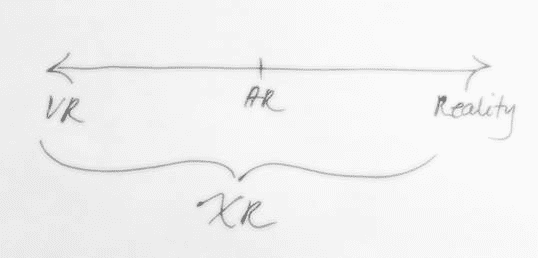
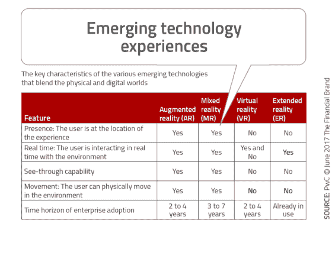
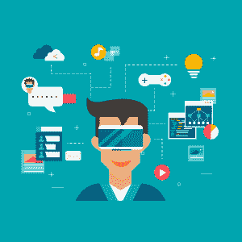

# 跨越现实，影响您的客户

> 原文：<https://simpleprogrammer.com/extended-reality-impact-customers/>

大多数科幻电影已经在我们的大脑中种下了种子，我们将能够立即远程传输自己，就像电影《Jumper》中的主角能够通过打个响指从世界的一个地方“跳到”另一个地方。

也许对于我们这一代的玄学家和科学家来说，这种可能性有点太遥远了。然而，尖端技术给我们带来了做类似事情的机会。我们说的是**扩展现实(XR)** 。

## XR 是什么？

XR 被描述为真实世界、虚拟世界和人机交互的[组合。也就是说，它是一系列虚拟可能性的超集——增强现实(AR)、虚拟现实(VR)、混合现实(MR)和 360 度视频——与现实世界相结合。](https://apiumhub.com/tech-blog-barcelona/mixed-reality/)

AR 是将增强的、计算机生成的元素插入到现实世界中，例如，当你使用 Snapchat 和狗滤镜给自己拍照时。

另一方面，VR 正好相反。使用谷歌或三星眼镜等工具沉浸在数字世界中。一个很好的例子是，当你使用 PlayStation 眼镜玩视频游戏时，在外部小工具的帮助下，你感觉完全被数字世界包围了，你变成了厨师、酒保等。

你在现实世界中的数字沉浸程度描述了你所处的现实。正如我们在下图中看到的，你越向右走，你的现实的数字化程度就越大。

这是考虑量子现实的一种新方式。

(techcrunch)

很快，我们将能够在城市中行走，甚至不会注意到或区分真实或生成的图像。

跟踪当前所有的[沉浸式技术](https://apiumhub.com/tech-blog-barcelona/disruptive-technology-innovations/)可能会令人困惑，这些技术帮助我们与人联系、接收信息和感知难忘的经历。

XR 是新一代尖端技术，将我们的现实世界与数字和虚拟世界融合在一起。

质量的趋势将开始不太关心“在哪里”，或者你经历的地方，而更关注“如何”，或者什么技术使之成为可能。

近 80%的高管认为，扩展现实工具可以成为发展与客户和员工关系的巨大资产。

然而，许多经理和团队领导并没有意识到新技术在实现目标方面的实际能力，不仅是来自组织外部，也来自组织内部。使用 XR 技术可以让您拉近员工和组织文化之间的距离，让客户首先记住您公司的名字。

例如，对于你的员工，你可以组织一些活动来训练他们使用 XR。员工可以通过一个简单有趣的数字游戏来提高他们的技能，而不需要公司花费大量的资源或材料。也有很多日常活动你可以更顺利地跟踪，比如完成新库存清单。使用你的数字和联网头盔看起来比在盒子里寻找物品本身更有趣。以名为 **[Daqri 智能头盔](https://www.tworeality.com/blog/realidad-aumentada-la-industria-daqri-smart-helmet/)** 的 TwoReality 项目为例，它通过数小时的搜索或检查机器来促进制造工作。

同样，客户满意度和客户关怀是两个领域，你可以在新一代现实的帮助下轻松应对。想象一下，如果你在这种身临其境的技术的帮助下现场展示最终的产品或服务，你的客户会有多么深刻的印象。已经有许多餐馆开始实施这项技术。基于数字和虚拟菜单，客人可以预见菜肴的外观，并看到什么更合他们的胃口。这会让他们铭记在心，让他们在选择你之前就选择你。

尽管看起来很容易，但事实并非如此。这是一种转变，公司一直在以非常缓慢的方式将这种转变融入他们的战略。他们中的一些人从一开始就信任这项技术，另一些人没有实现它的资源，还有一些人希望在“全力以赴”使用它之前看到客户的反应。

### X 一代的各个阶段

通常，公司在其数字战略的早期阶段就开始采用 VR 战略。困难在于为客户创造更好的新体验，这意味着公司通常会推动自己采用更成熟的解决方案和工具。

As we can see described in the above picture, this new set of technologies is based on shortening the distance between people and experiences. The key part is that in order to maximize the experience into the digital world, you have to use more complex tools.

这个行业只有一个方面需要改进，那就是让用户在虚拟现实中完全自由地活动。目前，在封闭的环境中有这种“自由”。用户只有不离开确定的区域，才能接收到特定的 VR 体验。在未来，我们将能够在城市、国家…甚至星球间移动！并继续在数字世界中运作。

边缘和限制将由开发该产品的公司设定。

有了 AR，用户可以带来沉浸在数字场景中的感觉。AR 在现实世界中实现，不需要护目镜或额外的计算机。就像应用程序游戏“神奇宝贝 Go”，你可以通过智能手机的镜头在你的城市里看到和捕捉神奇宝贝。

下面，我们列出了一系列致力于用增强现实技术塑造未来的初创公司。

## 增强现实初创公司

[**1。全息灯**T3】](http://hololamp.tech/)

HoloLamp 创造了 3D 视错觉，让你无需特殊眼镜就可以随身携带 AR 体验。它的工作原理是给你带来用户可以在各种不同环境下激活的便携式设备。

他们开发了一个令人惊叹的餐厅工具，让顾客有一个最难忘的经历:在点菜之前就能看到他们的食物。

[**2。旅行 AR**T3】](http://travelxar.com/)

旅行 AR 将整个世界展现在你面前，使用你的手机。在 e-sphere 中移动，您可以查看世界上所有不同的国家，选择一个国家，并查看每个地方的精选视频和精彩内容。决定下一个假期去哪里和你能期待什么变得简单多了。

[**3。realcast**T3】](http://www.realcast.io/)

What if moving around old castles and houses could transport us to the time when people lived there? Realcast is a company that can make it happen. Blending your real world with the digital by using special glasses, they transform the real world into a multilayered experience that allows you to share and learn through playful and interactive scenarios where you can set fire to a piece of wood and move around, opening treasures, windows, coffers, and old rooms.

扩展现实已经表明，当公司考虑到你的公司不仅对你的业务，而且对你的内部组织时，它对于改善他们的客户体验和潜在客户的整体想法是多么强大的资产。它可以创造客户无法从他们的脑海中抹去的惊人体验或互动资源，从而为您的商业文化带来价值。

一个新的对话渠道已经在公司或品牌和最终消费者之间诞生，在这里，扩展现实的使用可以为市场带来更高的效率和整体盈利能力。

VR，AR，两者的结合(MR)，甚至 360 度视频，都将让我们在未来与数字世界互动，而不会注意到它已经融入了我们自己的世界。