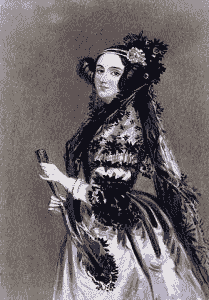
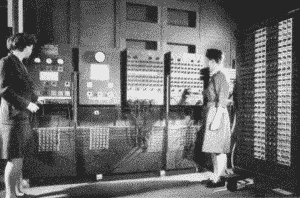
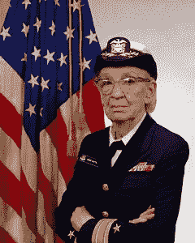
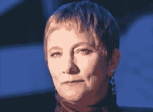
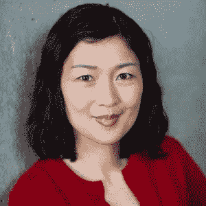
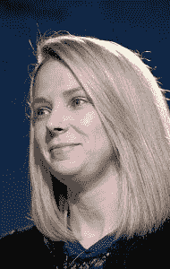
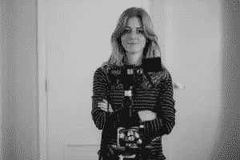
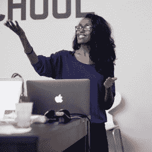

# 软件工程中女性的历史

> 原文：<https://simpleprogrammer.com/female-software-engineers/>

科技领域的女性无疑是一个热门话题。围绕着在软件工程领域追求教育和职业的女性明显少于男性这一事实，人们展开了激烈的讨论。

你可能已经看过一位谷歌工程师写的关于这个主题的信。我不想在这里进行辩论，但是这条新闻确实让我想到了那些对软件行业做出重大贡献的女性。

我决定花时间做一些研究，以更多地了解在整个编程历史上做出巨大贡献的女性，以及今天在软件工程行业中做着伟大工作的女性。有些你可能知道，有些你可能不知道。他们都做出了贡献，以一种主要的方式改变了软件工程领域。

## 阿达·洛芙莱斯

阿达·洛芙莱斯被认为是世界上第一个计算机程序员。没错——第一个程序员是女性。

19 世纪，洛夫莱斯与查尔斯·巴贝奇和他的分析引擎密切合作。她被认为是第一个程序员，因为她写下了在分析引擎中使用的算法，以计算[伯努利数](http://mathworld.wolfram.com/BernoulliNumber.html)。洛夫莱斯有先见之明，为一台尚未制造出来的计算机编写了程序！

洛夫莱斯的成就甚至更大，她预见到计算机最终能做的不仅仅是数学。她设想计算机具有创作音乐和图片的能力。

Lovelace 不仅创造了一个程序，还设想了在未来 100 年内无法完全实现的功能。她的遗产存在于 Ada 语言中，这是一种由美国国防部创造的、以她的名字命名的编程语言。

## 让·巴蒂克

第一批“计算机”实际上是女性。二战期间，女性数学家被聘为“人类计算机”，计算弹道轨迹。直到多年以后，机器计算机才强大到足以进行必要的计算。

让·巴提克是宾夕法尼亚大学的“人类计算机”之一。1945 年，她去大学工作，计算轨迹。在她开始工作后不久，比任何人都更快地计算轨迹的[电子数字积分器和计算机(ENIAC)](https://en.wikipedia.org/wiki/ENIAC) 项目被宣布。巴提克申请了这个项目并被接受。

巴提克有自己的工作要做。她必须在没有任何指导的情况下学习如何给 ENIAC 编程。为了自学所需的技能，巴提克与贝蒂·霍尔伯特森一起，孜孜不倦地研究图表，并采访建造 ENIAC 的工程师。今天的开发人员可能会涉及到这一点，因为他们仍然会一直自学！

在学习如何编程 ENIAC 的过程中，Bartik 和她的团队开发了许多基本的编程技术，如子程序和嵌套，每个程序员都在代码中使用这些技术。Bartik 和她的 ENIAC 女工程师团队开发了许多至今仍在广泛使用的概念。

## 格蕾丝·赫柏

格蕾丝·赫柏无疑可以被认为是计算机和软件工程早期最有影响力的女性。

她在霍华德·艾肯领导的哈佛 Mark 1 计算机团队开始了她的计算机职业生涯，但她最大的贡献是创建了一个程序，将人类可读的语句(代码)转化为计算机可以理解的机器语言。

任何高级编程语言，如 C++、C#或 Java，都使用编译器来完成这种转换。如果你编程过，你肯定用过编译器。

格蕾丝·赫柏有一个革命性的信念:你可以用英语单词编写代码，这些语句可以被编译器翻译成机器语言。尽管其他人声称这种类型的行动是不可能的，第一个编译器是由霍普在 1952 年完成的。

然而，霍普并没有就此止步。1959 年，她参加了数据系统语言会议(CODASYL)。这次会议导致了 COBOL 的诞生。

COBOL 是一种用英语单词编写的语言的实现，Hopper 为此付出了巨大的努力。事实上，它至今仍被广泛使用。点击查看令人印象深刻的统计数据[。](https://blog.codinghorror.com/cobol-everywhere-and-nowhere/)

格蕾丝·赫柏创建了第一批编译器之一，并帮助创建了一种语言，这种语言在创建后的 50 多年里仍在使用。这是给工程界留下的一个很大的印记。

## Anita Borg

任何关于技术和软件工程领域女性的讨论都必须包括安妮塔·博格。她是一位有成就的计算机科学家，也是科技界女性的强烈倡导者。

Borg 在为一家小保险公司工作时自学了编程。工作几年后，她于 1981 年获得纽约大学计算机科学博士学位。

Borg 花时间研究基于 UNIX 的操作系统。她获得了一项分析和设计高速存储系统的技术专利，后来又研究了一项鲜为人知的技术，名为电子邮件(你可能听说过)，建立了一个基于电子邮件和网络的系统来支持虚拟社区。她最终成为 PARC 施乐公司的首席技术官。

博格是科技界女性的大胆倡导者。她在 1987 年创建了该系统的邮件列表，1994 年，她创建了格蕾丝·赫柏计算机妇女庆典，1997 年，她创建了妇女与技术研究所。

妇女与技术学院现在被称为安妮塔·博格妇女与技术学院。该组织的目标是增加妇女在技术领域的代表性，并使妇女能够创造更多的技术。

安妮塔·博格是科技界女性的一大支柱，她的影响至今仍能感受到。

## 潘正磊

我们现在来看看最近女性对软件工程行业的贡献，从 Julia Liuson 开始。

如果你是一名 C#或 VB.NET 开发者，你应该感谢 Julia Liuson。1992 年，她大学一毕业就加入了微软，开始从事 Access，但这并不是她做出的最大贡献。

对于 Windows 应用程序开发人员来说，Visual Studio 是目前可用的最好的集成开发环境(ide)之一，而且它只会越来越好。

Visual Studio 于 1997 年首次推出，支持 Visual C++、Visual Basic 和 Visual FoxPro。随着时间的推移。NET 框架是和 C#以及其他几种语言一起加入进来的。Visual Studio 现在支持多种语言。查看本文了解 Visual Studio 的有趣历史。

Liuson 是 Visual Studio 项目的原始开发人员之一，从那时起就一直从事这项工作。她现在是 Visual Studio & .NET 的高级副总裁，掌管着整艘船。

你们中有多少人知道市场上最流行的 ide 之一，Windows 开发的主要部分，是由一位女工程师开发和管理的？

## 玛丽莎·梅耶尔

雅虎！经历了一些困难时期。然而，这一事实并没有消除现任首席执行官玛丽莎·梅耶尔对她软件工程师职业生涯的影响。

梅耶尔从程序员到 CEO，这当然是任何程序员的重大成就。然而，她作为工程师的成就也值得庆祝。

她于 1999 年成为谷歌的第一位女工程师。她很好地利用了自己在斯坦福接受的教育，编写代码，然后领导创建了几个成功的谷歌项目，包括 Gmail、谷歌地图、谷歌地球和谷歌新闻。

我知道我开车时很依赖谷歌地图。许多企业依靠 Gmail 提供电子邮件服务。玛丽莎·梅耶尔是创造这些神奇服务的主要部分。

## 琳赛·斯科特

琳赛·斯科特是一名演员兼超模，为路易·威登和古驰工作，也是第一位在时装周上登上卡尔文·克莱恩品牌专卖店的非裔美国模特。她也是一名电脑程序员。

斯科特毕业于阿姆赫斯特学院，主修戏剧和计算机科学。她利用自己的计算机科学技能成为了 iOS 问题 Stack Overflow 的顶级答案提供者之一。

她在 app store 中有几个应用程序(点击此处查看)，还花时间教孩子们如何编码。她是 T2 Ryse Up T3 公司的首席技术官，该公司致力于联系顶尖人才和新兴艺术家。

Scott 打破了程序员应该是什么样的刻板印象，并且是一个很好的例子，证明了无论你长什么样或以什么为生，你都可以通过技术产生影响。

## 杰西卡·麦克凯勒

Jessica McKellar 是一个你应该知道的名字，如果你是 Python 开发者或者开源的贡献者。

McKellar 是 Python 语言和社区的主要贡献者。她是 Python 软件基金会的董事，并因其对 Python 的贡献获得了 O'Reilly 开源奖。她也是 Python 网络框架 [Twisted](https://en.wikipedia.org/wiki/Twisted_(software)) 的贡献者。

如果这还不足以让你相信 McKellar 的才华，她是三个成功创业公司的一员。她最初是 Ksplice(2011 年被甲骨文收购)的开发人员，后来成为该公司的工程经理。

McKellar 后来联合创立了被 Dropbox 收购的聊天应用 [Zulip](https://zulip.org/) 。在 DropBox 工作了三年后，她创办了另一家创业公司 [Pilot，Inc](https://pilot.com/) 。

McKellar 也为 Linux 内核做出了贡献，目前正在为 O'Reilly 写一本名为 *Linux 设备驱动程序，第四版*的书。

McKellar 通过谷歌代码之夏、GNOME 女性拓展和黑客学校指导其他程序员。她还创建了世界上最大的 Python 用户群。如果您是 Python 开发人员，请了解 Jessica McKellar。

## 萨龙·伊特巴雷克

Saron Yitbarek 一开始并不是一名程序员，但自从她转型成为程序员后，已经产生了重大影响。在一家软件咨询公司和微软工作了一段时间后，她创建了 [CodeNewbie](http://www.codenewbie.org/) ，这是一个由新老软件工程师组成的超级支持社区，宗旨是互相帮助。这个网络的建立是迄今为止她对计算社区的最大贡献。

Yitbarek 的网络最初是一个每周一次的 TwitterChat，旨在帮助初学编程的人联系起来，现在已经发展成为一个伟大的网站，提供博客帖子、播客、新手程序员资源、讨论板和五个城市(亚特兰大、奥斯汀、达拉斯、DC 和费城)的本地聚会。

每周的推特聊天还在继续。每周三都会提出一个问题，开发者可以用#CodeNewbies 来回答。对于刚接触编程的人来说，看看 CodeNewbie，看看它是否能帮助你成为一个更自信、更有能力的开发人员。

## 不要忘记软件工程中的女性

这远不是在软件工程领域做出重大影响的所有女性的详尽列表——还有许多知名和不知名的人物做出了重要贡献。

[金伯利](https://en.wikipedia.org/wiki/Kimberly_Bryant_(technologist))开始了[黑人女孩代号](http://www.blackgirlscode.com/)。如果使用 [OAuth](http://oauth.net/) ， [Leah Culver](http://leahculver.com/) 帮助编写了 API 规范和一个 [Python 实现](https://github.com/leah/python-oauth)。安娜·帕特森领导谷歌的人工智能和机器学习工作。Emily Ratliff 是 Linux 基金会的高级安全主管。这些只是产生影响的几个数字:从这篇商业内幕文章中了解更多工程领域的女性。

帮助鼓励女性在软件工程领域追求教育和职业的一种方法是，将更多的注意力放在为所有程序员铺平道路的女性以及今天从事这项工作的女性身上。突出从事编程工作的女性可以帮助学生选择追求软件工程教育，向她们展示在这个领域工作的与她们相似的人。

女性为我们今天所知的软件工程行业铺平了道路，并继续推动它向前发展。我鼓励你更多地了解我们行业中的这些先驱。