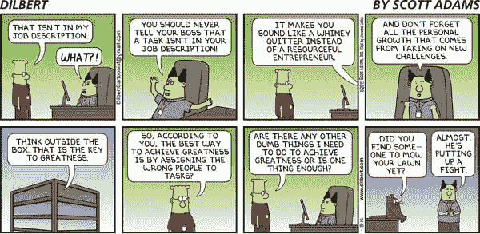

# 适应还是不适应:阻碍编程的巨大恐惧

> 原文：<https://simpleprogrammer.com/find-your-niche/>

这只是办公室的又一个星期四。你需要让你的眼睛休息一会儿，享受一下急需的午后咖啡休息时间，但是意想不到的事情发生了。当你转弯的时候，你滑倒在会计部的皮特忘记清理的溢出物上，并且你弄断了你的手腕。你开始寻求工人赔偿。你的公司为难你，不想付钱。开始寻找法律代表。

你找到一家有前途的律师事务所。他们在其网站上列出了以下资格:

*   优秀的口头和书面沟通技巧
*   熟悉案件文件扫描
*   非常喜欢 Evernote 跟踪案例
*   五年研究以前案例的经验
*   三年采访证人的经验
*   精通归档证据
*   能够一天几个小时在公文包里携带成堆的纸张

然后你再找一个网站。这一次，信息完全不同:

“你压力很大，担心入不敷出。你伤了自己，需要帮助获得工伤赔偿。我们专门帮助像你这样的人从你的雇主那里得到你应得的东西。我们已经打赢了数百起工人赔偿案件，我们也能打赢你们的官司。”

你选择哪个？

你的问题是:你需要工伤补偿，却拿不到。第二家律师事务所解决了这个问题。你雇佣他们。

专业化，或者说找到你的定位，对知识工作者来说也是一样的。公司有需要解决的问题。坦率地说，只有当你知道如何解决他们的具体问题时，你才能要价很高。

然而，许多开发人员和程序员害怕找到一个利基，并深入到一个专业领域。有一种担心是，公司员工已经习惯了:“除非我知道如何一直做好每件事，否则我没有价值。我无法只专注于一件事。”

我们来深究一下这种思维是从哪里来的。

## 

职位描述毁掉求职者(也欺骗他们)

以下是我从一份真实的工作描述中找到的一些统计数据(我不会链接到它，因为我不想挑出一家特定的公司):

*   21 资格
*   21 项工作职责，其中有几项把“领导”或“导师”列为第一个词
*   这 21 项资格中提到的 19 种具体产品

这不是一个高级职位。这是一个 It 系统管理员的职位。

像这样的招聘启事让求职者走上了成为商品的道路。你觉得为了变得有价值，你需要知道如何做公司可能要求你做的每一件事。你被训练成一个多面手。

那根本不是真的。你的价值来自结果。你的价值来自于解决问题。你的价值并不来自于了解 Windows Server 2008、2012、2016、Linux、Unix、Red Hat Enterprise Linux、Microsoft Azure、Amazon Web Services、Windows 10，或者招聘信息和简历中常见的其他无数事物。

本书 [*开发者霸权*](https://www.amazon.com/Developer-Hegemony-Future-Erik-Dietrich-ebook/dp/B0722H41SG/ref=sr_1_1) 很好地阐释了企业界的逻辑。在书中，埃里克·迪特里希描述了一个场景，一个人需要在他的地产上挖沟渠。他雇佣了一群擅长挖掘沟渠的人，并同意每天付给他们固定的工资(本质上是薪水)。

但是有一天，开始下雨，这意味着没有沟渠可以挖。土地的主人无论如何都要付钱给挖沟渠的人，所以他把他们带进来，让他们在他的房子里做家务来挣钱。他们不是被雇来洗碗的，而是被雇来挖沟的。

企业界与上述房主的心态相似。“我付你薪水是让你来工作，为了证明这份薪水的合理性，你几乎必须做我让你做的任何事情。”这种心态导致开发人员被困在他们讨厌的工作中，因为他们随意从一个项目转移到另一个项目，很少有发言权。他们应该照吩咐去做。

上面提到的工作描述是编程中这种现象的一个促成因素。这些职位描述把所有可能发生的事情都写在了纸上，让你觉得你需要知道所有这些事情才能被录用。实际上并非如此。

然而，许多申请人在看到一墙的资格证书时仍然犹豫不决，不是因为他们觉得自己不能胜任这份工作，而是因为他们不相信雇主会给他们机会。

职位描述让你觉得了解一切是你能为职业生涯做的最有价值的事情。那是骗人的。了解一切是你能为公司做的最有价值的事情。这是公司向你支付如此高的薪水、福利和退休计划的最佳方式。

公司想把你放在它想去的任何地方，告诉你做它想做的任何事情，这样你就成了某个问题解决方案中的一个齿轮，而这个问题是某个中层管理者想出来的，可能是错误的，浪费了大量的金钱。但是不要担心你那小小的程序员脑袋。那是“生意上的事”

## 公司生活限制了你

The software development world is interesting. In it, middle management often decides what needs to be done to improve a piece of software or generate revenue. Then the developers are handed a specification document and told to retreat to their dark room and come out with finished code.

不幸的是，这种工作方法将开发人员置于一个低杠杆的位置。如果你走出房间，告诉你的经理他们正在做的事情没有意义，并给他们一些如何实现相同目标的其他想法，会发生什么？

我在以前的公司生活中曾经这样做过，我可以告诉你这不起作用。你会得到两种回答:要么“这是个好主意。我会考虑一下(或者告诉别人)，”然后什么也没发生，或者，“是的，我知道这不是最好的，但无论如何都要做。”

当你去看医生时，你告诉他们哪里出了问题，他们会诊断出问题并开出治疗方案。他们也不管理治疗。在典型的企业生活中，开发人员不是医生。所以他们的诊断和处方都不要。相反，他们被期望管理其他人的治疗。因此，开发者应该思考如何成为医生。

在我所在的团队中，优先级变化如此频繁，以至于你永远没有机会真正做好一件事。你对一个主题进行研究，并对它能做什么感到兴奋。接下来你知道的是，你在做别的事情，而这种知识萎缩了。这使得你很难向其他雇主推销自己，因为你的公司让你更难将事情进行到底。这对你在其他地方找到工作没有帮助。

改变优先事项也会伤害公司。当项目切换如此频繁，以至于你开始了许多项目，但没有交付，很难证明所花的钱是值得的。我见过许多团队经历了整整一年，最后，他们觉得自己一事无成。这伤害了团队的士气，导致工作因脱离而更差。患者对每周或每月接受不同的治疗有何反应？不太好。

你可能会说，“帮你找下一份工作不是你公司的工作。”我同意你的观点。但这是你的工作。你应该把你的职业当成一门生意，寻找成长的机会，而不是呆在同一个地方，连续 10 年做同样的事情。

许多公司很乐意尽可能地利用你，然后在不需要你的时候解雇你。尽管有人力资源方面的说辞，公司并不关心你。

## 为什么编程利基是有价值的

那么突破传统企业发展局限的关键是什么呢？开发一个编程利基是最终成为开处方的医生而不是总是管理治疗的医生的关键。坦率地说，这就是价值所在。

利基之所以有价值，是因为你把自己从商品变成了必需品。尝试学习每一项可能的技能会把你放在一群都知道这些技能的候选人中(他们中的许多人比你便宜)。

这时，公司会根据你参加面试时穿的衣服或你如何在白板上写排序算法的细节来做出判断——这些事情与你能为他们做什么无关，但却是判断他们邀请面试的 100 名相同开发人员的任意方式。

而是注重差异化。什么让你与众不同？是什么让你不同于所有向公司承诺同样事情的人？

如果你专门为个体企业家和生活教练建立销售漏斗网站会怎么样？你现在已经发现了一个很多人都需要解决的问题，并告诉市场你可以解决这个问题。

杠杆在你手中。您决定使用什么托管解决方案，需要什么编程语言或工具套件，以及如何设计页面并将其连接到信用卡支付系统。你也决定你能得到什么报酬。

当你试图了解每一种技术产品或最新趋势时，你最终对企业真正需要的东西了解很少:问题解决者。你的公司不需要. NET 编译器专家。您的公司需要提高其。NET 应用程序减少了 20%。的。NET 编译器是一个工具。

学会从商业价值的角度来看待你正在解决的问题，而不是从你将要使用的最酷的新技术的角度。你可以随意向你的朋友谈论技术，但要记住更大的图景。

不要做有五年锤子经验的木匠，做木工车床的专家。相反，做一个能设计和建造餐厅家具的木匠。

## 如何找到自己的定位

Knowing that niches are valuable is one thing. Actually finding your niche and designing your career around it is something else. Therefore, it makes sense to address the big question that is doubtless growing in your mind.

“我如何找到自己的定位？”

这里有一些具体的步骤来帮助你找到一个有利可图的利基。

### 找一些人们会付钱让你做的事情

[看看你做了什么](https://daedtech.com/what-do-you-know-people-pay/)以及你带来了什么独特的体验。你为你的雇主建立了几个销售渠道吗？您是否拆除并重建过企业电子邮件系统？是否有多年从事某一类产品的经验，比如客户关系管理软件或者会计软件？

看一看你所知道的，可以融入商业问题解决方案的东西。

### 确保人们会为此买单

你需要找到一个利基市场，有愿意为你的服务付费的人。查看谷歌关键词规划器，看看人们是否在搜索你解决的问题。搜索博客，或 Stack Overflow 或 Quora 上的问题，这些都证明了你对你所在领域内容的兴趣。

市场力量的确很重要。遵循“如果你建造了它，他们就会来”的哲学可能会导致头痛，并导致你放弃。愿意去测试什么是有效的，并跟随你所学到的，而不是你所希望的。你既需要解决问题的能力，也需要相信这是一个人们需要解决的问题。

### 找到一个许多企业都会面临的问题并解决它

有时，你可以通过发现人们需要帮助的问题并开发解决问题的方案来创造自己的市场。

建立销售漏斗是每个个体企业家或教练在建立业务的某个时候都会遇到的问题。他们会找人帮忙建造漏斗。如果你在能解决那个问题的人的短名单上，你将永远不会失业。

看看你为现在或以前的雇主或客户完成的项目。看看有没有你觉得可以为其他企业或客户反复做的项目。然后开一个关于这个话题的博客，帮助别人完成他们的项目。你最好把自己定位成解决这个问题的人。

## 利用你的优势的最好方法

花一点时间，想想在公司环境中找到并利用你的位置是否有意义。这不是不可能成为你的利基市场，并提供高薪工作，以帮助公司解决这些问题。然而，我不认为这是将你的专长发挥到最大效果的最佳途径。

在企业环境中做一名开发人员是有局限性的。这是没有办法的。你可以以 100，000 美元被雇佣，然后在 10 年内获得 3%的加薪。持续赚更多钱的唯一方法是不断换工作，这是大多数开发者正在做的事情。

另一方面，作为一名顾问(不是假的)或者自由职业者，你会有无限的收入机会。开发一个利基市场，并围绕它建立一个企业，会给你带来巨大的杠杆作用，并提高你的赚钱能力，比传统的企业职业生涯更大。

你可以[成为一名自由软件开发者](https://simpleprogrammer.com/freelance-programmer/)从事你选择的项目。你可以成为你所选择领域的顾问，诊断问题，开出解决方案。或者你可以创造信息产品，让别人知道你的定位，从而创造一种不用工作时间就能为你创收的资产。

How to transition into freelance development or consulting is best left for another post. But doing so will be the best way to leverage your niche for maximum effect. You’ll [become the go-to person to solve a problem](https://simpleprogrammer.com/find-freelance-jobs-not-advertised/) and you’ll be able to charge more and more as you gain experience working in your niche. Plus you eliminate the hassle of going through programming interviews every two years.

## 不要让恐惧阻碍你

公司想要瑞士军刀作为员工，这样他们可以学习每一种可用的技术工具，并在需要时汲取这些知识。你希望得到与你价值相称的报酬，并因你能完成的事情而得到赏识。

不要把自己定位成瑞士军刀，甚至锤子。把自己定位成一个木匠，他可以把一个空的正方形房间变成一个漂亮的餐厅。重要的是结果，而不是你能在简历上贴多少首字母缩写词、证书和版本号。实际价值越少越好。

害怕错过可能是一个强大的动机，试图学习这一切。但是，不要追随最新的闪亮的东西，而是战略性地关注将会建立你的品牌和你的业务的东西。即使你不是自由职业者或顾问，你也应该把自己的事业当成一个职业。建立这种业务的最佳方式是找到一个合适的位置并加以利用。