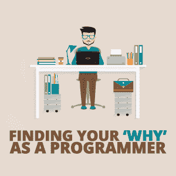

# 作为一名程序员，找到你的“为什么”

> 原文：<https://simpleprogrammer.com/find-your-why-programmer/>

Today, we’re going to tackle the big question: What’s the meaning of life, the universe, and everything? [It’s 42.](https://en.wikipedia.org/wiki/42_(number)#The_Hitchhiker's_Guide_to_the_Galaxy)

开玩笑的。不过说真的，是时候开始考虑在工作中寻找目标了。我们为什么做我们所做的工作？

作为开发人员，我们很幸运能在一个报酬丰厚、需求旺盛的领域工作。如果你是一个有一定技能的开发人员，愿意到有工作的地方去，那么世界就是你的了。

也就是说，仅仅为了钱而出现不会带来长久的幸福。即使你的收入很高，如果你不能把工作和目标联系起来，你的生活最终会感到空虚。

这不仅从情感的角度来看是痛苦的，而且你缺乏目标和方向意味着你最终会被困在一份你讨厌的工作中，没有简单的出路。这是导致精疲力竭的一个因素。

因为开发人员的工资很高，所以当我们向朋友提及对我们工作的任何不满时，我们经常会受到指责。我听说过这样的话，“你没有权利抱怨——你太幸运了。”

但是老实说，随着你事业的发展，金钱和地位成为次要问题。你需要在工作中找到更深层次的目标。没有与你的核心目标的联系，规划你的职业方向几乎是不可能的。你需要找到你的“为什么”,并用它来导航你的职业生涯。

基于我自己的经历，我将分享几个你可以用来寻找人生目标的策略。这不是找到“终极意义”或类似东西的神奇路径。我不是你或任何人的导师。

相反，这是一个实用策略的列表，您可以使用它来探索自己并找到更深的意义，从而在您的生活中获得更大的快乐，并帮助您在开发人员的职业生涯中做出更好的决定。

## 找到你的“为什么”

作家兼商业顾问西蒙·西内克认为，个人和公司应该总是“从为什么开始”他认为其他人(或者，在这种情况下，你——作为一个在你的职业生涯中寻找更深层次意义的人)更容易对“为什么”产生共鸣，而不是“如何”和“什么”在他的书 [*找到你的为什么*](http://www.amazon.com/exec/obidos/ASIN/B074F33DYD/makithecompsi-20) 中，他写了他用来帮助别人找到自己核心目的的方法。

这个方法是从故事开始的。想想你过去的故事，这些故事仍然能在情感上引起你的共鸣。这些可能是你职业生涯或个人生活中的形成性经历。许多这些故事可能来自你的童年。目标是想出五到十个这样的故事，然后写下来。

当你有了你的故事后，检查它们以找到共同的主题。例如，也许你所有的成长经历都围绕着保护你的家庭或者建造一些令人惊奇的东西。每个人的故事都会不同。

与你的伙伴、值得信赖的朋友或同事交谈有助于你找到故事的主题。他们经常会发现你错过的东西。

找到你的主题后，排列它们。你的目标是将列表缩小到一两个最能引起情感共鸣的主题。一旦你有了自己的主题，就用它们来构思一个个人的“为什么”陈述。

你的“为什么”陈述是一个可操作的陈述，着重于你对他人的影响。这是你希望你的工作如何影响他人。

格式是:给【贡献】以便【影响他人】。

这里有一个例子:

> 激励人们去做激励他们的事情，这样我们就可以一起改变我们的世界。西蒙·西内克

这一过程的优点是易于遵循。找到故事，找到主题，并精心制作一个声明。如果你刚开始自省，这是一个很好的开始。

就我个人而言，这不是我最喜欢的运动。虽然我确实设法创造了一个能引起情感共鸣的“为什么”陈述，但我觉得这个结果太软弱无力了。作为一名开发人员，我更喜欢更具体的东西。

然而，如果你正开始寻找更深的意义，这可能会给你提供一些见解，你可以在以后扩展。

## 现成的目的

在我们这个个人主义和进步的现代，我们倾向于想自己做所有的事情。人们经常抛弃旧观念，说它们不再适用于我们的现代世界。作为开发者，我们经常被赋予吹走过去，建设未来的责任。

虽然远离过去通常是积极的，但我们也可能会不小心扔掉一些可能有助于我们成为更好的人的东西。

几千年来，其他人一直在探索生命更深层的问题——包括目的。有时候，我们可以不通过内省来寻找意义，而是去看看这些以前的思想家，从他们的作品中获取意义。如果你不喜欢自省，那就去你的书架上找找建议。

过去的智慧有很多种。哲学、宗教和文学领域不乏伟大的作品。我偏爱罗马的斯多葛派，比如塞内加、爱比克泰德和马可·奥勒留。我喜欢斯多葛派，因为他们用理性化解负面情绪和消极心态。许多其他技术专业人士，包括像 DHH 这样的著名开发人员，也是斯多葛派哲学的粉丝。

不同的哲学适用于不同的人。坚持读下去，直到你找到与你产生共鸣的更深层次的意义。

## 目标层次结构

In [*Grit*](http://www.amazon.com/exec/obidos/ASIN/1501111108/makithecompsi-20), author Angela Duckworth talks about how finding a higher purpose helps you gain resilience. People who have a purpose to their work can more readily persevere in the face of adversity. This ability to persevere underlies success in all fields, especially tough fields like software development.

为了找到目标，她建议创建一个叫做目标层次的东西。要建立一个目标层次结构，首先要列出你的目标。没有你需要的具体数字，但我会从至少五个开始。

一旦你有了清单，问问自己为什么每个目标对你都很重要。当你不停地问为什么时，你会发现你的目标的原因会汇聚成几类。继续向后努力，直到你有一至三个不同但同样重要的目标。

例如，假设你的目标之一是在工作中获得晋升。问问自己为什么。也许你想要升职是因为你想要更多的钱。再问自己一次为什么。也许你想要更多的钱来为你的家人提供一个好的生活方式，或者成为一个养家糊口的人是你的核心动机之一。如果你的其他几个目标都集中在为你的家人提供良好的生活方式上，那么这就是核心价值。

这对开发人员来说是一个很好的练习，因为我们经常被鼓励创建目标列表。无论是在你为自己创建目标的绩效评估中，还是仅仅是对个人进步的一般推动，软件开发人员通常都有一个现有的目标列表需要分析。如果你是那种阅读简单程序员网站的人，你可能是那种至少有几个目标的人。

我发现这个练习是三个练习中最有用的。多年来，我一直在记录目标清单，因此利用它创建一个目标层级很有趣。检查我的清单比挖掘我过去的故事要容易得多。我也喜欢这项工作带来的具体成果。

## 找到更深层次的意义

无论你用什么方法找到它，在我们的工作中找到更深层次的意义对保持健康的职业生涯至关重要。

软件开发是一个很容易赚钱和找到工作的职业。这种成功的代价是需要不断更新你的技能，并在职业阶梯上磨砺。

钱不足以激励你不断前进。为了有一个长久健康的职业生涯，你需要对你的工作有更深层次的意义。这个更深层次的含义将帮助你做出更好的选择，并激励你尽最大努力。每当你面临职业选择时，你可以问问自己，这是否符合你个人的“为什么”

今天就采取行动。从这个列表中选择一种方法，找到你的目标。