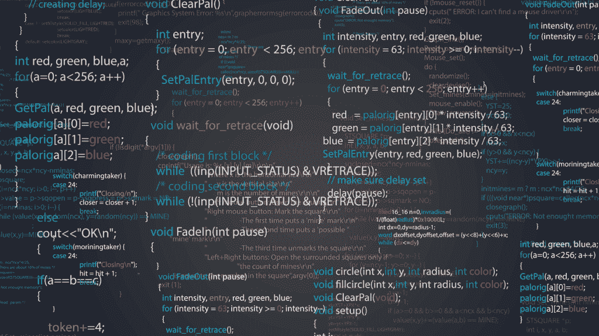

# 寻找相似之处的重要性

> 原文：<https://simpleprogrammer.com/finding-similarities/>

## 默认值:差异

你独一无二。这个星球上没有人像你一样。你很特别。这几乎是我们现在经常听到的。人是个体，因此是独特和特殊的。我完全同意这一点，但这让我们认为别人是不同的。然而，这种心态可能是危险的，或者至少是没有成效的。让我们把事情反过来，把别人想成差不多。找到你和他人的共同点，并专注于此。事实证明，这样的想法更容易与人合作，并且在编码时也有好处！但是我们必须改变我们的思维方式。

不幸的是，我们倾向于观察其他人和事物，并宣称他们是不同的。这方面最明显的例子是性别歧视和种族主义。我们看到另一种性别或肤色的人，会立刻认为他们与众不同，如此不同，甚至不值得尊重。即使我们不一定对另一性别或种族有负面的感觉，我们也会宣称它们是不同的。我们也有根深蒂固的刻板印象，加剧了这些差异。女人数学不好，情绪强烈，玩娃娃。男人是技术型的，强壮的，他们喜欢运动和汽车(顺便说一句，根据这个定义，我不算是个男人)。

事实上，我们非常想与众不同，即使我们有相同的兴趣，比如足球(欧洲或美国的那种)，我们也会通过为其他球队欢呼来区分自己，并对此非常虔诚(以至于我们真的会砸对方的头)。

美国全国广播公司新闻记者琳达·埃勒比曾经就这个话题说过:“人们非常相似。只是我们的差异比我们的相似之处更容易被定义。”

我们无时无刻不在评判别人。我们根据他们的头发，衣服，车做出假设。当我们听音乐时，我们喜欢认为古典音乐不同于说唱和金属。同样，说唱和金属也没有什么相似之处。恐怖电影一点也不像浪漫喜剧。我们给人和事物贴上标签，把他们彼此分开。

## 相似性的重要性

让我们努力改变这一切。[停止判断，转而寻找相似点](http://www.amazon.com/exec/obidos/ASIN/0387291466/makithecompsi-20)。我们都只是人。我们在努力谋生。我们很多人都在努力提高自己。我们中的一些人喜欢古典音乐。

那个让你的生活变得痛苦并且完全不像你的经理很可能像你一样试图供养他的家人。如果你在酒吧遇到他，你甚至会发现他和你喜欢同样的音乐。你可能不喜欢他这一点，但这确实让他更有人情味；这让他更像你。

让我们扭转局面。为什么这个经理让你的生活如此痛苦？大概是因为经理觉得你和他自己不一样。他是一个聪明的领导，而你是一个愚蠢的奴隶，一个有价值的员工。实际上，一旦经理发现你们听同样的音乐，他会变得更加友好。突然间你不再那么与众不同了。同样，你可能会更乐于接受他的建议。如果这家伙听了你最喜欢的乐队的歌，他能错到哪里去呢？

我们都见过人们因为共同的兴趣走到一起，又因为失去了共同的兴趣而渐行渐远。见鬼，我们都曾经是这样的人！

你可能听说过这句话“没有什么比共同的敌人更能把人们联系在一起。”如果把人们联系在一起的不是共同的敌人，而是战胜敌人的共同利益呢？如果共同的兴趣把人们联系在一起，那也可以是音乐或体育。

我和一个人成为最好的朋友已经有 16 年了，因为我们都习惯骑自行车上学(而不是坐公交车)。目前，我有两个同事有时骑自行车上班。这是我们仅有的几个共同点之一，但是对于一周一两次的谈话来说是很好的！相似之处可以像骑自行车一样简单。

## 基本上是一样的

想象你在一个聚会上和某人交谈——让我们称他为大卫。大卫提到他喜欢爵士乐。糟糕，你喜欢重金属。然而，还没有完全失去。同样，我们喜欢认为事物是不同的，乍一看，爵士乐和重金属是非常不同的。

好吧，你只是碰巧知道一个臭名昭著的黑人金属乐队的鼓手实际上是一个爵士鼓手。还有一些乐队实际上将金属和爵士乐混合在一起。此外，这两种类型都非常技术性；音乐家必须真正精通他们的乐器。事实上，你们一直在激烈讨论谁演奏得更快:爵士鼓手还是金属鼓手。知道了这些，爵士乐和金属真的有那么大的区别吗？虽然你看到了很多相似之处，但你仍然不是一个爵士迷。然而，你仍然可以祝贺大卫对音乐的良好品味。

让我们看另一个例子。玛丽收集邮票。你能想到比集邮更无聊的事情吗？玛丽是个大书呆子。幸运的是，你的《哈利·波特》商品收藏更有趣。你猜怎么着，大书呆子，你和玛丽喜欢一样东西:收藏！

保罗喜欢狗。你是一个喜欢猫的人。你们都是“毛绒宠物伴侣”的人。苏珊喝咖啡。你喝茶。你们都喝一种特定的，通常含有咖啡因的饮料。事实上，我已经和人们建立了联系，因为我们都在喝酒:对方喝啤酒，我喝芬达(因为我根本不喝啤酒)。

这些都不能保证让你成为一个更好的谈话者，更可爱，甚至稍微更社会化。事实上，我从来都不是一个善于交际的人。爵士乐和金属乐的人最终会变得非常不同，包括音乐方面。养狗的人可能真的讨厌猫和其他宠物。集邮者可能会认为你是收集愚蠢的*哈利波特*商品的失败者。

不过，总的来说，寻找相似之处帮助我更好地喜欢他人，使与他们交谈变得更加容易和愉快。我相信如果每个人都这样做，世界会变得更美好。瑞典化学家阿尔弗雷德·诺贝尔也这样说，“我们可以毫不夸张地说，对相似性和差异性的观察和探索是人类所有知识的基础。”

然而，似乎从相似点而非不同点来思考还有另一个好处。

## 导入过程

想象一下你和一些同事开会讨论客户的新功能。客户请求自动导入来自其客户的销售订单的一些数据。

在对文件或数据一无所知的情况下，Alice 提出了一个可以读取第三方文件并将其内容写入客户数据库的单一导入服务。在这一点上，Tom 指出这是不可能的，因为他知道每个客户都有自己的文件格式。有几个逗号分隔的文本文件和一些 Excel 文件。显然，每个文件都是完全不同的野兽，应该有自己的服务来处理它们。

此时，您决定介入并指出，为每个文件提供不同的服务会产生大量的维护开销，还可能会产生重复的代码。单个服务会更好，只要它可配置为支持不同的文件格式和布局。

汤姆把手举到空中。“好吧，但是当你处理巨大的 if-then-else 分支来处理所有不同的文件时，不要来找我！”

你听起来熟悉吗？也许你真的是那个故事中的汤姆，或者也许你仍然是。汤姆的反应没有错，但是他没有看到不同文件之间的相似之处。它们都是需要被读取的文件，并产生应该被写入数据库的统一输出。当然，作为程序员，我们学会考虑边缘情况。我们会直接想到，“这样不行，因为……”但是还有其他的解决方案。例如，我们是否考虑过文本和 Excel 之外的文件，以及如何将这些文件整合到单一服务中？如果我们得到的文件包含销售订单以外的数据怎么办？

另一方面，我们程序员倾向于抽象思维。一个文件就是一个文件，不管它是文本文件还是 Excel 文件。如果我们想要可伸缩，我们不能考虑每种文件格式。我们的系统处理客户 A 或供应商 B，我们不关心谁是 A 或 B，因为系统将对他们一视同仁(除非您已经编写了类似于 *if (customer。Name == "Contoso") { … }* )。

在我们进入技术细节之前，让我们应用前面关于 Tom 的部分。在需要做什么的问题上，他显然和我们有不同的想法。你可以和爱丽丝组队，进入“我们对抗他们”的心态。单个服务与多个服务。或者你可以在汤姆、爱丽丝和你之间找到一些共同的目标。显然，你们都想得到你们能想到的最好的导入过程(考虑到时间和金钱)。不过，也许你已经在想，汤姆不同意你的观点，所以他一定在试图破坏进口过程？

不，汤姆实际上正在尽他最大的努力使进口过程尽可能好。他可能比你有不同的知识和经验，因此对同样的问题有不同的解决方案。

现在，既然你和汤姆有相同的兴趣，你们可以进行建设性的对话，而不是宗教战争/激烈的竞争。确保汤姆也这么认为。“汤姆，你和我想要的是一样的:得到我们能想到的最好的进口程序。这就是为什么我认为我们应该有一个单一的服务…”一定要提到你们的共同目标。汤姆现在可能会同意你的观点，或者他毕竟有不同的目标！以下是一些可能的回答:

*   “是的，我也希望如此，但这就是为什么我认为我们绝对需要多种服务……”
*   “我以前从来没有这样做过，但你听起来很信服。我们试试单服吧。”
*   “嗯，如果你从这个角度来看，单一服务可能确实更好。我只是想把东西又快又便宜地拿出来！”(这里你们其实没有相同的目标！)

也许，现在你们都在一起了，你甚至会改变你对单一服务的看法！

有可能你们的共同目标是:尽可能好地完成导入过程。也许汤姆不想要我们年轻人一直谈论的面向对象接口。没有什么比单独的服务和一些好的“如果-那么-否则”分支更能完成工作了！

也许他甚至是个混蛋。“你们年轻人还没看到什么呢！先获取一些经验再告诉我怎么做服务！”

也许你们甚至没有共同的目标！Tom 可能会告诉你他想要尽可能最好的导入流程，但也许他只是想逃避工作或避免使用他不知道的技术(让他看起来很无能)。

在这种情况下，你可以和汤姆一起工作，或者直接和你的经理讨论。告诉他你解决不了，他应该有最终决定权。你和汤姆可能不会成为朋友，你们就像他愚蠢的服务一样水火不容。

## 软件设计的相似性

在导入服务过程的下一个阶段，Tom 提到了巨大的 if-then-else 分支，这听起来很合适，因为我们确实会得到需要不同处理的多个文件。

但是等一下。所有文件都有一个共同点，那就是它们需要被处理以产生统一的输出！当然，处理是不同的，但除此之外，过程是相似的。如果你是一个抽象程序员，你可能已经在考虑一些 *IFileHandler* 接口。那么，我们如何知道如何处理每个文件呢？

当然，我们需要能够区分不同的文件。这些文件可能以客户代码为前缀，或者可能保存在客户特定的文件夹中。使用该逻辑，我们将知道 *A_{datetime}。txt* 或 *C:\Imports\A{datetime}。txt* 是客户 A 和 B_ *{guid}的文件。xlsx* 或*C:\ Imports { guid }。xlsx* 是客户 b 的一个文件，无论如何，我们需要知道如何处理一个特定的文件，否则什么都不会起作用(甚至 Tom 的“按文件服务”解决方案也不行)。然而，如果我们了解我们的客户，我们知道如何处理它(这是可配置的部分)。

我将在这里进行一点跳跃，但这里有一些代码可能会处理我们的文件。您可以启动一个新的 C#控制台应用程序，并复制/粘贴代码；它应该工作并产生正确的结果。

当然我在这里写不出完整的解决方案，所以很基础，但是你应该明白其中的意思。有两个客户，每个客户都有自己的文件格式。文件由系统拾取，文件的实际读取和解析委托给一个 *IFileHandler* 。处理程序返回一个*销售订单*对象，该对象可以由系统进一步处理。如您所见，我为每个客户创建了一个单独的文件处理程序(*有点像*为每个客户创建一个单独的服务)，但是您可以添加额外的抽象层。在现实世界的例子中，我可能有一个 *TextFileHandler* 和一个 *ExcelFileHandler* ，并让客户特定的处理程序继承它们。或者，更好的是，拥有一个通用的 *TextFileHandler* 和 *ExcelFileHandler* ，并使它们可以根据客户进行配置。

> 抽象和模糊是完全不同的……抽象的目的不是模糊，而是创造一个新的语义层次，在这个层次上，一个人可以绝对精确。—埃德格·迪杰斯特拉

对这个简单的例子很满意，你去找汤姆，告诉他这应该在一个服务中就能完成。汤姆说了什么？“看，我告诉过你这是行不通的！您现在只能导入销售订单，但我知道有些客户已经想导入其他数据了！”

想想所有可以导入的数据:订单、客户、地址、产品、电话簿……基本上是任何适合数据库的东西。再次，想想他们都有什么共同点。它们基本上只是元组，一个有序的值列表。现在你可以考虑返回一个*数据表*或者其他任何代表普通数据集的东西。说到泛型，不如来个 *IFileHandler < T >* 其中 T 是返回对象( *SalesOrder，Product，Customer*……)。当然，这需要一些技术知识，但这一切都始于看到每个文件中的相似之处。

现在，如果你必须计算订单的折扣呢？有多种类型的折扣。所有超过 5 美元的产品享受 1 美元折扣，一个价格两个，定量折扣，八折折扣，优惠券折扣等。现在，不要把所有的折扣都看作是需要不同计算方法的不同事物，而是把它们看作是计算最终价格过程中的一个步骤。该步骤的细节因产品而异，但该步骤仍在计算折扣。你仍然需要考虑的是折扣是否会叠加，如果会叠加，应该以什么顺序计算。同样，我们可以利用一个接口。这里出现了相当多的代码，但是您可以看到添加折扣实际上是小菜一碟。

我们可以实现一个新的 *IDiscountCalculator* ，将它添加到 *currentDiscounts* 中，它将被应用。此外，如果您想要应用多个折扣，您可以简单地实现一个 *IDiscountCalculator* ，它聚合了其他*IDiscountCalculator*。最困难的部分是找出适用的折扣(可能存储在数据库中)并动态创建适当的 *IDiscountCalculators* (可能使用工厂)。

对我来说，这比编写巨大的 if-then-else 分支好多了，每次引入新的折扣时都需要编辑这些分支。它是可测试的，并且可以扩展，不需要接触现有的代码。一旦你开始认为折扣是“同样的事情”，不管是百分比还是其他，它也成为一个逻辑设计。

一旦你开始考虑相似性，软件抽象就变得更加自然。

## 当事物不相似时

如果我们看一下文件导入器，你可能会得出结论，一旦你把一切都抽象出来，它就不仅仅是一个导入器了。它可以将文本翻译成 Excel 格式，发送电子邮件，还可以遛狗。同样地， *IDiscountCalculator* 可以对订单做任何事情。但是要注意，太多的抽象可能是一件坏事！

每一层抽象都增加了一层复杂性。当然，您可以将读取从处理从写入中分离出来(这可能是一个好的实践)，但是一旦您发现您的导入服务现在也在进行所有的导出(它完全可以这样做)，您可能想要后退一步，想想这是否是您真正想要的。

这可能不是一个问题，但请记住，如果您出于任何原因(可能是软件更新)需要重新启动导入过程，您也将重新启动导出过程。同样，如果您对导出过程进行了更改，导入过程可能会因此而中断。在这种情况下，我会和 Tom 一起创建两个独立的服务，一个用于导入，一个用于导出(可能使用也可能不使用公共基类或库)。

早些时候，我为 SimpleProgrammer 写了一个名为 [KISS 的博客——一个统治他们所有人的最佳实践](”https://simpleprogrammer.com/2015/08/19/kiss-one-best-practice-to-rule-them-all/”)。从软件的角度来看，KISS，尽可能保持简单，应该总是优先于寻找相似之处。

例如，我曾经开发过一个 WinForms 应用程序，其中有几个表单看起来完全一样。您的第一直觉可能会告诉您创建一个基本形式并继承它。你已经成功地找到了不同形式的相似之处，并且应用了 DRY 原则(不要重复)。不幸的是，表单继承并不那么有效。如果我必须再做一次，我可能会复制/粘贴这些表单来支持 KISS，尤其是如果用户界面是相似的。

不要拉伸它。你可能认为订单就是订单，不管是销售订单、采购订单还是生产订单。这些订单可能有很多共同之处，但它们的使用可能非常不同，以至于将它们视为同一事物(即使是部分地)将没有什么好处，甚至会在以后产生问题。

实际上，有一个面向对象的设计原则可以解决这个问题，即 Liskov 的替代原则(或者 LSP，众所周知的固体原则中的 L)。这条规则规定同一基类的实现应该是可互换的。经典的例子是矩形不是正方形，因为它们的行为不同。

在我们的文件导入器的例子中，我们可以很容易地用处理程序 Y 替换处理程序 X，只要文件的格式正确。对于整个系统来说，导入哪个文件并不重要；反正都是进口的。

关于如何设计软件的可重用性、关注点分离和松耦合的更多信息，你可以看看我的免费电子书，C#简洁地面向对象编程。

很明显，当情况相似和不同时，需要一些经验和技术知识来做出正确的判断。不幸的是，你可能永远不知道你是否做了正确的决定。也许我们的导入服务永远不会得到超过这两个文件，或者每天会得到数百万个文件，这使得我们的服务很慢并且占用资源。如果我们听了汤姆的话，在不同的服务器上处理这两个文件并平衡负载就不是问题了。

当你做了一个错误的决定时，你就会知道。当应该独立运行的东西总是一起停止运行时，或者当您需要为一个单独的更改更新多个服务时，您知道有些事情不应该这样。一旦损害造成，修复这些问题通常是昂贵和耗时的，所以事先考虑清楚是值得的。

软件工程师弗雷德·布鲁克斯说得好:“好的判断是经验的结果……经验是坏的判断的结果。”

今天就改变你的生活；从相似点开始思考！