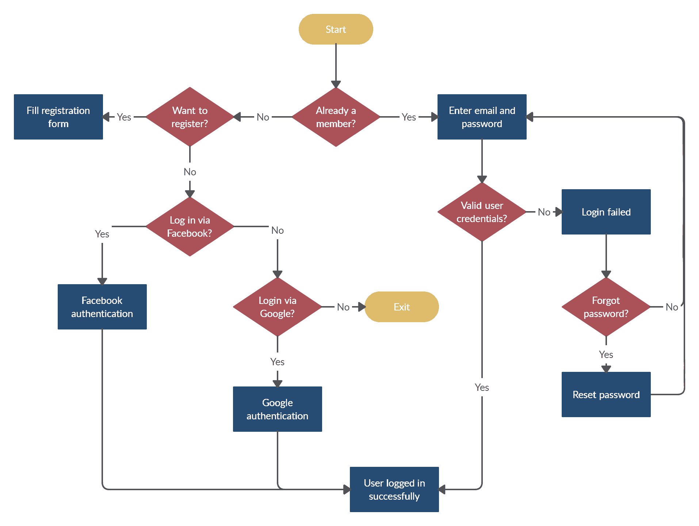
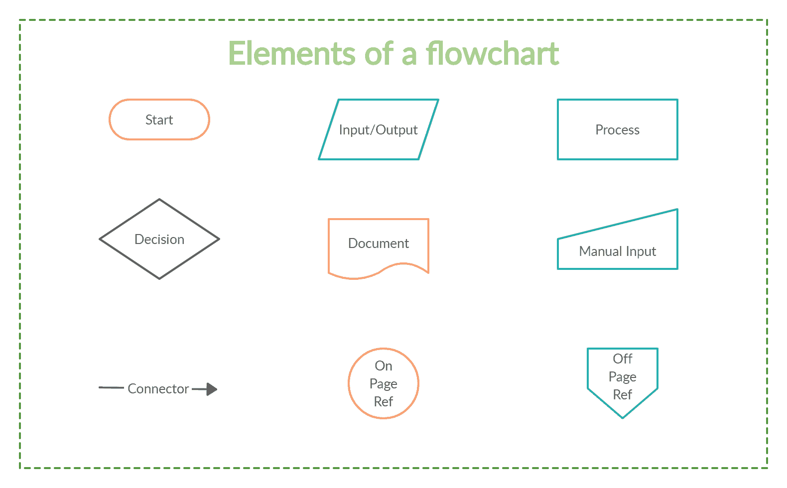

# 为什么流程图应该是开发人员最好的朋友

> 原文：<https://simpleprogrammer.com/flowcharts-for-programmers/>

In the pursuit of writing the “perfect line of code,” we often overlook the reason that we’re developing a piece of software in the first place. One of the biggest mistakes new programmers make is jumping right into writing code without having spent enough time thinking about and researching the end product. We think we’ll be able to code our way out of any problems that may arise along the way.

但是作为开发人员，我们的目标不是成为更好的编码者，而是更好的思考者。培养良好的计算思维是成为更好的开发者的基础。在我们解决问题之前，必须了解问题本身以及解决问题的方法。一个很好的方法是在开发过程的早期阶段引入流程图，作为在编写代码之前可视化代码的工具。

创建一个从根本上强大的结构轮廓是有效规划和开发任何程序的关键，就像你不会在没有一个完整的蓝图的情况下开始建造一座建筑一样。一个被设计来有效执行你的程序的架构框架允许你*三思而后行，编码一次。*

虽然伪代码在过去几年里越来越受欢迎——这是一种用简单的英语表达的算法，没有任何语法或编程语言——但它并不真正允许您“看到”您的代码。流程图的作用与伪代码相同，但它有一个额外的好处，那就是展示指令和数据从一个进程到另一个进程的整体流程。它们让你只需看一眼就能理解程序的主要概念。

本文介绍了流程图在代码开发中的重要性，并将带您了解如何开始在开发过程中实现流程图的基础知识。

## 流程图让您可以可视化您的代码

流程图被用于每一个可以想到的领域。它们在项目管理中用于安排流程的顺序和更好地规划工作流程；在市场营销中，描述销售过程或制定战略路线图；以及在数据可视化的教育中，作为研究、计划、改进和交流复杂过程并以图形方式将它们转换成易于理解的图表的好方法。

虽然流程图早在软件开发之前就被构思出来了，但是它们在可视化和表示算法方面的效用是不可忽视的。

您可以使用流程图来可视化系统中的步骤，包括输入、输出和循环，它们可以是考虑高科技流程的一种很好的低技术方式。流程图可以应用于任何过程，但在大型团队中尤其有用，因为它们帮助非程序员理解程序，并允许您轻松识别逻辑中的错误。

此外，流程图从未如此简单。有许多在线流程图软件程序可以让你快速方便地可视化你的程序。像 [Creately](https://creately.com/) 、Caligraflow 和 [Diagramo](http://diagramo.com/) 这样的工具都有直观的形状和模板，它们是专门为帮助你轻松规划程序而创建的。

[来源](https://creately.com/demo-start?tempId=b3Oe0OdHt0K)

## 流程图的要素

自从工业工程师 Frank 和 Lillian Gilbreth 于 1921 年首次构思出流程图以来，流程图已经走过了漫长的道路。这些年来，它们已经发展到描绘越来越复杂的过程。然而，绘制流程图的基础仍然保持不变。

流程图是由普遍接受的符号组成的，这些符号代表了流程图中的各个方面。这便于一目了然的理解。下面列出了流程图中一些最常见的元素。

*   **终端**–在算法开始时使用，作为指示程序开始或结束的符号。
*   **过程**–矩形框通常表示算法中的一个过程，在这里进行数学运算。
*   **输入/输出**–这些符号表示程序在不同阶段的输入和结果输出。
*   **决策**–菱形符号代表算法中的决策点。这些可能是二元的，这个或者那个，或者更复杂的选择。
*   **连接符**–这些由箭头表示，表示流程图中元素之间的关系，并引导您完成决策序列。
*   **页面连接符**–这些连接符用于连接同一页面上流程图的两个或多个部分。
*   **离页连接符**–这些连接了分布在不同页面的流程图的两个部分。
*   **Document**–该对象是一个带有波浪形底部的矩形，用于表示流程中的文档或报告。
*   **手动输入**–手动输入对象表示提示用户输入必须手动输入系统的信息的动作。

## 流程图的优势

让我们再来看看流程图对编程过程进行有效补充的几个原因。

*   更好的交流–流程图是快速交流想法和计划的好方法。它们允许您拥有一个集中的文档，作为构建代码的基础。
*   **分析**–流程图确保对提议的流程进行更有效的分析，并确保没有遗漏任何内容，并且考虑了所有可能的输入、流程和输出。通过研究流程图，您可以发现可能导致效率低下和错误的不合逻辑的顺序。您可以在问题发生之前发现问题，并更准确地解决它们。
*   **高效编码**–流程图为更高效的编码提供了路线图，因为可以清楚地看到数据的最终去向。对于更大的系统构建，不同的部分被分解成更小的单元，供程序员个人使用。有一个集中的参考文档可以减少冗余。
*   **适当的调试**–流程图帮助开发人员在早期识别问题区域，并帮助调试或修复不工作的代码。
*   **适当的文档**–流程图可以作为制定计划和变更的中心位置。随着程序的发展，流程图也在发展。它可以在将来被引用，并且是一种简单的方法，可以让项目的新成员了解这个过程，从而获得一个更好的整体理解。
*   **高效的程序维护**–当核心结构易于理解时，程序的操作和维护变得更加容易。流程图允许不同的人接触到程序，以便更好地理解它，从而更有效地维护它。

## 设计流程图时要记住的事情

对于组织良好、有效的流程图，请考虑以下几个方面。

*   **定位—**确保你的读者按照你希望的方式浏览你的流程图是关键。线条和箭头引导人们完成流程图的各个步骤。确保每个形状都连接到其他形状，并确保线条和箭头从上到下或从左到右移动。
*   **起点和终点**——明确流程图的起点和终点。通常，终止符形状用于指定流程图的开始和结束。使用颜色和位置作为指标。
*   **颜色**–适度使用颜色，在一个流程图中，尽量将颜色选择限制在三种或更少。在图中使用互补色和颜色代码相似的过程。
*   **形状**–在流程图中坚持普遍接受的形状可以更好地确保普遍理解。即使您不遵循每个形状的确切规则，在图表中使用不同的形状也可以添加额外的信息层，并使您的流程图更易于阅读。请记住创建一个形状关键字，以显示流程图中每个形状或颜色的含义。
*   **文本**–尽可能简洁，并限制每个形状中的文本数量。如果您需要在某些形状中添加更多的上下文或细节，请将这些信息放在备注或注释中，而不是弄乱形状内部的空间。

## 记住，流程图是开发人员最好的朋友

在开发之前有效地规划和详述过程的实践允许更健壮的程序。流程图是开拓更广阔思维方式的关键，它能让你更好地把握“大局”。我们在流程图方面的实践越多，我们的计算思维就会变得越好。

使用流程图的主要好处是，它们允许我们处理一个复杂的问题，真正理解它，并开发解决方案。然后，我们可以用计算机、人或两者都能理解的方式来呈现这些解决方案。

所以，下次你坐下来开发一个新项目或计划一个过程时，记得从绘图板开始，回到软件开发的基础。