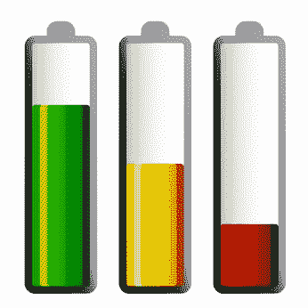

# 如何保持乐观

> 原文：<https://simpleprogrammer.com/follow-passion/>

我今天很有可能搞砸了。

这篇博客文章很有可能会失败。

也许，你会来到我的博客，期望得到启发，但却发现一堆毫无价值的废话，不值得你花时间去读。

但是，你猜怎么着？我不在乎。

这并不是说我不在乎我是否能做出好的作品，我正在尽我最大的努力。

我并不是不在乎我创作的内容是否有价值——我真诚地希望有价值。

我甚至不是不在乎，因为这没什么大不了的——我的博客是我赚钱的主要途径之一，所以这是件大事。

我不在乎，因为我已经学会不把自己看得那么重。我明白了，我正在做的事情并不重要，每一次小小的失败或成功都不会决定世界的命运。

当然，我希望成功，但是失败——尽管不是最好的——也是可以的。

## 是时候放松一下了

说真的。确实是。

如果你正在阅读这篇博文，你可能是一名软件开发人员。现在，你可能正在开发一个非常重要的软件系统，它将拯救生命或者彻底改变世界，但是很有可能，你不是。

即使你是，你在软件中的角色可能相对较小，也不是那么重要。

我说这些不是贬低你。我知道我们大多数人喜欢思考自己有多重要。相反，我这么说是希望你能意识到，从全局来看，我们所做的大部分事情并不重要。

为什么这对我如此重要？

为什么我会在乎传递这个信息？

因为，大量的暴行和愚蠢的错误都是那些有把自己看得太重倾向的人犯下的。

但是，把自己看得太重是什么意思？

这意味着你太在意自己的观点和自己塑造的形象，以至于你把自己的重要性强加给了太多的人和其他人。

那么，如果有人对测试驱动开发的看法是错误的，那又如何。

那么，如果人们不正确地使用 IoC 容器会怎样。

所以，如果你只是搞砸了，说了一些尴尬的错误。

如果你做了让你看起来像个白痴的事又怎么样。

我是说，这真的那么重要吗？无论你陷入什么样的困境，感到什么样的烦恼，真的值得你紧张吗？伤害别人的感情，引起骚动，真的值得吗？

[*(如果你还这么认为，那就帮你身边的人一个忙，请读读这本书。)*](http://www.amazon.com/gp/product/B003WEAI4E/ref=as_li_tl?ie=UTF8&camp=1789&creative=390957&creativeASIN=B003WEAI4E&linkCode=as2&tag=makithecompsi-20)

大多数时候不是这样，但我们倾向于认为是这样——包括我自己在内，我无法逃避评判。我时不时会把自己看得太重。

然而，大多数时候，我发现无论是什么让我如此沮丧，无论是什么让我对这个世界感到焦虑或沮丧，都没有我想象的那么重要。

## 你一天中只有这么多精神和情感能量

为什么要浪费在不重要的事情上。

我正准备永久关闭脸书，因为看到这么多人在争论一些荒谬的新闻文章和无关紧要的政治议程，实在令人不安。

当然，枪支在美国是否被禁止很重要，但大多数抱怨这个或那个方向的人不会对此做任何事情。他们只是在脸书问题上浪费有用的情感和精神能量，他们也在精神上和情感上耗尽其他人——更不用说失去朋友和过河拆桥了。

我在工作场所也经常看到这种情况。我为此内疚过很多次。96%有效的解决方案就可以了，还要争取 98%有效的解决方案。

很容易被吸进陷阱。人们很容易开始认为我们的观点非常重要。人们很容易开始相信我们正在做的事情以及人们如何看待我们是一个国家安全问题。

但是，事实是，这样做很累人。

当你早上醒来的时候，你只能有这么多的耐心。你的注意力只有这么多。你可以选择把精力花在那些并不重要的小事上，或者你可以把它用在实际完成一些事情上——让别人的一天变得更好，而不是毁掉他们。由你来决定。

## **听起来好像我对这个话题感到不安**

但我不是。我正在写博客，这是我想到的。

当然，我希望你同意我所说的。当然，我认为我是对的，但也许我不是。也许变量的名字真的很重要。也许我们应该就是否应该在伊拉克部署军队进行一场激烈的争论。

关键是，这不重要。

我决定不再把自己看得太重。

我决定不再那么在意别人的想法。

我决定不再在琐碎的争吵中浪费太多时间。

我已经决定不再在无关紧要的事情上浪费太多精力。

相反，我决定尽我所能，意识到其他人可能也在做同样的事情——尽管这种观点可能很乐观——并且活下去，也让别人活下去。

 **人生苦短，不能不乐观。

我是一名软件开发人员，致力于将复杂的事情变得简单。我通过我的博客帖子、课程、视频、播客和电子邮件，帮助其他开发人员过上更好的生活，尽可能成为最好的自己。

在这里加入我的探索。T3】**