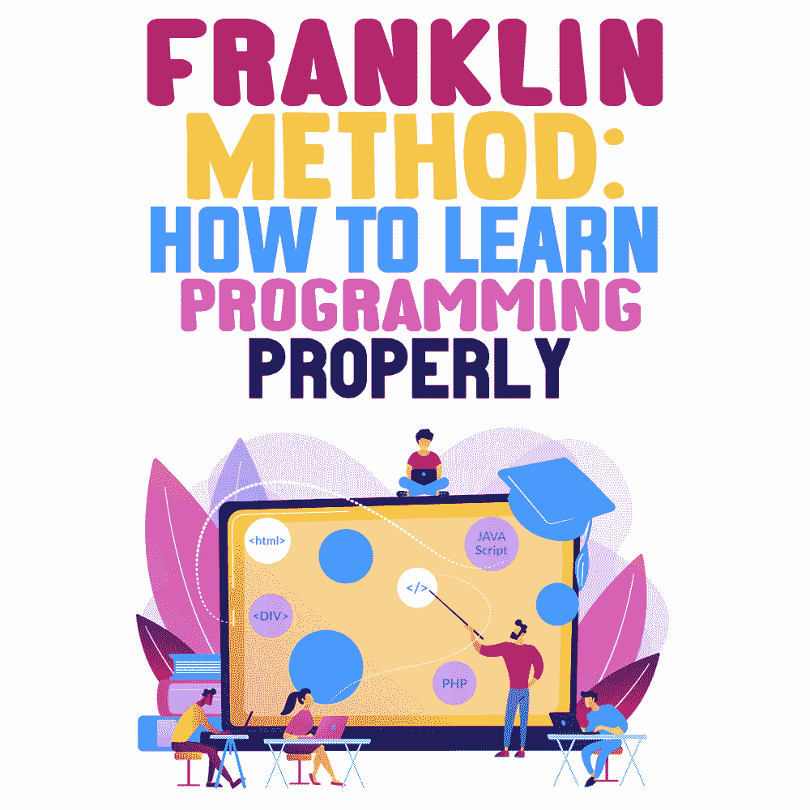
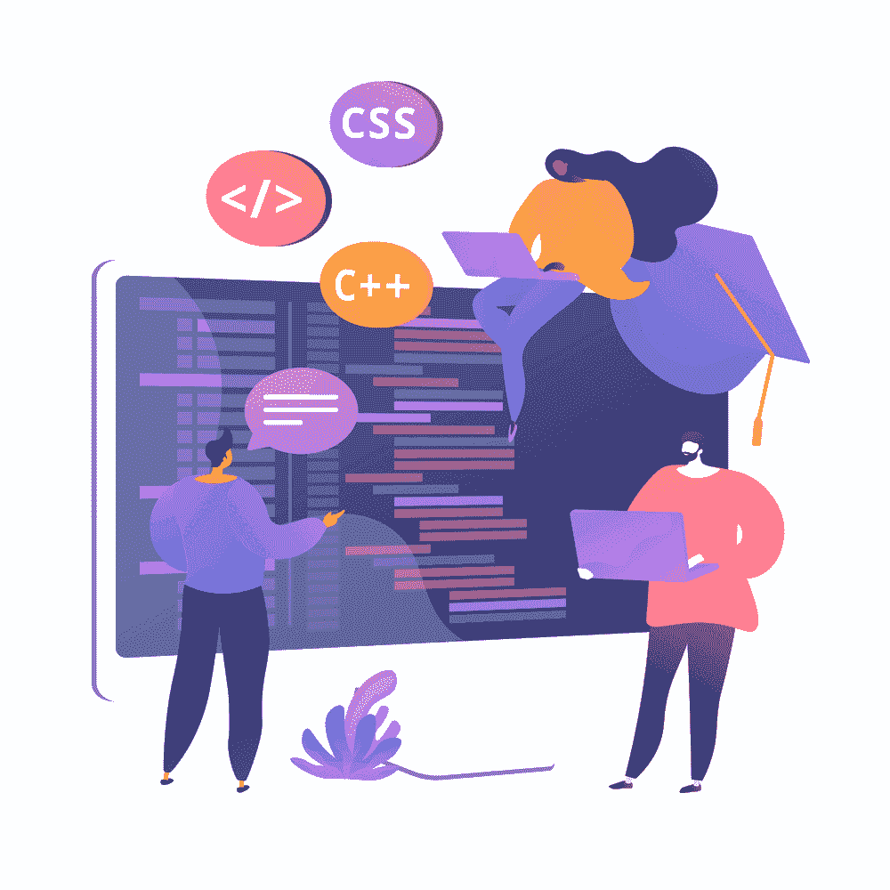

# 富兰克林法:如何正确学习编程

> 原文:[https://simple programmer . com/Franklin-method-learn-programming/](https://simpleprogrammer.com/franklin-method-learn-programming/)

Looking to master the craft of programming? The first steps in [learning how to program](https://simpleprogrammer.com/learn-code-where-start/) may be daunting. Typically, many to-be developers don’t know where to start and try to grasp information from all available sources. Yet, it's not always the best approach.

学习编程最常见的方法是购买如何编写代码的书，阅读它们，然后从头再来一遍。这种方法在短期内非常有效，因为你会学到一些新概念。当[的初级程序员](http://www.amazon.com/exec/obidos/ASIN/1465482210/makithecompsi-20)刚刚开始他们的学习之路，开始创建一个现实世界的项目时，真正的挑战来了。即使那些拥有基本编程知识的人也很难理解逻辑，不知道从哪里开始。

那么如何防止这种情况发生呢？答案是通过研究最佳学习实践。富兰克林方法是最有效的学习策略之一，已经在许多行业证明了它的有效性。

为了帮助您学习，本文介绍了 Franklin 方法以及如何在编程学习中使用它。作为奖励，你会发现其他有用的学习技巧和方法。

## 本杰明·富兰克林方法

想到本杰明·富兰克林的方法在如此多的领域变得引人注目，真是令人着迷。作家使用富兰克林方法来掌握他们的写作技巧。学者们发现这种方法在记忆大量数据和复杂概念方面很有效。

从政治到编程，本杰明·富兰克林的自我教育方法是一种强大而有效的学习策略。它建立在强迫你的大脑记忆信息的想法上，这样你就能完整地回忆起来。让我来解释一下。

## 富兰克林方法是如何工作的？

本杰明·富兰克林认为他可以通过模仿和复制他人的作品来学习。在他的自传中，他介绍了一种基于心理表征和模仿的学习方法。

富兰克林描述了他是如何通过阅读《旁观者》(一份颇具影响力的英国政治杂志)、做笔记和尝试重新创作这篇文章来重新创作的。然后，他将自己写的东西与原稿进行比较，找出错误，并加以改正。富兰克林通常会在周末、晚上或早上上班前练习。有时，他会做笔记，然后把它们混在一起，或者把它们变成诗歌，以学习如何更好地整理自己的思路。富兰克林对这种方法相当满意。这种做法起了作用，帮助他改善了用词，扩大了他在写作中可以使用的词汇量。

该方法具有通用性，也可用于学习编程。以下是如何使用富兰克林方法来学习如何编码:

1.  ***读取已有的实现。*** 让我们假设您遇到了想要记忆的代码样本。您要做的第一件事是阅读现有的代码示例。
2.  ***记录相关信息。*** 阅读代码时，记下你觉得有趣或挑战你的地方。笔记将有助于你将来回忆起这些信息。例如，您可以记下例程名称和变量。
3.  ***试写等价代码。*** 一旦你做好笔记，尽可能地模仿原文。这可能不是完美的代码，但这不是重点。主要的想法是试着按照逻辑顺序回忆和重写尽可能多的信息。
4.  ***重复。*** 当你写完你的副本后，你想将你的代码与原始代码进行比较并改正你的错误。完成后，转到第一步，再次重复，直到您可以轻松地编写代码示例。

当你不用检查笔记就能重写代码样本时，你就知道你成功了。您可以使用这种方法来记忆任何代码示例。对于使用哪种类型的代码没有限制，因为该方法是通用的。你也可以用这种方法来记忆编程原理。

## 如何正确学习编程？

除了不断重复和模仿原始代码之外，您还需要考虑以下与富兰克林方法一样有效的学习实践。

### 请特别注意核心概念

Understanding the fundamental principles of coding is as important as choosing your programming language. As a beginner, you may want to jump to practice right away, but you must learn the basics first.

从选择你最熟悉的编程语言开始。一旦你选择了这门语言，你需要花时间去理解它的语法和核心概念，包括条件、变量、循环和操作。

请记住，您对核心概念理解得越好，就越容易理解更高级的实践。

### 理解数据结构和算法

一旦你对自己选择的编程语言感到满意，并且能够编写最基本的程序，接下来你应该做的就是理解算法和数据结构。

在编程中，数据结构和算法的正确组合对于解决复杂的编程问题至关重要。这就是为什么学习不同的数据结构并理解它们如何用于解决不同的问题将极大地有助于你的编程技能。

每天学习实现不同的算法。你可以按照富兰克林的方法来记忆和练习新的算法和数据结构。

如果你面临一个复杂的多层问题，试着把它分成小块，以得到最终的解决方案。

### 学习手工编码

当你实践富兰克林方法时，总是手工编码。手工编码是学习如何编码的最有效的方法之一。手动编码意味着一种编程技术，在这种技术中，用户在没有代码生成器帮助的情况下手动输入所有代码。尽管这种方法很耗时，但如果你想成为一名专业的程序员，知道如何手工编码是非常重要的。

除了明显的教育益处，手工学习还有其他优势。当您使用生成器时，它们通常会创建额外的代码，而手工编码允许您留下较小的编码足迹。这将极大地提高你的网站(应用/程序)的速度。

### 从小处着手

当使用 Franklin 方法时，您希望从较小的项目和代码样本以及不太复杂的原则开始。急于解决[困难的编程问题](http://www.amazon.com/exec/obidos/ASIN/B074R6B13N/makithecompsi-20)是许多新手开发者常犯的错误。当涉及到构建复杂的项目时，业余爱好者通常会陷入困境，并试图在在线教程和练习中找到解决方案。然而，这可能会导致大量时间和精力的浪费。

相反，你想从做较小的项目开始，然后逐步解决更复杂的问题。通过这种方式，您将获得足够的专业知识来构建更小的部件，以完成一个耗时的大型项目。例如，如果你正在[创建一个网站](https://zyro.com/blog/i-bought-a-domain-now-what/)，你想从注册和登录表单这样的小功能开始，然后转移到更复杂的部分，比如导航栏。

### 摆弄代码

成功完成你的第一个项目并不意味着你已经学会了编程的所有知识。即使是最合格的专业人员也要不断探索和摆弄代码来学习新的东西。

计算机科学是一个不断发展和丰富的领域，肯定会有新的东西为您存储。如果你专攻 web 开发，你可能想扩展你的知识面，学习更多关于移动应用程序开发、系统编程、云计算、虚拟现实或区块链的知识。确保用富兰克林方法在这些领域进行自我教育。我已经提到了这种方法的普遍性。你可以通过重写这些门徒的关键概念，就像富兰克林复制《旁观者》那样。

### 你能用富兰克林方法做什么？

Benjamin Franklin was right—the recreation of the original piece and repetition are the key components of efficient learning. The Franklin Method is a great reminder that our brains just as our muscles can be trained to perform better. Before you leave, let’s quickly wrap up what you’ve learned today.

本杰明·富兰克林的方法表明，你可以通过阅读代码样本，把它们放在一边，并试图根据记忆重写代码来学习。如果你卡住了，你可以看看你的笔记或者重新打开代码。这将迫使你的大脑对代码有一个全面的了解。因此，你会更快地记住代码。

除了使用 Franklin 方法记忆代码样本之外，您还需要花时间去发现您所选择的编码语言的基本概念。

特别注意各种数据结构和算法。从小项目开始，掌握手工编码。

最后，永远不要停止探索！本杰明·富兰克林在他 65 岁的时候写了他的学习方法。这告诉我们，我们所有人(就像本杰明·富兰克林一样)都是不断的学习者。这就是为什么像他那样练习从不迟到。