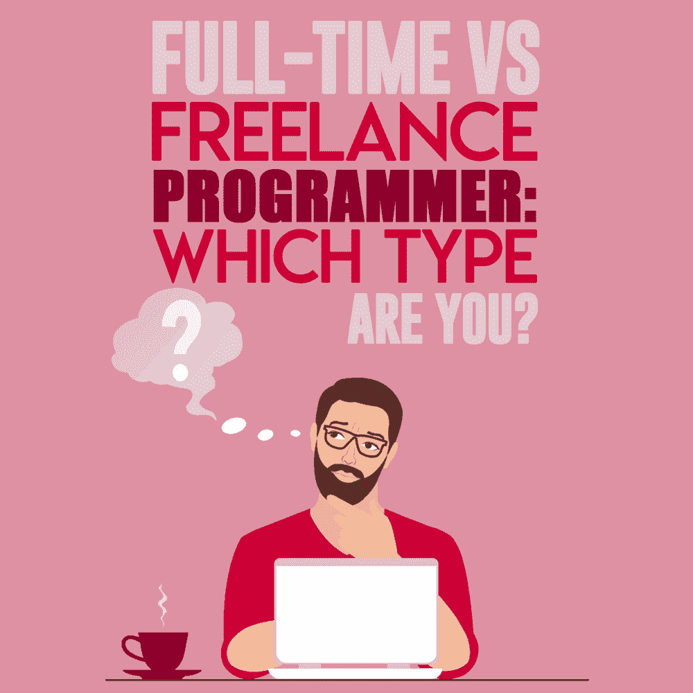

# 全职 Vs 自由程序员:你是哪种类型？

> 原文:[https://simple programmer . com/freelance-programming-vs . full-time/](https://simpleprogrammer.com/freelance-programming-vs-full-time/)

Freelancing can be a very lucrative way of making money, especially if you get the chance to [work remotely](https://simpleprogrammer.com/why-remote-work/). But no matter how many people have told you that you could work on the beach using your laptop and make money, there is still a downside to freelancing.

全职工作机会是获得稳定收入的更好方式，还是你喜欢自由职业的挑战和好处？

为了找到最适合你的方式，你必须考虑你的性格，并且清楚地知道你将要面对的是什么。

## 自由职业者和全职编程:有什么区别？

尽管全职和自由职业者都有类似的(如果不是相同的)编程工作，但两者之间有很大的差异。

大部分需要工作的程序员直接去做全职。这被认为是一种“安全”的赚钱方式。然而，即使看起来是这样，仍然有被解雇的可能。

另一方面，自由职业允许你为自己工作，同时与更多的客户合作，选择你想投入的小时数，并设定自己的目标(而不是朝着雇佣你的公司的目标努力)。

了解这两种工作模式之间差异的最佳方式是看一看各自的优缺点:

|  | **优点** | **缺点** |
| **全职** |  | 

*   [Have to work at least 40 hours a week (fixed time)

*   Have a fixed salary (low salary increase) [unable to realize one's full potential
*   Have to work hard towards the company's goal.

 |
| **自由撰稿人** | 

*   Ability to work remotely
*   No upper income limit
*   The ability to work towards one's own goals (or those of one's own company)
*   Ability to control one's workload
*   Ability to choose a partner
*   No long commute.
*   The ability to work at the time you expect.

 | 

*   Have to pay their own health insurance, salary, vacation and retirement fund.
*   Have to do their own administrative work.
*   Inconsistent cash flow
*   The responsibility of finding your own job (and clients)
*   I have to deal with most problems myself.

 |

## 如何知道全职工作还是自由职业适合你

许多程序员被随时随地工作的能力所吸引。我曾多次看到有人在公共咖啡馆里一边喝着他们最喜欢的咖啡，一边在笔记本电脑上工作，心想，“那个人过得真好”！

正如你现在所知道的，这两种类型的编程都有各自的优点和缺点，但是你的个性会帮助你找到哪种类型最适合你。

### 你是什么类型的人？

自由职业可能看起来很有趣也很容易，直到你亲自尝试，发现它并不像理论上看起来那么简单。

自由职业者需要比一般人更有动力的特定类型的人。这需要一个高度自律的人。不拖延的人。

大多数时候，这些类型的人会把自由和创造力看得比全职工作的安全感更重要。

尽管你可以通过自己的努力达到这些特征，但还有一项必要的技能可能更难达到。自由职业者应该学得很快，这是不容易学会的。

另一方面，全职工作仍然需要纪律，但是如果你天生不是一个有纪律的人，你很可能会在老板的压力下成为一个。

你可能不喜欢长时间工作，但你会接受的，因为这是大多数全职员工都会做的事情——事情就是这样。

作为一名员工，你可能不需要成为一名快速的学习者，因为你很可能更关心完成工作日的工作，而不是改善那些可能不会被注意到的方面(或者感觉他们做得徒劳无功)。

但是，如果你有强烈的意愿和愿望，你愿意做任何事情来放弃全职工作，你不只是说说而已，我相信你可以成为一名自由职业者。

### 全职，自由职业者…为什么不是全职自由职业者？

有些人认为自由职业是创造另一种收入来源的好方法，这种收入来源将与他们的全职薪水相当。

但是为什么不把这两个条件结合起来，成为一名全职的自由职业者呢？

这意味着你仍然会全职工作，但不是为一家公司工作，而是将所有的精力和时间投入到自己的事业中。

你可以独立工作，全权负责(你甚至可以期望自律)。

全职从事自由职业也有风险，但是完全值得。

## 如何成为自由职业者

## 

T2】

每个初学者都面临着挑战，比如对未知的恐惧，缺乏信心，缺乏技能，或者害怕无法领导一个成功的自由职业生涯。

许多人认为自由职业“风险太大”，因为大多数人已经有工作，而且有“安全感”尽管他们在公司工作的每一周或每一个月都有工资保证，但他们随时都可能被解雇，这种安全感也随之消失。

从这个意义上说，自由职业没有那么大的风险，但是它需要大量的努力和自律。一旦你度过了开始阶段，你就可以享受自由职业的好处，这将超过全职工作的好处。

每个人都可以学习新技能，每个人都可以让自己的纪律井然有序，每个人都可以朝着自己的目标至少工作 40 个小时(反正每个人都已经为自己的雇主工作了 40 个小时)。

一旦你成为自由职业者，害怕做不到是不可能的。当你成为一个自由职业者，你会把你的一切都投入进去，只是为了让它发挥作用。如果你做到了，你就会成功。

### 成为自由职业者的步骤

这六个步骤将帮助你顺利成为一名自由职业者。

#### 定义您的服务

自由职业给你很多机会和自由，包括选择你将提供什么服务的自由。

无论是应用程序开发、[软件测试](https://simpleprogrammer.com/software-testing-career/)还是网络安全，想想你已经拥有的技能和你想学习的技能。

用不了多久，你心里就会有一个具体的服务。这是你成为自由职业者的第一步！

#### 选择你的焦点

你打算做兼职自由职业者还是全职自由职业者？重要的是要清楚地了解自己，清楚地知道自己想要从自由职业的旅程中得到什么。

如果你打算做兼职自由职业者，你可能不会承受全职自由职业者的沉重压力，但你不会完全投入自己的事业。

决定你想走哪条路，再问自己一次——你准备好为成功做些什么了吗？这是值得的，我保证！

#### 设定您的价格

作为一名自由程序员，你需要[学习如何确定你的服务和时间的价值](https://simpleprogrammer.com/freelance-developer-pricing/)。你需要知道如何设定你的费率，这样你就能盈利，不管你投入了多少时间。

此外，你还必须考虑你要照顾的其他一切——你自己的保险、假期、设备、退休基金、工资，甚至水电费(如果你在家工作的话)。

虽然作为自由职业者，接受任何找上门的工作都很诱人，但你应该在你的时间和投入自由职业事业的投资以及你得到的回报之间取得平衡。

#### 建立自己的品牌/产品组合

你离推销自己、让自己脱颖而出、获得你的第一个客户只有几步之遥。

然而，在这之前，你需要一些能帮助你销售服务的东西:投资组合。

它可以是一个简单的网站，展示你的工作，以及你的联系信息和联系方式。

直接创建一个投资组合是很重要的，因为这会给你更高的机会被潜在客户认真对待。

#### 管理你的财务

正如我之前提到的，作为一名自由职业者，你必须注意你的财务。

这意味着保留你自己的账簿和准确的收支表。我们也强烈建议记录你工作的时间。

后来，当你成功了，你会被要求纳税——或者甚至雇佣你自己的会计师(如果你非常忙的话)。

目前，一个简单的表单或软件程序就足够了，此外还有一个个人银行账户和几个最知名的互联网支付平台上的账户，用于接收数字支付。

#### 选择一台好的笔记本电脑和电脑

As a freelance programmer, it’s important that you have a reliable computer. And if you want to take your freelance career on the road, the last step you need to do is [equip yourself with a good laptop](https://www.netbooknews.com/reviews/best-laptop-for-blogging-and-bloggers/).

购买前做好调查——像 [NetbookNews](http://netbooknews.com) 这样的网站致力于帮助你找到完美的笔记本电脑，这样你就可以让你的客户放心，高效地完成工作，并且永远不用担心你的笔记本电脑会让你失望。

## 做出你的选择

做一份你喜欢的全职工作是一个逐渐积累财富的好方法，同时还能有安全感和固定的薪水。

但是如果你对自己的职业方向不满意，或者你想换个行业，或者甚至开始为自己工作，自由职业是最好的选择。

这需要大量的工作和奉献，但是你可以做你热爱的事情，发展一个没有收入限制的企业。从长远来看，做自由职业是值得的。