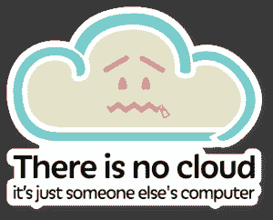
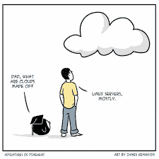

# 进入云端——为什么开发人员和设计人员需要注册 AWS

> 原文：<https://simpleprogrammer.com/future-cloud-computing/>

“没有云。只是别人的电脑。”

我们都见过这个关于云的互联网迷因，对吗？在一定程度上这是真的；然而，现实并非如此简单化。“云”不仅仅是一个很快就会消失的新词。它正迅速成为大多数组织运行其计算机、网络和存储基础架构的操作方式。

“那又怎么样？”你可能会问。你是一名 UI 设计师或开发人员，你不可能管理云基础设施，对吗？

是的，你不太可能被要求[成为云架构师](https://codeislife.blog/2020/10/20/how-to-pass-aws-certified-architect-associate-exam/)。但是，如果您认为您不需要了解云就可以在职业生涯中前进，那么您就大错特错了。

如果你是一名开发人员、设计师或者(在此插入几乎任何与 IT 相关的职位)，那么你必须获得云认证——或者至少，学习一些关于云计算的基础知识。

在这篇文章中，我将讨论云计算将如何影响软件开发的各个方面，以及开发人员和设计人员必须如何(以及为什么)准备迎接未来的云计算。

## 什么是云

儿子:“爸爸，云是什么做的？爸爸:“主要是 Linux 服务器。"

你可能会问，“除了别人的电脑，云是什么？”不如我们问问圣贤之圣，维基百科。

> **云计算**是[计算机](https://en.wikipedia.org/wiki/Computer) [系统资源](https://en.wikipedia.org/wiki/System_resource)的按需可用，尤其是数据存储([云存储](https://en.wikipedia.org/wiki/Cloud_storage))和[计算能力](https://en.wikipedia.org/wiki/Computing_power)，无需用户直接主动管理。该术语通常用于描述许多用户通过互联网[使用的](https://en.wikipedia.org/wiki/Internet)[数据中心](https://en.wikipedia.org/wiki/Data_center)。— [维基百科](https://en.wikipedia.org/wiki/Cloud_computing)

该定义中最重要的术语是“数据中心”在公共云模式中，任何持有信用卡的人都可以访问世界上最强大的数据中心，如亚马逊、微软和谷歌创建的数据中心。

过去，设计人员和开发人员只能使用他们的个人计算机(或者最多是他们组织的数据中心的计算能力)，而现在，每个开发人员和设计人员都可以访问有史以来最强大的计算平台。最棒的是，你可以选择按需付费，也就是说，只为你使用的东西付费。你甚至可以在免费层做很多事情，而不用支付一分钱。

那么，所有这些力量正在改变开发和设计的前景吗？你打赌它是。

云不再是与你自己不同的数据中心。这是计算、存储和网络领域的一次范式转变，也是我们思考计算的方式的一次转变。与上面的迷因所暗示的不同，云不仅仅是 Linux 服务器。

你是否在你的小笔记本电脑上运行你的机器学习模型，并且花了很长时间才得出一个可行的模型？为什么不在云服务器上运行这个模型，或者更好的是，为什么不使用一个托管的人工智能开发平台，在那里你只需要专注于构建和部署你的模型？

您是否一直在为每隔几年就会过时的软件许可证支付数百美元，导致您最终再次支付相同的价格？随着 Adobe 等大多数主要设计工具的软件即服务模式的出现，你可以改为每月支付访问费。

这样，如果您有一些停机时间或没有得到同样多的设计工作，您可以选择停止订阅，不支付月租费。从长远来看，这可以为你省钱。

让我们谈谈云将如何影响你，好吗？

## 云将如何影响开发者

> “开发人员，开发人员，开发人员，开发人员……”—史蒂夫·巴尔默

If you are a developer, you’ve at least heard of the cloud, and maybe you are already working in the cloud. If that’s the case, congratulations; you are ahead of the game.

作为开发人员，最想做的就是写代码。由于云计算的兴起，每个人都希望事半功倍，包括开发人员。

您可能正在与没有专用服务器或运营团队的客户合作。你甚至可能是一个人的操作(听说过全栈开发者吗？那只是你做一切的另一种说法)。正因为如此，你可能很快就会得到运行你的代码的基础设施。

在任何人认真对待您的代码之前，您可能还需要展示概念应用程序的工作证明。在云时代，如果您不能在全尺寸的工作负载中显示正在运行的应用程序，那么您就落后了。

随着越来越多的公司向云迁移，“[向云的转变仍在继续](https://www.flexera.com/blog/elo/2020-state-of-tech-spend-it-spending-benchmarks-and-trends/#:~:text=The%20shift%20to%20cloud%20continues,software%20spend%20(22%20percent).)，云支出占 IT 支出的 25%，超过了内部软件支出(22%)

传统的软件开发模式也在慢慢变得过时。借助云提供商提供的 CI/CD 工具，预计将特性和修复部署到生产环境的速度正在提高。[截至 2011 年，亚马逊每 11.6 秒就对其生产环境进行一次变更](https://www.helpsystems.com/blog/6-companies-are-doing-devops-well#:~:text=By%20May%202011%2C%20Amazon%20was,sent%20into%20the%20production%20environment.)。

您能想象在一个部署周期不是两个月，而是 11.6 秒的环境中工作吗？

## 云将如何影响设计师

> “设计不会拯救世界，但肯定会让它看起来不错。”—未知

你设计网站吗？也许你为网站创建图像/标志和图标，或者为网络创建其他图形材料。嗯，所有的网站迟早都会在云中运行，但它不仅仅是托管功能。

云使得整合网站的非传统用户界面变得容易。越来越多的用户现在希望能够使用某种语音控制与网站进行交互。聊天机器人和基于语音的虚拟助手到处都是，如果你正在设计的 ui 没有与这些新的发展相结合，你就落后了。

云将使其他用户界面易于集成，包括 AR 和 VR。最近，我在市场上寻找一个新家。大约在同一时间，我订购了新的 Oculus Quest 2 VR 耳机。当它到达时，我确信我会把它放上，访问房屋建筑商网站，它会在虚拟现实中 360 度参观他们的模型房屋。然而，这是相当令人沮丧的访问建设者的网站，只查看虚拟家庭在平面屏幕上游览。

AR、VR、聊天机器人和机器学习:云供应商正在以令人眼花缭乱的速度创新，基于云的应用程序拥有良好的用户界面非常重要。如果有云迁移发生，如果你了解云计算，你更有可能参与其中。底线是，你更有可能被雇用。

云加速了每个用户可用的平均带宽。平均带宽在增加，因此，用户对加载时间的期望也在增加。在过去，用户愿意等待 30 秒来加载网站，[他们现在不愿意等待超过 3 秒就离开](https://www.hobo-web.co.uk/your-website-design-should-load-in-4-seconds/#:~:text=following%20key%20findings%3A-,47%20percent%20of%20consumers%20expect%20a%20web%20page%20to%20load,render%20before%20abandoning%20the%20site.)。

所有这些发展要么在云端，要么由于云端，所以你最好学习云端，而且要学得快！

好了，现在我已经让你相信了云计算及其重要性，你一定会问，哪家云提供商是最好的？这里有一条我一直使用的经验法则:如果你是一项技术的新手，试着向行业领导者学习。说到云技术，AWS 无疑是行业领导者。

## 自动警报系统

> “发明需要两样东西:1。尝试大量实验的能力，以及 2。不必忍受失败实验的附带损害。”— AWS 云首席执行官 Andy Jassy。

### 什么是 AWS？

> ***亚马逊网络服务** (AWS)是[亚马逊](https://en.wikipedia.org/wiki/Amazon.com)的子公司，向个人、公司和政府提供[按需](https://en.wikipedia.org/wiki/Software_as_a_service) [云计算](https://en.wikipedia.org/wiki/Cloud_computing) [平台](https://en.wikipedia.org/wiki/Computing_platform)和[API](https://en.wikipedia.org/wiki/Application_programming_interface)，以按量付费的方式。—* [维基百科](https://en.wikipedia.org/wiki/Amazon_Web_Services)

我推荐 AWS 的原因有很多。

不要脸的塞警报！我最近通过了 [AWS 认证架构师助理考试](https://www.amazon.com/dp/1119490707/makithecompsi-20)，这是我最有经验的云提供商。

然而，这不是唯一的原因。

“如果我生活在罗马时代，我会住在罗马。……今天，美国是罗马帝国，纽约是罗马本身。”约翰·列侬

如果你生活在云时代(你就是)，AWS 几乎可以算作罗马。AWS 也是 Gartner 魔力象限的领导者，所以如果你学习 AWS，你可以相当安全地打赌 AWS 不会很快消失。

[AWS 现在是世界上最大的系统企业](https://www.nextplatform.com/2019/04/30/aws-is-now-the-largest-systems-business-in-the-world/#:~:text=With%20an%20annualized%20run%20rate,Unix%20platform%20was%20ever%20as)所以不要担心，你获得的任何认证或你拥有的 AWS 知识都可能在很长一段时间内派上用场。

## 面向开发者的 AWS

AWS was among the first cloud providers. It has been innovating at an incredible pace, and the number of services that are likely to interest developers and designers is huge. They also provide an excellent free tier where you can do a lot without paying a cent.

那么对于开发者来说, [AWS 中有什么呢？让我们复习一些基本知识。](https://simpleprogrammer.com/cloud-computing-aws-developer-tools/)

### 无线电数据系统

RDS(关系数据库服务)是开发人员绝对应该熟悉的服务。它允许为关系数据库(如 MySQL 和 Postgresql)提供 AWS 管理的数据库服务器。

如果您是一名开发人员，并且曾经希望能够在生产规模的数据库服务器上测试您的代码，那么只需看看 RDS 就行了。不再需要在本地实例甚至小型 docker 容器中进行测试。请随意提供一个与您的生产环境大小相同的实例，一旦您完成测试，就可以拆除它，只为您所使用的内容付费。

### 希腊字母的第 11 个

在云计算领域有很多流行词的地方，“无服务器”这个流行词不太可能消失。无服务器计算不仅仅是一种计算能力的新方法，它是一种完全不同的编写和构建应用程序的方式。

AWS Lambda 是 AWS 无服务器产品的支柱。它是一个无服务器的计算引擎，你可以用你选择的任何运行时语言运行一个函数。你会问，这个功能运行在哪个服务器上？这就是它的美妙之处。没有服务器，因此，您不必为任何闲置的服务器或计算能力付费。您只需为函数的执行和任务付费，仅此而已。

### S3

lambda 是 AWS 无服务器计算产品的支柱，而 S3 是 AWS 无服务器存储产品的支柱。这是一种基于对象的存储，具有无限的存储空间。好吧，最后一部分有点夸张，但实际上，S3 的存储能力是无限的。

S3 的可用性、耐用性和可扩展性是业界领先的，并且由于分层存储产品，您可以每月花 1 美元存储 1tb 的数据(真的)。有了 S3，你再也不用担心会遇到服务器磁盘空间的限制。如果您仍然不相信，S3 还提供内置的数据合规性和治理功能。

### electrical field stimulation 电场刺激

块存储并不完全符合您的需求，您需要一个文件系统来代替您的应用程序？别担心，我的开发者朋友，EFS 在这里。弹性文件系统是一个完全托管的网络文件系统存储解决方案，它可以根据存储的文件数量进行扩展和收缩，而您只需为使用的文件付费。

### 数据库

我已经提到了无服务器吗？如果你正在寻找一个无服务器的数据库，DynamoDB 就是你想要的。整个 Amazon.com 现在都在运行 DynamoDB。需要我告诉你更多吗？

## 面向设计师的 AWS

AWS 不仅仅面向开发者。有很多工具和服务也会引起设计师的兴趣。下面是一些开发人员感兴趣的工具和服务。

### 波莉

尽管对话和语音用户体验曾经是最前沿的技术，但如今任何没有它们的应用程序都显得有些过时了。大多数用户希望能够与他们的设备对话，并且希望这些设备能够回应。Polly 是 AWS 的文本到语音产品，如果你正在设计应用程序或网站，最好跟上语音和文本到语音的潮流，否则可能会落后。

### 亚马逊 Lex

Alexa、Siri 和 Cortana 等数字助理的兴起让最终用户期望用户能够使用语音控制他们的设备。Lex 允许您创建聊天机器人和基于语音的数字助理，它们可以根据用户语音输入执行操作。

设计花店网站？如果使用网站助手，您可以像通过电话订购鲜花一样订购鲜花，会怎么样？有了 Amazon Lex，你可以创建基于语音和文本的机器人来做到这一点。其他使用案例包括帮助台自动化和销售线索挖掘。

### S3

我已经在开发人员部分提到了 S3，所以我不会在这里解释它是什么，但是 S3 也可以用来存储和托管静态网站和静态内容，如图像、样式表和 HTML 页面。如果你正在寻找一个静态的小型企业网站的快速托管解决方案，S3 是一个非常便宜，但企业级的静态网站托管解决方案。

### 亚马逊工作区

尽管设计师正在转向软件即服务产品，如 Adobe Creative Cloud，但设计师仍然使用传统的台式机来完成工作。这些机器很快就过时了，然后不得不被替换。

借助 Amazon Workspaces，您可以快速配置桌面，根据需要为其提供尽可能多的 CPU 和 RAM，完成您的工作，并取消桌面配置，而无需购买任何相关硬件。只为你使用的东西付费。视频编辑或 3D 建模等计算和内存密集型设计工作现在可以按需完成，无需每隔几年购买新的硬件。

As most designers reading this post know, you must buy new hardware every four to five years to keep up with the performance requirements for more and more demanding workloads. As performance requirements increase, so does the cost of ownership of desktop and laptop hardware, and if you are a small business or a freelancer, those costs can add up. Amazon Workspaces is the answer.

### 苏美尔人

三维网络正在崛起，虚拟现实耳机的用户数量也在增加。使用亚马逊苏美尔人，您可以创建 AR 和 VR 的 3D 前端体验。

[截至 2018 年的 VR 活跃用户数为 1.71 亿](https://www.statista.com/statistics/426469/active-virtual-reality-users-worldwide/#:~:text=The%20total%20number%20of%20active,themselves%20to%20be%20hardcore%20gamers.)，预计这一数字还会上升。在你知道之前，为网站提供 AR 和 VR 就绪的用户界面不仅仅是一件好事，就像移动响应设计不再是可选的一样。再说，**真的*真的*爽！**

## 把你的头放在云里

好了，伙计们。无论您是开发人员还是设计人员，了解云中可用的不同工具和服务已经变得绝对必要。

开发人员和设计人员都可能感兴趣的一些服务包括 RDS、Polly、Lambda、Amazon Workspaces、EFS 和 S3。但实际上，有无数的选择可以帮助你提高工作效率。

如果你希望在未来保持相关性，如果你想在开发人员或设计师的职业生涯中取得进步，如果你不想落后，那么你最好把你的头放在云上。