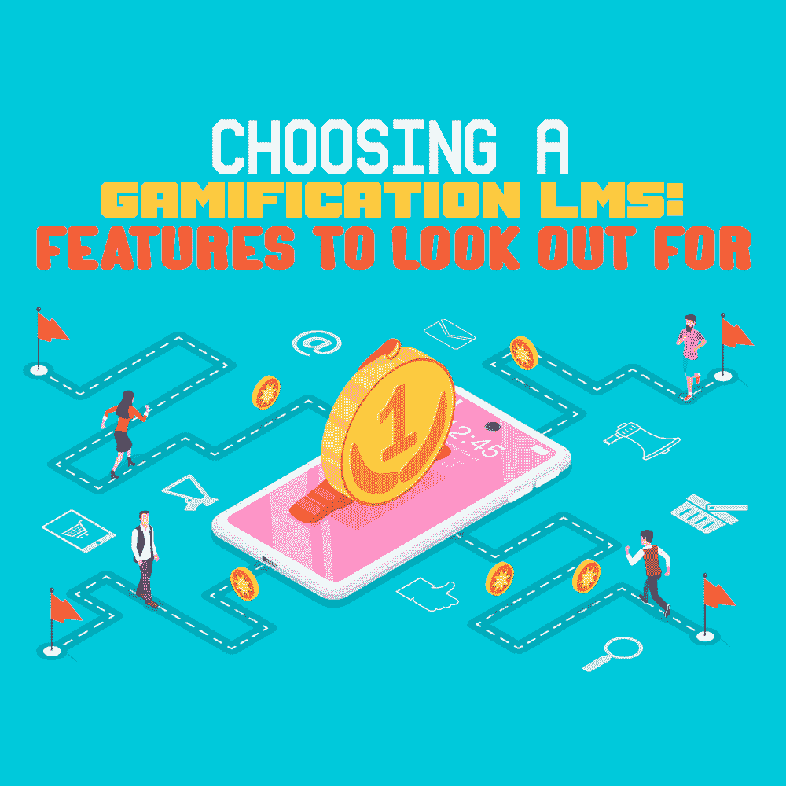

# 选择游戏化 LMS:需要注意的特性

> 原文：<https://simpleprogrammer.com/gamification-lms-features/>

Engaging learners, be it in a K-12 scenario or [employee training](https://simpleprogrammer.com/workplace-learning-culture/), is a known challenge in development and learning circles.

多年来，人们进行了大量的研究，希望找到更多关于人类大脑如何学习的信息。多亏了这项研究，再加上技术的进步，我们现在有了专门用来让学习者参与进来的工具。

一个众所周知的吸引学习者的技术是游戏化。简单来说，游戏化就是在训练体验中加入类似游戏的元素。

这是一种经过验证的技术，它利用大脑对收到奖励的反应来激励学习者投入到培训项目中，并最终帮助他们表现得更好。

为了在您的培训体验中成功实现游戏化，您需要一个具有游戏化功能的强大学习管理系统(LMS)。满足您需求的正确的游戏化 LMS 将取决于 LMS 提供的功能，因此了解存在哪些功能以及如何使用它们非常重要。

## 什么是学习管理系统？

学习管理系统是一个虚拟平台，用于存储和分发培训材料。大多数现代学习管理系统都是基于云的，并允许学习者轻松共享培训材料。

现代的 LMS 还提供跟踪功能，让你可以看到报告和其他数据，显示你的学习者做得如何。这些平台还可用于提供自定进度和虚拟讲师指导培训的混合，提供一整套功能，如内置白板和视频录制功能。这些功能的可用性在不同的产品之间可能有所不同，并且还会对 LMS 的成本和用户友好性产生重大影响。

LMS 还提供了添加类似游戏的功能的能力，这些功能[经过科学验证](https://wistia.com/learn/marketing/the-science-behind-gamification)可以提高您的学习者的动机，从而提高他们对学习体验的参与度。再说一次，并非所有的游戏化 LMS 都是相同的，有些可能会提供与竞争对手不同的功能。

以下是你的 LMS 应该具备的一些最基本但有效的游戏化特性。选择具备所有这些功能的 LMS 将让您为所有学员建立一个充满活力的培训体验。

### 点

从理论上来说，奖励优秀表现的积分也许是实现游戏化最简单的方法。

实际上，实施积分机制是一项复杂的任务，因为为了真正提高这一策略的影响力，你必须对学习者可能完成的每一个可能的行动或任务给予积分奖励。例如，你不能简单地给那些在评估中表现良好的人加分，因为那只是在测试后给出分数。

因此，成功实施积分系统需要大量的努力和一个可靠的计划。同时，您还需要一个 LMS，使您能够将基于点数的奖励与任意数量的学员行动相关联。

### 徽章

徽章可能是学习管理员最常用的游戏化功能之一。

实施徽章制度后，每当学员完成某个模块或取得非凡成就时，就会获得一枚彩色徽章作为奖励。

当查看 LMS 中的徽章功能时，寻找定制徽章的能力。这样，您将能够为您认为您的学员应该执行的特定活动创建自定义徽章，以取得更好的效果。

### 水平

另一个受欢迎的游戏化功能，关卡提供了一个简单直接的方法将一个简单的游戏化元素引入你的训练体验。

流行的学习应用程序，如语言学习应用程序 Duolingo，很好地利用了这一功能，激励学习者继续前进，最终提高完成率。

在查看级别功能时，请确保您询问的是向学员展示课程“全貌”的能力。这样，他们不仅能看到他们已经走了多远，还能看到他们还有多远要走。

### 排行榜

另一个受欢迎的游戏化功能，排行榜不仅通过友好的竞争激励学习者，还使组织能够确定最佳表现者和可以成为未来经理的个人。

也就是说，排行榜通常与积分系统配对。因此，您必须首先将积分系统与您的学员可以在 LMS 中执行的所有相关在线活动相集成，然后考虑引入排行榜功能。

## 选择功能和实用性的最佳组合

While most learning management systems do offer these features, they may not be designed the same way in each product. Your goal should be to pick a learning management system that offers all of these features, without the presence of a complex user interface.

当然，预算也是一个重要的考虑因素。LMS 提供的功能越多，成本可能就越高。如果可能的话，使用允许您在预算允许的情况下添加功能的 LMS。

很有可能，你不会同时需要所有这些特性。一开始，你可能会在课程中使用一个或两个功能的组合。然而，在选择 LMS 时，最好考虑您未来的培训需求，并找到一种不仅能支持您目前的培训计划，而且能随着您的组织的发展而扩展的工具。

## 明智地选择你的 LMS

技术已经彻底改变了我们生活的几乎所有领域。这场革命导致了前所未有的习惯的发展。谈到培训，不管是什么水平，重要的是[解决和说明深受数字技术影响的现代学习者新形成的学习习惯](https://simpleprogrammer.com/test-driven-learning/)和风格。

点数、徽章、等级和排行榜可能是你可以在训练体验中使用的一些最基本的游戏化功能，但毫无疑问，它们将为你的训练体验添加急需的健康竞争元素。

选择具有这四个特点的 LMS，你的培训项目将充满成功的学习者。