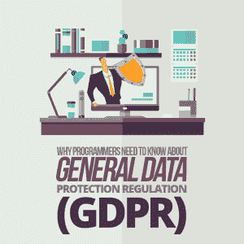

# 为什么程序员需要了解一般数据保护条例(GDPR)

> 原文：<https://simpleprogrammer.com/general-data-protection-regulation-gdpr/>

GDPR, or the General Data Protection Regulation, is a fairly new, European data protection regulation that applies not only to European citizens, but also just about every programmer and technology consumer in general.

尽管这项规定可能源于欧洲，但它的影响将波及全球，因为许多公司的客户来自欧盟，因此必须注意自己的数据。

这些法规涉及到数据方面的消费者权利，如果您是一个收集客户和受众数据或个人详细信息的大型组织，这些法规就显得尤为重要。据 Gartner 称，[超过 50%受 GDPR 影响的公司](https://www.gartner.com/newsroom/id/3701117)到 2018 年底仍无法完全合规。

对于那些有准备的人来说，已经有了一个保持合规和忠于法规的流程。只要你在欧洲有客户，你的企业在哪里并不重要——法律适用于你。

这在今天可能更有意义，因为脸书正在经历剑桥分析公司的整个[场景。](https://www.nytimes.com/2018/03/19/technology/facebook-cambridge-analytica-explained.html)

在脸书的自由裁量权之后，关于数据透明度、[安全性和适当处理](https://simpleprogrammer.com/security-code-secure-devops/)的对话都是非常必要的——这并不是说它们不总是令人担忧的。人们关心他们的数据被收集和使用的方式，如果事情是在桌子底下，就会有问题。

围绕数据监管和隐私的许多讨论都集中在企业、组织和以数据为中心的团队上，这是有充分理由的。

我们还没有看到，并且需要看到更多的是针对程序员、开发人员和设计人员的讨论。因为即使你可能不这么认为，任何与数据打交道的人似乎都会受到法规的影响，尤其是 GDPR。

## 什么是 GDPR？

通俗地说， [GDPR](https://www.eugdpr.org/) 是一项保护所有欧洲公民隐私和个人数据安全的法规。该法律不仅概述了必须在其保护下提供的用户权利，还概述了组织、团队、开发人员和数据管理员可以遵循的方式。

GDPR 的许多关键组成部分涉及欧洲公民的权利及其数据隐私和安全。开发人员和程序员必须注意实现法规要求的正确特性，同时避免遗漏一个必需的特性而使他们的公司面临风险。

这些是 GDPR 赋予欧洲公民的权利，开发商应该最关心的是:

*   **处理限制:**某些点的数据可能由公司或组织保管；然而，用户有权“限制”处理，这意味着未经用户明确同意，他们的数据不能被进一步使用或利用。
*   **删除:**所有用户必须可以选择被遗忘或从系统中删除。
    数据可移植性:所有收集的数据和信息必须是可移植的，这样用户就可以导出内容并以适当的格式查看或阅读。
*   **修正:**修正不准确或不完整的个人数据的选项或能力。
*   **了解信息:**每个用户都有权了解数据收集和使用情况，包括标准条款和条件之外的信息。
*   **访问:**任何收集、处理或存储的数据都应始终对相关用户可见。

Of course, developers should also be concerned with the concept of data minimization as set forth in the GDPR. This means that no group, team, or organization should collect more data than necessary for the task at hand.

完整性、隐私性和机密性也很重要，是系统和任何存储或处理的数据的整体安全性的一个因素。您必须确保数据不能被未授权方查看，并且策略防止不适当的修改。

这将影响你的工作、任务和机会——特别是关于你为项目交付的特性和功能。

## GDPR 会影响哪些特征？

为了遵守上面列出的许多权利，您需要确保您开发的系统和平台集成了各种特性和功能。这些新功能是对 GDPR 国家必须遵守的基本风险评估和管理协议的补充。

例如，您需要一个“勿忘我”或“缓存删除”方法，当用户想要删除某个用户的 ID 或帐户信息时，该方法会删除与之相关的所有个人信息。

一些数据模型使得这种删除更加困难，尤其是在处理集成或性能测试时:在这些场景中，数据是在没有太多监督和意图的情况下收集的。

以下是一些功能以及如何将它们纳入您的系统和平台:

### 通知第三方数据服务进行擦除

如果[数据与另一方或服务](https://simpleprogrammer.com/third-party-service-providers-function/)共享，您还必须通知该联系人数据已应消费者的要求被删除，必须进行清理。这包括 Hubspot、Salesforce、Twitter、脸书等平台，以及任何具有数据收集 API 的平台。

**可以做的:**通知第三方 API 删除个人数据。如果第三方的公开个人资料页面包含被 Google 抓取的信息，您需要确保这些信息不会出现在搜索结果中。

### 导出数据

您必须包括一个功能，允许您的用户下载或导出与其帐户和活动相关的所有数据。更重要的是，导出的转储或内容在格式方面没有严格的定义，但是您希望提供一些用户可以实际使用或阅读的内容。根据数据内容，JSON、XML、CSV 和 XLS 文件非常适合。

**你能做什么:**包括一个按钮——“导出数据”——当点击它时，允许用户接收你当前持有的关于他们的所有数据。由于数据导出可能需要一些时间，因此最好让您的“导出数据”功能触发一个后台进程，以便在用户的数据准备好接受审查时通过电子邮件通知用户。

### 创建可编辑的内容和个性化

许多数据源或收集方法往往不准确，这意味着它们收集的用户和受众信息并不完全匹配。这使得作为开发人员的您有责任创建一个允许他们编辑或个性化内容的系统。他们必须修正关于他们和他们习惯的数据或观察。这是 GDPR 提供的一种主要的矫正和保护形式。

**您可以做什么:**允许用户通过用户界面(UI)编辑任何“用户”字段。

### 同意

这个特性对于任何整理、聚集或处理数据的系统来说都是必不可少的。您必须允许用户“接受条款和条件”或同意数据收集。此外，您还必须得到用户的同意才能处理和利用收集的数据。否则，您将需要一个额外的请求选项。在某些情况下，如果条款不明确，或者如果您更改了收集和使用数据的系统或方式，您可能需要重新请求同意。

你能做什么:复选框是你的朋友。在用户注册过程中，通过每个处理活动将它们分开，并确保它们不是预先选择的。如果同意被认为是不明确的，你将不得不创建一个功能，将大量的电子邮件用户，让他们知道他们必须更新他们的个人资料与正确的同意。

### 

查看数据

这类似于导出特性，除了它主要处理从用户提取的数据的查看能力。他们有权访问为他们建立的个人数据库，也有权查看你拥有的一切。这包括实现一个可以过滤和返回必要信息的系统。

**您可以做什么:**允许用户通过输入他们的电子邮件地址或联系信息来检查存储的数据。

### 强制年龄验证

与显示成熟内容的过程类似，您必须实现年龄检查或验证过程。这可以确保用户达到同意使用数据的适当年龄，如果他们没有达到，你可以代表他们与监护人或父母互动。是的，有孩子和人可能作弊的情况，但只要你有这个功能和过程，你就满足了法规要求。

**你能做的:**孩子们有办法在网上绕过年龄要求，但你可以在你的系统中创建一个流程，让孩子给出家长的电子邮件，然后家长可以确认，确保你按照规定行事。

## 自学 GDPR 和数据监管

最后，如果您关注这里讨论的功能和权利，您应该可以遵守 GDPR 及其关于欧洲消费者数据保护和隐私的许多法规。

GDPR 的目标是确保与您的系统或软件交互的任何用户——无论是基于云还是其他方式——完全控制专门为他们收集和处理的数据。我们看待数据的方式正在发生文化转变:它不再仅仅是公司的资产，而是用户有权保持隐私和受到保护的东西。

只要你向用户提供必要的措施和功能，你就满足了规定的限制。