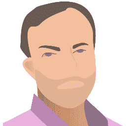

# 起床，代码 29:坐下来与马特巴克斯特雷诺兹，作者死亡的个人电脑

> 原文:[https://simple programmer . com/get-code-29-sit-matt-Baxter-Reynolds-author-death-PC/](https://simpleprogrammer.com/get-code-29-sit-matt-baxter-reynolds-author-death-pc/)

刚刚发布了起床和编码播客的新一集。

在这一集里，我和 Iris 谈论了顶尖的 Matt Baxter-Reynolds,《个人电脑之死》的作者，ZDNet [的热门博主。](http://www.zdnet.com/meet-the-team/us/matt-baxter-reynolds/)

这个小插曲很好地提醒了我们，在你最终出现问题之前，注意自己的健康是多么重要。

我发现马特对跑马拉松的态度非常令人耳目一新。他没有说他可能会做或者他会尝试，他说他会做。因为他对自己想要完成的事情有绝对的信念，所以他更有可能成功。

我发现这种态度是孕育成功的态度，难怪 Matt 在技术领域有如此成功的职业生涯。

你可以在这里听这一集:

[http://www.signalleaf.com/embed/523a643af152e30200000005/528e857cbb6bfa020000000b/](http://www.signalleaf.com/embed/523a643af152e30200000005/528e857cbb6bfa020000000b/)

[http://www.signalleaf.com/embed/523a643af152e30200000005/528e857cbb6bfa020000000b/](http://www.signalleaf.com/embed/523a643af152e30200000005/528e857cbb6bfa020000000b/)