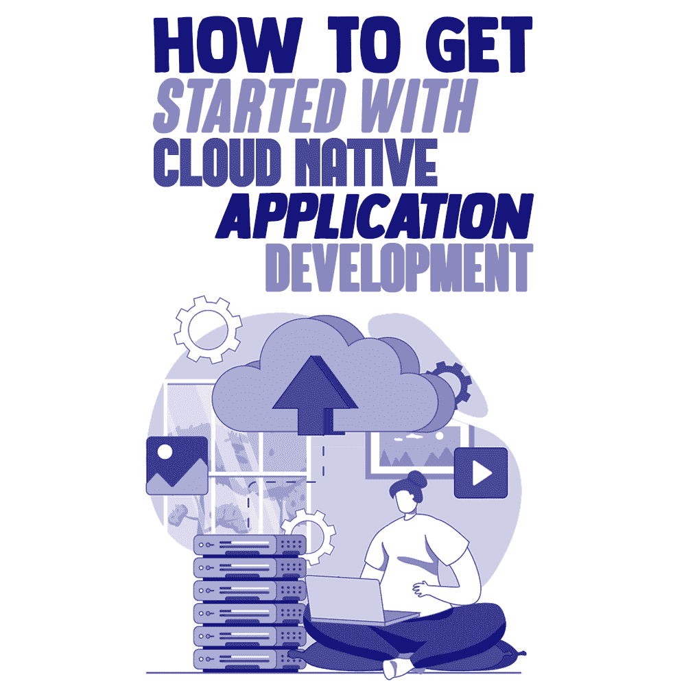
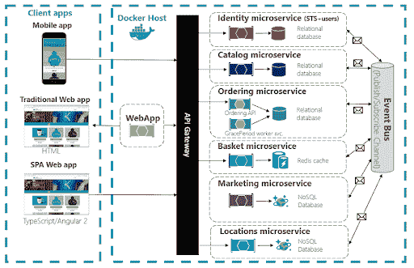
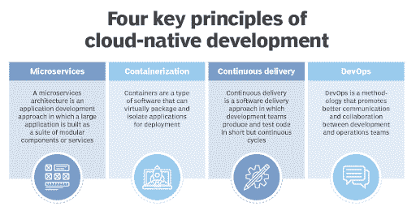

# 如何开始云原生应用开发

> 原文:[https://simple programmer . com/get-started-cloud-native-application-development/](https://simpleprogrammer.com/get-started-cloud-native-application-development/)

$120 billion.

根据 Forrester 的一份[报告，这是全球云计算市场的规模。](https://ecm.capitalone.com/WCM/tech/forrester-pdfs/predictions-2021-cloud-computing.pdf)

软件、数据存储和基础设施向云的无情转变是由新技术推动的，这些新技术使工作负载易于在云环境中开发和执行。

进入[云原生计算](https://www.nutanix.com/theforecastbynutanix/technology/cloud-native-computing-what-it-is-and-why-businesses-need-it)。

根据云计算本地计算基金会(CNCF)的数据:

*“云原生技术使组织能够在现代动态环境(如公共云、私有云和混合云)中构建和运行可扩展的应用。容器、服务网格、微服务、不可变基础设施和声明式 API 就是这种方法的例子。”*

如果你在前五个单词之外把它们弄丢了，不要担心。我们将在下一节回到这个问题。

各种形式的云是商业技术的新面孔。它现在是企业的一项成熟功能。可以肯定地说，许多大公司都是依靠它们运行的云应用来开展业务的。这不仅包括优步和 DoorDash 这样的“初创公司”,还包括为经纪人提供股票交易应用的老牌金融公司。

来自 CNCF 的数据显示，超过 600 万的开发者正在为每一个可以想象的商业功能构建云原生应用。这些应用基于 DevOps 等[最佳实践，因此可扩展至底层基础设施的极限。](https://simpleprogrammer.com/devops-methodology-learn/)

让我们探讨一下什么是云原生应用程序开发，以及它如何让您的企业交付更多价值。

## 什么是云原生 App 开发？

云原生应用程序开发是在云中为云开发应用程序的过程。

这听起来是不是太简单了？

实际过程可能看起来相当复杂，但核心思想是相当容易理解的。再细分一下这个过程，云原生应用是一系列容器化的微服务，这些微服务通过自适应基础设施进行管理，并持续交付。

*图片来源:[微软](https://docs.microsoft.com/en-us/dotnet/architecture/cloud-native/introduction)T3】*

在更传统的项目中，系统管理员负责管理基础设施分配。在云原生应用开发生命周期中，流程编排引擎会控制该流程。也就是说，开发人员或管理人员不必花时间去争取或论证他们需要的资源。相反，每个资源分配决策都基于系统中预先配置的规则。

开发环境，或者说开发应用的基础设施，对开发者来说是“抽象的”，或者说是不可见的。他们可以使用自己选择的技术来开发微服务，增加应用程序的可移植性，并允许快速更改代码。这是[敏捷开发](https://simpleprogrammer.com/agile-implementation/)的核心原则之一，即快速开发、快速发布，并迎合业务用户的实时需求。

从流程的角度来看，下面是如何进行云原生应用程序开发:

1.  在开发、IT 管理和领导团队中内化 **DevOps 实践**。
2.  采用 Kubernetes 这样的容器平台。这就形成了**运行和开发微服务的基础。**
3.  确保开发者**访问容器化的技术**并且协调引擎运行资源分配过程。DevOps 团队可以在项目的整个生命周期中监控项目。
4.  交付必须通过沙箱和 **[内置的可观察性](https://newrelic.com/topics/what-is-observability)实现自动化和连续化。**

## 云原生应用的业务优势

云原生应用程序为您的业务带来了多种效率和性能提升模式。这里有几个好处，将产生最大的影响。

### 1.经济高效的项目生命周期

应用程序开发项目最紧迫的挑战之一是资源管理过程。经验丰富的团队经常为了安全起见而过度分配资源。虽然这确保了项目生命周期的顺利进行，但它最终增加了应用开发的成本，并减少了项目可能的回报。

云原生的一个重要方面是，它不需要负载平衡、配置，甚至不需要手动分配。云资源是自主管理的，允许它们根据测试和部署的需要进行扩展和收缩。这些节省在整个项目生命周期中累积起来，使得云原生应用程序开发过程更加经济高效。

### 2.弹性建筑

一些产品负责人发现云部署很有挑战性，因为正常运行时间与数据中心或公共云或私有云的 VDI 环境中的虚拟机(VM) [的正常运行时间直接相关。云原生应用程序是可移植的，并且独立于虚拟机运行。换句话说，除非特定的微服务需要专用的 GPU，否则该架构可以无缝运行，几乎没有依赖性。](https://www.nutanix.com/theforecastbynutanix/technology/what-is-virtual-desktop-infrastructure)

依赖关系越少，工作负载的弹性就越大。故障排除也变得更加简单和快速。由于云基础架构依赖性不是一个问题，管理员可以将调查重点放在隔离其他潜在威胁上。

### 3.加快上市时间

[持续集成和持续交付(CI/CD)](https://newrelic.com/blog/best-practices/continuous-delivery-continuous-deployment-continuous-integration) 是云原生应用开发成功的核心。到目前为止，软件交付过程受制于阶段——在发布 alpha、beta 和产品版本之前需要进行全面的测试。

如今，通过在云环境中按需进行智能测试和持续部署，该流程可以完全自动化。与 DevOps 流程同步使用，这使得项目团队能够在更大范围内协作，并消除产品发布的风险，从而显著缩短从开发开始到第一个版本发布的时间。

### 4.不依赖供应商

[供应商锁定](https://www.nutanix.com/theforecastbynutanix/technology/is-vendor-lock-in-inevitable-in-cloud-and-infrastructure-management)是几乎所有应用程序的主要问题，包括那些部署在主要云提供商如谷歌、亚马逊或微软上的应用程序。除非你自己是一个科技巨头，否则你的工作负载的平稳运行取决于你的云存储供应商的可用性和效率。

由于云原生应用程序是可移植的，它们消除了对单一平台或云基础架构的依赖性问题。无论底层架构如何，您的开发人员都可以继续更新和升级您的应用，并充分利用新的 PaaS 和 IaaS 服务。

## 云原生应用的关键特性

云原生应用的定义特征是:

*   基于容器的基础设施
*   [围绕微服务构建的架构](https://www.amazon.com/dp/0367249952/makithecompsi-20)
*   持续集成和持续交付(CI/CD)的使用
*   [DevOps 进程](https://www.amazon.com/dp/1942788002/makithecompsi-20)

*图片来源:[TechTarget](https://searchcloudcomputing.techtarget.com/definition/cloud-native-application)T3】*

总之，这些转化为应用程序开发过程本身的许多好处:

### 1.模块化管理

单一应用的最大挑战之一是可伸缩性问题。开始时，它与开发团队的规模和专业知识成比例。然而，随着功能和特性的增加，单片架构变得更加复杂。

这样，在产品的生命周期中，产品所有者无法理解整个应用程序，开发团队不知道他们的模块如何与其他模块集成，QA 团队无法测试修改整个应用程序的一个特性的效果。

应用程序中缺乏可见性会引发更多问题，因为开发人员无法开发额外的功能。应用程序的体系结构变得混乱，小的变化会引发大的失败。

这些结构问题通过使用微服务来解决，微服务是单独构建的模块，每个模块只负责一个特定的功能。因此，可以测试和更新部分应用程序，而无需更改整个应用程序的代码或运行时。

### 2.自主资源分配

借助云原生应用，开发人员无需直接与云基础设施提供商的应用编程接口(API)进行交互。相反，DevOps 团队可以为每个容器(在其中开发应用程序)分配计算、内存和存储资源设置一个集中的策略。

自动资源分配对项目的投资回报(ROI)有直接影响。因此，超过或低于分配资金的每一个小数都会改变申请成功的可能性。自主资源分配通过将应用需求与可用资源精确匹配来降低这些风险。

### 3.异步开发

云原生应用本质上是聚合和容器化的微服务。这对用户来说意味着，当一个微服务出现故障时，不会影响其他微服务的性能。每个微服务都是封装的，都有自己的依赖项，所以一个微服务不会挟持整个应用程序。

同样的逻辑也适用于开发过程。除非容器化的微服务有共同的依赖关系(在这种情况下，它们可以被复制或分离)，否则它们可以异步开发、测试并添加到生产应用程序中。因此，您可以并行开发多个特性或应用程序模块，而不用担心集成问题。

### 4.快速缩放

虽然云和微服务都在为未来铺平道路，但企业仍有尚未充分利用的传统基础架构投资。由于云原生应用是打包为容器的自治服务的集合，因此它们可以动态地横向扩展和纵向扩展(使用或多或少的计算或存储资源)，这与传统基础架构中的虚拟机不同。

云原生应用允许与传统系统和数据进行基于 API 的集成。这使得即使是小型企业也能在从传统基础设施过渡到云的过程中加速其数字化转型过程。

### 5.全面的应用智能

微服务非常适合独立的审查、分析和评估。因此，开发人员可以在独立的基础上以及在整个项目的上下文中评估每个微服务的性能。由于模块化和弹性架构，全栈可观察性和特定见解使得对应用进行调整更加容易。

## 轮到你了

云原生应用是为软件开发和云技术的下一个时代而设计的。凭借其多功能性和灵活性，云原生使组织能够将其技术努力与其业务目标相匹配。无论您是中小型企业还是大型企业，现在您都可以明智地使用云原生技术来帮助解决您的业务问题并提高运营效率。