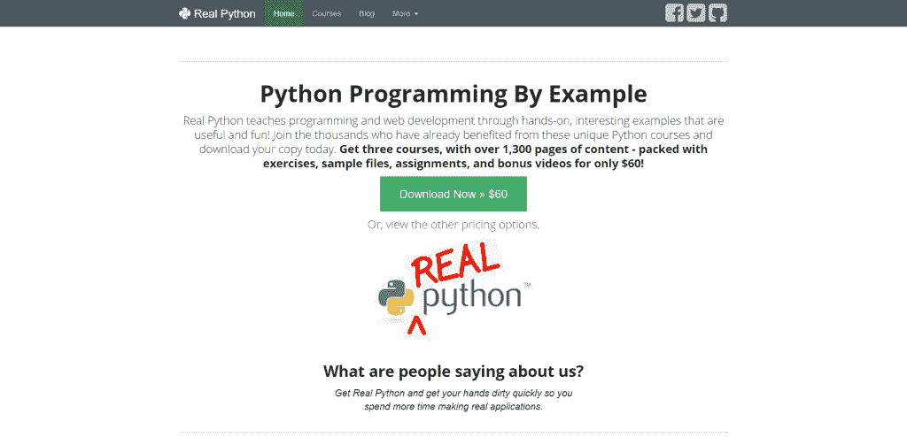
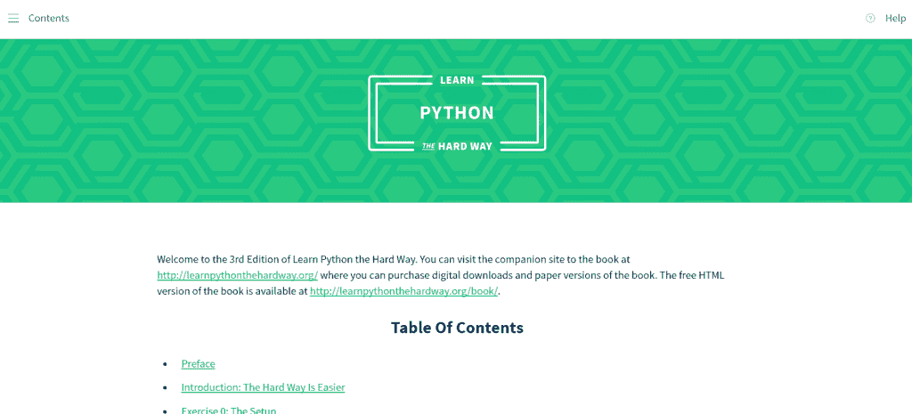
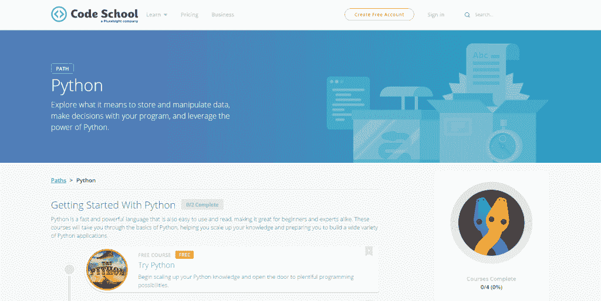
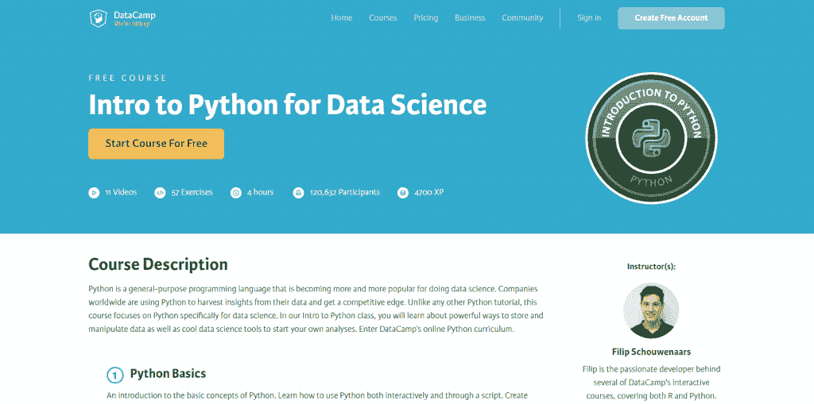
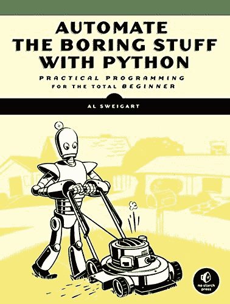
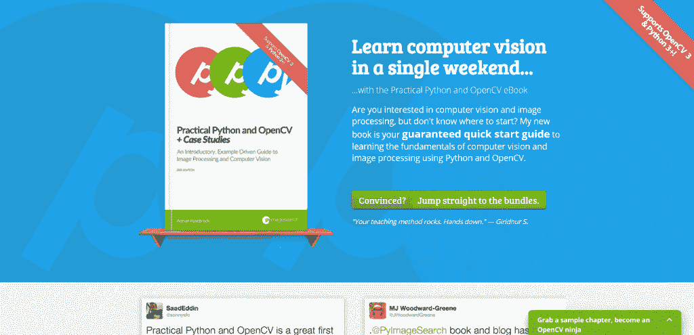

# 学习 Python 的最好方法

> 原文：<https://simpleprogrammer.com/get-started-learning-python/>

学习 python 的最好方法是从决定你想要构建什么开始。接下来，你需要找一门课程或一些资源来帮助你发展你的想法。学习 python 时，从一个想法开始非常重要。如果你试着建造一些你感兴趣的东西，它会让这个过程更加身临其境。

*   [真正的蟒蛇](#real-python)

*   [Python 通过构建 10 个应用程序快速启动](#python-jumpstart)

*   [艰难地学习 Python](#python-the-hard-way)

*   [代码学院:学习 Python](#code-academy-learn-python)

*   [代码学校:学习 Python](#code-school-learn-python)

*   [面向创业者的 Python](#python-for-entrepreneurs)

*   [数据科学 Python 简介](#python-for-data-science)

*   [用 Python 自动化枯燥的东西](#automate-the-boring-stuff)

*   [学 Python，易如反掌](#learn-python-its-cake)

*   [奖励:实用 Python 和 OpenCV](#practical-python-and-opencv)

上个月我讨论了为什么你应该学习 Python 编程语言。今天我将向你展示*如何*使用我最喜欢的十种资源学习 Python。

[https://www.youtube.com/embed/hcbfF8I9zCo](https://www.youtube.com/embed/hcbfF8I9zCo)

This list includes courses, books (both digital and physical), and tools/utilities you can use to take your first step with the Python programming language. These resources are a combination of *free* and *paid* tutorials. Most of the paid lessons include a set of sample exercises you can use to get a taste of the quality of the content.

无论您是一名经验丰富的代码处理者，还是第一次编写代码，这些资源无疑将有助于您掌握 Python。

## [real ython](https://realpython.com/)

说到学习 Python 编程语言和使用 Python 进行 web 开发，我推荐 T2 的 RealPython 课程。

本课程从 Python 编程语言(Python 2.7 和 Python 3)的基础开始，然后转到使用 Django、Flask 和 web2py 进行 web 开发。这些是目前最流行的 Python web 框架，您将在 Python web 开发人员的职业生涯中遇到。

您不仅将学习 Python 的最佳实践，还将发现如何利用诸如 vagger、Git、Heroku 等工具。一旦你完成编码，这些工具就可以用来真正地*构建*和*发布*你的 Python 应用程序。

我亲自完成了这门课程，并随后将它推荐给我的同事，他们来找我要学习 Python 编程语言的好资源。他们每个人都感谢我推荐了这门课程。

Michael、Jeremy 和 Fletcher(课程作者)都是非常好的人，他们不怕麻烦地帮助回答你的问题，确保你能够有效地学习 Python 编程语言。他们甚至在升级课程包中提供一对一辅导。

无论你以前是否有其他语言的编程经验，或者这是你第一次编写大量代码，你都应该看看真正的 Python 课程。

## [Python 通过构建 10 个应用程序快速启动](https://training.talkpython.fm/courses/explore_python_jumpstart/python-language-jumpstart-building-10-apps)

[Python jump start 课程](https://training.talkpython.fm/courses/explore_python_jumpstart/python-language-jumpstart-building-10-apps)由广受欢迎的 [*播客*的主持人 Michael Kennedy 创建。早在 2016 年，我个人就支持迈克尔的 Kickstarter 活动](https://talkpython.fm/)，为球场的创建提供资金。自从它发布以来，我已经经历了教训，并彻底享受这种体验。

Michael 的课程面向已经有一定编程经验并希望快速掌握 Python 的读者。

本课程还关注如何通过构建*项目*来学习 Python，而不是通过虚构的例子来索引语言基础。有太多的课程/书籍只是简单地解释如何编码，而不是要求你应用新获得的知识来解决现实世界的问题；迈克尔的课程是*而不是*这些枯燥乏味的教程之一。

在 Python Jumpstart 中，您将学习如何:

*   构建一个简单的天气客户端(HTTP 客户端、屏幕抓取、外部包)。
*   创建一个房地产价格分析器(文件格式，列表理解，生成器)。
*   构建一个个人日志应用程序(基于文本的文件 I/O)。

如果你是那种以“动手”的方式学习的人，你会喜欢这门课程的。Michael 在通过实际项目进行教学方面做得非常出色，如果您以前曾用另一种语言编程，我强烈推荐他的资源。

## [#3: *敬酒不吃吃罚酒*](https://simpleprogrammer.com/learnpythonhard)

Python 教育领域的经典之作*， *[艰难地学习 Python](https://simpleprogrammer.com/learnpythonhard)*是 Zed Shaw 的电子书，他是一名软件开发人员，也是 Ruby 混合 web 服务器的创建者。*

*Zed 的教导遵循一个简单的三步公式:*

1.  *完成每个练习。*
2.  *准确键入每个示例*。**
3.  *让它跑起来。*

*是的，很难。*

*是的，这会有点令人沮丧。*

*是的，你可能会发现课程有时有点枯燥。*

*但是泽德的方法奏效了。*

*当我们被扔进游泳池的深水区时，我们经常会挣扎，但是*艰难地学习 Python*将帮助你踩水，最终教会你如何自己游泳。*

*如果你是编程领域的新手(< 1 年的经验)，那么我会向你推荐这个资源——但是如果你已经是一个经验丰富的程序员，你会发现真正的 Python 和 Python Jumpstart 课程有更多的价值，因为它们更实用，并且演示了如何构建实际的应用程序，而不是代码片段示例。*

*说了这么多，我确实想指出关于这本书的一个重要的细微差别，一个经常被初学程序员忽略的差别:*

*随着你对 Python 编程语言越来越有经验，你很可能会放下这本书，转向其他资源。*

*怎么会这样*

*原因是*艰难地学到了 Python*使用 Python 2.7 而*还没有*更新到涵盖更新的 Python 3。*

*虽然这并不妨碍交易(记住，学习 Python *最重要的一步是真正开始*)，但当你试图在 Python 3 解释器中运行 Python 2.7 代码，却不知道为什么代码会失败并抛出错误时，这确实会令人沮丧。*

*如果你决定读这本书，记住这个细微差别，你会没事的。我还建议投资一个好的 Python 3 资源，比如 O'Reilly 的权威 Python“圣经”(在这个列表的后面会详细介绍)。*

## *[代码学院:学习 Python](https://simpleprogrammer.com/codecademy-py)*

*我最喜欢学习 Python 的在线课程之一是[代码学院](https://simpleprogrammer.com/codecademy-py)。*

*一年半前，当我开发一门关于 Python、计算机视觉和 OpenCV 的课程时，我第一次偶然发现了 Code Academy 和他们的教学产品。我最终登陆了代码学院的网站，并决定尝试一下他们的课程。*

*这些练习是有趣的和互动的，这意味着你可以在你的浏览器中进行 T4 编码。对于那些不熟悉这门语言，只想在不下载任何软件或配置机器的情况下开始学习的读者来说，这是一个巨大的好处。*

*Code Academy 学习 Python 课程的理想受众是几乎没有经验的程序员。如果你有超过 6-12 个月的编程经验，你可能会发现教程有点“噱头”，缺乏技术深度。*

*不利的一面是，虽然该课程目前可用，但它将在 2017 年夏天离线更新。如果我是你，我会立即投入到这个过程中。*

## *[代码学校:学习 Python](https://www.codeschool.com/learn/python)*

**

*类似 Code Academy 的 Learn Python 课程，我们还有另外一个由 [Code School](https://www.codeschool.com/learn/python) 提供的课程。*

*我个人比较喜欢代码学院提供的课程；然而，当 Code Academy 的课程改头换面时，你应该考虑尝试一下 Code School 的课程。*

*但是，要小心代码学院、代码学校之类的课程。虽然这些课程绝对会教你如何编程，但人们很容易忽略更大的图景:**如何构建和发布完整的应用程序。***

*学习如何编程不是为了获得徽章和装饰你的在线个人资料。相反，它是关于编写解决实际问题的软件。*

*你将在代码学院和代码学校学习如何*编写代码*,但是如果你的最终目标是获得一份 Python 程序员的工作，你将希望通过 Real Python 或 Python Jumpstart 的课程来补充你的教育。*

## *[面向创业者的 Python](https://training.talkpython.fm/courses/explore_entrepreneurs/python-for-entrepreneurs-build-and-launch-your-online-business)*

*[面向企业家的 Python](https://training.talkpython.fm/courses/explore_entrepreneurs/python-for-entrepreneurs-build-and-launch-your-online-business)是由*播客主持人 Michael Kennedy 为我讲述 Python*的另一门课程。我喜欢把这门课程推荐给那些有“创业优势”的学生。**他们不只是对学习如何写代码感兴趣；他们想用自己的知识建立一家真正的公司。***

*正如我上面提到的，程序员不会因为知道如何编码而被雇佣。他们被雇佣是因为*他们能用代码解决问题。*差别很细微，但值得注意。*

*面向企业家的 Python 课程假设您了解 Python 编程语言的基础知识，然后利用这些基础知识来帮助您通过构建实际的在线业务来提升技能。*

*Michael Kennedy 和 Matt Makai(来自于 [Full Stack Python](http://www.fullstackpython.com/) )用构建一个电子商务网站的例子来演示如何:*

*   *接受信用卡付款。*
*   *(安全地)将用户凭据存储在数据库中。*
*   *发送出站电子邮件。*
*   *设置 SSL 证书。*
*   *将您的应用程序部署到云服务器。*

*虽然本课程目前处于预购状态，但我已经先睹为快，可以告诉你它非常值得。*

## *[数据科学 Python 简介](https://simpleprogrammer.com/datacamp)*

**

*虽然许多读者对学习 Python 进行 web 开发感兴趣，但是这种语言还有许多其他的用途——T2，其中一个主要的用途是数据科学 T4。*

*Python 最受欢迎的一些包包括用于科学计算的 [NumPy](http://www.numpy.org/) 和 [SciPy](https://www.scipy.org/) 。*

*如果你有兴趣在数据科学(包括机器学习、深度学习、计算机视觉、统计分析等)领域探索职业生涯。)，您不仅需要熟悉 Python 编程语言，还需要熟悉 NumPy 和 SciPy 库。*

*阅读《Python 数据科学入门》是学习这三者的好方法。*

## *[#8: *向奥雷利学习 Python*](https://www.amazon.com/gp/product/1449355730/ref=as_li_ss_tl?ie=UTF8&linkCode=sl1&tag=trndingcom-20&linkId=963e5708fd96380e4d706d280dd8f477)*

*很难在不提及 [O'Reilly 的经典著作](https://www.amazon.com/gp/product/1449355730/ref=as_li_ss_tl?ie=UTF8&linkCode=sl1&tag=trndingcom-20&linkId=963e5708fd96380e4d706d280dd8f477)的情况下创建一个 Python 编程资源列表，该书现已出版第五版。*

*虽然这是一个很好的资源，但我对这本书最大的问题是它太大了。这本书以 1648 页的篇幅问世，出色地涵盖了 Python 2.7 和 Python 3；然而，我推荐你在阅读完我在本文其余部分提到的其他实践资源中的几个章节/课程后，用这本书来*补充*你的教育。*

## *[#9: *用 Python 把枯燥的东西自动化*T3】](http://www.amazon.com/exec/obidos/ASIN/1593275994/makithecompsi-20)*

**

*可以说是我最喜欢的初学者 Python 工具，Al Sweigart 的 *[用 Python 自动处理枯燥的东西](http://www.amazon.com/exec/obidos/ASIN/1593275994/makithecompsi-20)* 如果你通过实际例子学习，是“必须拥有”的。*

*这本书对你以前的编程经验不做任何假设，但同时教会你如何通过构建简单的(自动化的)应用程序来编写软件，例如:*

*   *在文本文件中搜索文本。*
*   *在系统上创建、重命名和移动文件。*
*   *发送短信提醒和电子邮件。*
*   *更新 Excel 电子表格中的数据。*

*我建议将这本书与代码学院或代码学校的课程结合使用，这样您就可以了解如何将所有 Python“拼图”组合在一起，以创建实际问题的解决方案。*

## *[学 Python，易如反掌](https://www.udemy.com/learning-python-not-the-snake/)*

*正在寻找一个免费资源来启动您的 Python 职业生涯吗？*

*如果是这样的话，我会强烈推荐 Jay Elbourne 的[学习 Python，这是小菜一碟](https://www.udemy.com/learning-python-not-the-snake/)课程。你所需要的是一个(免费的)Udemy 帐户，你将能够访问超过 7 个小时的视频教程，从最基础的(如何在你的系统上安装 Python)一直到构建小型应用程序。*

*我个人的建议是参加这个课程，然后购买更多的基于项目的书籍，比如 *Python Jumpstart* 或者*用 Python 自动完成枯燥的工作。**

## *[奖金#1: *实用 Python 和 OpenCV*T3】](https://www.pyimagesearch.com/practical-python-opencv/)*

**

*如果你对计算机视觉和图像处理的世界感兴趣(例如，编写能够*理解*和*解释*图像内容的软件)，你可能会对我的书*实用 Python 和 OpenCV* 感兴趣。*

*在本书中，您将学习如何:*

*   *检测图像和视频中的人脸。*
*   *识别笔迹。*
*   *利用你的计算机视觉树莓皮。*
*   *跟踪视频流中的对象。*
*   *建立一个计算机视觉系统来识别书籍的封面。*

*虽然我的书假设你已经有了基本的 Python 经验，但我还是花时间一行一行地解释每个例子，确保你理解每一行是做什么的。*

*由于这种实际动手的方法，我有很多读者回来告诉我，这本书不仅帮助他们学习了计算机视觉/OpenCV 的基础知识，还帮助他们学习了 Python！*

*如果您对利用 Python 编程语言分析图像并理解其内容感兴趣，请花些时间学习该语言的基础知识(例如，If、for、while 等)。constructs)，然后再看看 *[实用 Python 和 OpenCV](https://www.pyimagesearch.com/practical-python-opencv/) 。**

## *[奖金#2: Python Anywhere](https://www.pythonanywhere.com/)*

*Python Anywhere 不是可以用来学习 Python 的书籍、课程或教程。相反，它是一个运行在你的网络浏览器中的成熟的 Python 环境。*

*使用 Python Anywhere，无需下载也无需安装——只需打开浏览器，指向 PythonAnywhere.com 域、 ***并开始编码*** 。如果你发现你喜欢 Python Anywhere 服务，你可以花很少的费用升级你的帐户，并获得更多的 CPU 周期、网络流量和磁盘空间。*

*如果您正在努力在您的系统上安装和配置 Python，那么在学习基础知识的同时从 Python Anywhere 开始，稍后再回到安装过程。*

*记住，学习 Python 最重要的一步是第一步:**实际入门！***

## *有你推荐的其他资源吗？*

*上个月，我从我的个人经历*[中分享了为什么你应该学习 Python 编程语言](https://simpleprogrammer.com/2017/01/18/7-reasons-why-you-should-learn-python/)的七个理由。我今天在这里的目标是帮助提供一个资源列表，您可以在自己的 Python 编程之旅中使用这些资源。**

**你对我上面列出的资源有亲身体验吗？**

**我错过了你推荐的书或课程吗？**

**请务必在下面的表格中留下评论，让我们知道！**