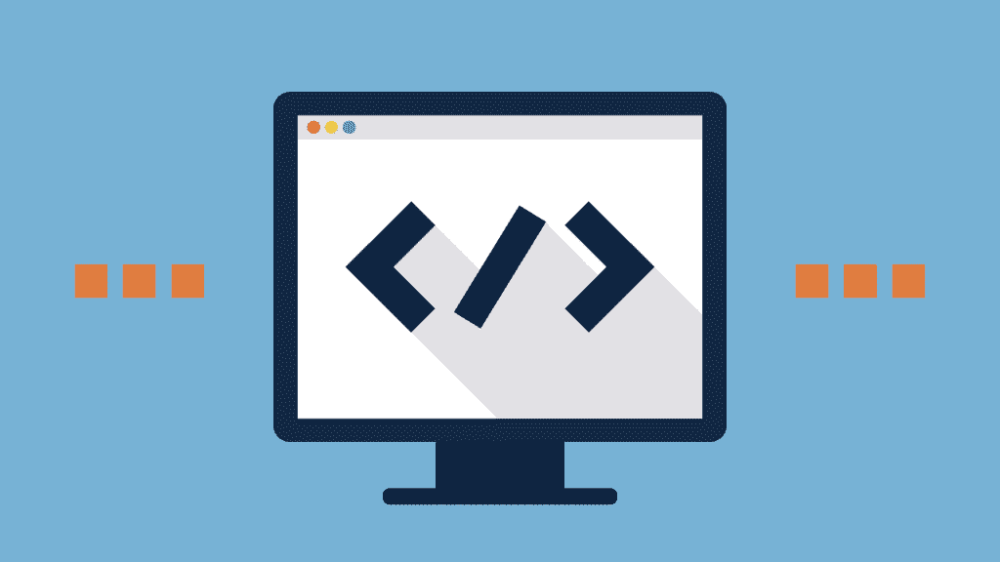

# 软件开发如何入门

> 原文:[https://simple programmer . com/get-started-software-development/](https://simpleprogrammer.com/get-started-software-development/)

当我刚开始做软件开发时，我不知道自己在做什么。

我也很沮丧。似乎没有什么是有意义的，我不认为我会“明白”

我告诉你这些的原因是，如果你有[拿起我的书](https://simpleprogrammer.com/2016/07/04/complete-software-developers-career-guide-introduction/)，你可能会有完全相同的感觉。

不要担心，**这是正常的。其实很自然的**。

当你第一次涉足软件开发领域时，如果你没有[感到不知所措](https://simpleprogrammer.com/2014/06/23/dont-overwhelm-trying-learn-much/)就像你刚刚跳进一个脚踝绑着重物的水池的深水区，你可能要么做错了什么，要么你不是人类——也许两者都是。

无论如何，你应该预料到开始会很困难和困惑，但不会总是那样——我保证。

## 我是如何开始的

[https://www.youtube.com/embed/iO52xWqKktQ](https://www.youtube.com/embed/iO52xWqKktQ)

I remember when I was first teaching myself to code. I didn’t have all the resources we have today. In fact, **I didn’t have any resources**.

我从一个流行的 MUD 下载了源代码。([那是多人地下城](http://www.amazon.com/exec/obidos/ASIN/0471116335/makithecompsi-20))。想想*魔兽世界*，但是没有图形——只有文字。是的，这是在“使用调制解调器拨号到 BBS 系统”的时代。)

我甚至不知道我在看什么。我只知道我想创建我自己的 MUD 版本，并添加我自己的功能，而实现这一点的关键就藏在这堆奇怪的神秘字符串中。

我开始乱搞。我把变量换成不同的值。我寻找一些似乎能控制对手致命一击几率的代码。我改了一下，重新编译了一下 MUD，看看发生了什么。

有时候它做了我想做的。**有时候甚至没有编译**。当我看到什么可行，什么不可行时，我学到了。

我仍然不知道我在做什么，但在一周左右的时间里，我对代码进行了修改，成功地创建了一个 MUD 版本，其中实际上包含了我的一些“特性”。

离成为一名熟练的程序员还有很长的路要走，但这是一个开始——我们都需要一个开始。

我之所以给你们讲这个故事，是因为，**比拿起一本教科书，比上大学或参加新兵训练营，比其他任何事情都重要……我相信这是开始编程的方式**。

你必须四处摸索，看看什么行得通，什么行不通。(我相信这是最好的学习方式，句号。参见我在 [*软技能:软件开发人员生活手册*](https://simpleprogrammer.com/softskills) 中关于快速学习的章节。)

但是**学习编码和学习如何在软件开发的世界中起步是两码事**。

是的，你需要学习如何编码，但是远不止这些，这就是本章的内容。

## 了解职业

首先，你需要了解一些开发软件的知识。

这比你想象的既容易又难。

这本书的一整节都致力于“关于软件开发你需要知道什么”的想法，但是我将在这里给你一个快速的概述。

软件开发不仅仅是编程。编程是其中很大一部分，但是仅仅知道如何编码不会让你走得很远——特别是如果你想以此为职业的话。

大多数软件开发项目背后的想法是将目前世界上手工完成的事情自动化，或者创造一种新的自动化方法来完成手工难以完成的事情。

想想我现在用的文字处理软件。我碰巧用[谷歌文档](http://www.amazon.com/exec/obidos/ASIN/1530312949/makithecompsi-20)打了这篇文章。

没有谷歌文档或其他文字处理程序，我不得不要么用打字机打这份文件，要么手写。

如果我想把文档格式化打印出来，我必须手工排版要打印的信件。

如果我想改正错误——尤其是拼写错误——我需要在身边放一瓶涂改液。(可能还有一瓶威士忌。)

现在不仅仅是谷歌文档允许我做这一切。有一堆相关的硬件和软件程序，允许我把手工打字或手写一本书的过程自动化，但我想你明白了。

因此，让我向您强调一个关键的概念，在您开始成为一名编码员的旅程时，您应该尽早了解这个概念。

在实现自动化之前，你必须能够手动操作。

## 收集要求

太多有抱负的——有经验的——软件开发人员试图在没有完全理解软件应该做什么的情况下编写软件。他们想直接跳进去编码。

显然，**你比那个**聪明，因为你正在读这本书。

软件开发的过程总是从首先理解要解决的问题开始。你在自动化什么？

不同的软件开发方法以不同的方式做到这一点，但是现在关注这个并不重要。现在，关键是**你必须以某种方式，在你能写任何代码**之前，收集某种需求和对正在解决的问题的理解。

这可能像与潜在客户交谈并讨论需要构建什么以及它应该如何工作一样简单，也可能像创建完整的文档化规范一样正式。

## 设计

一旦你理解了这一点，你就可以想出如何用代码来解决这个问题的某种设计了——同样，在编写任何代码之前。

请将此视为您代码的架构蓝图。同样，不同的软件开发方法以不同的方式处理这个问题，但是重要的是在你开始编码之前，你已经有了一定的设计水平。

这适用于大规模和小规模。一些学习了敏捷软件开发的开发者认为他们不需要设计任何东西，他们可以马上开始编码。虽然敏捷开发关注较少的预先设计，但是**设计仍然是必要的**。

你不能通过随意地将两块四块的木板钉在一起来建造房子。

## 编写代码

一旦你对软件的设计有了一些想法，是时候编写一些测试来定义软件应该做什么了(也称为[测试驱动开发](https://simpleprogrammer.com/2014/03/27/views-test-driven-development/)或 TDD)，或者是时候开始编码了。(我们将在后面的章节中详细讨论 TDD。)

**编写代码本身就是一门学科**，所以我们不会在这里深入探讨，但是我会推荐两本关于编写优秀代码的好书，你一定要读。

首先，我推荐史蒂夫·麦康奈尔的 *[代码全集](http://www.amazon.com/exec/obidos/ASIN/0735619670/makithecompsi-20)* 。这是每个软件开发人员都应该阅读的经典书籍。

第二本是罗伯特·马丁的 *[干净的代码](http://www.amazon.com/exec/obidos/ASIN/0132350882/makithecompsi-20)* ，这是另一本帮助你学会写更好的代码的经典书籍。

这些书将帮助你学习如何构建你的代码，以及如何编写易于理解和维护的代码。

这两本书对我的编码技能有着深远的影响，尤其是在清晰度和设计方面。

## 测试和部署

所以，一旦代码写好了，我们就发货，对吗？

不对。现在是测试代码的过程。，[不同的方法会以不同的方式处理这个问题](https://simpleprogrammer.com/2010/06/16/agile-testing-is-different/)，但是一般来说，在代码发布给最终用户之前，必须进行某种测试。

例如，在传统的瀑布开发项目中，测试发生在项目的最后，但是在“敏捷”项目中，测试发生在每个迭代中，通常持续大约 2 周。

一旦代码被测试，它就为部署做好了准备，[这本身可能是一个完整的过程](https://simpleprogrammer.com/2012/04/01/deployment-made-simple/)。

我们现在还不了解细节——将有整整一章讨论这个主题——但部署是将完成的软件安装在服务器上、放入应用商店或以其他方式提供给该软件的用户的过程。(这个过程可能相当复杂。)

在这个过程中，代码可能——咳咳，肯定应该— **被签入源代码库**,不同版本的代码和随时间的变化被存储在那里。

在大多数处理任何种类的卷和数据的复杂应用程序中，也有可能涉及到某种数据库。

数据库通常会存储应用程序的用户数据或配置信息，并且可能还需要与源代码一起更新。

许多软件开发团队使用某种形式的[持续集成](https://simpleprogrammer.com/2009/12/30/continuous-integration-best-practices/)来在开发人员“签入”部分代码时自动构建代码。

## 不仅仅是写代码，更多的是写代码

**最后，我们不要忘记调试**。作为一名开发人员，你的大量时间将花在找出为什么你的代码——或者其他人的代码——不工作上。

如你所见，软件开发不仅仅是写代码。

在你找到一份真正的软件开发工作之前，你需要了解所有这些东西。希望你在其他一些领域至少也有一些经验和技能。

但是不要害怕。这本书的目的是让你为所有这些做好准备——或者至少让你转个圈，给你指明正确的方向。你可能需要把背包装满你自己需要的所有用品，但我至少会告诉你要打包什么。

## 有计划

好的，约翰，我知道软件开发不仅仅是写代码，我会花很多时间调试，但是你还没有告诉我如何开始。怎么回事？

啊，是的。我明白你的意思，但你猜怎么着？好消息是:

> 你已经开始了。恭喜你。

通过拿起一本书，比如这本书，并且实际上试图理解软件开发不仅仅是写代码，你有了一个比大多数软件开发人员更好的开始。

好吧，是的，是的，我知道这是一个感觉良好的绒毛，但它确实是真的。有一天，当你像我一样成为一个满腹牢骚的老软件开发人员时，你也会宣扬同样的事情。

现在，在更实际的方面…你需要一个计划。

是的，一个计划。一个真实的、实际的、没有废话的计划，告诉你如何从一个对软件开发一无所知或几乎一无所知的人成长为一个成熟的软件开发人员。

有很多方法可以让你达到目的——我将在接下来的章节中讲述其中的一些——但是重要的不是你选择哪条路，而是你选择一条路并坚持走下去。

## 整合计划

让我们谈谈你的计划应该包括什么。

首先，你需要对你现在所处的位置以及你需要学习的东西进行诚实的评估。

你有编程经验吗？

你会编程语言吗？

您曾经构建过应用程序吗，或者您是完全从头开始吗？

我之前提到的其他技能呢？

你有他们中的任何一个吗？

你了解数据库、源代码控制、TDD、测试、调试或软件开发方法吗？

还有，问问自己**想做什么样的软件开发**。

当然，[每个人都想成为游戏开发者](https://simpleprogrammer.com/2016/05/19/game-development-career-viable/)，但是这实际吗？你想从那里开始吗？你愿意在漫长而孤独的道路上投入大量时间，与你将面临的所有竞争做斗争吗？

**很多人在人生的某个方向出发时，却没有先把事情想透。**

花些时间回答这些问题，这样你就能想出一个好的开始计划。

不要误解我。在这本书里我会尽可能地帮助你，但是我只能带你到这里了。

我可以给你成为一名优秀甚至伟大的软件开发人员所需的所有信息，但是你必须**把它组织成一个为你量身定制的行动计划**。然后你将不得不跟随它。

## 创建计划

一旦你稍微思考了这些问题，就该制定一个实际的计划了。

发展你的计划的最好方法是从你想要实现的目标开始向后努力。

与其“学习编程”或“成为一名软件开发人员”，你应该想出一个你想成为的软件开发人员的具体目标。

在本书的“关于软件开发你需要知道什么”一节中，我将涵盖你可能想要考虑的不同种类的软件开发角色或工作，但是你也可以自己做一些研究来确定什么最适合你。

你希望尽可能地具体，这样你就能确切地知道你需要学习什么，你想如何制作你的简历和作品集，你可能想报读什么学校或项目，甚至你想申请什么工作。

我知道做决定和做出承诺很难，但我怎么强调这一点都不为过！

你对自己想成为什么样的软件开发人员越明确，**一切就越容易**。

你将能够清楚地知道你需要学习什么，你需要为每一步做什么。

## 谁想成为“运动员？”

这样想:假设你想成为一名“运动员”。

这太宽泛了。你应该如何训练成为一名“运动员”

也许你应该举重和跑步，但也许你应该练习游泳。也许你应该用网球拍击球。

更好地做所有这些事情甚至更多，这样你就可以为你最终可能加入的任何运动做好准备。

看到这听起来有多荒谬了吗？

当有人期望成为一名“软件开发人员”时，这听起来是多么的荒谬——事实上甚至更荒谬

相反，**选择你的运动**。

一旦你了解这项运动，你就能知道如何为这项运动进行训练，这将使你的生活变得容易得多——相信我。

**从目标开始，然后反过来**确定为了达到目标你需要知道什么和做什么。

一旦你做了那件事，你就可以制定你的计划了。

你的计划的开始应该是关于你需要学习的东西。弄清楚你需要学习的顺序和你将如何学习是很重要的。

然后，你应该弄清楚你需要做些什么来为你的第一份工作和求职做准备。

最后，你需要一份获得这份工作的切实计划。你要去哪里找？你要怎么办？你打算申请什么样的工作？

我可能还会为你在找到第一份工作后如何继续个人发展和教育添加一个计划。

我知道这有点让人不知所措，但别担心。我写这本书的原因是为了让你更容易理解这一切。

在接下来的几章中，我将帮助你弄清楚你需要知道什么以及如何获得这些知识，在接下来的几节中，我将告诉你如何找到工作的细节。

现在，你可以开始考虑**你的计划将会是什么样子**，并且试着弄清楚**你想成为什么样的开发者**。

## 具体的例子

我总是觉得真实的例子很有用，所以让我们来看看一个现实的场景，这个场景适合那些想成为 web 开发人员的人，他们利用 Node.js 作为他们的主要技术:

### 目标:成为 Node.js 开发者。

### 计划:

**学习**

*   学习 JavaScript 的基础知识。
*   了解网页和 web 开发技术，如 HTML 和 CSS。
*   学习 Node.js 的基础知识。
*   能够编写某种简单的 Node.js web 应用程序。
*   了解开发人员用于开发 Node.js 应用程序的不同框架和技术。

### 待办事项:

*   从上面的研究中填入一些框架或技术来与 Node.js 一起使用。
*   学习一些与 Node.js 一起使用的数据库技术。
*   学习计算机科学基础知识:
    *   算法。
    *   数据结构。
*   了解编写优秀代码的最佳实践。
*   了解如何设计 Node.js 应用程序的架构。

**准备找工作**

*   开始查看我所在领域的 Node.js 开发人员的职位描述，并了解雇主需要什么技能。
*   列出一份我可能在当地找到工作的公司名单。
*   开始参加该地区的用户组。
*   开始与其他本地 Node.js 开发人员建立联系。
*   雇一个简历写手帮我写一份好的简历。
*   练习编写面试问题。
*   练习模拟面试。
*   建立一个几个应用程序的组合来演示。

**找工作**

*   联系我网络中的所有人，让他们知道我能提供什么价值，我在寻找什么。
*   开始申请初级工作或实习项目。
*   计划每天至少申请两份工作。
*   面试后与自己交流，决定哪些技能需要改进。

这仍然是一个相当粗略的计划，但你可以看到这种计划如何给出一个清晰的路径让你从 A 到 b。

起初，你的计划会很粗略，但是当你更多地了解到你需要学习和做什么的时候，你可以补充更多的细节。

制定某种计划很重要。你可以随时改变和调整计划，但是如果你一开始就没有计划，你将会漫无目的地漂浮在随机的方向，很可能会感到沮丧，更有可能放弃。

在下一章，我将帮助你进一步完善这个计划，因为我们将讨论成为一名软件开发人员所需要的技能。

当你在研究你的计划时，一定要看看我的课程:[快速学习的 10 个步骤](https://simpleprogrammer.com/store/products/learn-anything-quickly/)

* * *

