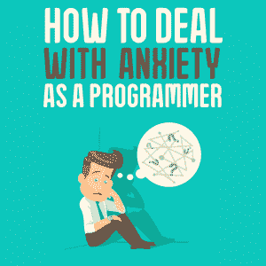
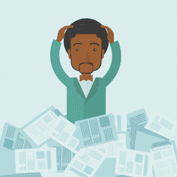

# 作为程序员如何应对焦虑

> 原文：<https://simpleprogrammer.com/getting-rid-anxiety-programmer/>

Good ol’ worry. Worry and anxiety are two of the worst feelings in the world. They can make you feel hopeless, lost, and scared.

因为这个网站是关于成为一个更好的程序员的，你可能不认为这篇文章适合你。不要看别处。如果你认为学习 SQL 或 Node.js 就是处理编程所需的一切，那你就大错特错了。软件开发人员拥有的[软技能](http://simpleprogrammer.com/softskills)通常是一个快速升至高层的程序员与一个停留在公司层级最底层的程序员之间的区别。

作为一名程序员，能够在担心或焦虑出现时处理它们是至关重要的。这不是你在课堂上或 Udemy 的在线 Python 课程中学到的东西。相反，它是你经常通过多年的经验学到的东西。这么多年过去了，一些人仍然不知道如何处理它们。

我这篇文章的目的是帮助你理解焦虑和担心是如何阻碍你成为一名程序员的，然后告诉你如何处理它，当然！

## 焦虑:一个常见的问题

我们要用我朋友玛丽的故事。她是一家小型 AI 公司的高级节点工程师。大约五年前，她获得了加州大学伯克利分校的计算机科学学士学位。她是优等生。现在，她想从高级工程师晋升为团队的首席程序员。

有一个问题:她通常让每次 scrum 的工作任务引起她的焦虑。她几乎总是认为他们对她来说太多太难做。当她开始这样想时，她就会陷入这种状态，担心如果她搞砸了，她和她的工作会发生什么。这严重影响了她完成工作的能力。

她厌倦了总是被自己的想法弄得像个废物。所以，她想办法找出如何才能停止焦虑，如何才能感觉更好。这是关键的第一步，认识到你可能需要帮助来应对焦虑。

## 为什么焦虑对程序员有害

随着 Mary 开始了解如何解决自己的担忧，她开始意识到焦虑正在影响她的工作以及工作之外的生活。

### 焦虑会导致健康问题

首先是焦虑和担心给她带来的健康问题。Mary 已经开始意识到她的脚是如何在工作中随机伤害她的，但后来她意识到她的焦虑的影响之一是她会随机感到肌肉疼痛。

这些疼痛影响了她集中精力工作的能力，此外，她还因为焦虑而注意力不集中。

她注意到的另一个健康影响是极度疲劳。为了让程序员完成工作，他们必须有精力保持清醒。如果你没有精力保持清醒，你就无法完成当天的任务。所以，玛丽不仅努力集中注意力，还努力保持清醒来完成她的工作！

程序员已经有可能因为工作环境而出现健康问题。我们整天坐着，紧紧盯着电脑屏幕，经常喝咖啡或苏打水，吃零食。焦虑，以及所有相关的问题，不是程序员应该寻找的东西。

虽然健康问题极其重要，但这并不是我向你们讲述玛丽焦虑故事的主要原因。她还有很多东西要学，我们可以跟着她一起学。

### 焦虑消耗你的思想

Worrying a ton about her work is causing Mary’s mind to react negatively to more than just work. The purpose of worrying is to help you think about possible negative outcomes so you can prevent them with a little bit of action.

然而，担心和焦虑的副作用之一是，一旦你有了这些想法，你就会陷入越来越消极和令人担忧的想法。因此，尽管担忧有一个好的功能，但每次我们允许它影响我们时，我们最终会拥有越来越多的担忧。

你可以想象，这是玛丽难以集中注意力的主要原因。她是团队中最聪明的开发人员之一。她在学校的成绩和多年的经验证明她很在行。但是，她正在努力应用她所知道的信息，因为她无法集中精力处理头脑中所有令人担忧和焦虑的想法。

专注是所有程序员都需要的技能。当我们想出下一段代码时，我们经常需要做一些复杂的数学运算来解决问题。如果你不能集中注意力，那么很可能你会努力想出一个解决方案。

### 担忧影响工作之外的生活

如果你认为焦虑始于工作，止于工作，那你就错了。玛丽醒着的工作日有一半时间是在工作中度过的，然而她所感受到的焦虑正渗透到她的家庭生活中。

她最近和丈夫乔结婚了。你可以想象，维持婚姻需要付出很多努力。

乔向玛丽抱怨她的担心影响了他们的关系。当她回到家，她看起来很消极，总是很烦恼。她不能放松和他一起玩。这导致乔不满意。

这不仅影响到她的丈夫，也影响到她的朋友和家人。当她在他们身边时，她只是抱怨她害怕失去工作，或者她有太多的工作要做，她害怕不能及时完成！

玛丽终于意识到她对工作的焦虑对她的事业和亲密关系有多么深远的影响。她决心放下烦恼，成为一名优秀的程序员

## 如何停止担忧

玛丽现在准备采取一些行动来消除她的担忧，对她来说，这归结为两件事。

### 找个分散注意力的地方

当下一个 sprint 到来时，她被分配了那个时期的开发任务。通常情况下，玛丽会觉得自己不能及时完成所有需要完成的事情。

但是之后她看了一个她最喜欢的 Youtubers 视频，是关于他(T2)如何在他(程序员)的工作环境中克服担忧的。

还记得我们之前说过，令人烦恼的想法会吸引更多令人烦恼的想法吗？为了停止担忧，你必须做的第一件事就是转移注意力。做点别的分散注意力！

如果你在办公桌前工作时变得焦虑，加载一个有趣的 YouTube 视频，去会议室冥想，和朋友谈谈(不是关于担心)，去做一些有趣的事情。

你必须做些什么来打破一个又一个令人担忧的想法的循环。

### 挑战你的想法

一旦你打破了这个循环，你必须做下一件至关重要的事情来阻止担忧回到你的头脑中。你必须挑战你的想法。

我这么说是什么意思？就你认为会发生的事情问自己一些问题。

所以玛丽问自己，她是否认为她的担心是真的。她最初担心在扩展服务器时会遇到困难。问了一些问题后，她记起她在以前的工作中已经构建了一个类似的功能，这比她现在需要构建的功能要困难得多。不仅如此，她还在更短的时间内做到了！

挑战你的想法可以让你摆脱情绪化的一面。情感方面是关于你的感受。和你编程时需要的思维是不一样的。程序员需要逻辑思维。当它的情感方面被移除，你可以进行逻辑思考，那么你就能真正发现你正在思考的事情是否真的有可能发生。你所担心的事情很可能不会发生。

## 再也不会感到焦虑了！

Mary finally succeeded in getting rid of anxiety. She was able to stop focusing on that worrisome thought spiral and was able to change those thoughts to positive ones right away.

她学会了首先从引发焦虑的想法中转移自己的注意力。然后，一旦她可以更有逻辑地思考，为了防止那些想法回来，她挑战和质疑她的担忧，看看它们是否是真实的！

这就是情绪和内心挣扎的问题:你可以克服它们。只需要一点点知识和一点点行动。在你的控制之下，总有一些你可以做的事情来帮助解决问题。这就是为什么我写了一本关于这个主题的书。

玛丽受益于首先注意到她的焦虑是一个问题，然后着手了解它，并找出正确的步骤来采取。她现在可以通过理解一个场景中可能的负面结果，并尽她所能限制它们，来利用担忧为自己谋利。

这让她能够更加专注于自己的代码，每天完成更多的工作。不仅如此，她的事业开始好转，她的人际关系也变得更牢固了！

我受够了。你该去解决你的烦恼了！