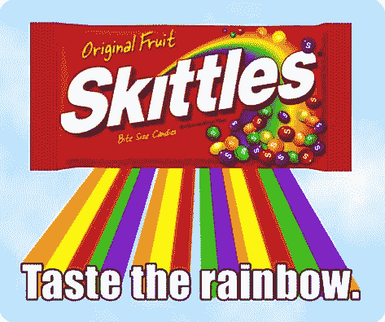

# 接近蝙蝠:将蝙蝠加入你的接受标准

> 原文：<https://simpleprogrammer.com/getting-up-to-bat-adding-bats-to-your-acceptance-criteria/>

所以现在我们已经[构建了我们的自动化框架](https://simpleprogrammer.com/2011/03/16/getting-up-to-bat-designing-an-automation-framework/)，并且让我们的[冒烟测试作为构建](https://simpleprogrammer.com/2011/04/05/getting-up-to-bat-adding-smoke-tests-to-your-build/)的一部分运行，我们现在需要确保为新的积压工作创建新的 bat。

这无疑是你将面临的更具挑战性的任务之一，也许是最关键的。

如果你不能为已经完成的新的积压订单创建新的 bat，你所有的努力都将是徒劳的，因为如果你不这样做，你将仍然在做手工测试，你将一直在追赶进度。

## 从小处着手

这里的目标是最终达到这样一个点，即每一个 backlog 都需要编写和传递 bat，以便该 backlog 被称为“完成”

如果你试图在一次迭代中把这个崇高的目标丢给一个团队，你很可能会被狠狠地揍一顿。

相反，从一个简单的目标开始，要求至少有一个 backlog 拥有该 backlog 所有功能的 bat。从这个小目标开始，但是要严格执行。

通过像这样从小处着手，您将让团队习惯于在构建功能的同时构建自动化测试的想法，并且您将让他们有机会在不牺牲太多速度的情况下取得小的成功。

此时的目标应该是让人们对编写 bat 和 backlog 感到兴奋。

## 其实挺好玩的

我发现开发人员倾向于真正喜欢编写自动化测试。确保你让每一个想要分享乐趣的人，而不仅仅是 QA 和开发者。

看到自动化测试的“魔力”,点击网页上的按钮，做各种以前看起来很乏味的事情，真的非常令人兴奋。

我发现这非常有趣，以至于你可能会遇到这样的问题:开发人员不想处理真正的 backlog，而是想为它编写自动化测试。

这很好，你真的想培养这种态度，这将大大有助于当你最终…

## 扔炸弹！

什么炸弹？炸弹上写着:

> 所有积压订单都需要 bat 作为验收标准。除非它有证明其功能的自动化测试，否则它不会被完成。

平均来说，您应该在 3 到 4 次迭代内达到这一点。不要走得太快，但也不要走得太慢。

我知道这似乎是一个不可能的任务，但它真的不是。我以前来过这里，并在几个不同的团队中取得了很大的成功。关键是要确保每个人都乐于编写自动化测试，并理解其价值。

不管你做什么，一旦你在沙地上划下了这条线，就不要退缩！我是认真的。

你可能会收到死亡威胁。人们可能会一直当着你的面大笑，还会往你的咖啡里吐彩虹糖，让你尝尝彩虹的味道，但你必须坚守阵地。

从长远来看，这是值得的，因为随着时间的推移，你将建立一个强大的安全网来证明你的软件的功能。

## 不全是彩虹和蝴蝶

您有时会遇到这样的情况，对于特定的待办事项，自动化的代价太高了。

这尤其会发生在你拥有某种跨越多个领域或软件系统的过程的情况下。

当你遇到那些情况时，给它一个坚实的努力，至少尽可能多地自动化，但不要死在山上，扼杀整个自动化项目。我们必须务实，否则我们的信誉可能会受到质疑。

不要指望每个人一夜之间都拥抱写作蝙蝠，甚至擅长写作。当你第一次向团队介绍这一点时，你会有一个学习曲线，你的自动化框架仍然会有一些相当大的漏洞。

但是，没关系。随着时间的推移，你将构建出那个框架，并产生一些经历过激烈战斗的伤痕累累的老兵，他们能够在远远地瞪着你的同时自动化网页，只是不要失去希望，继续打鼓！