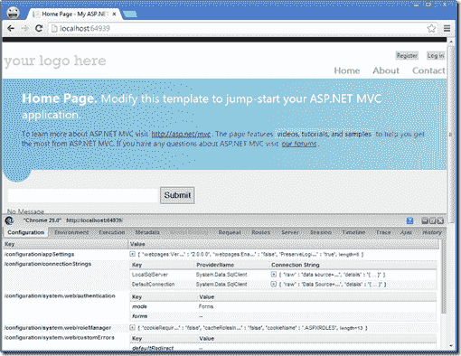
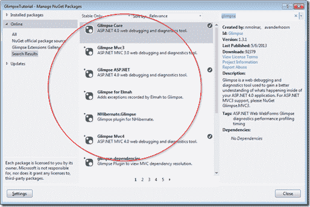
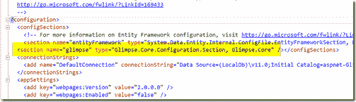
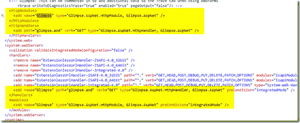
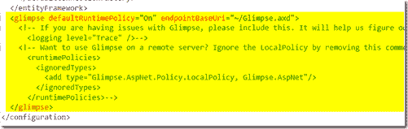
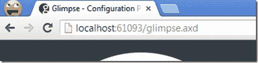
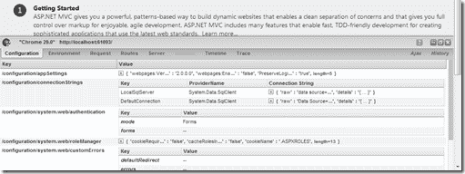
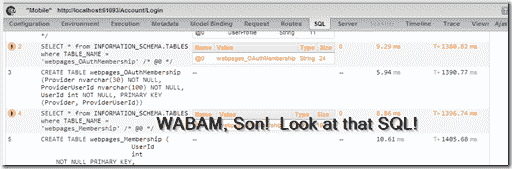

# ASP.NET MVC 中的快速入门

> 原文：<https://simpleprogrammer.com/glimpse/>

如果你正在使用 ASP.NET，特别是如果你正在使用 ASP.NET MVC， **[你需要使用惊鸿一瞥](http://getglimpse.com)。**

~~我目前正在制作一个更加详尽的[多视课程](https://simpleprogrammer.com/using-glimpse-aspdotnet-mvc4)的惊鸿一瞥~~，([课程现已上线！但是我想我应该在这里写一篇快速入门指南。](https://simpleprogrammer.com/using-glimpse-aspdotnet-mvc4)

## 什么是惊鸿一瞥？

也许你还没有听说过《惊鸿一瞥》，或者你只是有点不确定它到底是什么。

Glimpse 基本上是一个开源的免费网络诊断平台。现在它最适合 ASP.NET，尤其是 ASP.NET MVC，但是它也可以扩展到其他平台。一个 PHP 版本的工作已经开始，甚至一个 Python 端口的工作也已经开始。

Glimpse 的基本功能是通过一个完全用 JavaScript 呈现的小诊断窗口，让您直接在页面上看到关于服务器上发生的事情的诊断信息。

开箱即用，Glimpse 可以向您显示关于您的 MVC 应用程序的各种信息，比如注册了什么路线，通过 MVC 管道的流程是什么，以及模型是如何绑定的。

(顺便说一句，如果你想重温你的 ASP.NET MVC 4 技能或者了解 ASP.NET MVC 4，我推荐[专业的 ASP.NET MVC 4](http://www.amazon.com/gp/product/111834846X/ref=as_li_ss_tl?ie=UTF8&camp=1789&creative=390957&creativeASIN=111834846X&linkCode=as2&tag=makithecompsi-20)。伟大的书，顶尖的作者。)

这是页面上的 Glimpse 窗口的外观。

Glimpse 也是完全可扩展的。

已经有实体框架、NHibernate、Ninject 和很多很多的插件

Glimpse 最大的优点是它的设置非常简单。

我将带你完成下面的步骤。

## 第一步:从 NuGet 获得一瞥

要安装 Glimpse，您只需:

*   打开软件包管理器控制台，输入***“Install-Package Glimpse。Mvc4"*** (或 ***【惊鸿一瞥】。AspNet* "** 如果你没有使用 MVC)
*   或者，右键单击您的引用，选择 Manage NuGet Packages，然后搜索 Glimpse 并找到合适的 Glimpse 包。

一旦你这样做了，Glimpse 会自动为你添加一些条目到你的 web.config 中。

## 第二步:打开惊鸿一瞥

打开惊鸿一瞥超级简单。

只需启动你的应用，导航至 ***glimpse.axd*** 。然后，点击 ***【开启 Glimpse】***来设置一个 cookie，让运行在服务器上的 Glimpse 组件向你发送 Glimpse 数据。

**转到 glimpse.axd**

打开它！

就这么简单！

## 第三步:点燃它

现在，您所要做的就是导航到应用程序中的任何页面，您会在屏幕的右下角看到这个小图标:

如果你点击这个图标，你会看到 Glimpse 面板，它现在看起来类似于 [Chrome Dev 工具面板。](http://pluralsight.com/training/courses/TableOfContents?courseName=chrome-developer-tools)

## 使用 Glimpse

每个选项卡包含关于您的应用程序的不同诊断信息。

这些数据对于解决问题和了解 MVC 内部到底发生了什么非常有帮助。

你还可以找到可以从 NuGet 轻松安装的插件。

例如，如果您添加实体框架插件，您将开始看到一个选项卡，显示关于 EF 查询的数据，如下所示:

我对《惊鸿一瞥》及其未来感到非常兴奋。Anthony van der Hoorn 和 [Nik Molnar](https://twitter.com/nikmd23) 是 Glimpse 的两位创造者和主要维护者，他们在改变我们获取 web 应用程序诊断信息的方式方面做得非常出色。

我发现这个平台最令人兴奋的一点是它很容易扩展。~~在我的[即将到来的](https://simpleprogrammer.com/using-glimpse-aspdotnet-mvc4)~~ ，([课程现已直播！](https://simpleprogrammer.com/using-glimpse-aspdotnet-mvc4))我将带您创建一个 Glimpse 插件，这非常简单。

如果你还没有看过《惊鸿一瞥》，你还在等什么？现在就去做吧，你大概需要 5 分钟来设置。

你怎么想呢?你已经在用 Glimpse 了吗？发表评论让我知道。

我本周的 YouTube 视频:(这不是广告！)

<object width="448" height="252" classid="clsid:d27cdb6e-ae6d-11cf-96b8-444553540000" codebase="http://download.macromedia.com/pub/shockwave/cabs/flash/swflash.cab#version=6,0,40,0"><param name="src" value="http://www.youtube.com/v/gNYwaYAEexI?hl=en&amp;hd=1"></object>Dealing With Burnout

这里是每周起床和编码集:

[http://media.signalleaf.com/player/Get-Up-And-CODE/52e463bc5f3896020000000f/](http://media.signalleaf.com/player/Get-Up-And-CODE/52e463bc5f3896020000000f/)

[http://media.signalleaf.com/player/Get-Up-And-CODE/52e463bc5f3896020000000f/](http://media.signalleaf.com/player/Get-Up-And-CODE/52e463bc5f3896020000000f/)