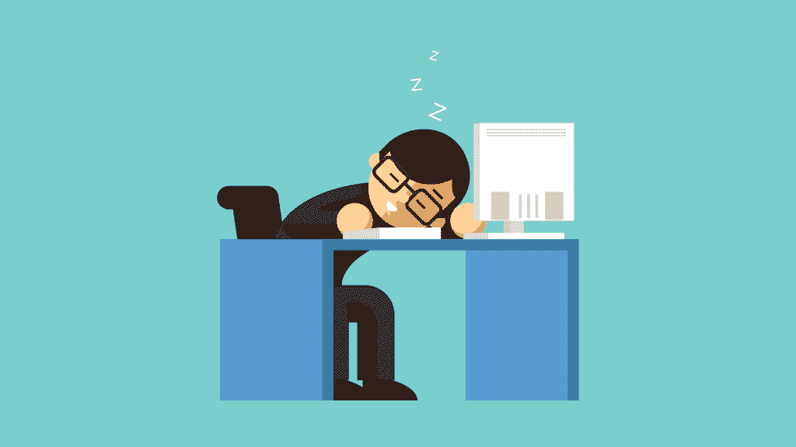
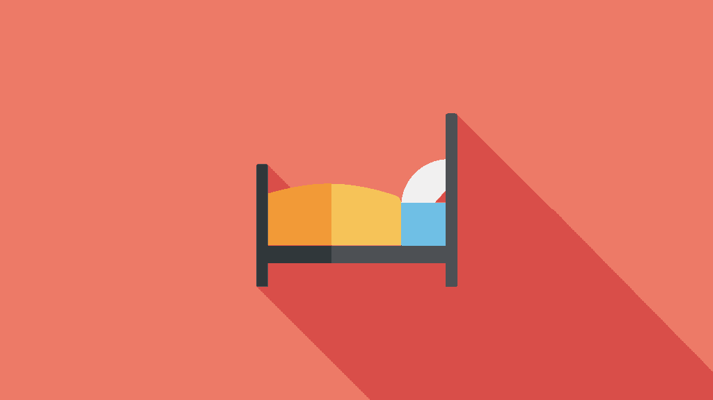

# 睡个好觉——软件开发人员休息好的 6 个小贴士

> 原文：<https://simpleprogrammer.com/good-nights-rest/>

作为软件开发人员，我们每天都在使用我们的大脑。我们的逻辑思维天赋与我们生活的许多不同方面相关，所以我们必须尽我们所能保持头脑敏锐和健康。这可能是健康饮食，锻炼，读书，甚至是游戏。

然而，现在，在 21 世纪，美国人似乎仍然没有得到一件对健康大脑至关重要的事情:足够的休息。为什么？一个原因是我们的生活中发生了太多的事情，其中许多超出了我们的控制，这影响了我们的睡眠和休息习惯。

现代世界中有许多现象可能会长期吸引我们的注意力，例如娱乐、社交媒体和我们的职业生涯。例如，你在睡觉的路上，一个电视节目吸引了你的注意力。你预计晚上 10 点睡觉，但由于这种分心，你最终在凌晨 1 点睡觉，或者你喜欢玩手机上的数百种功能。不知不觉，几个小时过去了！或者你接到朋友打来的电话，对某件事或某个人有“独家新闻”,因为你对这件事非常好奇，你倾向于因为一场本来可以等到第二天的谈话而失眠。

这些引人注目的现象就是我所说的“矩阵”诚然，这些东西很有趣，但当它们打扰我们休息时，也可能是有害的。

你有没有感到非常累，只是在睡觉前玩手机或其他类型的电脑设备时，不知何故又感到非常清醒？这是因为当你看着数字屏幕发出的蓝光时，你的大脑被阻止释放一种叫做褪黑激素的激素，这种激素让你的身体知道该睡觉了。

作为一名开发人员，确保你能得到适当休息的最好方法之一就是脱离矩阵。

## 获得充足的睡眠

据报道，40%的美国人晚上睡眠时间少于建议的时间。美国人平均睡眠时间为 6.8 小时，建议睡眠时间为每晚 7 至 8 小时。对于一些开发人员来说，这可能更像是繁忙的一天中的两到三个小时。根据我的经验，在极度忙碌的时候，我的最低睡眠时间是 6 个小时，或者如果我在写代码，我会说大约 5 个小时。如果我一个晚上只睡五个小时，我通常会在下班回家后小睡一会儿。

获得适当的休息可以让你的大脑变得敏锐，更容易记住任务，从而促进心理健康。如果我们有新项目的任务需要在三周内完成，适当的休息可以帮助我们在写笔记之外保留这些任务。充足的休息也有助于决策——这对开发人员来说是一项极其重要的技能，因为我们编写的许多代码都是基于决策和使用逻辑的。适当的休息也可以通过清除长时间积累的毒素来从身体上清理你的大脑。

## 关闭所有不用的电子设备

除非你需要一个电子设备来帮助你睡觉(例如 iHeartRadio 这样的收音机应用程序、空调或加热器)，否则我建议把它们都关掉。如果你碰巧用手机听广播或听音乐，试着调暗手机的灯光，把音量调得足够低，让你能听到音乐，但不要大到打扰你的睡眠。

## 花更少的时间使用社交媒体

今天，我们中的许多人认为，如果我们与社交媒体断开连接，我们的生活将变得无聊，我们将与世界隔绝。但这绝对不是真的。

社交媒体非常容易上瘾，也非常有害。你知道吗[长时间的社交网络活动会导致注意力下降](http://nperov.com/health/social-networking-bad-mental-health/)，以及注意力缺陷多动症的其他症状。作为一名开发人员，你最不希望恶化的就是你的注意力持续时间。这就是为什么暂时退出社交媒体可能对你有益。你的大脑可以放松，这反过来通过保护前额皮质和大脑中心来增强你的记忆。

看看 Cal Newport 博士的视频[“退出社交媒体”](https://www.youtube.com/watch?v=3E7hkPZ-HTk)。纽波特博士是一名计算机科学家，他解释了自己从未有过社交媒体账户，但仍然能够与世界各地的人联系并拥有社交生活。考虑到他的职业，大多数人可能会认为他没有社交媒体账户是疯了，但如果他仍然过着正常的生活，你也可以。然而，如果你不想完全放弃社交媒体，这里有 [10 种方法可以让你在不完全放弃的情况下戒掉社交媒体。](http://superheroyou.com/wean-social-media/)

## **沉思

** 

大多数人会告诉你不要担心你无法控制的事情。现实是，每个人都这么做。这是人性的一部分。

猜猜还有什么是你无法控制的？令人担忧！然而，你能控制的是你担心什么，以及你担心的频率。克服这个习惯是个好主意，因为过度的担心会对你这个开发者产生负面影响。

冥想是一种练习，在其中我们[训练我们的头脑](https://simpleprogrammer.com/2017/06/16/mind-training-programmers/)并练习将我们的注意力转向一个单一的参照点。冥想可以帮助我们承认内心的内容，而不会认同这些内容。事实证明，它可以减轻压力，从而帮助你晚上睡得更好。冥想有许多不同的类型:

1.  超然——被称为开悟的状态，这意味着我们体验到内心的平静，那种最不兴奋的安静状态，即使是在非常忙碌的时候。
2.  心律——被称为向下冥想，这是一种协调身体呼吸、循环和神经系统的呼吸方法，使人的灵魂、心脏、身体和思想融为一体。
3.  引导可视化——一种较新的技术，引导可视化可用于精神治疗、减压或个人发展。
4.  启功——这种冥想可以改善姿势、呼吸和更轻松地放松的能力。它还包括运动。
5.  zazen——字面意思是“静坐冥想”这种禅坐方式依靠自我指导，帮助你忘记判断性的想法、观念和形象。
6.  正念——当前最受欢迎的正念，对开发者来说是个好主意。它允许思想自由漫游，并强调接受任何出现的想法。
7.  昆达里尼——这是一种向上冥想的类型，它获取休眠能量来改变你的意识状态。

这里有更多关于这七种冥想的细节(还有其他类型的冥想；找出适合你的方法，并建立一个常规的练习。

## 补充你的褪黑素

褪黑激素是一种帮助你入睡的天然化学物质。如果你是一名需要轮班工作的随叫随到的开发人员，你可能会因为身体在白天失去褪黑激素而更难休息(根据马里兰大学进行的研究)。我做了两年电脑操作员，通宵工作；试图在程序员开发的系统中实现代码，并监控服务器和电子邮件，以确保所有系统正常运行，没有中断，这是一种痛苦的经历。有时我甚至在工作时睡着了。

我建议使用低剂量的非处方褪黑激素来帮助睡眠。*在使用任何非处方药之前，请先咨询你的医生*！如果你需要在白天睡觉，使用眼罩也有帮助。我们的设备发出的蓝光波长较短，这意味着蓝光的浓度更高，对睡眠诱导激素褪黑激素的影响比任何其他波长都大。

## 睡前播放平静的音乐

最后，晚上播放安静的音乐可以帮助你休息。为什么音乐可以帮助我们睡眠的原因还不清楚，但可能与某些类型的音乐对听者的放松效果有关。或者这可能与大脑释放某些化学物质有关。例如，你去一家公司面试，你走进一间小办公室，里面有杂志和点心。在背景中，取决于办公室，你会经常听到平静的音乐播放。自然地，你在面试前会感到不那么紧张和不那么紧张。如果音乐在你完全清醒的时候有那么大的影响，想象一下它在你准备休息的时候会有什么影响。

音乐还可以降低人的心率。就我个人而言，我听流畅的爵士乐是为了帮助我入睡。流畅的爵士乐平静、放松，不仅仅可以用来帮助睡眠——它也非常适合阅读和学习。在我知道之前，我已经睡得很熟了。有时，我会忽睡忽醒，还能听到音乐在播放。在我完全意识到之前，我又睡着了。不幸的是，这种方法不一定每天晚上都有效。有些夜晚可能非常紧张，平静的音乐可能一点帮助都没有。如果你以前有过这种经历，我建议你读一下 [10 个小贴士，在紧张的一天后获得良好的睡眠](https://www.mindbodygreen.com/0-14226/10-tips-to-get-great-sleep-no-matter-how-stressed-you-are.html)。

如果你不喜欢柔和的爵士乐，但想用音乐来帮助你入睡，我推荐古典音乐，甚至一些乡村音乐。这两种类型的音乐都有许多容易听的曲目，有助于睡眠。如果你不喜欢上面列出的类型，试试 R&B，或者任何其他你能感觉放松和抚慰身心的类型。请确保将音量调低，以便听到更多的旋律，而不是歌词。保持歌词柔和是一个好主意，因为如果歌词等于或大于旋律，你的大脑会好奇这首歌是关于什么的，这可能会扰乱睡眠过程。

## 一夜好眠至关重要

我敦促你们作为软件开发人员，请把健康放在首位。只要你活着——我祈祷你们所有人都长寿、幸福——你就需要你的身体和你的思想。最重要的是，作为一名软件开发人员，你需要一个健康的头脑。因此，为什么不通过获得你需要的适当睡眠来保护你的健康，从而过上积极的生活并做好你的工作呢？

如果我们买了一辆全新的车，我们会确保内外都保持干净。我们确保汽车得到良好的维护，让它带我们去我们需要去的地方。无论我们的身体是否向我们发出信号，我们都应该将同样的方法应用于我们的身体。

你的思想是珍贵的，你只有一个。尽你所能照顾好它。