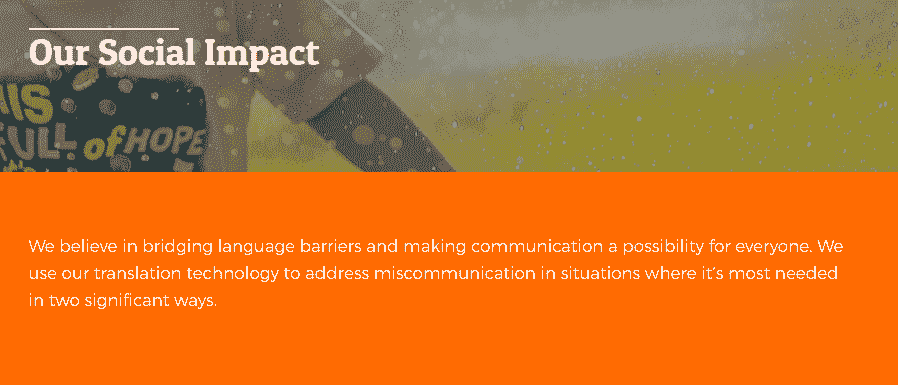

# 从谷歌筛选过程中吸取的 9 个教训，让你的简历增色不少

> 原文：<https://simpleprogrammer.com/google-screening-process/>

Most corporate job openings receive about 250 applications. Google receives [over 2 million per year](https://www.forbes.com/sites/stanphelps/2014/08/05/cracking-into-google-the-15-reasons-why-over-2-million-people-apply-each-year/). With so many resumes to handle and a genuine intent to hire only the best software engineers, Google knows a lot about the screening process.

即使你的目标不是在谷歌工作，向谷歌学习也会帮助你获得下一份技术工作。

从申请人跟踪系统(ATS)优化和软技能到更先进的知识，这些技巧将帮助你增强你的简历。

## 针对 ATS 进行优化

尚不完全清楚 ATS 在谷歌的招聘过程中扮演什么角色。该公司提供 ATS 作为 G 套件的一部分，但它计划于 2020 年关闭。尽管关闭了他们的产品，这表明谷歌确实重视 ATS。有些人甚至推测他们保留 ATS 供公司内部使用。

另一方面，大多数接受主要出版物采访的谷歌员工要么除了面试过程之外什么也不提，要么说谷歌招聘人员必须手动浏览所有面试。考虑到即使你没有被录用，你也必须在面试后与谷歌签署[保密协议(NDA ),所以关于招聘过程的信息很少也就不足为奇了。](https://medium.com/@jinzhe/my-google-interview-experience-51f716c7e578)

即使谷歌没有使用 ATS 来审查申请，许多科技公司也会这样做。下面是你需要做的事情来优化你的简历，以适应 ATS : 

*   保持简历结构良好。
*   以常规方式命名每个部分。
*   包括雇主可能感兴趣的关键词。
*   确保你交的文件可以被解析。

遵循这个简单的清单，你将更有可能被人力资源官员接受。然后，你必须考虑让你的机器人完美投资组合对人类也有好处。

## 提高可读性

如果你申请的公司使用 ATS，它可能能够将你所有的信息整理成一个整洁且易于浏览的格式。如果没有，可以由招聘人员进行人工审核。

你最不希望你的简历是一篇论文。平均而言，谷歌人力资源人员判断一份简历的时间不会超过 6 秒。如果你申请的公司很大，很可能你不会有更多的时间来打动评审。

这就是你如何让你的简历对人可读的方法。box-4-multi-130{border:none！重要；显示:屏蔽！重要；浮动:无！重要；行高:0；边距-底部:15px！重要；左边距:0！重要；右边距:0！重要；margin-top:15px！重要；最大宽度:100%！重要；最小高度:250px 最小宽度:250 像素；填充:0；文本对齐:居中！重要}

*   选择一个清晰和传统的字体。
*   选择一个传统的结构。
*   把姓名和联系方式放在左上角。
*   用可见的字体写下每个简历类别的名称。
*   使用项目符号。
*   用简短的形式写。

这些写作技巧是基本的，但令人惊讶的是，有多少工程师放弃写作，只赌他们的技术知识。其他人则犯了截然相反的错误，过分炫耀自己的专业知识。

## 避免流行语

审查者希望看到证明你是一个值得加入公司的候选人。他们希望看到技能和能力。如果你提到你是一个“团队成员”或者你是“自我激励的”，这只会告诉他们你精通公司语言。

前谷歌招聘人员斯科特·培根说，在简历中看到“协同”或“动态”这样的词是最大的障碍之一。

这些公司可能会在他们的网站上使用这种语言，但这不太适合写简历。做筛选的员工很清楚这些话是空洞的。

遵循这个经验法则:如果你不能用一句话解释你将要使用的单词，就不要使用它。提及你的硬技能非常简单。精通 C++和 Java 是不言自明的，敏捷的基础知识也是如此。

当谈到软技能和描述你的职业经历时，就变得模糊了。“颠覆性创新”到底是什么，当你说你是“主动的”时，你指的是什么对许多人来说，这只是“我做事”的一种花哨说法

找到像这样的词，用你能做任何事情的铁证来代替它们。

## 秀，不要说

当你在简历上谈论你的工作经历时，重要的是要记住你用它来追求什么目标。你写你的工作经历不是为了让招聘人员了解你以前的工作职责。很可能，他们知道软件工程师是做什么的。

Your goal is to show you’ll be making money for the company. It’s to show that you’re a data-driven person who knows what result you should produce and how to measure it. Finally, your goal is to show that you’re an [efficient programmer](https://simpleprogrammer.com/value-of-effective-programmer/). How do you do that?

与其告诉他们，*不如展示给*他们看。谈论你在工作场所的成就，展示你有多优秀，而不是使用那些被过度使用的毫无意义的标签。

不过，你不需要讲一个大故事。你可以使用谷歌的拉兹洛·博克提出的公式:我通过做 z 把 X 提高了 Y%

例如，我通过改善延迟和修复应用程序故障，将客户端应用程序的客户流失率降低了 125%。或者，我通过实现更友好的用户界面，向更广泛的受众开放了一个[免费虚拟专用网](https://cooltechzone.com/free-vpn)应用。

你不必成为一个独立的软件工程师来吹嘘你的成果；提及团队项目也是可以的。

写下你不同寻常的职责，以及你的成就和工作亮点。结合可读的形式，这会让你的简历脱颖而出。

确保不要持续太长时间，因为人力资源部没有时间浏览论文。保持简洁，你会有更多被注意到的机会。

## 包括软技能

你的迭代能力和创造性解决问题的能力对公司来说极其重要。然而，软件工程师几乎从不独立工作。甚至谷歌对完美员工的标准也包括沟通和团队合作。

这就是为什么你的简历会从提及软技能和技术能力中获益。

现在的问题是，你如何在不使用太多流行语的情况下谈论你的软技能？毕竟，大多数公司要求你具备“沟通技巧”和“团队精神”。

不要只是向他们重复这些话。记住上面说的原则，秀而不告。展示你了解什么是真正的软技能，并且你拥有这些技能。

包括“我可以接受客观的批评”或“如果初级开发人员需要建议，我会给他们建议”这样的话，比说你擅长沟通强多了。

你也必须有一个展示你软技能的故事。想想你为前任雇主做过的与人相关的事情——帮助入职、解决冲突、以不咄咄逼人的方式讨论想法。在简历中提到其中的一些，会显得很棒。

## 管理在线状态

谷歌自己的 ATS Google Hire 允许用户从 LinkedIn 和 GitHub 开始，到美国专利数据库，在线检查申请人的每一个踪迹。很有可能，主要的科技公司在这个筛选阶段不会浪费任何资源。

不幸的是，这意味着你不能想发什么就发什么——你需要保持你的主要社交媒体档案对企业友好。招聘人员可能会认为，一年前你在脸书主页上发布的一个尖刻的笑话标志着你是一个不受欢迎的候选人。

你也应该努力提高你在网上的权威。请你的同事在 LinkedIn 上认可你的技能，并确保你在 GitHub 上有几个你引以为豪的个人项目。

## 坚持公司价值观

谷歌对其潜在候选人的核心要求之一是所谓的“谷歌性”该公司将其定义为团队合作和将自己推出舒适区的能力。

虽然你要申请的公司可能不是谷歌，但他们可能有一套他们认为对团队至关重要的价值观。

当然，在很大程度上，这只是一种花哨的公司用语，可以归结为“我们的员工必须一起工作，并且能够快速学习。”但是如果公司认真对待这个公式，你也应该认真对待。

如果你发现他们的网站上到处都是这种信息，最好在你的简历中加入一些他们谈论的特征。花几分钟调查一下公司的价值观是什么。去它的网站看看“关于我们”的页面。如果网站有一个“我们的使命”类型的页面，也可以去看看。

例如，这家公司用了整整一页来描述他们想要达到的社会影响。提到你关心他们的事业，你可能会有优势。

## 永远不要泄露敏感信息

谷歌对保密信息保密非常严格。许多其他科技公司也希望新员工遵守[程序员的行为准则](http://www.amazon.com/exec/obidos/ASIN/0137081073/makithecompsi-20)。

如果你的简历提到了一些应该放在 NDA 下面的信息，那你就不是在吹嘘你做了一个伟大的项目。你向他们表明你不在乎保密协议，如果符合你的兴趣，你会谈论公司的秘密。

如果大多数公司发现了这样的东西，他们会立刻忽略你的简历。

## 不要过于具体

这个有点难处理。你知道你应该为你申请的特定职位量身定制简历。然而，如果你做得太好，你可能会破坏你以另一个角色进入公司的机会。

谷歌的招聘人员一直在寻找人才，所以即使一份简历不太适合你申请的职位，他们也会把它发送给其他招聘人员。许多需要大量人才的大公司都采取这种态度。因此，你的质量保证简历可能会被拒绝，但如果公司认为你很适合，他们会给你一个初级开发人员的职位。

让你的简历专注于你申请的职位，但也包括与公司工作相关的技能。提及你曾是童子军的事实可能对你没有帮助，但是在你的 C++开发组合中加入 Java 技能可能会有帮助。

## 它关乎创造力和知识

无论你对他们有什么看法，谷歌都是最受欢迎的雇主之一。在筛选申请人方面，他们可能也是最好的公司之一。

从谷歌上获取这九条建议，并利用这些知识通过筛选过程进入面试。

当你到了那里，记住谷歌的另一个教训:该公司已经放弃了在面试中问脑筋急转弯的做法。他们发现他们根本不能预测表现。

相反，你会被要求实时解决一个问题并编写一些代码。所以，当你安排一个 45 分钟的面试时，准备好在这段时间里展示你的创造力和知识。