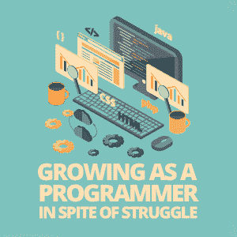
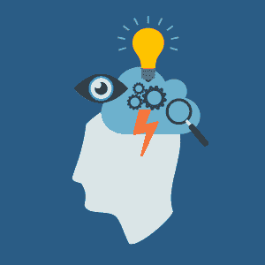

# 尽管奋斗，作为一名程序员成长

> 原文：<https://simpleprogrammer.com/growing-programmer-struggle/>

Most people try to hide away from pain and struggle. Instead of learning how to deal with it properly, they spend all the time in the world finding ways to avoid it.

意识到坚持不懈直到掌握它们是多么重要，这是程序员需要学习的一项关键技能，尤其是因为这是一个事物不断变化的领域。

你想成为一个普通人，每天大部分时间都在努力寻找解决问题的方法，而不是直面问题并克服它吗？我选择去克服这个问题，我希望读完这篇文章后你也会这样做。

今天，我在这里告诉你为什么[奋斗对你作为一名开发人员继续成长是重要的](http://www.amazon.com/exec/obidos/ASIN/B00G3L1B8K/makithecompsi-20),以及如何改变你的态度以便你能拥抱它！

## 什么是奋斗？

我们都听说过这样一句话，一个朋友正在为某事挣扎，或者完成这项任务是一场斗争。但是，这意味着什么呢？让我们澄清这一点，这样我们就可以确切地知道我们在这篇文章的其余部分谈论什么。

从 Google 定义服务中，我们得到以下内容:

奋斗:面对困难或阻力，努力实现或获得某物

或者

挣扎的:难以处理或应付的

它是当你面临一个严峻的挑战，你试图找到一种方法来克服它。如果你在到达另一边之前选择放弃或放弃斗争，你最终会失去你从斗争中获得的所有好处和成长。你只是想作弊。

在编程方面，你可能会遇到很多困难。当还没有太多关于一项新技术的文档时，你可能很难去学习它。如果你坚持不懈地学习大多数人不知道的东西，你最终会成为该专业领域最受欢迎的人之一。或者在你的工作中，当你面对一个想要在不可能的截止日期前完成某些事情的客户时。你如何与客户打交道，让他们明白完成一件事需要多少时间，这将决定你与该客户的未来。如果你成功地处理了这种情况，那么你现在就有了更好的沟通技巧，下次遇到类似的问题时，你可以带着这种技巧。

## 毅力是关键

当你在[与某事](http://www.amazon.com/exec/obidos/ASIN/B07BDBWN6V/makithecompsi-20)作斗争时，你正在尝试做你以前可能没有尝试过的事情，或者是你尝试过但放弃了的事情。当你放弃时，你不知道如何去做你想做的事情；相反，你现在的位置和你开始的时候是一样的。让我用一个例子来说明这一点:

约翰是一名程序员。他把所有的时间都花在了开发 iOS 应用程序上，而且他非常擅长自己的工作。最近，他公司的网页开发员离职另谋高就。现在他们需要有人来担任这个职位。

John 对 web 开发一无所知，但一直有学习的兴趣。所以他决定用自己的时间来学习，这样他就能得到这个职位。那天他下班回家，开始用服务器和客户端构建一个基本的 web 应用程序。他学习了一个教程，有了一个基本的 web 应用程序，并在第三天尝试构建自己的应用程序。

All is going well, til on Day Five he runs into a bug and his server will not start. He spends the next three days trying to solve the bug, but he decides web development is too hard for him, gives up, and sticks to iOS development.

约翰曾梦想成为一名 web 开发人员，但由于他在解决 bug 的斗争中放弃了，他将不会成为 web 开发人员。让我们改变这个例子的结尾，这样我们就可以看到如果他坚持下去，他会如何从这个场景中成长。

一切都很顺利，直到第五天，他遇到了一个错误，他的服务器无法启动。在接下来的九天里，他研究了服务器可能出现的所有问题，以便解决问题。他在 Stack Overflow 上发布了一个问题，并向老同事寻求帮助。在第九天，他终于发现他监听了错误的端口。他现在可以继续自学了。

在工作之余兼职做了三个月之后，他向经理展示了他的成就。他的经理喜欢他所做的事情，约翰现在一半时间都在做网站开发人员！

那么，这里的差异是什么呢？约翰能够继续解决他遇到的问题。又过了几天，他终于解决了问题，从错误中吸取了教训，可以继续学习了。

他决定不放弃。因为他没有放弃，他能够向前推进，成为他真正想成为的人:一名网络开发人员。

事实上，你选择斗争，让你变得更强大。当你进行斗争时，你正在为自己树立一个习惯[无论在什么情况下都不要放弃](https://simpleprogrammer.com/developers-guide-resilience/)。如果你在大多数人会放弃的场景下从不放弃，你就不会像大多数人一样。你将从斗争中获得新的教训。

## 从奋斗中成长的机会

在奋斗中成长不仅发生在你试图解决一个 bug 的时候(尽管这是编程中大量学习的地方)，也发生在生活中某些事情不容易发生的每一个时刻。

当你面临与家人或朋友的艰难时刻时，这可能是一个表明你真正关心他们并希望在你的生活中保持这些关系的时候，或者你可以表明你不希望他们出现在你的生活中。当你试图克服不安全感时，你可以让这种不安全感控制你的生活，或者通过努力克服它来面对恐惧。

挣扎出现在你面前的时候可能是你生命中的每一天，也可能很少。我喜欢奋斗；它们让我将某个领域的技能提升到一个新的水平。你必须改变心态，学会拥抱他们，而不是躲着他们。

## 改变你对斗争的心态

现在是最难的部分(哦，看，这是你第一次带着挣扎的考验！).你可能已经被告知要把奋斗当成你一生中的坏事，但是你必须学会找到一种方法把它们变成积极的事情。这并不容易，大多数人都做不到。

试着将奋斗视为学习的机会。当你在为某事奋斗时，你正在错过一些你还不知道的知识。你所缺失的知识来自于奋斗本身。如果你学会了将奋斗带向终点，你将会填补知识的空白。当我认为所有的希望都失去时，这句话总是帮助我度过生活中的斗争和战斗，提醒我每一次斗争都有好处:

****

**“每一次逆境、每一次失败、每一次心痛，都孕育着同等或更大益处的种子。”拿破仑·希尔**

重复这句话作为肯定会让你专注于这样一个事实:在每个问题中，都有一个更大的好处。如果你寻找那种好处，而不是对它抱有消极的心态，那么你会更有动力去克服它，并且知道如果你想更好地掌控它，从斗争中退缩不是一个选项。

## 努力奋斗吧！

现在是你采取行动的时候了。你明白不退缩并确保坚持下去直到问题被解决是多么重要。你知道你的心态需要改变，因为多年来的心理规划和思维让你相信奋斗是一件坏事。

作为程序员，从奋斗中成长应该是你日常工作的一部分。当你注意到一个问题时，你应该坚持下去，尽你所能解决这个问题，这样你才能从中吸取教训。这可能以多种形式出现，比如修复一个深层的错误，学习一项新技术，或者与同事和客户打交道。

今天是你做出改变的日子。走出去，开始[正面解决你的问题](https://simpleprogrammer.com/build-bulldog-mindset/)，看看从中你会成为一个多么强大的程序员、同事、朋友、家人和人类！