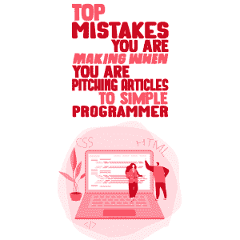
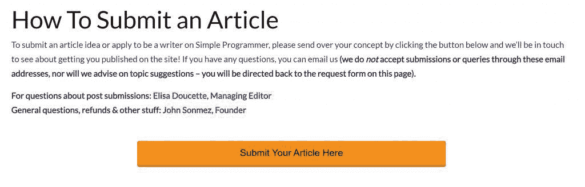

# 当你向简单的程序员推销文章时，你会犯的最大错误

> 原文：<https://simpleprogrammer.com/guest-posting-mistakes/>

Have you ever wanted to write a guest post for Simple Programmer?

就像我们的网站一样，它经常看起来很复杂，但实际上非常简单。

我们甚至有[一整页](http://www.simpleprogrammer.com/write-for-us)致力于帮助贡献者了解我们在寻找什么，以及他们如何向我们推荐他们的提交内容，包括我以前写的两篇文章，其中详细介绍了用简单的程序员发布客座博文的具体细节和过程(值得一提的是，还有我们互联网小角落之外的许多网站*。)*

即使有了所有这些信息，我的提交队列和收件箱的下降状态告诉我，给出所有的[操作方法](https://simpleprogrammer.com/simple-programmer-guest-post/)并积极地处理这些仍然不起作用。

所以今天，我将告诉你我们在简单的程序员提交队列中看到的最大错误，以及你如何避免犯这些错误——这样你的文章才能被发表！

## 简单程序员的提交批准率

这是从未真正改变过的事情，听起来可能有点吓人。

在 Simple Programmer，我们的编辑团队只批准了不到 35%的投稿。

听起来很可怕，是吧？

但也不尽然！

因为约翰在他的编辑内容上投入了太多，我们通常更愿意与一个没有为其他网站写作经验的投稿人合作，或者有一个想法但需要一些帮助来整合它。

大多数情况下，我们只需要看看这里的几样东西就能抓住机会:

*   **你*居然想给简单的程序员写*。**我不是在说“是啊，来自高领域权威网站的反向链接对我的品牌很有帮助”——我是说你有一个想法，你认为它会真正引起我们读者的共鸣，你很高兴能与我们合作出版它。
*   你*实际上遵循了*的指示。提交给我们审核并不是什么难事。在页面底部有一个巨大的橙色按钮，上面写着“在这里提交你的文章”，这确实是你应该提交文章的地方。
*   你*实际上想和我们*在 Simple Programmer 工作。我们的编辑流程不是拿一份半吊子的草稿，不经审核就发表。相反，我们会对你的文章进行几轮编辑。在我们的网站上有文章发表的指导方针。我们的大多数定期投稿人回来发表多篇文章，因为他们*喜欢*这种对他们写作技巧的磨练——和我们的编辑团队一起工作很愉快(尽管我们可能有点偏见！)

当人们犯了我将要分享的错误时，我们开始看到巨大的危险信号，并选择不继续某个作品或某个贡献者。

这将是非常简短和甜蜜的，因为当一个作家把自己放在那里等待认可时，我不喜欢纠缠于负面。这是一个有创造力的人所能经历的最糟糕的感觉之一，去展示自己，等待可能的拒绝。

没有人喜欢[拒绝](https://www.amazon.com/dp/B084GBBGHS/makithecompsi-20)。

老实说，我不喜欢被拒绝。这是做总编最糟糕的部分之一。

在我跳进这些人们在我们的提交队列中一次又一次犯的错误之前，让我非常明确地指出一点: **[我总是在寻找一个说是](https://simpleprogrammer.com/15952/)的理由。**

不幸的是，有些事情反而给了我说不的理由。

### 错误 1——你没有阅读指导方针和流程

你可以说这个让我最愤怒。

<article role="article" data-focusable="true" tabindex="0" class="css-1dbjc4n r-14lw9ot r-1ny4l3l r-1inuy60 r-1yt7n81 r-ry3cjt r-m611by r-o7ynqc r-6416eg" onmouseover="this.style.backgroundColor='rgb(245, 248, 258)'" onmouseout="this.style.backgroundColor='rgb(255,255,255)'">[Elisa Doucette@elisadoucette](https://twitter.com/elisadoucette?ref_src=twsrc%5Etfw%7Ctwcamp%5Etweetembed%7Ctwterm%5E1130512102387589120%7Ctwgr%5E%7Ctwcon%5Es1_&ref_url=https%3A%2F%2Fpublish.twitter.com%2F%3Fquery%3Dhttps3A2F2Ftwitter.com2Felisadoucette2Fstatus2F1130512102387589120widget%3DTweet)The editor's internal struggle: Want: WOULD YOU READ THE FUCKING DIRECTIONS & GUIDELINES I SENT YOU BEFORE REPLYING W MORE CANNED AND TEMPLATED SHIT?! Actual: Thanks for this. I suggest reading the directions and guidelines I sent carefully before submitting again. #amediting[12:34 AM · May 21, 2019](https://twitter.com/elisadoucette/status/1130512102387589120?ref_src=twsrc%5Etfw%7Ctwcamp%5Etweetembed%7Ctwterm%5E1130512102387589120%7Ctwgr%5E%7Ctwcon%5Es1_&ref_url=https%3A%2F%2Fpublish.twitter.com%2F%3Fquery%3Dhttps3A2F2Ftwitter.com2Felisadoucette2Fstatus2F1130512102387589120widget%3DTweet)[61](https://twitter.com/intent/like?ref_src=twsrc%5Etfw%7Ctwcamp%5Etweetembed%7Ctwterm%5E1130512102387589120%7Ctwgr%5E%7Ctwcon%5Es1_&ref_url=https%3A%2F%2Fpublish.twitter.com%2F%3Fquery%3Dhttps3A2F2Ftwitter.com2Felisadoucette2Fstatus2F1130512102387589120widget%3DTweet&tweet_id=1130512102387589120)[1](https://twitter.com/elisadoucette/status/1130512102387589120?ref_src=twsrc%5Etfw%7Ctwcamp%5Etweetembed%7Ctwterm%5E1130512102387589120%7Ctwgr%5E%7Ctwcon%5Es1_&ref_url=https%3A%2F%2Fpublish.twitter.com%2F%3Fquery%3Dhttps3A2F2Ftwitter.com2Felisadoucette2Fstatus2F1130512102387589120widget%3DTweet)</article>

我们让遵循一个过程变得愚蠢而简单，这与我们化繁为简的核心价值观非常一致。

阅读指导方针，遵循指示，给我们发电子邮件询问实际的合理问题。

这让我想到了第二个错误…

### 错误 2——不想浪费时间

你可能会惊讶地发现，我每天会收到多少封电子邮件，其中包含了“我能写些什么呢？”(在我把我们的指导方针寄出去之后。)

这很令人沮丧，因为我们的“为我们写作”页面中间有一个部分，用大号标题 2 字体写道，“你可以写些什么？”这一部分有 5 个一般主题，并附有解释和例子，说明我们正在寻找的具体内容。

现在，如果你对一件作品有一个彻底的和深思熟虑的想法，并且想知道你是否在正确的方向上前进或者应该调整，那么我很乐意帮助你找出最终提交的想法。

我明白了。你可能正试图获得尽可能多的反向链接和文章，所以在你被批准写作和/或发表之前，在一个项目上投入太多的努力确实是浪费你的时间。

令人震惊的是，和一个不愿意为作品付出任何努力的人来来回回真是浪费我的时间。

### 错误 3——标题不是推销

除了这一句简单的话，没什么可说的，它可能会改变你的整个投球过程。

我不能基于一个标题对一件作品做出严肃的评价。

基于一个陈述，一篇文章可以有太多的表达方式，我的设想和你要写的可能会有很大的不同。

用 2-3 个短句告诉我，你的文章将会是关于什么的，你将会分享什么信息。

再说一次，给我一个同意的理由。

### 错误 4——没有根据我们的观众量身定制你的推销

Though I get a lot of pitches about topics so completely unrelated to Simple Programmer’s general content that it is laughable at best (and a scathing commentary on the state of guest posts and backlink building in this day and age at worst), I’m not talking about irrelevant submissions.

那些被拒绝的人看都不看一眼。

相反，我说的是与我们的读者相邻但不直接面向我们的读者的内容。

广泛的职业和技术话题，你可以在任何关于职业和技术话题的网站上找到。

我们的读者来到 Simple Programmer 学习如何改善他们作为程序员和开发人员的生活和职业。

根据这个目标定制你的内容，然后我们可以谈谈。

### 错误 5——没有阅读或遵循说明

我在上面提到了这一点，但它经常没有做到，所以值得重复。

对于我们收到的关于为我们写作的冷冰冰的电子邮件和询问，我们会发送一个固定的回复，引导他们到我们的“为我们写作”页面。

尽管如此，我们仍会收到电子邮件，询问页面上已明确回答的问题。

或者发送完整的文章或广告，尽管页面底部有一个巨大的橙色按钮，上面写着“在此提交您的文章”

这就是为什么这是一个问题。

偶尔，我会收到这样的回复，大意是“哦，对不起，我没在页面上看到。我回去重读一遍，更仔细地跟踪你的过程。”

在这种情况下，酷豆。当提交的内容出现在我们的队列中时，我对贡献者没有任何苛刻的感觉或恶意。

我们都会犯错。

但是当我在电子邮件中收到 4-5 个问题，要求我为你做这项工作时，我可以告诉你这正是在这个出版过程中将要发生的事情。

你希望我们的编辑团队为你工作。

这是不可能的。

## 在 Simple Programmer 上发表的秘密(或者任何地方，真的！)

编辑和内容经理有很多事情要做。

但他们最重要的任务之一是确保内容按时发布。

为此，他们需要发布内容。

所以他们正在寻找一个说“是”的理由。

遵循他们的指导方针和提交流程。向他们推销一份经过深思熟虑的内容，为他们的读者量身定制并赢得他们的青睐。让他们的工作变得容易，向他们展示你是一个专家和专业人士，和你一起工作会很愉快。为你所做的事情感到骄傲，而不是玩数字游戏。

在我管理的所有网站和出版物中，我想不出超过六种情况，有人认真考虑了一个推销，我们不愿意与他们合作(或者如果这个推销只是我们不感兴趣的东西，就从不同的角度/主题与他们合作)。)

我们想对你提交给简单的程序员说是。

给我们一个理由。