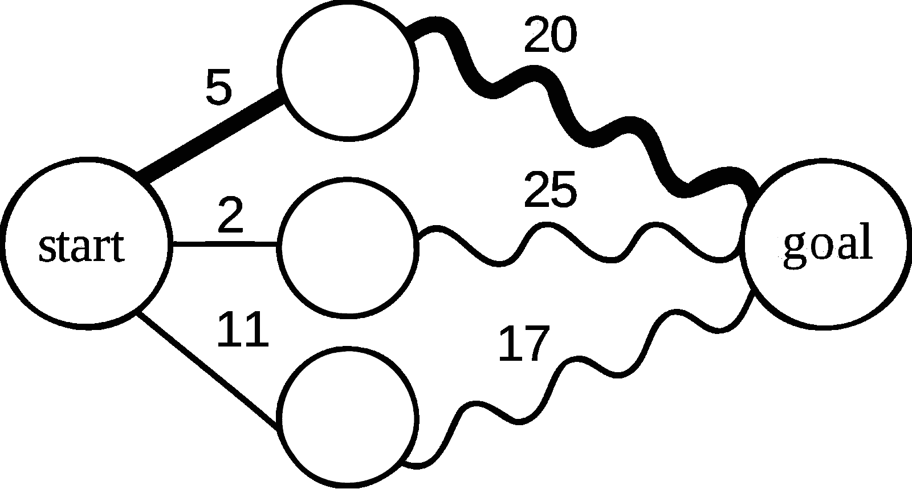
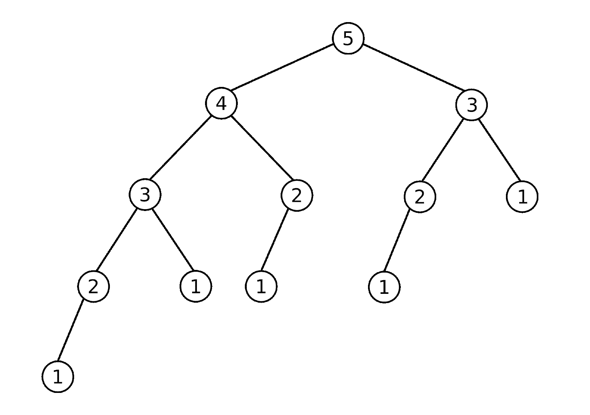
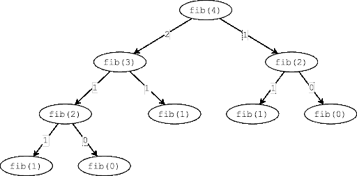
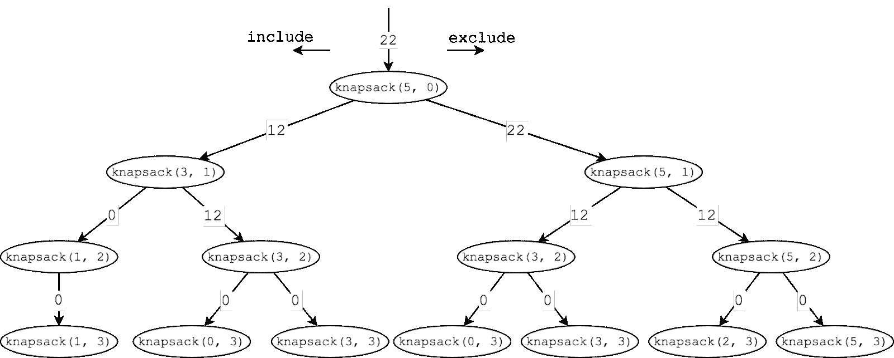

# 动态编程终极指南

> 原文：<https://simpleprogrammer.com/guide-dynamic-programming/>


Dynamic programming.

当你读到这个的时候，你有没有觉得有点发抖？

再想象一下那些令人毛骨悚然的鸡皮疙瘩信。

**动态编程。**

当我在[与我的学生一个字节一个字节地](http://dynamicprogrammingbook.com)交谈时，没有什么比动态编程更让他们害怕了。

我完全能理解为什么。动态编程(DP)既困难又违反直觉。我们大多数人通过在不同的问题中寻找模式来学习。但是对于动态编程，实际上很难找到相似之处。

即使这些问题都使用了相同的技术，它们看起来却完全不同。

但是，有一种方法可以理解动态编程问题并轻松解决它们。在这篇文章中，我将向你展示如何做到这一点。

## 什么是动态编程？

在我们进入如何解决动态编程问题的所有细节之前，关键是我们要回答最基本的问题:

什么是动态编程？

简而言之，动态编程是一种优化技术，我们可以用它来解决重复做同样工作的问题。你知道 web 服务器如何使用缓存吗？动态编程基本上就是这样。

然而，动态编程并不适用于所有问题。在很多情况下，动态编程根本不会帮助我们改善问题的运行时间。如果我们不做重复的工作，那么再多的缓存也没有用。

为了确定我们是否可以使用动态规划来优化一个问题，我们可以看看动态规划问题的两个形式标准。我马上会给你们一个快捷方式，让你们更快地识别这些问题。

先说形式定义。

如果一个问题满足以下条件，则可以使用动态规划对其进行优化:

1.  有一个最优的子结构。
2.  有重叠的子问题。

如果一个问题满足这两个标准，那么我们知道它可以使用动态编程来优化。

### 最优子结构

最优子结构不仅是动态规划问题的核心性质，也是一般递归的核心性质。如果一个问题可以递归地解决，那么它很可能有一个最优的子结构。

最优子结构仅仅意味着你可以通过考虑子问题的最优解来找到问题的最优解。

例如，如果我们在图中寻找最短路径，知道到终点的部分路径(下图中粗的曲线)，我们可以计算从起点到终点的最短路径，而不知道任何关于曲线路径的细节。



没有最佳子结构的问题的例子是什么？

考虑寻找两个机场之间最便宜的航班。据[维基百科](https://en.wikipedia.org/wiki/Optimal_substructure):

“使用在线航班搜索，我们会经常发现从机场 A 到机场 B 的最便宜的航班涉及通过机场 C 的单个连接，但是从机场 A 到机场 C 的最便宜的航班涉及通过其他机场 d 的连接。”

虽然这里有一些细微差别，但我们通常可以假设我们递归解决的任何问题都有一个最佳的子结构。

### 重叠子问题

[重叠子问题](https://en.wikipedia.org/wiki/Overlapping_subproblems)是我们的问题必须具有的第二个关键属性，它允许我们使用动态编程进行优化。简单地说，有重叠的子问题意味着我们不止一次地计算同一个问题。

假设您有一个缓存图像的服务器。如果同一个图像被反复请求，你将节省大量的时间。然而，如果没有人不止一次地请求同一个图像，那么缓存它们有什么好处呢？

这正是这里发生的事情。如果我们没有重叠的子问题，没有什么可以阻止我们缓存值。它实际上根本不会改进我们的运行时。它只会给我们创造更多的工作。

作为重叠子问题的例子，考虑斐波那契问题。下面是计算第五个斐波纳契数所需的所有递归调用的树:



注意我们如何在树中看到重复的值。数字 3 重复两次，2 重复三次，1 重复五次。每一次重复都是一个重叠的子问题。我们没有必要多次计算这些子问题，因为值不会改变。如果我们缓存它，我们可以节省很多工作。

### 什么时候应该使用动态编程？

为了绝对确定我们可以使用[动态规划](https://simpleprogrammer.com/get/dynamicprogramming)解决问题，测试最优子结构和重叠子问题是至关重要的。没有这些，我们就不能使用动态编程。

然而，我们可以使用试探法相当准确地猜测我们是否应该考虑使用 DP。这个简单的问题可以节省我们大量的时间。

我们要问的只是:这个问题可以通过解一个组合问题来解决吗？

[https://www.youtube.com/embed/qyu4q3-glLU](https://www.youtube.com/embed/qyu4q3-glLU)

考虑几个例子:

*   [找出兑换一定数量零钱所需的最少硬币数](https://www.byte-by-byte.com/smallestchange/)。看看所有硬币的组合加起来的总数，并数出最少的数字。
*   [找到你背包中最值钱的物品](https://www.byte-by-byte.com/01knapsack/)。找出项目的所有组合，并确定最高值的组合。
*   [找出通往楼梯顶端的不同路径的数量](https://leetcode.com/problems/climbing-stairs/)。列举所有步骤的组合。

虽然这种启发式方法并不能解释所有的动态编程问题，但它确实给了你一种快速的方法来彻底检查一个问题，并决定你是否想要深入研究。

## 使用快速方法解决任何 DP 问题

在看到我的许多学生一个字节接一个字节地与动态编程做斗争之后，我意识到我们必须做点什么。必须有一个让这些学生遵循的系统，帮助他们在没有压力的情况下持续解决这些问题。

正是这个任务催生了快速方法。

快速方法是一种在过去几年中被开发和测试的技术。当我写这篇文章的时候，我们的 8000 多名学生已经下载了我们的免费电子书，并使用快速方法学习掌握动态编程。

那么它是如何工作的呢？

FAST 是首字母缩写词，代表找到第一个解决方案， **A** 分析解决方案，识别**S**u b 问题，然后 **T** 返回解决方案。让我们来分解这些步骤。

### 找到第一个解决方案

使用 FAST 方法解决任何动态规划问题的第一步是找到初始的强力递归解。

你第一步的目标是在不考虑效率的情况下解决问题。我们只想在白板上写下解决方案。这给了我们一个起点(我已经更详细地讨论过这个问题[这里](https://www.byte-by-byte.com/brute-force/))。

对于这种强力解决方案的外观有一些限制:

*   **每个递归调用必须是自包含的**。如果你通过更新一些全局变量来存储你的结果，那么我们就不可能有效地使用任何类型的缓存。我们希望得到一个完全依赖于函数输入而不受任何外部因素影响的结果。
*   **删除不必要的变量。传递给递归函数的变量越少越好。我们将根据函数的输入保存缓存的值，所以如果我们有无关的变量，这将是一个痛苦。**

让我们考虑两个例子。我们将使用这些例子来演示过程中的每一步。

**例 1:**

我们要研究的第一个问题是斐波那契问题。在这个问题中，我们想简单地识别第 n 个斐波那契数。递归地，我们可以这样做:

```
 // Compute the nth Fibonacci number
// We assume that n >= 0 and that int is sufficient to hold the result
int fib(int n) {
if (n == 0) return 0;
if (n == 1) return 1;
return fib(n-1) + fib(n-2);
} 
```

这里需要注意的是`fib(n)`的每个结果是如何 100%依赖于“n”的值的。我们必须小心地以这种方式编写我们的函数。例如，虽然下面的代码可以工作，但是它不允许我们做 DP。

```
 // Compute the nth Fibonacci number
// We assume that n >= 0 and that int is sufficient to hold the result
int fib(int n) {
int result = 0;
fibInner(n, &result);
return result;
}
void fibInner(int n, int *result) {
*result += n;
if (n == 0 || n == 1) return;
fibInner(n-1, result);
fibInner(n-2, result);
} 
```

虽然这看起来像是一个玩具示例，但是理解其中的区别非常重要。这个函数的第二个版本依赖于`result`来计算函数的结果，而`result`的作用域在`fibInner()`函数之外。

你可以在这里了解更多不同之处。

**例 2:**

我们要看的第二个问题是最流行的动态规划问题之一:0-1 背包问题。对于这个问题，我们给出了一个有重量和值的物品列表，以及最大允许重量。我们想确定在不超过最大重量的情况下可以获得的最大值。

下面是我们的强力递归代码:

```
 public class Item {
int weight;
int value;
}
class Item {
int weight;
int value;
}
// Brute force solution
int bruteForceKnapsack(Item[] items, int W) {
return bruteForceKnapsack(items, W, 0);
}
// Overloaded recursive function
int bruteForceKnapsack(Item[] items, int W, int i) {
// If we've gone through all the items, return
if (i == items.length) return 0;
// If the item is too big to fill the remaining space, skip it
if (W - items[i].weight < 0) return bruteForceKnapsack(items, W, i+1); 
// Find the maximum of including and not including the current item
return Math.max(bruteForceKnapsack(items, W - items[i].weight, i+1)
+ items[i].value,
bruteForceKnapsack(items, W, i+1));
}
```

有了这些强力解决方案，我们就可以进入快速方法的下一步了。

注意:我发现很多人觉得这一步很难。这是一个太大的话题，无法在这里涵盖，所以如果你在递归方面有困难，我推荐你看看[这个关于字节的怪物帖子](https://www.byte-by-byte.com/recursion/)。

### 分析第一个解决方案

现在我们有了强力解决方案，快速方法的下一步是分析解决方案。在这一步，我们正在查看我们的解决方案的运行时，看看是否值得尝试使用动态编程，然后考虑我们是否可以使用它来解决这个问题。

我们将从我们问题的时间和空间复杂性开始，然后直接分析我们是否有最优的子结构和重叠的子问题。请记住，这些是我们使用动态编程所必需的。

让我们回到斐波那契的例子。

**例 1(斐波那契):**

对于这个问题，我们的代码很简单，但是不幸的是我们的时间复杂度很糟糕。了解代码中发生了什么的最简单的方法是画出递归树。这是`fib(4)`的树:



我们立即注意到，这里我们基本上得到了一棵高度为`n`的树。是的，有些分支有点短，但是我们大的 Oh 复杂度是一个上限。因此，为了计算时间复杂度，我们可以简单地估计树中节点的数量。

对于任何一棵树，我们可以将节点数估计为`branching_factorheight`，其中分支因子是树中任何一个节点拥有的最大子节点数。这给了我们一个非常糟糕的运行时间`O(2n)`。

所以如果我们能优化这段代码就好了，如果我们有最优的子结构和重叠的子问题，我们就能做到。

在这种情况下，我们有一个递归的解决方案，可以保证我们有一个最优的子结构。我们通过解决它的一些子问题来解决这个问题。

我们还可以从树形图中清楚地看到，我们有重叠的子问题。注意到`fib(2)`被叫了两次了吗？这是一个重叠的子问题。如果我们画一棵更大的树，我们会发现更多重叠的子问题。

假设我们已经发现这个解决方案具有指数运行时间，并且它满足动态编程的要求，那么这个问题显然是我们要优化的主要候选问题。

**例 2 (0-1 背包):**

这个问题的代码有点复杂，所以把它画出来变得更加重要。当我们勾画出一个例子时，它让我们对正在发生的事情更加清晰([参见我勾画解决方案的过程](https://www.byte-by-byte.com/recursion/#section3))。

对于以下输入，我们的树可能是这样的:

```
 Items = {(w:2, v:6), (w:2, v:10), (w:3, v:12)}

maxWeight = 5 
```



*注意，在这个图表中，传递给函数的两个值是最大权重和项目列表中的当前索引。*

画完我们的树，让我们从时间复杂度开始。类似于我们的斐波那契问题，我们看到我们有一个递归调用的分支树，其中我们的分支因子是 2。这给了我们一个时间复杂度`O(2n)`。

我们有最优子结构吗？没错。同样，递归基本上告诉了我们在这个计数上需要知道的一切。

和重叠子问题？既然我们已经画出了草图，我们可以看到`knapsack(3, 2)`被调用了两次，这显然是一个重叠的子问题。

这看起来也是 DP 的一个很好的候选。

### 识别子问题

快速方法的第三步是识别我们正在解决的子问题。这就是我们真正开始优化代码的地方。

我们将从用简单的英语定义我们的子问题开始。我总是震惊于有多少人会写递归代码，但并不真正理解他们的代码在做什么。理解至关重要。

一旦我们理解了子问题，我们就可以实现一个缓存，它将**记忆**我们子问题的结果，给我们一个**自顶向下**的动态编程解决方案。

记忆只是缓存结果的策略。我们可以使用数组或映射来保存我们已经计算过的值，以便于以后查找。

我们称之为自顶向下的动态编程解决方案，因为我们是递归地解决它。本质上，我们从“顶部”开始，递归地将问题分解成越来越小的块。这与**自下而上**或**列表式**动态编程相反，我们将在 FAST 方法的最后一步看到。

**例 1(斐波那契):**

那么我们的子问题是什么呢？这个问题很容易理解，因为`fib(n)`就是第 n 个斐波那契数。因为我们的结果只依赖于一个变量，`n`，所以我们很容易记住这个变量。

考虑下面的代码。通过添加一个简单的数组，我们可以记住我们的结果。请注意这段代码和我们上面的代码之间的区别:

```
// Top-down dynamic solution
int topDownFib(int n) {
int[] dp = new int[n+1];
return topDownFib(n, dp);
}
// Overloaded private method
int topDownFib(int n, int[] dp) {
if (n == 0 || n == 1) return n;
// If value is not set in cache, compute it
if (dp[n] == 0) {
dp[n] = topDownFib(n-1, dp) + topDownFib(n-2, dp);
}
return dp[n];
} 
```

看看我们实际上需要改变的有多少？一旦我们理解了我们的子问题，我们就确切地知道我们需要缓存什么值。

现在我们有了自顶向下的解决方案，我们也想看看复杂性。在这种情况下，我们的代码已经降低到了`O(n)`时间复杂度。我们可以很容易地看到这一点，因为我们的`dp`数组中的每个值都被计算一次，然后被引用一定的次数。这比我们之前的指数解要好得多。

**例 2 (0-1 背包):**

这个问题开始展示真正理解我们正在解决的子问题的力量。具体来说，`knapsack()`不仅接受一个权重，还接受一个指数作为参数。所以如果你调用`knapsack(4, 2)`，那实际上是什么意思？我们期望的结果是什么？如果你看一下代码，我们可以用简单的英语来定义这个函数:

这里，“`knapsack(maxWeight, index)`返回仅考虑从索引到项目列表末尾的项目时，我们在当前权重下可以生成的最大值。”

有了这个定义，我们可以很容易地重写函数来缓存结果(在下一节中，这些定义将变得非常有价值):

```
 // Top-down dynamic solution
int topDownKnapsackArray(Item[] items, int W) {
int[][] dp = new int[items.length][W + 1];
for (int i = 0; i < dp.length; i++) {
for (int j = 0; j < dp[0].length; j++) {
dp[i][j] = -1;
}
}
return topDownKnapsackArray(items, W, 0, dp);
}
// Overloaded recursive function
int topDownKnapsackArray(Item[] items, int W, int i, int[][] dp) {
if (i == items.length) return 0;
if (dp[i][W] == -1) {
dp[i][W] = topDownKnapsackArray(items, W, i+1, dp);
if (W - items[i].weight >= 0) {
int include = topDownKnapsackArray(items, W-items[i].weight, i+1, dp) + items[i].value;
dp[i][W] = Math.max(dp[i][W], include);
}
}
return dp[i][W];

} 
```

同样，我们可以看到只需要对我们的原始代码做很少的修改。我们所做的只是添加一个缓存，我们在计算任何函数之前检查它。如果缓存中的值已经设置，那么我们可以返回该值，而无需重新计算。

就这里的时间复杂度而言，我们可以转向缓存的大小。缓存中的每个值最多计算一次，因此我们的复杂度为`O(n*W)`。

### 扭转解决方案

快速方法的最后一步是采用我们的自顶向下的解决方案，并将其“扭转”为自底向上的解决方案。这是一个可选的步骤，因为自顶向下和自底向上的解决方案在复杂性方面是相同的。然而，许多人更喜欢自底向上，因为迭代代码往往比递归代码运行得更快。

这一步，我们基本上是要颠倒我们自顶向下的解决方案。我们将从最小的子问题开始，然后建立越来越大的子问题，直到我们达到目标，而不是从目标开始，并把它分解成更小的子问题。这就是上一步中的定义派上用场的地方。

**例 1(斐波那契):**

首先，让我们回忆一下我们的子问题:`fib(n)`是第 n 个斐波那契数。

记住，我们首先要计算子问题的最小版本。这将是我们的基本情况，或者在这种情况下，`n = 0`和`n = 1`。

一旦我们有了这些，我们就可以计算下一个最大的子问题。为了得到`fib(2)`，我们只看已经计算过的子问题。一旦计算出来，我们就可以计算`fib(3)`等等。

那么我们该如何编写代码呢？好了，我们的缓存将看起来与上一步中的一样；我们将从最小的子问题到最大的子问题来填充它，我们可以迭代地完成。

```
 // Bottom-up dynamic solution
int bottomUpFib(int n) {
if (n == 0) return 0;
// Initialize cache
int[] dp = new int[n+1];
dp[1] = 1;

// Fill cache iteratively
for (int i = 2; i <= n; i++) {
dp[i] = dp[i-1] + dp[i-2];
}

return dp[n];

} 
```

简易柠檬榨汁机。

这种自底向上解决方案的另一个好处是计算时间复杂度非常容易。与递归不同，使用基本的迭代代码很容易看出发生了什么。

这就是全部了。关于这个问题(以及其他一些 DP 问题)的一个注意事项是，我们可以[进一步优化空间复杂度](https://www.byte-by-byte.com/01knapsack/)，但这超出了本文的范围。

**例 2 (0-1 背包):**

随着有点成为趋势，这个问题就困难多了。然而，现在您已经拥有了自下而上解决背包问题所需的所有工具。

回想一下我们的子问题定义:“`knapsack(maxWeight, index)`返回在当前权重下，仅考虑从索引到项目列表末尾的项目，我们可以生成的最大值。”

为了使我们自下而上的目的变得简单一点，我们可以颠倒定义，这样我们的子问题就可以求解数组，直到(但不包括)索引，而不是从索引到数组的末尾。

有了这个，我们就可以开始填充我们的基本案例了。我们将从初始化我们的`dp`数组开始。当最大权重为 0 时，`knapsack(0, index)`必须为 0。回到我们的子问题定义，这是有意义的。如果权重为 0，那么我们不能包含任何项目，因此值必须为 0。

如果 index 为 0，情况也是如此。因为我们将我们的子问题定义为直到但不包括指数的所有项目的值，如果指数为 0，我们也包括 0 个项目，其值为 0。

从那里，我们可以迭代计算更大的子问题，最终达到我们的目标:

```
 // Bottom-up dynamic solution.
int bottomUpKnapsack(Item[] items, int W) {
if (items.length == 0 || W == 0) return 0;
// Initialize cache
int[][] dp = new int[items.length + 1][W + 1];
// For each item and weight, compute the max value of the items up to
// that item that doesn't go over W weight
for (int i = 1; i < dp.length; i++) {
for (int j = 0; j < dp[0].length; j++) {
if (items[i-1].weight > j) {
dp[i][j] = dp[i-1][j];
} else {
int include = dp[i-1][j-items[i-1].weight] + items[i-1].value;
dp[i][j] = Math.max(dp[i-1][j], include);
}

}

}

return dp[items.length][W];

} 
```

同样，一旦我们自底向上解决了我们的解决方案，时间复杂度变得非常容易，因为我们有一个简单的嵌套的`for`循环。

## 动态编程不一定很难！

虽然动态编程似乎是一个可怕的、违反直觉的话题，但事实并非如此。通过将结构应用到你的解决方案中，比如用快速方法，有可能以系统的方式解决这些问题。

面试官喜欢测试候选人的动态编程，因为这被认为是一个很难的话题，但没有必要紧张。按照步骤来做，你会做得很好。

如果你想了解更多的快速方法，可以看看我的免费电子书， *[面试动态编程](https://www.byte-by-byte.com/dpbook/)。*