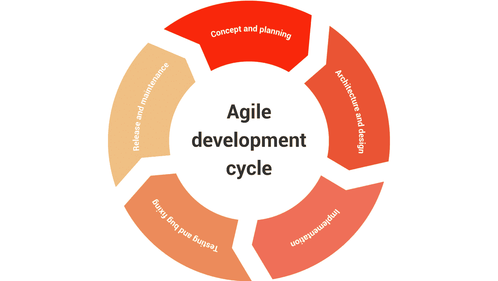

# 保护 SDLC 的完整开发人员指南

> 原文：<https://simpleprogrammer.com/guide-secure-software/>

软件开发生命周期是帮助开发人员以有组织的方式计划和创建软件的一系列步骤。它有六个主要步骤:

每一步都有需要解决的安全问题。未能解决这些问题会导致应用程序充满错误，一旦被利用，会导致停机、收入损失以及客户信息被盗。

这是一个极其普遍的问题，排名前 100 的移动应用[中有 90%报告](https://www.helpnetsecurity.com/2012/08/20/92-of-the-top-100-mobile-apps-have-been-hacked/)至少被黑客攻击过一次。防止这些问题的最好机会是在应用程序的开发过程中，这正是我在这篇文章中分享的技巧可以帮助你的地方。

本指南介绍了生命周期中的每一个步骤，并强调了为确保安全应用程序而应该完成的安全实践/操作。这包括行业工具、技术和资源，您可以使用它们来确保您的应用程序在流程结束时是安全的。

## 概念和规划

这个阶段是关于定义应用程序的概念和需求。换句话说，重要的是要确保你对需要做的事情有一个明确的轮廓，并且你对如何去完成它有一个高层次的理解。

**概述安全性和合规性要求:**概述您的应用程序的技术和法规要求。对于技术要求，这将包括确保你对存储中的数据和传输中的数据进行适当的 T2 加密。

术语“监管要求”指的是理解软件将存储和传输的数据类型——例如，财务信息、[支付](https://www.securitymadesimple.org/cybersecurity-blog/how-to-be-pci-dss-compliant)卡信息、[医疗](https://www.securitymadesimple.org/cybersecurity-blog/introduction-to-hipaa-compliance)以及个人身份信息。

每种类型的数据都有关于如何处理、收集、存储和传输的特定法规。因此，你需要知道你在收集什么信息，以及需要如何处理这些信息。

安全意识培训:如果你在一个开发团队中工作，你应该有时间检查安全需求。

如果你是经理或团队领导，你有责任组织这件事。如果你只是一个开发人员，这是你应该向你的团队领导提出的要求。这确保您和团队中的每个人都理解应用程序的需求。

**回顾第三方软件组件:**第三方组件通常用于提高开发软件的速度和添加有用的功能。但是，它们会在您的软件中引入漏洞，在您的应用程序中使用这些组件之前，需要对这些漏洞进行评估。

您可以通过对您正在使用的库进行一些研究来开始这一评估，这将允许您查看已经报告了哪些问题。对于更正式的验证，像 veracode 这样的公司有在线指南以及评估第三方软件安全问题的软件解决方案。

## 建筑和设计

The architecture and design phase is about designing an application that meets all of the requirements set out in the planning phase in detail.

**威胁建模:**这是了解您的应用程序可能遭受的攻击场景，并提出防止它们得逞的控制措施。一个常见的例子是 SQL 注入，它将一个 SQL 查询提交到一个输入表单中，以便从数据库中提取数据。

**确保安全设计:**您希望检查您的应用程序的设计是否符合软件开发中常见的最佳实践，例如增加对敏感信息的保护并确保合规性。[在这里](https://www.bcs.org/content-hub/10-best-practices-for-secure-software-development/)你可以找到软件开发的 10 个最佳实践。

## 履行

实现是创建应用程序、调试和创建将被测试的应用程序的第一个版本的过程。这个阶段的目标是创建一个稳定的应用程序。

**使用安全编码指南:**这些[指南](https://simpleprogrammer.com/5-security-concepts/)会警告你程序员常犯的错误，让你避免这些错误，为自己节省大量时间。一些常见的错误包括存储未加密的密码。[在这里](https://wiki.sei.cmu.edu/confluence/display/seccode/Top+10+Secure+Coding+Practices)你可以找到 CERT 提供的十大安全编码实践的完整列表。

**静态扫描:**静态应用程序扫描工具(SAST)可以扫描新编写的代码中的漏洞，而无需运行应用程序。您可以在编写代码时使用它们来检查 bug，并在第一个版本之前纠正它们。[这里](https://www.g2.com/categories/static-application-security-testing-sast)是你可以考虑在你的软件中使用的六个 SAST 工具。

**手动代码审查:**在完成应用程序的第一个版本后，应该有一个对软件开发中的安全缺陷非常了解的高级开发人员来进行手动代码审查。自动化工具要快得多，但是它们仍然会遗漏一些重要的问题，所以执行手动审查仍然非常有益。

## 测试和错误修复

这个阶段的目的是发现并修复工作应用程序中的错误。这个阶段包括运行应用程序和使用不同类型的输入来观察应用程序如何响应。

**模糊化和动态扫描:**动态应用扫描工具(DAST)通过在运行时模拟攻击来测试漏洞。模糊化涉及使用自动化工具根据特定模式生成随机输入，以检查应用程序是否能够正确处理它们。[在这里](https://www.g2.com/categories/dynamic-application-security-testing-dast)你可以找到一些流行的 DAST 工具列表。

**渗透测试:**渗透测试包括雇佣专业的安全研究人员来尝试侵入你的应用程序，以便找到任何能够深入你的应用程序的漏洞。你可以雇佣单独的公司/团队，或者你可以使用一个 bug 赏金计划来[众包](https://simpleprogrammer.com/crowdsourcing-security-with-bug-bounties/)这一步。

**测试环境停用:**一旦不再需要某个测试环境，如果它是一个虚拟机，就应该将其脱机或删除。通常，这由开发人员或 IT 团队监督。

测试环境访问互联网以允许开发人员进行连接和工作是很常见的。然而，有时系统甚至在项目完成后仍保持在线。

因为该环境没有被任何人使用，所以它将保持不被修补。由于面向互联网，可以理解，它将成为黑客的一个大的容易攻击的目标。

## 发布和维护

这是应用程序向其目标用户发布的阶段。尽管应用程序是活动的，但这并不意味着工作已经完成。该应用程序需要在其生命周期中进行维护和改进，可能的错误也需要修复。

**持续的安全检查和补丁:**安全检查应由公司的安全团队或独立供应商定期执行。接下来，只要发现安全问题，就需要创建和发布补丁。

这些检查不需要无限期地进行，但应该在应用发布后至少持续几年。此外，在您计划停止支持应用程序之前，应该向用户发出一份声明。

## 寿命终止

生命周期结束是指软件不再受其开发者的支持。这意味着将不再提供补丁、更新或错误修复。包含敏感数据的应用程序也需要删除敏感数据，以防止由于旧的、不安全的应用程序而导致数据泄露。任何没有更新安全相关缺陷的应用程序都不应该被认为是安全的。

**数据保留:**政府和监管机构为不同类型的数据定义了保留要求。确认您的保留要求非常重要，并确保在丢弃应用程序之前适当地存储数据。

**数据处理:**在应用程序的生命周期结束时，应安全删除所有敏感信息，包括所有个人信息、加密密钥或 API 访问密钥。这里的目的是确保所有信息保密，防止数据泄露。[这里](https://www.informationsecuritybuzz.com/articles/8-tips-securely-dispose-end-life-data-assets/)是一些关于正确处理数据的提示。

## 为最好的产品修复每个阶段的安全问题

The software development life cycle is a widely popular template and each step has its own requirements that need to be completed to ensure a secure application.

app store 中超过 90%的顶级应用程序至少被黑客攻击过一次，这表明当前开发应用程序的过程不是很安全。在本指南中，我为您提供了与开发周期的每个步骤相关的活动的安全提示。遵循这些提示，您可以确保您的应用程序不太可能出现安全问题。

首先，在规划阶段，目标是根据技术和法规要求正确规划您的应用程序。接下来，您希望基于[安全](https://www.amazon.ca/Building-Secure-Software-Security-paperback/dp/0321774957)最佳实践来设计您的应用程序。您还需要实现适当的手动和自动测试，并让主题专家审查您的应用程序。如果您缺乏内部专业知识或资金来雇佣安全专业人员进行测试，您可以使用 bug bounty [程序](https://www.securitymadesimple.org/cybersecurity-blog/what-is-a-bug-bounty-program)这种经济有效的方法。

一旦应用程序发布，就需要定期检查和修补，因为会发现新的 bug。当它的生命结束时，您需要保留的信息必须得到保护，所有剩余的信息都需要处理掉，以防止数据泄露。