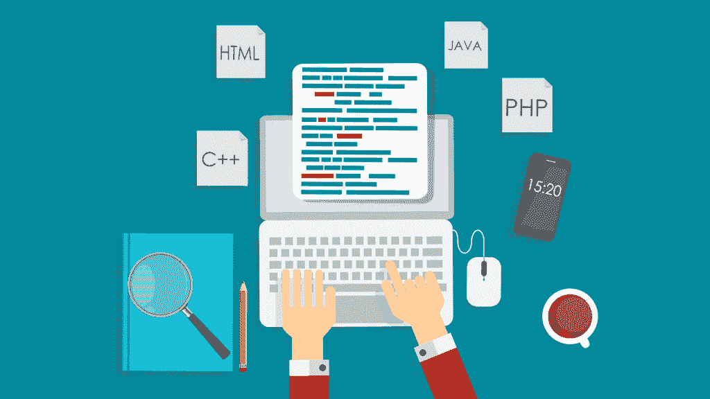
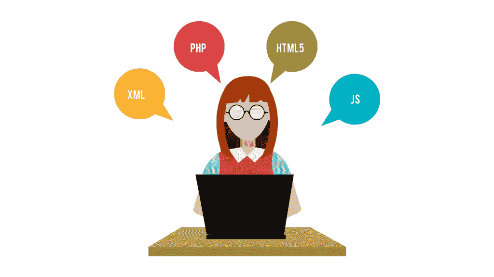
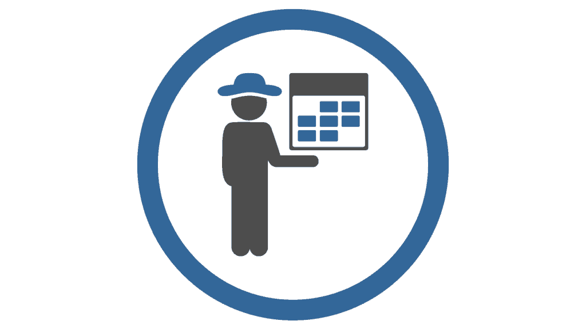

# 黑客马拉松是为了娱乐和利益(但主要是利益)

> 原文：<https://simpleprogrammer.com/hackathons/>

如果你能在两三天内扩大你的人脉，获得工作机会，推广你的项目并学到很多东西，这不是很棒吗？

不要再看了！

有这么一个东西，叫做[黑客马拉松](https://en.wikipedia.org/wiki/Hackathon)。

在过去的三年里，我参加了几个，拿走了大部分的奖项，甚至帮助组织了一个。当你做好准备并有正确的心态时，黑客马拉松会是一次令人惊奇的经历。

我在这里帮助你充分利用你参加的每一个活动！

## 黑客马拉松到底是什么？

“…计算机程序员和其他参与软件开发的人，包括图形设计师、界面设计师和项目经理，在软件项目上紧密协作的事件。”

这是无聊的维基百科的定义。通俗地说:黑客马拉松是一项活动，开发者通常在一个周末从事一个项目，然后他们将他们的项目提交给预先确定的评委，选出获胜者。大部分的黑客马拉松都是面向团队的，这不是一个单人游戏。

### 没有严格的格式，也没有严格的规则。

通常的情况是 2-3 天，从周五晚上到周日下午。通常在黑客马拉松之前，你不允许在你的项目上做开发工作。

有奖励，尽管金钱上的收益通常不会吸引人们；相反，乐趣和竞争精神是吸引他们的原因。黑客马拉松的组织者在周末负责食物和饮料。

在大多数情况下，你可以留下来通宵工作。有一个应该遵循的主题(例如，物联网、视频游戏等等),虽然不是强制的，但是强烈建议遵循这个主题。

上面的场景是我的首选设置。大家都在一个地方，可以不间断的工作，不用管吃的喝的。

还有其他几种格式值得讨论:

*   **在线黑客马拉松**:你可以在自己舒适的家中参加，通过流媒体或视频展示，你还可以自己买披萨。
*   单赞助商黑客马拉松由一家公司组织或支付费用。这里的区别是，通常黑客马拉松的主题是使用公司已经开发或积极参与的产品。在幕后，这通常是参与者的一次大型面试，最好的团队会获得丰厚的工作机会。对于这些黑客马拉松，通常每个团队有 2-3 个人的限制。(就我个人而言，我不喜欢这种类型的黑客马拉松，因为我觉得一个可能的雇主不值得我花 30-40 个小时的空闲时间，但话说回来，奖金通常都很大。)
*   马拉松黑客马拉松持续时间非常长。从一周到一个月不等。如果你正在寻找好的项目来充实投资组合，这些黑客马拉松是一个很好的选择。如果你每天都工作，那就有足够的时间让项目有一个像样的版本，可以向未来的雇主炫耀。

当我阅读一些文章，看看其他博客爱好者对黑客马拉松有什么看法时，我遇到了不少不开心的人。他们的批评范围广泛，从:

他们提倡不健康的生活方式

到

“它们是给没有生活的人准备的。”

我个人最喜欢的是:

**“最好的项目不会赢。”**

让我们逐一剖析这些:

*   **“他们提倡不健康的生活方式”**——如果你生活健康，无论你身在何处，你都会找到健康饮食和锻炼身体的方法。在这段时间里，你不会被束缚在一个小隔间或其他什么地方。事实上，大多数黑客马拉松都提供熟食。
*   **“他们是为没有生活的人准备的”**——因为和与你有共同兴趣的人在一起，结交新朋友，是为失败者准备的。正确
*   **“最好的项目不会赢”**——这是事实。一个令人惊叹的演示和一个创新的想法通常会赢得一个技术更先进或更完整的项目。接受这一点，把它变成优势，而不是负担。

如果你没有准备好或者心态不好，黑客马拉松会很糟糕。

所以让我们看看如何准备自己！

## 你如何最大限度地利用黑客马拉松？

### 对于你想要完成的事情，你必须有明确的目标。

第一步是明确你的期望。否则你可能会失去自己的时间，这很可怕，因为大多数黑客马拉松都是在周末(也就是一周中最好的时间，也就是你的空闲时间)举行的。

还有三个更常见的选项。您可以:

*   参与竞争——全力以赴，展示你目前的能力
*   参加以增强你的人际网络——因为当你需要的时候，很少有足够的人来完成一个项目
*   专心学习——黑客马拉松为快速学习提供了一个良好的环境，所以不妨利用它

### 没有团队？没问题。

假设你没有团队，但你想参加黑客马拉松。

一旦你决定参加活动，就开始和其他参与者交流。与会者名单总是公开的，所以给尽可能多的人发一封电子邮件。如果很多与会者没有回复你的邮件，不要气馁，因为你只需要一个团队。

此外，你不认识的人也不了解你。他们不欠你任何东西，甚至是回复你邮件的礼貌(假设它没有被过滤为垃圾邮件)。

即使在黑客马拉松开始前你还没有找到团队，你也应该去。大多数黑客马拉松会让你在头几个小时加入一个团队，或者组建一个新团队。

除非规则明确规定你不能在黑客马拉松上组队，否则不要排除这个可能性。

### 所以，你很有竞争力，你想赢？

好吧，让我们看看如何增加你的机会。

对许多人来说，最大的震惊是演示文稿和你展示的东西比你实际编码的东西更有价值。

法官不会关心你的单元测试、自动化构建或者详细的配置。如果你想在黑客马拉松后继续从事这个项目，或者如果你想把它放在你的简历中，你仍然应该做所有这些事情，但评委不会太在意。

为了增加你获胜的机会，你应该有一些**闪亮的东西展示给**和一个**优秀的主持人**。

我不能帮助你提高你的表达技巧(那是另一篇文章)，但我可以告诉你，假装做爱(或实际上做爱)似乎会让你处于上半部分。

我能帮上什么忙，你就展示什么。闪亮的东西意味着有用，或者至少看起来有用。如果你已经在某个地方部署了你的软件，或者你给了评委一个平板电脑/笔记本电脑，让他们测试一下，你会得到很多分。

*你的目标*应该是展示一个演示。*你可以准备*，找一个好的演示者，想一些有趣的方式来展示你的项目。

在一些黑客马拉松中，评委或赞助商会来拜访团队，了解这些人和项目。如果你参加的黑客马拉松是这样的，你应该试着总是有东西可以展示，即使它还没有完成。

最简单的方法是**用可以展示的东西来保留项目的主分支**，不管有多少硬编码的值。如果你不确定裁判或赞助商是否会在比赛期间与参赛队见面，就问一下。

### 你的秘密武器——抵御其他秘密武器

如果你参加比赛，一件经常被遗忘的事情是事先准备好你的开发设置。

你可以每月花 10 美元租一台像样的虚拟私人服务器。我个人以前失败过一次，因为我和我的团队花了整个黑客马拉松 15%的时间来设置一切。不要犯这种错误！

我们做了一切可能做错的事情:使用我们的一台 PC 进行开发(这意味着我们必须创建一个通过 ssh 连接的用户)，我们必须安装和配置我们的 web 服务器，db 服务器安装我们的编程语言及其软件包，等等。所有这些都必须在黑客马拉松的期间*完成，这是一件痛苦的事情，正如我在上面写的那样，**在这个特定的黑客马拉松**上浪费了我们 15%的开发时间。*

为了节省大量时间，只需:

1.  获得 VPS
2.  为开发设置环境
3.  确保每个人都有他们需要的访问权限
4.  测试测试测试

### 结交朋友和未来的商业伙伴

也许你是一个健谈型的人，想要**扩展你的人际网络**或者结识**可能的导师**？你应该考虑周末独自去做一些小项目。

如果赞助商/导师来了，你可以向他们展示你正在做的事情，但是要花一些额外的时间和他们交谈。通常如果他们感兴趣，他们会提出报价，但正如 LinkedIn 上的猎头喜欢说的那样，提到“你正在寻找新的机会”也无妨。

与那里的其他开发人员联系有点棘手，因为他们中的大多数人在那里从事项目工作，而不是闲聊。当你去和人们交谈时，你应该计时。最好的时间是在吃饭时间和深夜，这时参与者已经累了，放松下来，进入一种更具对话性的情绪。

## 想让这成为一次学习经历吗？

你会从竞争中学到很多东西，但是如果你想最大限度地获取更多的东西，你应该研究一下其他团队会使用什么技术。熟悉其中的一些技术，并在黑客马拉松期间阅读 1-3 个最有趣项目的源代码。如果你有问题，就去问开发者(在正确的时间！)，他们会非常乐意帮助你。

此外，你可以向评委/导师咨询一般指导、书籍推荐等等。他们中的大多数人都很友好，也很乐意帮忙。

## 下一步:组织黑客马拉松

也许你想组织一次黑客马拉松？

简而言之:你需要钱。

虽然你可以得到赞助商，但第一次举办黑客马拉松很难筹集到资金。这是你的费用清单:

*   **地点/场地**——人们要去哪里？这通常是比较贵的东西之一。如果你缺钱，你应该考虑做一个在线黑客马拉松，因为你不必为此付出太多。选择场地时，记住:如果它没有良好的互联网连接(Wi-fi ),你必须以某种方式提供。除非你有多余的路由器，否则当你寻找一个好的场地时，你最有可能把它放在你的列表的首位。
*   食物——如果是在线黑客马拉松，这是另一件不用付钱的事情。在现实世界中，咖啡和茶是必须的。如果你提前和一些当地餐馆协商，通常你能得到好的报价。此外，因为现在是 2016 年，所以一定要考虑素食/纯素/无麸质(以及下一个时髦的东西会是什么)的选择。每个人都会喜欢比萨饼，但我会尽量吃些熟食。(事实上，我最喜欢的本地黑客马拉松每次都能推出熟食，这太棒了)
*   你需要一个网站，但你可以花 5 美元在 WordPress 上买一个，再花 5 美元买一个域名。在推广方面，只要联系当地的学校和大学(看你的对象)，就不用付出很多。也许是一些脸书广告或一些来自有影响力的本地技术相关博客/脸书页面的赞助内容帖子？无论如何，这类事情的广告通常都很便宜。
*   奖励——因为大多数人追求荣誉/乐趣/学习，他们不需要什么大不了的东西，但是要记住，丰厚的奖励会吸引更多的人
*   **技术团队和演示设备**——你需要有人来处理任何互联网和其他可能出现的技术问题。因为在黑客马拉松中可能发生的问题非常少，所以你通常可以向朋友求助或者自己动手。请记住，这是相当恼人的，尤其是如果有大量的人。对我来说，这太烦人了，如果我再自己组织一次黑客马拉松，我会付钱给一些可怜的人来处理这件事。
*   你必须有贴纸和衬衫。每个人都喜欢它们，我可以保证如果你没有它们，你最终会看起来很廉价。其他可选物品包括笔记本、笔、杯子……标准赠品**。**

如果你想看一个世界著名黑客马拉松的例子，你应该看看美国宇航局的 [SpaceApps](https://2016.spaceappschallenge.org/) 挑战赛。这是一年一度的黑客马拉松，全球有数百个地方举办，所以你有机会参加下一次比赛！去看看。

## 你如何找到黑客马拉松？

有几个平台，但大多数都有故障，有过时或粗略的黑客马拉松，或者只是举办过多的“2 天面试”黑客马拉松，这不是我真正喜欢的。

我建议你在谷歌上搜索“黑客马拉松”，或者给最近的教授某种形式的计算机科学的大学发一封电子邮件。

这对我很有效，坦白地说，我发现我可以参加更多的黑客马拉松。

## 让我们总结一下

1.  你必须有一个目标，一些你想在黑客马拉松期间实现的目标
2.  一旦你有了目标，你必须在黑客马拉松之前做尽可能多的准备
3.  不要失去注意力，尝试许多你没有计划要做的事情(尽管你仍然可以尝试一些！)
4.  玩得开心，让这成为你和你周围人的积极经历

现在你已经学会了诀窍，去结交一些新朋友，并建立一些真棒！