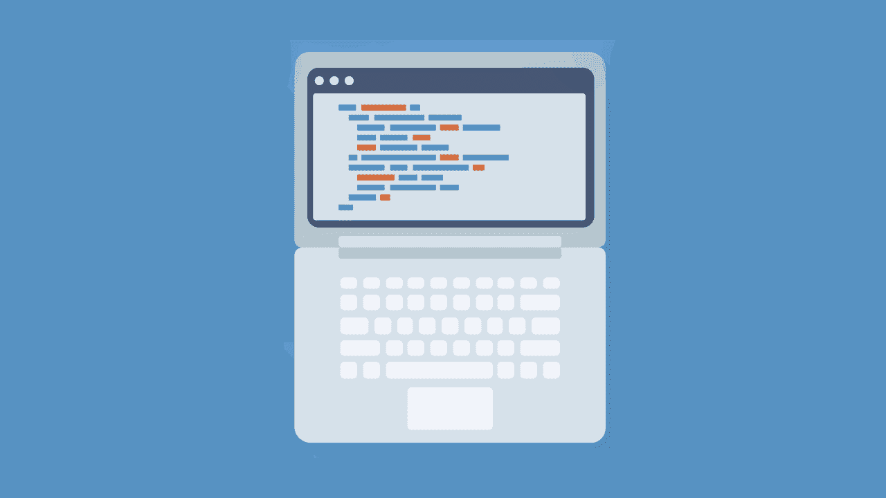

# 在 Java 中处理异常

> 原文：<https://simpleprogrammer.com/handling-java-exceptions/>

每个程序员都想写出完美的程序。也就是说，一个运行起来没有任何故障的程序。

如果愿望是马，乞丐会骑。超出程序员的所有愿望，有时会发生不可预见的情况。

这些不可预见的情况在 Java 中一般被归类为“异常”[。异常会干扰我们代码的顺利运行，如果不处理就会终止程序。处理异常包括编写另一组代码，以便在异常发生时管理这些异常。](http://www.amazon.com/exec/obidos/ASIN/0071808558/makithecompsi-20)

有两类例外，一类我们无能为力，另一类我们可以。对于第二个类，正确处理异常是很重要的，因为我们不希望我们的代码因为异常而终止。

当我们的代码以意想不到的方式运行时，异常就会发生(这就是为什么异常可以被认为是一种 bug)。这些意想不到的方法可能是将一个数除以零，试图访问一个不存在的索引处的数组，或者试图访问一个不存在的对象。所有这些方式都会产生异常代码，即不遵循程序设计的正常路径或过程的代码。

当异常发生时，会向用户报告一个描述，解释是什么导致了异常代码。报告此异常的行为称为引发异常。

异常处理是 Java 不可或缺的一部分；每个 Java 开发人员都需要理解如何处理异常，这样他们才能写出[干净、优雅的代码](https://simpleprogrammer.com/2017/10/06/5-tips-code-quality/)。

## 抛出异常

使用劣质燃料的汽车会冒烟，这样我们就知道出了问题——Java 程序中抛出的异常就相当于冒烟。当 Java 程序中发生异常时，需要向系统用户报告，以便用户确切地了解哪里出错了。通过向用户报告这个异常，我们抛出了一个异常。

程序员可以引发异常，或者 Java 语言引发异常。当程序的用户执行一些在程序中显然是非法或不正确的操作时，程序员可以引发一个异常。此外，如果程序的输入违反了一些基本的算术或编程原则，如将一个数除以零，或者如果程序运行的环境出现了一些问题，如内存不足，Java 语言会抛出一些异常。

那么当 Java 程序抛出异常时，会发生什么呢？创建任何 Throwable 子类的对象，根据异常的类型解释异常的性质。例如，可以抛出一个 ArithmeticException 对象，这表明发生了算术错误。

任何可以从 Java 程序中抛出的异常都被认为是可抛出的类的一个对象，该类又分为两个子类:T2 异常类和 T4 错误类。

程序员不能处理的异常在 Error 类中。可以修复的异常在 Exception 类中。

### 误差等级

有些例外就像自然灾害——它们会发生，你只能接受它们的发生。属于错误类的异常是您无法修复的。它们也只是发生，你必须接受它们的发生。

Error 类异常通常用于表明代码运行的环境有问题。这些类型的问题可能包括内存不足——内存不足的情况不是您编写代码来处理的，因此您不能简单地处理它。这些异常只是终止你的程序。

错误类异常通过重新启动程序来修复，但只有在导致程序终止的环境问题得到解决之后。在我们的示例中，对错误的修复可能包括为程序的执行手动回收空间。

只知道 Java 不修复错误类异常；程序的所有者必须在代码终止后做一些事情，以确保程序再次工作。

### 异常类

在 Exception 类下发生时可以处理的异常。Java 编程语言有无数可以在子类 **RuntimeException 下处理的异常。**

这些异常包括被零除异常，当您试图用零除一个数时会发生这种情况。

Exception 类的异常能够被处理，因为它们表明一些问题发生在代码内部，而不是代码运行的环境中。

您可以通过编写代码来避免此类异常，确保它们首先不会发生，如果它们真的发生了，您可以编写代码来确保这些异常不会终止您的程序执行。为了处理异常，它们被放在一个 *try 块*中，我们很快就会看到。

错误类和异常类之间的基本区别是错误类会导致程序终止，并且它不能被处理，但是如果异常被正确处理，异常类可以不导致程序终止。

## 涉及异常的重要关键字

Java 中的异常处理是通过使用一些关键字实现的，比如 *try、catch、throw、throws* 和 *finally* 。这些关键字用于管理如何抛出和处理异常。

任何可能导致抛出异常的代码都写在一个 **try** 块中。可能抛出异常的代码通常会处理输入值，但这并不能保证总是程序员想要的方式。

想象一个试图走路的婴儿。你只需用手抱住婴儿，以确保婴儿不会摔倒并受伤。同样，try 块用于包围运行时可能引发异常的代码。

try 程序块之后紧接着是 **catch** 程序块或 **finally** 程序块或两者。

一个 **catch** 块确实如其名:它捕捉 try 块中抛出的异常。由于可以抛出许多异常，catch 块必须指定它正在处理的异常的类。

除了 catch 块之外，还有 **finally** 块，它只是在 try 块完成时工作。因此，finally 块等待 try 块执行。请注意，try 块后面可以跟 catch 块或 finally 块，或者两者的组合。如果 try 块有 catch 块，则 finally 块在 catch 后运行，否则 finally 块在 try 块后立即运行。

因此，把 finally 块想象成 try 块的最终手段。finally 块通常用于处理 try 块可能没有正确利用的资源。

在 Java 中执行特定功能的一个方法或一段代码可以通过在方法标题中使用 **throws** 关键字来抛出一种类型的异常。

Error 或 RuntimeException 中的异常及其子类不需要包含在 throws 语句中。它们被归类为未检查的异常，即应该以任何可能的方式防止的异常，并且不能有意识地允许其发生。

程序中可能出现的未检查异常的数量如此之大，以至于我们不能在一个方法中抛出所有未检查的异常。这会导致方法失去清晰性，所以 Java 假设运行程序的程序员不会故意抛出这种类型的异常。

每个方法都有可能在出错时抛出未检查的异常，所以不需要在 throws 语句中添加未检查的异常。

throw 关键字用于在方法中专门抛出异常。它只是提供了动词 throw 中的正常用法:抛出 Throwable 类的一个对象。不能抛出不在 Throwable 类或其任何子类中的对象。注意不要用 throw 关键字抛出未经检查的异常。使用 throw 关键字抛出检查过的异常。

## 为什么要处理异常？

T2】

因为我们编写的每个程序都会在某个时候抛出异常，所以理解如何处理它们是很重要的，这样每次代码中出现异常时，就不会总是[终止我们的程序](https://simpleprogrammer.com/2013/03/10/7-reasons-why-you-should-tackle-hard-problems-last/)。

了解属于 Error 类或 Exception 类的异常之间的区别可以帮助您确定是否可以修复该问题。

当你编写代码来处理异常时，确保你理解并正确使用 try、catch 和 finally 块，并记住尽最大努力防止抛出未检查的异常。

学习如何在异常发生之前处理它们将有助于您编写干净、优雅的代码。