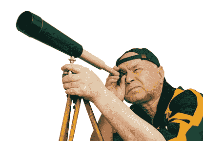
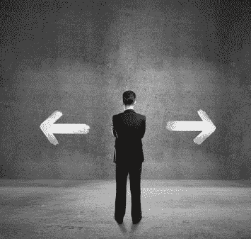

# 我讨厌天文学家

> 原文：<https://simpleprogrammer.com/hate-astronomers/>

大多数人并不总是对的。

如果你从这篇文章中没有得到任何东西，但是它提醒了你这个事实，那么我会觉得我已经完成了我的工作。

我们今天生活的社会比以往任何时候都更加紧密相连。分享想法和交流变得越来越容易。现在我正在夏威夷的毛伊岛写这篇文章。想到这个世界是如此的紧密相连，以至于我几乎可以在世界上的任何一个地方工作，这真是太神奇了。

但是，事情是这样的:随着世界联系的日益紧密，群体思维的数量也呈指数增长。我们越容易分享想法，某些想法就越容易流行，并且几乎淹没了其他想法的声音——不管是对还是错。

## 不思考的瘟疫

这种现象的症状随处可见。在软件开发世界中，我们真的很擅长掌握某些开发方法，不是基于它们的健全性或结果，而是纯粹基于流行度。否则，你如何解释 JavaScript 成为如此流行的编程语言，或者依赖注入变得如此普遍地被误解，却又如此广泛地被使用？

但是，这种现象不仅仅停留在软件开发方法上。不，它延伸到了软件开发的文化。冒着再次深究政治的风险，最近的“兄弟羞辱”浪潮是一个很好的例子，正是我所说的。(不要将此解读为对那种趋势的认可或批判，我对此事有看法，但不打算在本文中讨论。)

在软件开发领域之外，情况甚至更糟。我的脸书和推特上充斥着未经教育的观点和信仰，不是基于个人的思考，而是几乎完全归因于根本没有思考，只是盲目地追随似乎大多数人支持的东西。

但是，等等，你说，一个问题通常不是有两个方面吗？难道我们没有看到亲巴勒斯坦和亲以色列派的帖子吗？反堕胎和反堕胎派别？枪支管制的人和第二修正案的人？强奸文化人群和反女权人群呢？民主党和共和党？保守派和自由派？进化论者和神创论者？

是的，这正是问题所在。谁说只有两个选择？谁说这些选择都是正确的？别误会我的意思。我并不想忽视许多辩论的二元性。是的，电灯开关不是开着就是关着，但是我们有多少次根据我们碰巧喜欢的大多数人说的话来争论电灯开关的状态呢？有多少次我们没有意识到调光器开关的存在？

我的观点是:我们大多数人选择了辩论的一方，不仅盲目地相信我们事业的论点，而且相信随之而来的所有额外负担。

等等你说，不是我。我不这样做。我有充分的理由相信我所相信的，我只支持我所相信的事业，因为我在这件事上已经形成了自己的观点。我的观点恰好与大多数站在我这一边的人完全一致。

当然，我们欢迎你继续持有这种观点——毕竟，大多数人都持有这种观点——但是，你至少必须承认，这么多人往往对这么多不同的问题得出完全相同的结论，这有点奇怪。

我知道我还是不能说服你。我仍然能在脑海中听到你的抗议。所以，这就是我要做的:我要第一个承认我遭受了我指责你的弱点。那里。现在我既在对你说教，也在对自己说教。

## 我们给予科学家、宗教学者和历史学家太多的信任。

警告，我可能会在这里冒犯你——甚至可能激怒你——太糟糕了，这是无法避免的。

事实是，我们倾向于相信太多我们从完全基于可信度的“可信来源”那里听到的东西。不要误解我，我不反对科学和科学成就，我不是阴谋论者，也不是宗教激进分子。我反对盲目接受事实——或者说理论是事实——仅仅基于其来源的权威。

我尤其讨厌天文学家，我会告诉你为什么。天文学家编造任何他们不理解或不符合他们的事物运行方式模型的东西。无论你相信神创论还是宇宙大爆炸理论，你都必须承认它们都是疯狂的想法——更重要的是，它们都是完全无法证明的。

再说一次，不要误解我，我不会试图说服你接受我的观点。你是否持有我的观点并不重要。重要的是你花时间和精力去独立思考这个问题，而不是把你的观点仅仅建立在权威人士所说的基础上。有时候一个问题的正确答案是“我们不知道，也可能永远不会知道。”但是，这又把我带回到天文学家的问题上。他们不会说“我们不知道”当某样东西不符合他们的模型时，他们会发明一个符合模型的解释。

我知道我在这里变得有点异端，但是，不要误解我，我知道我们知道很多关于太空的事实——我们毕竟成功地将人类送上了月球。但是，重要的是要认识到，我们认为理所当然的某些想法，比如解释为什么宇宙中没有预期的质量——暗物质——只不过是试图解释那些真正应该用“我不知道”来回答的问题

当我读到新闻报道说地球已经有 x-百万年的历史，或者说一些事件发生在 y 百万年前，就好像这是绝对的事实，而不是一群科学家的集体猜测，这让我愤怒不已。还是那句话，不要误会我，我并不是想说服你地球不老——我信不信并不重要——但是，事实就是事实，观点就是观点。事实是可证明的，观点和理论不是。

当我们开始将观点和理论视为事实时，仅仅因为大多数人相信它们是事实，或者因为专家告诉我们它们“基本上是真实的”，我们就开始冒险进入各种危险的领域。各种历史暴行都是因为这一个简单的手势而犯下的。当人们不再为自己思考，而让科学家、宗教领袖、历史学家——最糟糕的是政客——为他们思考时，人类的堕落就会充分发展，我们肯定离黑暗时代不远了。

不仅仅是科学家，宗教领袖也在为人们思考，并要求他们接受意见作为事实。有多少人盲目遵从宗教领袖的教导，而不质疑他们的信仰，甚至不打开他们自己的宗教文本来证实他们被告知的事情？

## 我们不必对一切都持怀疑态度

同样，不要把这篇文章理解为支持或反对科学或宗教，甚至保守主义对自由主义。我对两者都有自己的看法，但关键是，我的看法无关紧要，那些在这个问题上比我更可信的人的看法也无关紧要。重要的观点是你自己的。真正属于你自己的意见，而不是你或我附和想象的那些意见，因为它们来自我们的嘴巴，它们来自我们的大脑。

这并不意味着我怀疑一切。说我是绝对荒谬的很容易驳回我的观点。毕竟，一个人不能简单地质疑摆在他们面前的每一个事实。我们必须相信某些事情，否则就不会有进步。你知道，站在巨人的肩膀上什么的？

但是，这根本不是我要说的。我把能被证明是事实的东西视为事实，但没有证据我不会接受它们。如果你告诉我 2 + 2 等于 4，我不会只相信你。你需要给我看它的证据。但是，一旦你证明给我看，我就有能力自己算出 5 + 5 是多少。

显然，我们必须把某些事情视为理所当然。没有必要怀疑重力——尽管对重力的科学解释仍然有些疑问。同样，我们知道生物学、物理学、医学和许多其他领域的某些事情，但几乎每个研究领域都有一些与事实相结合的观点，我们被要求在不知道配料的情况下吃馅饼。

所以，这里是交易:不要把任何人说的当作事实，只是基于来源的优点或他们的可信度。观点和理论经常被当作事实呈现——甚至是由应该更了解的来源呈现。而且，观点常常被裹上糖衣，让你相信它们的价值，而不要求你花一点时间为自己考虑。大多数人所表达的道德权利经常被用作权宜之计，用来打击那些敢于形成自己观点的人。

(顺便说一句，我以前推荐过这本书，但是如果你想要一本引人入胜的书，展示当一个社会的个体停止为自己思考时会发生什么，看看[阿特拉斯耸耸肩](http://www.amazon.com/gp/product/B003V8B5XO/ref=as_li_tl?ie=UTF8&camp=1789&creative=390957&creativeASIN=B003V8B5XO&linkCode=as2&tag=makithecompsi-20&linkId=DRAXHJ3JSWYQZDLA) )

如果你喜欢这篇文章，[在这里注册加入 5000 多名其他简单的程序员](https://simpleprogrammer.com/email)，他们每周都会把这些文章直接发送到他们的收件箱。如果你讨厌这篇文章，把它分享到推特上，让每个人都知道我是一个多么混蛋的人。