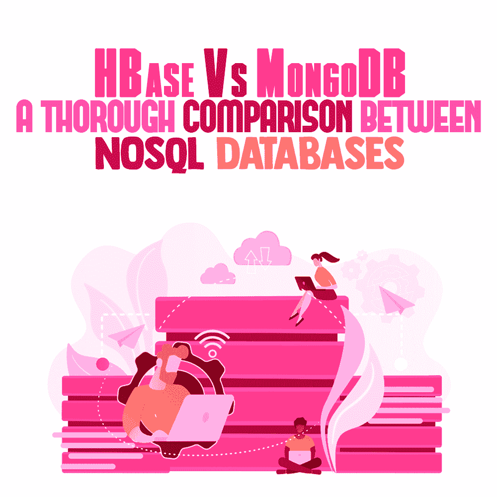

# HBase 与 MongoDB——NoSQL 数据库之间的全面比较

> 原文:# t0]https://simple programmer . com/hbase-vs-mong odb/

Change is the only constant! Especially in the era of big data analytics and data science, the contemporary solution to managing distributed databases is changing from traditional databases to NoSQL databases.

吸引越来越多开发人员使用 NoSQL 数据库的主要特性包括:

*   管理大量数据的能力
*   表演
*   简单的可扩展性
*   敏捷开发
*   故障转移安全性
*   出色的 CPU 和内存技能
*   更快上市
*   没有数据库损坏

这一领域的两个主导技术是 HBase 和 MongoDB。由于两者之间的差异很重要，软件架构师发现很难为他们的项目选择正确的一个。

在我们通过比较这两种领先技术来进一步探讨这一点之前，让我们先来看一看它们各自的功能。

## 什么是 Apache HBase？

根据[维基百科的定义](https://en.wikipedia.org/wiki/Apache_HBase)，“HBase 是一个开源的、非关系的分布式数据库，仿照 Google 的 Bigtable，用 Java 编写。”

当需要对大数据数据库和大量结构化数据进行随机和实时读/写时，最好使用 Apache HBase。它在 HDFS 和 Hadoop 的基础上提供了类似 Bigtable 的技能——压缩、内存操作、布隆过滤器等。

HBase 是一个用于结构化数据的可伸缩的、依赖于列的数据库，支持对分布在各种服务器上的大量数据进行有效而精确的管理。

因为它是用 Java 创建的，所以它支持不同的 API。它主要用于管理具有许多行和列的大表中的实时查询，并在一个硬件集群上执行。它基于四维数据模型，具有最大的可扩展性和容错性。

### 关键特征

*   线性可扩展性和模块化
*   帮助通过 Hadoop 指标子系统导出指标
*   自动化故障转移支持和表分片
*   客户可以轻松使用的 Java API
*   读写的规律性
*   作为键或值的数据存储
*   最适合基于范围的扫描

有很多公司和组织在使用 HBase，比如 Adobe，Hubspot，Vinted，JVM Stack，Flurry，Tumblr，Pinterest，Celer Technologies，Yahoo！等。想了解更多信息，请参考 [HBase:权威指南:随机访问你的行星大小的数据](https://www.amazon.com/dp/1449396100/makithecompsi-20)。

## 什么是 MongoDB？

正如维基百科告诉我们的那样，“MongoDB 是一个源代码可用的、跨平台的、面向文档的数据库程序。作为一个 NoSQL 数据库程序，MongoDB 使用类似 JSON 的文档和可选的模式

更详细地说，MongoDB 是一个通用的、基于文档的分布式数据库，是为现代应用程序开发人员和云时代创建的。许多开发人员利用它来开发世界上最先进的产品，并[构建高度可伸缩的 API](https://simpleprogrammer.com/building-highly-scalable-apis/)。

它能够服务于不同行业领域的多个财富 500 强和全球 500 强组织，如医疗保健、教育、电子商务和金融。

它是用 C++、Go、Python 和 JavaScript 编写的，非常高效、可伸缩、高性能，包含复杂基础设施的单一服务器部署。作为表和行的替代，它包括文档和集合。它被认为是实时分析和高速记录的理想选择。

### MongoDB 的主要特性

*   减少了 I/O 过载，为简单的数据结构提供了动态模式
*   复制，支持多个存储引擎
*   无模式数据库，通过索引实现更快的查询处理
*   水平扩展、分布式存储和卓越的可用性
*   弹性、数据的实时视图、嵌套对象结构
*   企业版中的可索引阵列属性、桌面加密

在众多使用 MongoDB 的组织中，值得一提的是脸书、Adobe、Foursquare、谷歌、SAP、Shutterfly、思科、福布斯、易贝和 Paypal。有关 MongoDB 的更多信息，请考虑阅读 [MongoDB:权威指南:强大且可伸缩的数据存储](https://www.amazon.com/dp/1491954469/makithecompsi-20)。

## MongoDB 与 HBase 的综合评价

当我们比较这两个数据库时，会发现两者有一些相似之处:

*   拥有主从复制
*   支持分片分区方法
*   不支持外键
*   持久耐用，同时具备内存功能

下面是两者的详细对比:

|  | **HBase** | **MongoDB** |
| **数据模型** | 面向列 | 面向文档 |
| **概述** | 基于 Apache Hadoop 和 BigTable 基础的宽列存储、NoSQL 数据库 | 一个文档存储，NoSQL 数据库可作为完全托管的基于云的服务访问，也可以自我管理 |
| **写于** | 爪哇 | C，C++，JavaScript |
| **由**开发 | 阿帕奇软件基金会 | MongoDB 公司。 |
| **支持的编程语言** | C，Scala，C++，Groovy，C#，Java，Python，PHP， | Erlang，C，C#，C++，Java，JavaScript，Perl，Python，PHP，Ruby，Scala |
| **节点数量** | 十个主节点、数据节点、区域服务器等节点。 | 三个节点用于主节点、辅助节点和复制节点 |
| **备份和恢复** | 在群集的所有节点上每分钟拍摄一次数据快照 | 使用 Ops manager 和 Atlas 进行定期备份 |
| **等待时间** | 高延迟操作 | 低延迟操作 |
| **支持的数据类型** | 将数据转换为连续字节 | 多种数据类型，包括浮点、字符串、时间戳等。 |
| **二级指标** | 不存在，由开发人员在代码中维护的物化视图 | 具有地理空间、文本、TTL 等的本地索引。 |
| **服务器操作系统** | Linux、Windows、Unix | Linux、Solaris、Windows、OS X |
| **可用版本** | 社区版 | 社区和企业版 |
| **已知用例** | Hadoop、在线日志分析、MapReduce、重型应用程序 | 运营和实时智能、内容管理、物联网 |
| **复制因子** | 利用可选择的复制因子 | 利用主从复制因子 |
| **分区** | 使用哈希方法 | 使用哈希、范围和区域分片 |
| **API 和访问方法** | Java API，节俭，RESTful HTTP API | JSON 专有协议 |
| **数据库类型** | 分布式数据库 | 分散数据库 |
| **分布式系统一致性** | 即时一致性 | 立即和最终的一致性 |
| **表格和行** | 收集和文件 | 表和列族 |
| **数据库** | 没有人 | ScaleGrid MongoDB 托管，MongoDB Atlas，mLab MongoDB |
| **查询模型** | 拥有数据的键值对 | 查询模型有各种过滤、投影等。 |
| **文本搜索功能** | 搜索引擎的数据复制 | 文本索引的本机特性 |
| **表演组由** | 使用 Hadoop 完成传统 Map Reduce | 使用聚合管道完成 |

## 满足独特需求的独特选项

各得其所！尽管 HBase 和 MongoDB——两个著名的 NoSQL 数据库——之间存在差异，但它们都有各自的名气和可信度。在选择哪一个之前，组织必须详细评估他们自己的因素。

HBase 最适合将 HDFS 作为存储层的组织需要大量随机读/写的关键值工作负载，尤其是因为它提供了非常快速的读/写。

如果有更广泛的应用领域，MongoDB 是正确的选择，因为它提供了一个丰富的模型来轻松跟踪用户行为。HBase 对于选定的子集来说是可伸缩的和高性能的，而 MongoDB 可以用于更广泛的应用程序。

由用户决定他们是需要性能驱动的实施还是对各种应用的有效支持。在这个由大数据和 [BI 解决方案](https://www.spec-india.com/services/business-intelligence-services)统治的世界里，这是一个很难做出的选择，尤其是当它像是从最好中选择更好的时候。希望这篇文章能让你的决定更简单、更容易！