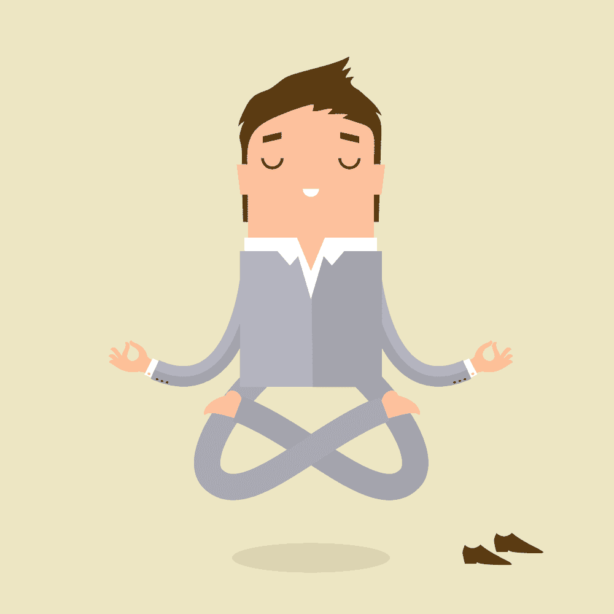

# 开发人员可以采取 4 个步骤来节省未来的医疗费用

> 原文：<https://simpleprogrammer.com/health-tips-for-programmers/>

We programmer geeks knew what we were getting ourselves into, but we absolutely love it. Waking up, solving those bugs, coding, and getting our nerd on gives us a super high.

当我选择这个领域时，我很清楚通常随之而来的压力和工作日程:长时间的编码，不眠之夜坐在电脑屏幕前试图满足大量的最后期限，开发新的计算机程序，修复程序错误和缺陷。

我花了不止半天的时间，不，几乎整天都在工作。如果你和我一样，我敢打赌你现在正锁在堆满垃圾食品的房间里，喝着苏打水或咖啡。我的意思是，来吧，我们需要熬夜，所以我们应该得到这个，对不对？

一些顶级科技公司与我国的大学签订了协议，允许这些公司从大学毕业后直接聘用他们选择的工程师。我很幸运地成为少数被选中的人之一，这意味着我在一家顶级科技公司开始了我的职业生涯，在那里我尝到了企业生活的滋味。哦，食物也很棒！自助餐厅的沙发差不多就是我的办公桌。我想给我的第一个老板留下深刻印象，我会像机器人一样把一壶咖啡转化成代码。

刚从父母家搬出来，我确保自己不碰任何我妈妈总是强迫我吃的蔬菜和谷物。汉堡和薯条是家常便饭。周日是 PlayStation 日，我喜欢这种新发现的自由。骑自行车上班是我唯一一次锻炼身体，但是当我买了第一辆车后，这种情况很快就结束了。

快进九年，你会看到这个呻吟着，超重 30 磅的中年男子睡在硬地板上，希望这样可以消除他的背痛(嘶:不要相信那些该死的 WhatsApp 转发)。是的，那是一年半前的我。我知道，在美元离开我的口袋被医疗账单取代之前，必须要做一些重大的改变。

我决定大胆尝试，跳上创业列车。我从家里带着一个小团队开始了自己的事情。改变是一个巨大的动力，这种工作的改变(实际上可能是缺乏健康保险，但我们不要跑题)促使我开始[更好地照顾自己的身体](https://simpleprogrammer.com/get/not-to-die)。瘦瘦的，面带微笑，是周日自行车比赛的常客，努力进入前 10 名——这就是现在的我！

我的团队是一群年轻人，很容易坐在最奇怪的位置上工作几个小时。这让我想起了过去我在自助餐厅沙发上工作的日子。很明显，我过去犯的那些错误已经折磨我够久了，我不想看到我的人也受折磨。

如果这让你对自己的健康或生活方式感到一丝内疚，请继续读下去，因为我有一些简单的方法，可以帮助你把那些崭新的美元钞票放在口袋里，而不是医生的口袋里。相信我，当我说这比编码容易的时候。

## 注意你的饮食

你，是的，你在读这个。当你读这篇文章的时候，不要吃东西。你可以以后再谢我。

避免在屏幕前吃东西，绝对不要在办公桌前吃！吃适当的食物，而不是整天吃东西，或者更糟——挨饿。是的，这种事过去在我身上发生过好几次。临近最后期限的兴奋或者在从椅子上站起来之前急于得到下一个承诺意味着我经常在不知不觉中让自己饿上几个小时。

还有，你有可能远离垃圾吗？你最终可能会吃得比你想象的多，尤其是在调试的时候大嚼那些薯条、汉堡或薯条。

如果你喜欢烹饪，提前为自己做一顿美味的饭菜吧！扔掉垃圾，就像你从你的代码中去掉所有的 bug 一样。如果烹饪不是一个选择，注册一个送餐服务。你的食物会来找你的！

此外，从 App Store 或 Google Play 下载一个免费应用程序，提醒你每小时补充水分。当你忙于工作，完全忘记给身体补水时，脱水晕倒是非常真实的可能性。

我说的水合物是指 H2O，而不是红牛、苏打水或咖啡。如果不是这个应用，试着在每次修复一个 bug 或者做一个 git commit 的时候喝一杯水。

## 像瑜伽士一样弯曲它

想象一下，你已经 35 岁了，但是由于背部问题和疼痛导致的驼背，你看起来更老了。不是一个令人愉快的景象，是吗？

你不需要选择昂贵的健身房会员或课程来避免它。每天醒来做基本的瑜伽伸展运动就行了。你的肌肉需要很好的伸展。

Follow [your own Yoga plan](https://simpleprogrammer.com/5-yoga-poses-every-programmer-try/), or just go to your favorite app store and download something like the Daily Yoga – Workout & Fitness app, which will fix you up with some good exercises. This will not only help you maintain your posture but will also strengthen your back. Here are [a few basic ones](https://simpleprogrammer.com/get/the-yoga-beginner) you can try at home: cat/cow pose, spinal twist, downward dog pose, seated forward fold, eagle pose, and the child’s pose.

没有人要求你像一个重量级拳击手一样有粗大的二头肌。只要养成一个整洁的早晨习惯，就能让背痛远离你！你的新陈代谢会加快，耐力也会增强。我敢肯定，当你遇到几级楼梯时，你不会想气喘吁吁的。像我们这样的工作，我们需要这种精力和奉献精神。

## 人体工程学 101

所以呢？让我解释一下。人体工程学包括设计一个合适的工作空间，以避免无精打采和在沙发上工作的不良习惯，这最终会导致工作效率低下。不良的姿势会导致健康问题和受伤。

在每一种工作文化中都应该采用符合人体工程学的流程，以消除导致严重健康问题的风险因素。

我们怎样才能结束这一切？购买舒适、可调节的椅子，配有漂亮的扶手、可调节的显示器和外部鼠标，并正确放置电线。

我已经在我的办公室里试过了，年轻的小伙子们对整个系统非常满意。如果你是一个在家工作的人，你必须做的第一件事就是遵循这些步骤。

## 睡得好

就像你的手机一样，你的身体需要偶尔进入飞行模式。我不想成为你唠叨的妈妈，但是相信我:每晚八小时睡眠的固定作息实际上会让你更有效率。此外，这将有助于防止你在会见客户时打瞌睡。

当你睡得好的时候，你会感觉压力较小，醒来时精力充沛。此外，将这些令人惊叹的瑜伽体式添加到你的日常生活中，会让你一整天都保持清新和精力充沛。睡觉前，确保给自己一些时间。脱离科技世界，让你的眼睛休息一下。手机发出的明亮蓝光已经被证明会扰乱自然睡眠模式。做个好梦！

## 对你的未来说是

遵循这些简单的步骤将确保你未来的自己不会诅咒你。这就是我如何记住这些简单的步骤——助记符 F-YES。为了防止未来的自己诅咒你，注意你吃的*食物*，做*瑜伽*，采用*人体工程学*，最后*睡好*。做这些和*未来你*会说*是*并想拍拍你的背。