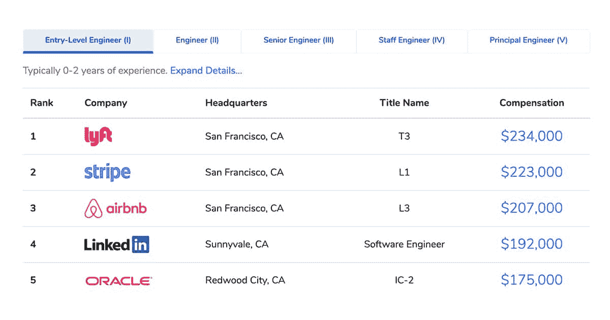
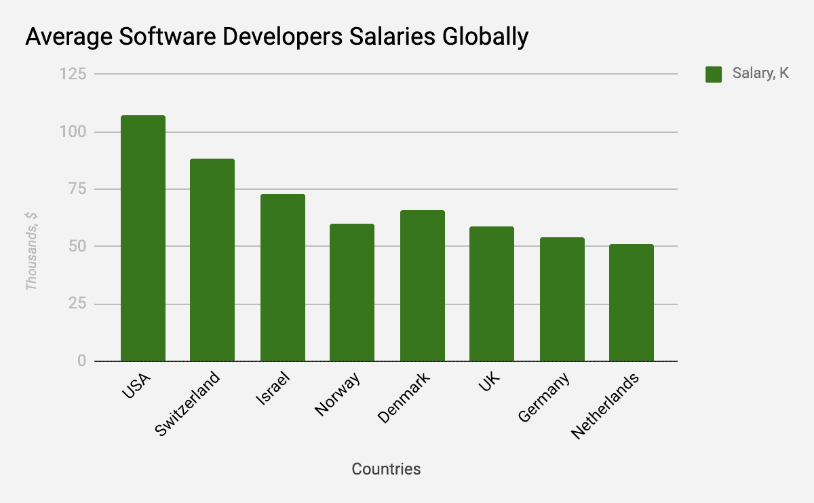
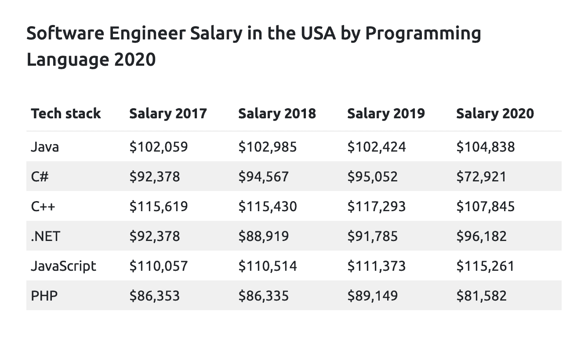
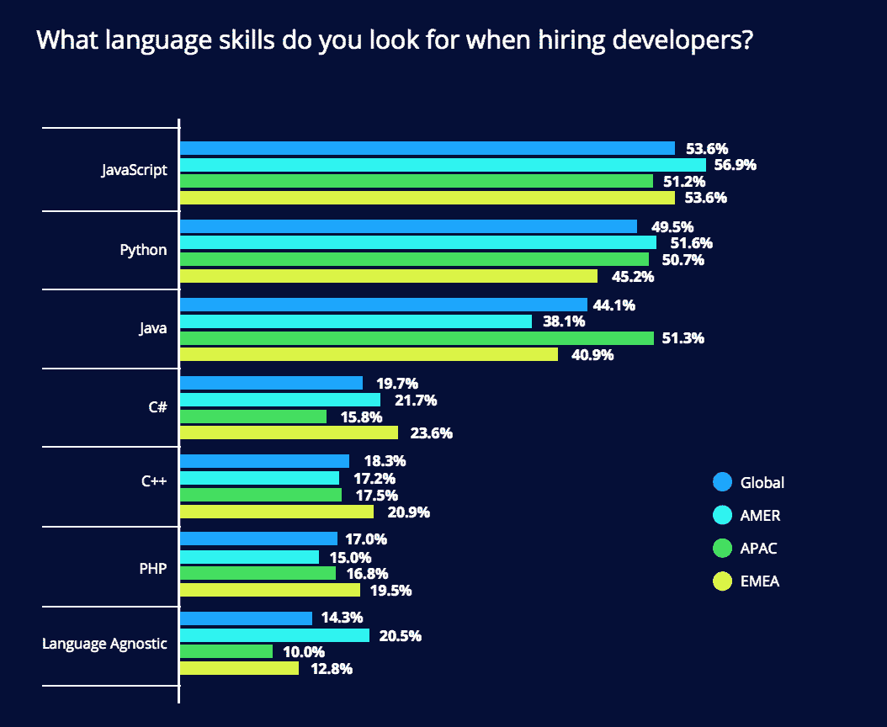
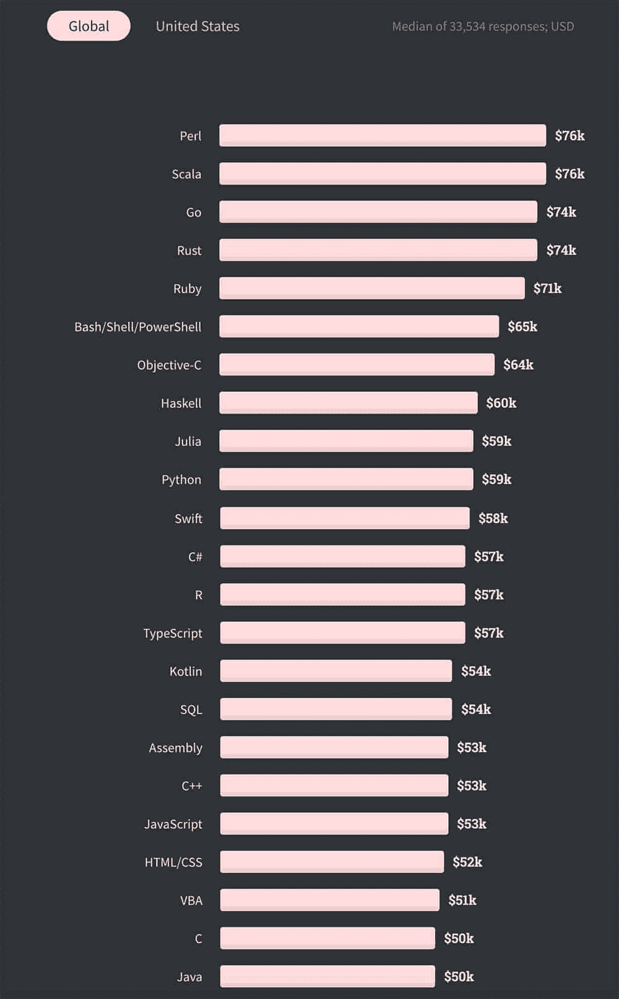

# 2021 年收入最高的 10 个软件工程师职位

> 原文:[https://simple programmer . com/高薪软件工程师乔布斯 2021/](https://simpleprogrammer.com/highest-paid-software-engineer-jobs-2021/)

根据 [Indeed 报告](https://www.indeed.com/career/software-engineer/salaries)显示，美国平均[软件开发费率](https://youteam.io/blog/offshore-developers-rates-in-2020-best-countries-and-best-platforms-to-hire-a-remote-development-team/)为每年 110539 美元。

对于那些正在考虑成为软件工程师或刚刚开始开发生涯的人来说，这样的数字可能会成为努力学习和获得高价值技能的强大动力。

此外，由于上面的数字只是一个平均值，你能得到的实际金额甚至可能更高，这取决于你的谈判技巧、经验、软技能和雇主等因素。

无论你是熟练的软件开发人员还是初级软件工程师，问题都是一样的:在当前的市场条件下，什么编程语言和框架带来的薪水最高？继续阅读，了解所有细节，确保你的编程生涯朝着正确的方向前进。

## 拥有顶级编码技能能赚多少钱？

根据 2019 年 [Levels.fyi research](https://www.levels.fyi/2019/) 的数据，在热门科技公司工作的软件工程师可以期待非常高的薪酬水平。当然，你的工资将取决于经验。但是根据这项研究，[在一家受欢迎的技术公司，软件工程师的起薪](https://simpleprogrammer.com/increase-salary-software-developer/)可以是每年 175，000 美元到 234，000 美元。

图片来源: [Levels.fyi research](https://www.levels.fyi/2019/)

很多时候，雇主使用某种基于级别的系统来给他们的开发人员排名。例如，苹果的工程师从 ICT2 开始到 ICT6 分为五个级别，而在谷歌，入门级开发人员从 3 级开始。

这些系统可能会有所不同，但要点是相同的:你必须提高你的软硬技能才能达到更高的水平。更高的级别意味着更高的薪水。

不同公司的情况也可能不同。根据你所在单位的规模和权限，同级别工程师的工资可能相差很多。旧金山大公司中一些最优秀的软件工程师的年薪可能超过 100 万美元。根据 Levels.fyi 的一份报告，脸书的高级工程师每年可以拿到超过 350 万美元。

软件工程师的平均工资也因国家而异。据 Indeed 报道，美国是开发者收入最高的国家。你可以看到其他国家的年薪是如何下降的。瑞士是软件工程师排名第二的国家；他们的平均年薪是 8.3 万美元。

T2】

开发人员的工资也取决于他们使用的编程语言。

图片来源:确实

对最流行的编程语言有经验的工程师比率最高。这些流行的技术在大多数 IT 项目中都是需要的，而且企业会花大价钱聘请一位特定编程语言的专家。此外，这些专家在找工作时往往没有问题。

虽然 JavaScript 和 Java 仍然是需求量最大的编程语言之一，并保证开发人员每年都有高薪，但随着时间的推移，一些技术开始失去人气。例如，2020 年 C#、C++和 PHP 开发人员的工资有所下降。这完全有道理，因为招聘人员对这些语言的需求是 Java 和 JavaScript 的一半。

图片来源:HackerRank

此外，值得记住的是**工资**和**薪酬**之间存在巨大差异。

如果工资是你在一段时间内(通常是一年)得到的钱数，那么薪酬是一个复杂得多的概念。在不同的公司，薪酬可能会有所不同，包括个人和家庭保险、带薪病假和假期、退休计划、教育计划、健身房会员资格、儿童保育援助，甚至利润分享或持股计划。

考虑到所有这些，我们可以看到，高工资本身并不是最好的提议的指标。较低的工资加上丰厚的薪酬最终会给员工带来更多，而高工资可能会让员工没有奖金或其他福利。

薪酬计划的比较超出了本文的范围，所以我们只关注薪酬，作为一个指标，薪酬与确定薪酬最高的开发技术更相关。当薪酬说明一个特定的公司对待员工的方式时，工资是一个与供求相关的通用市场指标。

## 哪种编程语言工资最高？

现在我们来搞清楚什么编程语言能给你带来最高的工资。来自 [HackerRank](https://info.hackerrank.com/rs/487-WAY-049/images/HackerRank-2020-Developer-Skills-Report.pdf) 的关于 2021 年开发者技能的报告称，JavaScript 再次成为工程师们最熟知的语言。相比之下，Go 是大多数开发人员想学的第一语言。考虑到它的创造者，科技巨头谷歌，是推动语言采用的人，它的流行是有道理的。

一般来说，开发人员倾向于学习最广泛使用的技术。当一个开发人员能够用一种在不同软件项目中使用的流行编程语言编写代码时，找工作对他们来说不是问题。

对于那些主要目标是开始 IT 职业生涯的初级开发人员来说，学习流行语言是一个很好的策略。但为了获得加薪，他们应该获得独特且要求极高的技能，因为公司倾向于为拥有罕见技术经验的专家支付更高的薪酬。

下面我将讨论什么是薪水最好的编程语言，你需要花多少时间学习和练习这门语言，以及初级开发人员的期望薪水。

图像来源:[堆栈溢出](https://insights.stackoverflow.com/survey/2020)

Perl 是一种高级的、通用的动态编程语言，以其字符串解析能力和对正则表达式的本地支持而闻名。你需要大约一年的时间，每天两小时，才能让[精通 Perl](https://www.amazon.com/dp/B08LVX2TLL/makithecompsi-20) 。在美国，使用 Perl 你平均每年可以赚 13 万美元，而在全球范围内，它每年给开发者带来大约 7.6 万美元。

Scala 也是一种通用语言，主要面向 Java 虚拟机。设计 Scala 的马丁·奥德斯基(Martin Odersky)在 Coursera 上有一门课程，时长 7 周，工作量 5-7 小时。Scala 开发人员在美国每年获得 14 万美元，在全球每年获得 7.6 万美元。

Go(或 Golang) 是一种开源编程语言，可以轻松构建简单、可靠、高效的软件。Go 让你每年在美国赚取 14 万美元，在全球赚取 7.4 万美元。你将在两周内学会围棋的基础，但要精通它，你需要 3-6 个月。

Ruby 是一种多平台动态面向对象解释器，是松本幸弘(Matz)在 1995 年创建的一种开源语言。如果你已经熟悉了其他语言，你可能需要两周到两个月的时间来学习 Ruby。作为一名 Ruby 开发人员，在美国你每年可以赚 13 万美元，而在全球范围内，这个数字是 7.1 万美元。

Objective-C 是为 OS X 和 iOS 编写软件时使用的主要编程语言。你可以在 2-3 周内获得该语言的语法和概述。在美国，Objective-с开发人员的期望年薪是 12.3 万美元。

Swift 是一种快速、安全、富于表现力的通用编程语言，由苹果公司为其平台和 Linux 开发。你需要大约三个星期来学习 Swift。全球范围内，Swift 开发人员的平均工资在美国为 12.5 万美元，在全球范围内为 5.4 万美元。

是一种免费的开源编程语言和软件环境，用于生物信息学、统计计算、可视化和一般计算。学习 R 编程需要七天时间，每天至少花三个小时。你在美国可以赚 10.9 万美元，在全球范围内每年可以赚 5.7 万美元。

**Prolog** 是最常用的逻辑编程语言。它通过模式匹配和时间回溯支持非确定性编程。学习 Prolog 编程需要 12 天。在美国，Prolog 开发人员的平均工资是 10.2 万美元/年。

**C#** (读作“see sharp”)是微软开发的一种静态类型、高级、多范例编程语言。C#代码通常针对微软的。网族。平均而言，一名 C#工程师在美国的年薪为 11 万美元，在全球范围内为 5.7 万美元。

有了上面的这些数据，你就可以考虑你想花在学习上的时间，以及你作为一个有经验的开发者未来可以得到的预期薪资，[选择学习的路径](https://simpleprogrammer.com/confirm/5-learning-mistakes-c/)。

## 哪些框架与更高的薪水相关联？

当开发人员熟悉一种或多种编程语言时，是时候提升技能并学习对软件开发有帮助的不同框架了。有时，工程师选择学习他们当前或未来项目所需的框架。但是你也应该考虑哪些是开发人员和技术招聘人员中最流行的框架。

在全球范围内，Backbone.js 与最高的薪酬相关联。然而，根据 [HackerRank](https://info.hackerrank.com/rs/487-WAY-049/images/HackerRank-2020-Developer-Skills-Report.pdf) 的研究，React 是 32%的开发人员表示他们下一步想学习的框架。AngularJS 和 Django 也名列前三。这些也是招聘人员最需要的框架。

Therefore, with the knowledge of a popular programming language and one of these frameworks, you can already be in demand and get a higher salary than an entry-level engineer can get.

然而，与高薪的关联部分取决于资历。让我们以 Backbone.js 为例。虽然 7%的高级开发人员知道这个框架，但只有 2%的初级开发人员能够熟练使用它。

在下面的列表中，您可以找到基于开发人员对每个框架的了解的工资增长的统计数据。但是你必须考虑到，由于高级开发人员的工资较高，这可能会提高与框架相关的平均工资。

所以让我们仔细看看流行的框架，看看了解每一个框架能赚多少钱。

**Backbone.js** 是一个 JavaScript 框架，它通过提供具有键值绑定和自定义事件的模型、具有声明性事件处理的视图以及具有丰富的可枚举函数 API 的集合来为 web 应用程序提供结构，并通过 restful JSON 接口将其连接到您现有的 API。

如果你有兴趣学习这个框架，可能只需要 [30 个小时](http://javascriptissexy.com/learn-backbone-js-completely/#:~:text=js%20properly.,about%2030%20hours%20to%20complete.&text=After%20I%20learned%20Backbone.,for%20a%20client%E2%80%94a%20startup.)。根据 HackerRank 的说法，通过[known backbone . js](https://www.amazon.com/dp/1782162720/makithecompsi-20)，你可以获得 48%的加薪(以 54K 美元/年的全球平均工资计算)。但是记住这取决于开发者的资历，就像我上面解释的那样。

**Cocoa** 是**苹果公司为 macOS 开发的**应用开发框架，包括基础、应用套件和核心数据。这个框架有助于构建 macOS 应用程序，所以如果你想从事 iOS 开发人员的工作，你应该考虑学习它。你可以用《Mac OS X 可可编程》这本书来学习这个框架。可可可能会给你带来大约 36%的加薪。

**Ruby on Rails** 是一个在 MIT 许可下用 Ruby 编写的服务器端 web 应用框架。它有利于快速应用程序开发，节省开发时间，因为编程比其他框架和语言要快得多。你需要 [1-2 个月](https://www.sitepoint.com/community/t/how-long-does-it-take-to-learn-ruby-on-rails/24662/6)来学习 Ruby on Rails。如果你已经选择了 Ruby 作为你的编程语言，那么这个框架的知识可以让你的薪水增加 29.6%。

Spark 是一个简单、开源、富于表现力的 Java/Kotlin web 框架 DSL，专为快速开发而打造。它是其他 Java web 应用程序框架的替代方案，如 JAX-RS、Play 框架和 Spring MVC。如果你想从事数据分析，这个框架会对你有用。可以让你的工资大 29.4%。如果挑自学的方式，需要 3-4 个月才能学会 Spark。

Struts 框架是一个用于创建 Java web 应用程序的免费开源解决方案。你只需要 30 天来学习 Struts，它将帮助你节省大量的 web 应用程序开发时间。学习这个框架可以增加 19.3%的薪酬。

**。NETCore** 是一个开源、免费、托管的计算机软件框架，适用于 Windows、Linux 和 macOS 操作系统。它是的跨平台继任者。微软员工开发的. NET 框架。如果你要和。Net，学习这个框架对你来说是一个很大的优势。学习过程可能需要 [2-3 个月](https://stackoverflow.com/questions/413731/how-long-would-it-take-a-non-programmer-to-learn-c-the-net-framework-and-sql/413772#:~:text=Net%20is%20very%20enjoyable%20from,months%20to%20learn%20the%20basics)，但绝对值得。有了. NETCore，你可以期待 10.7%的加薪。

**React** (也称为 React.js 或 ReactJS)是脸书开发的用于构建 ui 的开源 JavaScript 库。它使用基于组件的、声明性的范例，旨在既高效又灵活。建议你先学习 HTML 和 CSS 的基础知识。如果您这样做了，那么学习 React 对于您的 web 项目来说将会更加容易和方便。

熟练使用 React 的学习过程平均需要[六个月](https://betterstack.dev/blog/how-long-does-it-take-to-learn-react/#:~:text=The%20short%20answer%20is%20it,the%20learning%20path%20you%20take.)。了解 React 框架可以让你的工资大 8.7%。

**ASP** (Active Server Pages)是微软的第一个脚本服务器端语言和引擎，用于随时间或其他条件变化的网页。你需要大约 2-3 个月的时间来学习基础知识，但是要成为 ASP 的专家需要 1-2 年的时间。但最重要的是，你需要学习 C#。所以，如果你选择 C#作为你的主要编程语言，ASP 将会对你有用。然后，你可以用这个框架获得 7.4%的加薪。

Vue.js 是一个用于构建用户界面的渐进式 JavaScript 框架。要学习 JS，你需要大约两年的积极学习。此外，要学习 Vue，你还需要一年时间。众所周知，Vue.js 被初创公司使用，但也可以用在大规模应用中。了解 Vue.js 可以让你的工资增加 6.3%。

**Angular.js** 是一个基于 JavaScript 的前端开源 web 框架，主要由 Google 维护，以解决开发单页应用程序时遇到的许多挑战。大约 2-3 个月的积极学习足以了解 Angular.js。如果你知道 Angular.js，你可以指望 3.7%的工资增长。

## 该是你成为高薪软件工程师的时候了

正如你所看到的，软件工程师的工资取决于许多因素，包括编程语言、经验、公司和你工作的国家。在选择编程语言之前，根据我在这篇文章中与你分享的数据来考虑你的选择。

First of all, you should decide whether you are interested in creating and working with web development or building mobile applications. That will help you to choose your first steps.

根据您想从事的开发领域，选择您的第一种编程语言会更容易。由本帖辅助，对比主要语言，预估成为入门级软件工程师需要多少时间，每种语言能赚多少钱。

然而，不要忘记分析你当地的薪资市场和你打算申请的公司，因为数字可能会略有不同。

有了以上所有信息，你也可以选择你可以专注的其他领域和你可以学习的新框架，从而成为有需求的候选人，期待更高的工资。