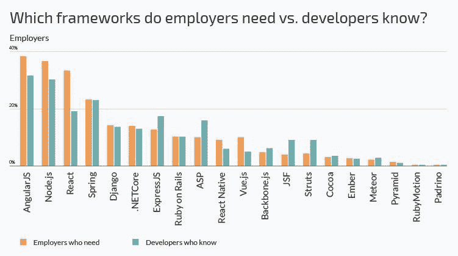
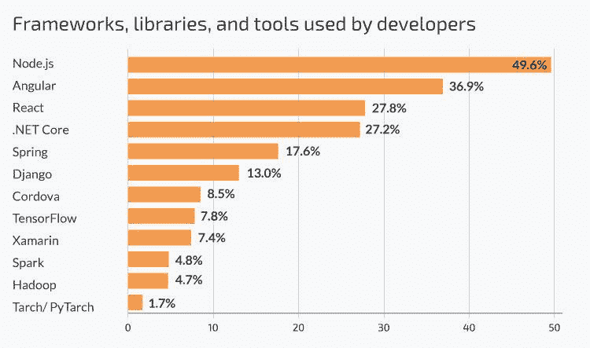

# 为什么你的项目需要 Angular 开发人员，以及如何雇佣他们

> 原文：<https://simpleprogrammer.com/hire-angular-developers/>

JavaScript 统治着网络。很难反驳这种说法，因为 JavaScript 在互联网上几乎无处不在。根据 Stack Overflow 的[开发者调查 2018](https://insights.stackoverflow.com/survey/2018#technology) 显示，JavaScript 是最常用的编程语言。超过 78，000 名受访者中有近 70%的人用 JavaScript 编写代码。

此外，JavaScript 框架也在发挥作用。HackerRank 发布的 2018 年开发者技能[报告](https://research.hackerrank.com/developer-skills/2018/)显示，AngularJS、Node.js、React 等 JavaScript 框架的供需缺口最大。尽管事实上已经有许多专门研究这些框架的开发人员，但是寻找这方面专家的雇主要多得多。

*Source: HackerRank*

该图表还表明，Angular 开发人员的需求和供给都高于任何其他框架。所以，让我们弄清楚 Angular 为什么如此受欢迎，以及如何为您的项目雇用有才华的 Angular 开发人员。

## 什么是有角？

Angular 是最热门的开源 JavaScript 框架之一。Angular 由 Google 维护，用于构建具有丰富特性集的引人注目的 web 应用程序。它在使 JavaScript 代码更加简单和结构良好方面做得很好。

此外，它还用于开发移动和桌面应用程序。例如， [Ionic，](https://simpleprogrammer.com/ionic-framework-development/)一个用于开发跨平台移动应用的强大平台，就建立在 Angular 之上。

自 2009 年以来，谷歌的 Angular 团队已经推出了该框架的多个版本。第一个版本 AngularJS 是为构建动态单页应用而设计的。通常，术语“Angular”适用于 Angular 2 和所有后续版本。

Angular 不仅仅是一个更新，而是对 AngularJS 的全面改写。它引入了全新的特性，比如组件架构、不同的表达式语法、模块化、类型脚本语言、动态加载等等。

许多著名的[网络应用](https://simpleprogrammer.com/get/javaee)，包括 Eat24、Radio.com、Udacity、Freelancer、Crunchbase、NBA.com、Google Express 等等，都是用 Angular 构建的[。有这么多产品是在谷歌的支持下构建的，很明显这个框架的受欢迎程度不会降低。根据 Stack Overflow 的 2018 年开发者调查，Angular 是开发者中第二常用的前端框架。](https://www.madewithangular.com/categories/angular)

*Source: Stack Overflow*

## 角形框架的优点

当然，Angular 框架如此受欢迎是有原因的。那么这个框架给开发团队带来了什么好处呢？

*   **打字稿用法**。尽管 Angular 被认为是一个 JavaScript 框架，但它是基于 TypeScript 的，TypeScript 是 JavaScript 的超集。用 TypeScript 编写的代码很容易编译成 JavaScript。与 JavaScript 相比，TypeScript 的一个强大优势是在键入代码时识别错误，这使开发人员能够立即修复错误。
*   **稳定。**从 Angular 2 开始，框架的所有版本都是向后兼容的。这意味着您可以将项目升级到新的 Angular 版本，而无需更改代码库。此外，Angular 由 Google 提供支持，这更加增加了框架的稳定性。
*   **模块化。**角度应用由模块组成。这意味着代码由负责不同功能的独立模块组成。您可以使用标准 Angular 包中的模块，编写自己的模块，或者集成 Angular 社区开发的现成组件。此外，这种结构允许“延迟加载”，即只加载所需的特性并优化应用程序。
*   **代码一致性。**angle 应用程序基于组件的特性使代码库保持有序，更易于维护。这些组件高度可重用，对于不熟悉代码的工程师来说可读性更好。
*   **易于测试。**模块化系统还简化了测试，因为独立组件更容易测试。此外，还有不同的角度测试技术。例如，量角器对于端到端测试是有效的，而 Karma 对于单元测试是有益的。
*   **跨平台。**您可以使用 Angular 开发不同的应用程序，如 web、本地和移动应用程序。此外，Angular 允许创建渐进式网络应用程序——像网页一样加载的网络应用程序，但提供了通常只有原生移动应用程序才能提供的额外功能。
*   **社区。** Angular framework 在开发者中极受欢迎，有一个很大的社区。你可以在网络上找到很多有角度的社区(Stack Overflow，Gitter，LinkedIn groups，Slack channels 等。)和[角会议](https://angularconferences.com/)发生在世界各地。这有利于知识共享和框架的发展。

## 如何雇佣有棱角的开发人员

首先，当雇佣棱角分明的开发人员时，你必须恰当地传达你的想法，这样你的潜在员工才能意识到你想从他们那里得到什么。他们应该理解你的愿景和他们在你的项目中可能面临的挑战。

此外，你必须弄清楚是否有发挥主动性和创造新的创造性解决方案的地方。如果你对必须做什么有明确的要求，那么你需要让你潜在的团队成员知道，并检查你的候选人是否能够满足这些要求。

然而，如果你对技术专家的一些新想法持开放态度，那么你的潜在员工必须意识到这一点。开发人员经常渴望提出新的解决方案，而不仅仅是执行给定的任务。

当寻找一个熟练的 [Angular developer](https://simpleprogrammer.com/get/angularjs) 时，检查他们的简历、投资组合以及客户和前雇主的推荐信是至关重要的。当然，开发人员的经验是至关重要的，因为从事类似或更大的项目将有助于提高产品的质量。技术要求取决于任务的复杂程度和你的角度工程师的专业水平(对资深者的要求比初级者更高)。

### 

在棱角分明的开发者身上寻找什么:

*   **核心 JavaScipt 的知识。**如今，你可以找到许多单框架开发人员。但是，只专攻你的框架是不够的。不管你雇佣的是 Angular、React 还是 Vue.js 工程师，这个人都应该了解 JavaScript 语言的核心。
*   **对棱角框架的深刻认识。**不言而喻，你的 Angular 开发者必须是这个框架的主人。随着框架的定期更新和新版本的发布，保持知识和技能是非常重要的。
*   精通 web 标记、HTML 和 CSS。在 [web 标记](https://simpleprogrammer.com/consultants-know-your-markup/)方面经验丰富的开发人员将对元素的定位、UX 概念和元素交互有很深的理解。这些知识对于交付高质量的项目非常重要。
*   RESTful API 集成经验。RESTful API(应用程序接口)使用 HTTP 请求来获取、上传、发布和删除数据。为了能够阅读 API 文档并有效地使用它，开发人员需要在 REST APIs 方面经验丰富。
*   **Node、Webpack 等相邻技术的知识。**这些技术补充了框架，使得开发过程更加容易和有效。如果你找的是中层+工程师，那就把他们列入你的需求。
*   对细节的注意。为了写出高质量的代码并能够立即识别错误，你的开发人员应该非常关注细节。
*   良好的沟通技巧。你需要你的 Angular 开发者能够解释正在发生的事情，以确保你们在同一页上。如果你雇佣了一个 Angular 工程团队，你可以有一个项目经理或者一个交付经理站在他们一边，进行有效的协作。[交付经理的角色](https://www.n-ix.com/how-offshore-development-company-should-manage-delivery-people-processes-product/)是推动工作流程，提出正确的问题，并得到正确的答案。

如果您所在的地区缺少高技能的 Angular 开发人员，您可以尝试将您的 JavaScript 开发外包给第三方供应商。如果你计划与一个离岸软件开发团队建立长期的合作关系，你可以在这里找到一系列要问你的软件开发人员的问题。

## 获得有角度的结果

JavaScript 是一种多方面的语言，可用于各种领域——前端、后端、移动和浏览器扩展。毫无疑问，Angular 是最强大的 JavaScript 框架之一。这个框架有很多优点，并且得到了 Google 和它强大的开发者社区的大力支持。

如果你想雇用有才华的 Angular 开发人员，你应该做彻底的研究和准备——从检查工程师的简历和经验到列出正确的要求。最后，重要的是要明白，你不仅需要高技能的专家，还需要一个强大的开发团队，能够有效地协作并交付最佳结果。