# 互联网的历史:第十三部分 iPhone 的救赎

> 原文：<https://simpleprogrammer.com/history-internet-13-criticism-of-the-iphone/>

在第 12 部分中，我们报道了直到 2007 年初第一代 iPhone 的发展故事。此时，苹果公司首席执行官史蒂夫·乔布斯即将发布 iPhone，但开发工作仍在疯狂进行，该设备尚未接近完成。

在第 13 部分中，我们将了解这些问题是如何被克服的，以及苹果是如何找到成功的秘诀的。

新年伊始，乔布斯开始在旧金山莫斯康中心为 iPhone 的发布进行练习。即使在排练的第五天，原型手机也会随机掉线、断网、死机或关机。高级工程师安迪·格里尼翁(Andy Grignon)分担了乔布斯的愤怒，他咒骂并威胁道:“如果我们失败了，那就是因为你！”

## macworld 2007:iPhone 揭秘

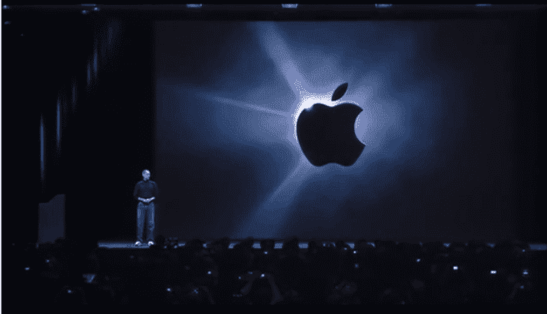

2007 年 1 月 8 日，史蒂夫·乔布斯在 Macworld 上发布了 iPhone。正如他为 iMac 的发布所做的那样，乔布斯邀请了安迪·赫兹菲尔德、比尔·阿特金森、史蒂夫·沃兹尼亚克和 1984 年的麦金塔团队参加庆祝活动。

乔布斯通过赞美改变一切的稀有产品来戏弄他的观众，然后他宣布，“今天，我们推出这一级别的革命性产品。第一个是带触摸控制的宽屏 iPod。”观众爆发出掌声。

"第二个是革命性的手机."观众爆发出更大的欢呼声。

“还有第三个。是一个突破，互联网通讯设备。”观众全神贯注。

“你明白了吗？这不是三个独立的设备，这是一个设备。我们称之为 iPhone。”乔布斯继续观察市场上的其他智能手机不是不太智能就是不太容易使用，并声称该团队正在开发一款比其他任何手机都更智能、更容易使用的手机。

他将其他手机上的软件描述为“像婴儿软件一样”，并声称 iPhone 可以在 Mac OS X 上运行。这对手机应用程序开发人员来说是一个令人兴奋的发现，因为其他手机平台都很初级，很难在其上开发。第一次，移动电话开发将接近开发桌面应用程序的体验。

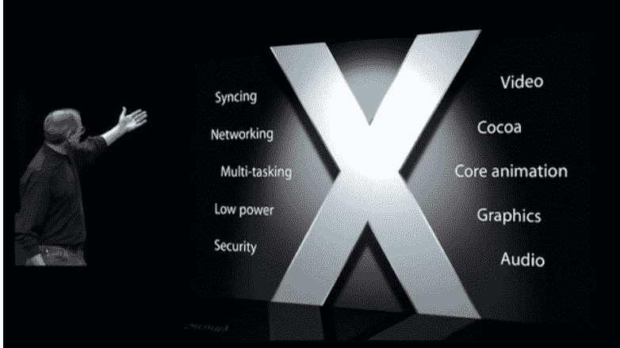

乔布斯列举了 Mac OS X 和 iPhone OS 的主要功能

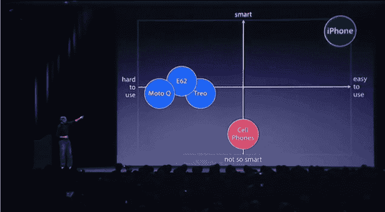

乔布斯使用了一点他扭曲现实的能力，声称“我们已经发明了一种叫做多点触摸的新技术，这是一种非凡的技术”，但没有承认任何以前的发明者。苹果公司这一说法背后的主要天才韦恩·韦斯特曼甚至没有被邀请参加这次活动。

乔布斯通过再次逗观众来揭开新的多点触控 UI:

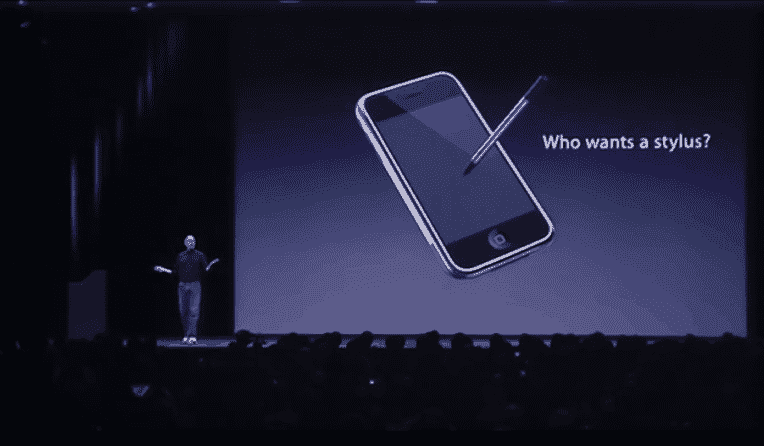

“我们要怎么交流？我们不想带着一只老鼠。那我们该怎么办？哦，手写笔，对吧？我们要用手写笔，对吧？不要！谁想要手写笔？你必须得到它们，然后你把它们收起来，你就会失去它们。呸！没人要手写笔！”

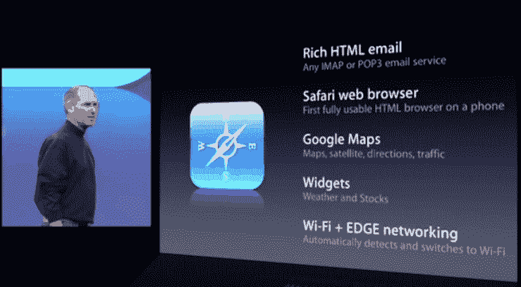

iPhone 附带了 HTML 电子邮件、Safari 网络浏览器(手机上第一个完全可用的 HTML 浏览器)和谷歌地图。

乔布斯随后在台上欢迎谷歌首席执行官埃里克·施密特。要理解这一点为何如此重要，我们必须解释一下苹果和谷歌在 2005 年前后的背景故事。

## 苹果 [< 3](https://en.wikipedia.org/wiki/Heart_(symbol)#Encoding) 谷歌

从 2006 年开始，苹果和谷歌之间的关系越来越好，因为他们的服务对双方都有利。

举个例子，虽然乔布斯认为 iPhone 原型过于敏感，不能让他自己的大多数员工知道任何关于它的事情，但他很乐意向谷歌的拉里·佩奇炫耀，后者建议他们添加谷歌地图。乔布斯立即同意了这一点，谷歌同意让苹果工程师带着谷歌地图的完整源代码走出他们的办公室，而无需签署任何书面合同。

谷歌地图相对较新，因为它于 2005 年 2 月在台式机和笔记本电脑上推出。谷歌地图在手机上的实现使得导航和探索新地点比以往任何时候都更容易。

施密特还建议苹果在 iPhone 上安装一个 YouTube 应用。虽然乔布斯没有立即同意，但这是他正在考虑的一个想法。

## 施密特在 Macworld 大会上

乔布斯随后在台上欢迎了苹果董事会的新成员，谷歌首席执行官埃里克·施密特。许多年前，当施密特在太阳微系统公司，乔布斯在 NeXT 公司时，施密特就和乔布斯做过生意，他们互相尊重。2006 年 8 月 29 日，苹果发布了一份新闻稿解释新战略:

“作为谷歌的首席执行官，埃里克显然做得非常出色，我们期待他作为苹果董事会的一员做出贡献，”苹果首席执行官史蒂夫·乔布斯说。“像苹果一样，谷歌非常注重创新，我们认为埃里克的见解和经验将非常有价值，有助于在未来几年指导苹果。”

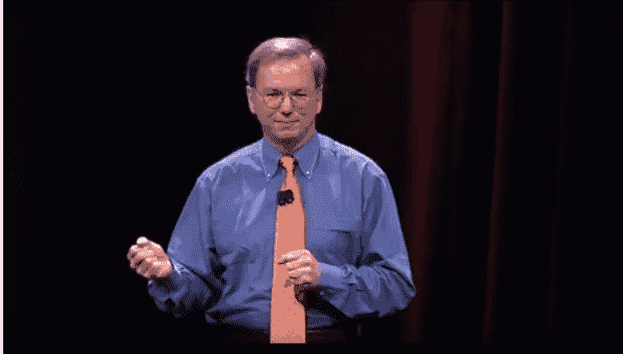

施密特发表了一个简短的演讲，充满了对乔布斯的奉承，他谈到了他们的合作如何帮助两家公司专注于他们最擅长的领域，以及谷歌和苹果的公司文化如何相似。

对苹果与谷歌合作的热烈掌声有助于让乔布斯相信，在 YouTube 应用程序上与谷歌合作也是一个好主意。施密特将舞台交还给乔布斯，乔布斯宣布谷歌不是他们唯一的合作伙伴。

## 雅虎伙伴关系

iPhone 为用户提供了在谷歌和雅虎搜索引擎和雅虎 IMAP 电子邮件服务之间的选择。接下来，乔布斯欢迎雅虎联合创始人兼首席执行官杨致远上台。杨致远表示，他希望雅虎的新技术 OneSearch 能很快在 iPhone 上推出，并在移动设备上提供 Web 2.0 服务方面取得成功。

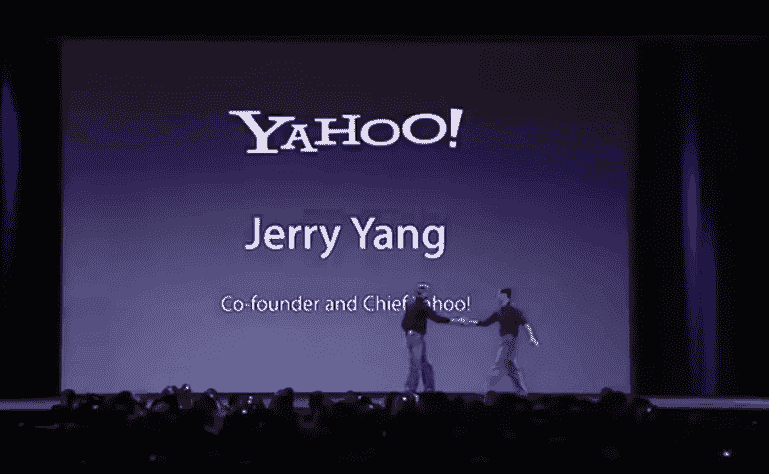

乔布斯声称 iPhone 的电池续航时间为 5 小时，可用于视频、通话或浏览。到发布时，苹果公司将这一声称增加到 8 小时通话、7 小时视频或 24 小时音频。苹果基于其各种创新申请了 200 多项专利。

最后上台的嘉宾是 Cingular 首席执行官斯坦·西格曼。Cingular 与苹果合作，成为美国唯一的网络提供商，iPhone 在 Cingular 商店和苹果商店都有销售。Sigman 宣布 Cingular 现在是美国电话电报公司的一部分，并声称他们一起提高了标准。

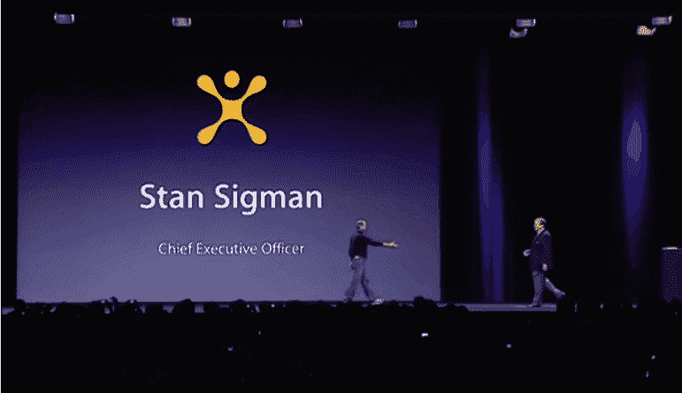

乔布斯最后说，手机市场如此巨大，1%的市场份额意味着 1000 万台。苹果的目标是在 2008 年底达到这个市场份额。

乔布斯和计算机科学先驱艾伦·凯的友谊可以追溯到 20 世纪 80 年代，当时凯告诉《新闻周刊》，麦金塔是“第一台值得批评的电脑”

Macworld 2007 的最后，乔布斯把 iPhone 递给凯，问道:“艾伦，你觉得这值得批评吗？”凯回答说:“把屏幕变大，你就能统治世界。”

## 第一代 iPhone 的受欢迎程度和销量

iPhone 于 2007 年 6 月 29 日在美国上市，具有 3.5 英寸和每英寸 160 像素的显示屏，200 万像素的摄像头，WiFi，蓝牙，带麦克风开关的立体声耳机，接近传感器，环境光传感器，以及用于感应何时在人像和风景模式之间切换的加速度计。

4GB 型号的零售价为 499 美元，8GB 型号的零售价为 599 美元，合同期为两年。乔布斯认为这是物有所值，他认为你实际上买了一个 199 美元的 iPod 和一个 299 美元的智能手机，并免费获得了许多额外的功能。然而，这有点误导，因为第五代 iPod 有 80GB 的存储空间，而 iPhone 只有这个空间的一小部分，电池寿命也更短。

在发布前的准备阶段，围绕该产品的宣传达到了极致。最大的苹果粉丝称它为“耶稣手机”这个俚语源于 Gizmodo 博客作者 Brian Lam 的一篇恶搞文章[，但是在 iPhone 发布前，这个词被主流媒体采用并推广开来。即使是 Lam 呼吁终结这种夸张的说法，也丝毫没有降低人们对这款新手机的热情。](https://gizmodo.com/224143/the-pope-says-worship-not-false-idols-save-us-oh-true-jesus-phone)

许多关于 iPhone 的评论都非常正面。《时代》杂志授予它 2007 年[发明](http://content.time.com/time/specials/2007/article/0,28804,1677329_1678542_1677891,00.html)，称它为“永远改变电话的电话”

在伦敦举行的 GQ 颁奖典礼上，U2 乐队的 Edge 向 Jony Ive 颁发了年度产品设计师奖，宣布“GQ 年度产品设计师是 iPod、iPhone 以及我们所知道和喜爱的所有苹果产品的创造者。他把美丽的东西带给大众，他是真正有天赋的乔纳森·伊夫。”

微软首席执行官史蒂夫·鲍尔默是反对的声音之一。他认为这款手机太贵了，不可能成功。它对商业客户没有吸引力，因为它没有键盘，这使它不是一台非常好的电子邮件机。”

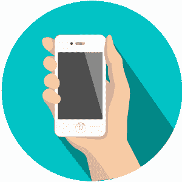

Microsoft was working in partnership with Nortel to produce their own smartphone, so it is not surprising that Ballmer wanted to dampen down the iPhone hype, but his view had some merit.

大卫·波格(David Pogue)为《纽约时报》( New York Times )( New York Times )( New York Times )( New York Times )( New York Times )( New York Times )( New York Times )( New York Times )( New York Times )( New York Times )( T2)撰写了一篇文章，他在文章中对 iPhone 大部分的宣传都进行了赞扬和批评:

> “iPhone 是革命性的；它有缺陷。是物质；是风格。它做了以前没有手机做过的事情；它缺乏最基本的手机所具备的功能。”

波格对网络浏览器特别感兴趣，它给人的体验远远好于市场上的任何其他产品，但他指出，“浏览器不能处理 Java 或 Flash，这会让你失去数百万个网络视频。”

几位科技记者指出，电池寿命不足，没有苹果公司声称的那么长。并不是每个人都对苹果公司做出的几乎不可能更换电池的决定感到高兴。据报道，200 万像素的摄像头不如诺基亚高端手机的技术，而且它不能用于录制视频，因为苹果没有足够的时间编写必要的软件。对于他们的第一代 iPhone，苹果并没有将摄像头作为一个非常高的优先事项，但随着后来的机型，这种态度发生了变化。

另一个常见的抱怨是，在其他手机使用 3G 的时候，由于使用老化的蜂窝网络，没有 WiFi 接入，网页浏览速度非常慢。由于 iOS 平台是如此之新，在推出时缺乏可用的软件:它附带了 16 个应用程序，而且没有更多可供下载的软件。

乔布斯坚决反对向苹果以外的任何人开放 iOS 平台。他告诉《纽约时报》，“你不希望你的手机像电脑一样。”在发布的那天，他说，“你不希望你的手机成为一个开放的平台。你不会希望它因为那天早上你加载的三个应用程序中的一个出错而无法运行。”这种极端激进的态度让开发者和消费者都不高兴。

一些消费者也希望有选择运营商的自由，但 iPhone 被锁定只能使用 AT&T 提供的网络。当时，包括美国电话电报公司在内的几家电信公司对任何提供解锁服务的人都采取了咄咄逼人的态度，解锁手机的做法在欧洲和北美都是很多法律纠纷的主题。

所有这些因素都是为什么尽管人们对 iPhone 热情很高，但 iPhone 的早期销量却远低于诺基亚和三星等老牌公司的部分原因。

## iPhone 销售放缓

销售的第一个周末取得了巨大的成功。世界各地的媒体机构报道称，铁杆苹果粉丝在苹果商店外排队数小时，只为有机会购买一部 iPhone。劳拉·英格尔报道了纽约市苹果商店发布日的造势活动，在接受《新闻周刊》的史蒂文·利维采访时，一名男子在被摔倒在地之前抢走了她的麦克风，令所有人大吃一惊。一分钟后，英格尔和利维继续接受采访，但两人显然都被这一事件震惊了。

另据报道，iPhone 在上市的头几个月就销售一空；然而，这主要是由于供应短缺。

一个鲜为人知的事实是，第三季度销售疲软。苹果对这种失望的回应是放弃 4GB 型号，并将 8GB 型号的价格降至 399 美元。随着降价和在欧洲的推出，苹果在圣诞节期间销售了超过一百万台设备。

尽管到 2007 年底，销售势头越来越猛，但如果苹果要达到 1%的市场份额目标，还有很长的路要走。

## 开发者对 iPhone 的强烈反对

与此同时，随着人们对如此强大的智能手机的可能性越来越兴奋，来自开发者的各种博客帖子涌现出来，要求苹果向第三方开发者开放平台。

在苹果内部，许多工程师也想为 iPhone 提供软件开发工具包，但乔布斯认为，第三方应用程序可能会让苹果陷入法律风险:“我们不想承担你无法拨打 911 的责任，因为一些糟糕的应用程序把整个事情都搞糟了。”

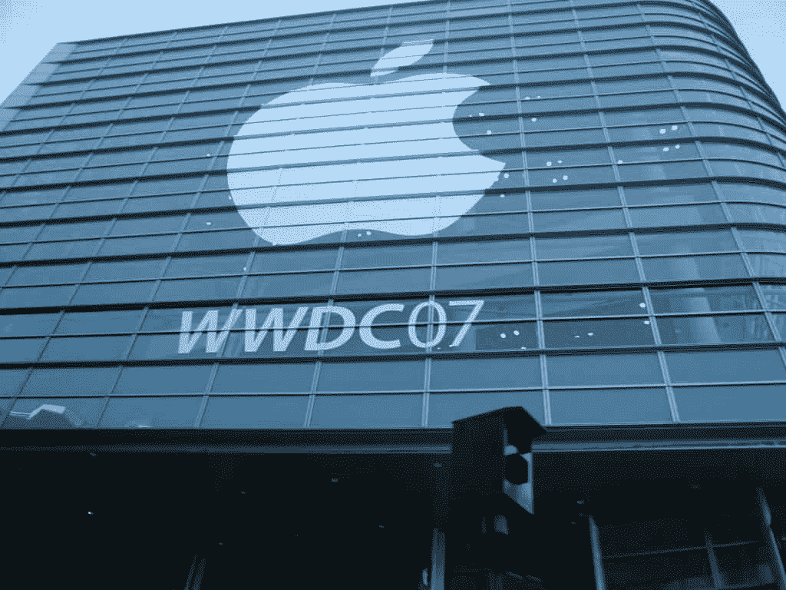

WWDC 2007 在三藩市莫斯康中心。版权所有[大卫·勒尼汉](http://davidlenihan.com/)

2007 年 6 月，苹果的开发者大会， [WWDC 2007](https://www.youtube.com/watch?v=Shu6_lO1PW8) 以假冒的史蒂夫·乔布斯调侃 Windows Vista 和 Zune 开始，并宣布他别无选择，只能退出并关闭苹果。然后真正的乔布斯走上台宣布，“你可以为 iPhone 编写伟大的应用程序:它们被称为‘网站’。”"

John Gruber 发现这种说法几乎和虚假的乔布斯一样虚假，并回应说这种侮辱性的说法是开发者可以一眼看穿的。其他智能手机制造商允许第三方开发者为他们编写应用程序，而苹果则落后了。

## 释放 iPhone

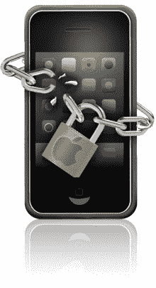

开发者并不是唯一对 iPhone 和苹果的局限性不满的群体。

一群名为 [iPhone 开发团队](https://en.wikipedia.org/wiki/IPhone_Dev_Team)的黑客决定，消费者应该可以自由选择他们喜欢的 iPhone 网络运营商。他们找到了将手机锁定在 AT & T 网络上的基带处理器芯片，在其上焊接了一根电线，并使其失效。他们编写了一个程序，使 iPhone 能够与任何无线运营商合作。

2007 年 8 月 21 日，乔治·霍兹在 YouTube 上发布了世界上第一部解锁 iPhone 的视频，展示了它在 T-mobile 网络上打电话。

由于 iPhone 只能连接麦金塔电脑，大学生王耀庆贴出了如何让 iPhone 与微软视窗系统兼容的说明。

最初的 iPhone 有许多安全漏洞，包括当用户导航到带有 TIFF 图像的网页时，Safari 浏览器崩溃的错误。黑客发现这可以被用来控制操作系统。

这种做法被称为[越狱](https://en.wikipedia.org/wiki/IOS_jailbreaking)，黑客们创建了一个 [jailbreakme](https://www.jailbreakme.com/#) 网站，在那里一个“滑动解锁”按钮让原本繁琐的过程变得非常简单。iPhone 开发团队内部甚至有一个人:[本·拜尔](https://fail0verflow.com/blog/2016/ben/)，他在苹果公司担任高级嵌入式安全工程师，化名“[套管](https://www.theiphonewiki.com/wiki/User:Bushing)，是 iPhone 开发团队的核心成员之一。

乔布斯曾告诉媒体，对付越狱者是“一场猫和老鼠的游戏”，并补充道，“我不确定我们是猫还是老鼠。”拜尔同时扮演猫和老鼠。

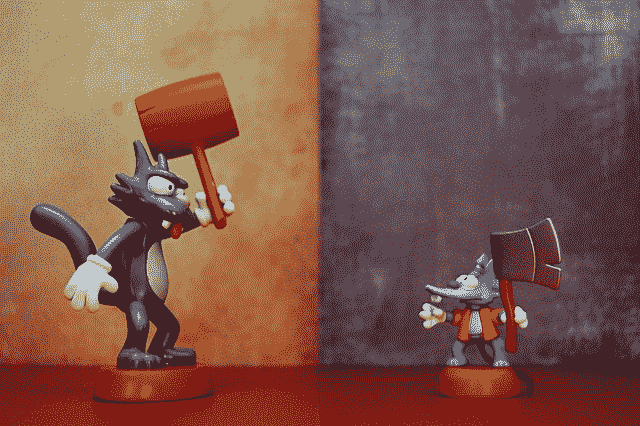

Itchy 和 Scratchy，比喻苹果和 iPhone 开发团队。JD Hancock 的照片

2008 年 2 月，Jay Freeman 为越狱的 iPhones 发布了 Cydia。Cydia 是 App Store 的前身，允许用户下载应用程序，重新设计屏幕布局，并进行许多其他未经苹果官方允许的定制。

2008 年，越狱(表面上)违反了 1998 年的数字千年版权法(DMCA)。尽管苹果从未起诉过任何越狱者，但黑客们冒着成为罪犯的风险，仅仅是因为开放了苹果的平台。

每三年，美国版权局召开一次“规则制定”会议，考虑给予 DMCA 豁免。电子自由前线(EFF)自该法案首次推出以来，一直在为其争取豁免。2009 年，它与苹果公司对抗。

## 支持和反对 iPhones 越狱的法律案例

2009 年 5 月 1 日，苹果高管 Greg Joswiak(iPhone 产品营销副总裁)，[在加州的一次法庭听证会上与 EFF 辩论了](https://www.copyright.gov/1201/hearings/2009/transcripts/1201-5-1-09.txt)越狱的优点。

Joswiak 认为，“越狱攻击并修改操作系统，这样做侵犯了苹果和第三方软件。这破坏了原本非常有益的生态系统。那是因为当你修改和黑 iPhone OS 时，任何事情都可能出错。”

在描述了 iPhone 产品的各种成功之后，Joswiak 解释了苹果的目的:“我们希望保护产品不被修改和复制，保护我们的软件不被修改和复制，因为这些操作系统修改会造成损害。”

Joswiak 表示，尽管只有 1%的 iPhone 被越狱，但越狱 iPhone 的应用程序“是 iPhone 上最大的崩溃错误”他谈到了苹果的家长控制，并认为越狱应用程序“可能会让儿童接触到不适合他们年龄的内容。”

他还担心，这种做法可能“有损害苹果品牌的风险”，因为“对于有越狱手机的人来说，他们甚至经常没有意识到他们的问题可以追溯到越狱手机。”

弗里德里希·冯·罗曼。Ralf Roletschek 拍摄的照片， [CC BY-SA 3.0](https://commons.wikimedia.org/w/index.php?curid=18378150)

弗里德里希·冯·罗曼(Friedrich von Lohmann)代表 EFF 回答说，他是苹果和 iPhone 的忠实粉丝。他将苹果的担忧描述为家长式的，并同意“鉴于刚刚强调的这些担忧，许多用户将选择不越狱他们的手机。”

Lohmann 将这种情况比作购买汽车的非官方零件:“我有一辆丰田车。

当然，丰田更希望我只使用正宗的丰田零件和丰田经销商提供的服务，他们也更希望我不要以可能对我有危险的方式改装我的丰田汽车。我很感激，但这毕竟是我的车。"

他对 Joswiak 对越狱手机的较低估计提出质疑，称“目前至少有 180 万部越狱 iphone，约占发布的 iphone 的 10%。”

罗曼解释说，出于苹果的商业利益，一些第三方开发者应用被禁止进入官方应用商店:

> 我们现在得到了 Mozilla 和 Skype 的支持，他们谈到了为什么他们的应用程序被排除在外。就 Mozilla 而言，苹果不允许在 iPhone 上使用其他浏览器框架。就 Skype 而言，他们现在在 App Store 中有一个应用程序，但不允许使用 3G 数据网络来拨打电话。这也是苹果强加的限制。

他最后反驳了苹果关于安全性的观点:“让我们百花齐放。如果说我们在过去 10 年中学到了什么，那就是当有许多竞争对手试图提供安全时，安全就会蓬勃发展，而不是每个人都必须共同依赖的一个提供商。”

## 自由选择的胜利

2010 年 7 月 26 日，EFF 发布了一份新闻稿庆祝 DMCA 的三项豁免，包括版权局的决定，即为了使用未经苹果或其他智能手机制造商批准的独立创建的应用程序而越狱属于合理使用。

2012 年，EFF 再次向美国版权局申请对 DMCA 立法的豁免，称“这些限制损害了竞争、消费者选择和创新。”iPhone 开发团队的追求是他们请愿书中使用的主要例子。版权局在其最终规则制定中更新了对智能手机的豁免，但没有将其扩展到其他设备。

越狱和 Cydia 的流行是苹果决定创建自己的应用商店的众多原因之一。2008 年初，iPhone 消费者严重缺乏选择，但 App Store 改变了这一切。

2007 年，斯科特·福斯特尔开始大力推动乔布斯允许第三方应用。他说，“史蒂夫，我会把软件放在一起，如果发生事故，我们会确保保护它。我们会隔离它。我们不会让手机死机。”2007 年 10 月，乔布斯在苹果网站上宣布了自己的改变:“让我直说吧:我们希望在 iPhone 上有第三方应用。”

> “有时候当你创新时，你会犯错误。最好尽快承认它们，并继续改进你的其他创新。”史蒂夫·乔布斯

2008 年 2 月，当苹果发布 16GB 型号的 iPhone 时，他们提供了黑色和白色两种版本。这让用户能够在智能手机上放两倍多的歌曲。但大多数消费者决定等待下一代 iPhone。

2008 年 3 月，乔布斯公布了 iPhone 软件路线图，并发布了 iPhone 软件开发工具包(SDK)，允许开发者制作自己的 iPhone 应用程序。

## iPhone 3G 的发布

在[苹果 WWWDC 2008](https://www.youtube.com/watch?v=r7fVWjgxRwk) 上，乔布斯宣布了 iPhone 3G。虽然大部分硬件与最初的手机相同，但它比其前身提供了许多更强的卖点。

iPhone 3G 拥有更快的 3G 网络速度、企业支持和第三方应用程序支持，并且比最初的 iPhone 在更多的国家和地区有售。

乔布斯承认第一代 iPhone 太贵了，并透露 56%的美国潜在 iPhone 客户将此作为他们尚未购买 iPhone 的原因。

乔布斯展示了在 iPhone 3G 上加载国家地理网站的速度是第一代 iPhone 的 2.8 倍，比竞争对手诺基亚和 Treo 3G 手机快得多，只比 WiFi 连接略慢。

iPhone 3G 还提供了更长的电池寿命、质量更好的扬声器，以及一个[辅助的全球定位传感器](https://en.wikipedia.org/wiki/Assisted_GPS)。

对普通消费者来说，最好的是 8GB 型号的 399 美元价格被削减到 iPhone 3G 的 199 美元。

苹果当时未能在亚洲推出，所以他们决定在那里推出 iPhone 3G。iPhone 3G 于 2008 年 7 月 11 日在 22 个国家推出，接下来的几个月还将在全球 48 个国家推出。苹果终于有一款真正的主流设备上市了。

## App Store 让 iPhone 销量暴涨

为 iPhone 和 iPhone 3G 推出的[应用商店](https://en.wikipedia.org/wiki/App_Store_(iOS))为苹果创造了一个良性循环:商店里的应用越多，iPhone 的销量就越大。iPhones 卖得越多，开发者对这个不断增长的市场越感兴趣。

iPhone 第一年销量最大的应用是意外成功的玩笑应用 [iFart](https://en.wikipedia.org/wiki/IFart_Mobile) 。在[深夜](https://www.youtube.com/watch?v=2HfY12YCDh4)和[白天](https://www.youtube.com/watch?v=nS0Arm4rskE)脱口秀节目上的免费宣传，以及在俄亥俄州市议会会议上的一些不合适的音效，帮助下载量飙升。仅在头两个星期内，它就以每本 99 美分的价格售出了 10 万本，此后它的主要开发者乔尔·科姆赚了 50 多万美元。

在接受 MacCult[采访时，他透露，](https://www.cultofmac.com/7931/talking-with-the-man-behind-ifart/)

> 我把我的管理团队拉到会议室，我们走到白板前，开始写下各种想法。我们谁也不记得是谁想出了放屁机的主意，但当我们想到这一点并说‘我们必须开发这个’时，我们笑了。就这样。一群成年男人允许他们内心 12 岁的孩子表达自己。我们知道它会畅销。

2008 年 10 月 21 日，苹果公布了第四季度的财务业绩，并透露仅在该季度就售出了 690 万部 iPhone，打破了 2007 年为自己设定的 1000 万部 iPhone 的销售目标。

乔布斯吹嘘道，“以收入(而不是单位)衡量，苹果已经成为世界第三大手机供应商。”他还表示，客户会在第二天从应用商店下载第 2 亿个应用。

2009 年，苹果的营销部门在一个 29 秒的广告中抓住了 iPhone 3G 需求如此强劲的本质，“[有一个针对那个](https://www.youtube.com/watch?v=szrsfeyLzyg)的应用。”这非常简单地表明，无论你想做什么，都可能有一个应用程序可以做到这一点。这个口号如此吸引人，以至于苹果公司决定将它注册为商标。

虽然苹果公司为他们惊人的增长感到兴奋，但一个新的竞争对手最近进入了这个领域，他们将比市场领导者诺基亚和三星给他们带来更多的竞争。

加入我们的第 14 部分，见证 Android 的诞生。