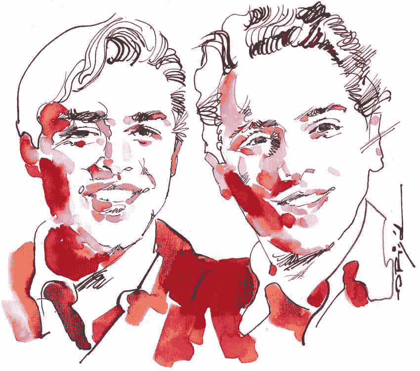
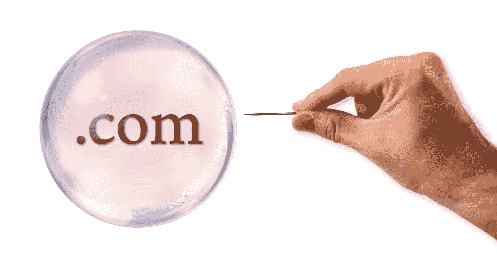
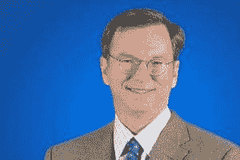
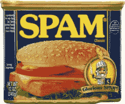
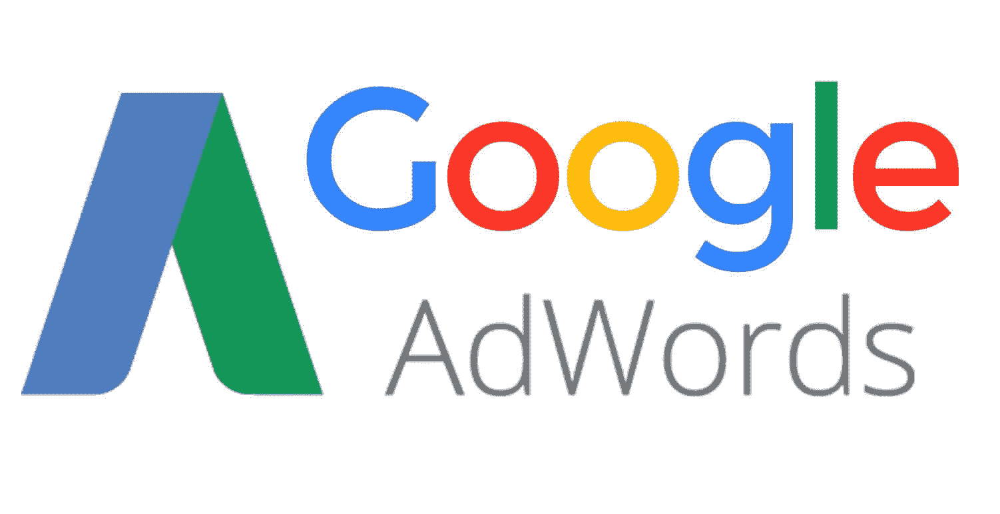

# 互联网历史:第八部分——谷歌的故事

> 原文:[https://simple programmer . com/history-internet-eight-Google-story/](https://simpleprogrammer.com/history-internet-eight-google-story/)

欢迎来到我们“互联网历史”系列的第 8 部分。在第七部分中，我们看了一些早期的搜索引擎，包括 Lycos，AltaVista 和 Yahoo！。到 1996 年，AltaVista 和雅虎！是目前为止互联网用户寻找新网站的两个最受欢迎的选择。

谷歌由谢尔盖·布林和拉里·佩奇共同创立。这两位发明家都有非常聪明的父母，在接触电脑的环境中长大。佩奇的父母在 1978 年买了一台家用电脑，佩奇很快就以打印的 Word 文档的形式上交了作业，这让他的老师们感到惊讶。他喜欢实验，在高中时，他用乐高积木搭建了一台可以工作的喷墨打印机。

拉里·佩奇和谢尔盖·布林。Graziano Origa 的艺术作品

布林是美国国家航空航天局(NASA)科学家和数学老师的儿子。从 Commodore 64 开始，他就喜欢上了计算机，并分享了他父亲对数学的兴趣和天赋。他在 19 岁时就获得了马里兰大学数学和计算机科学的本科学位。

佩奇与布林相识于 1995 年，当时两人都在攻读计算机科学博士学位。

到了 1996 年，他们经常在一起，以“LarryandSergey”这个词闻名后来，他们被称为谷歌人。

布林和他的教授 Rajeev Motwani 一起研究了一些现有的搜索引擎，但他们发现所有的搜索引擎都有缺陷。通常情况下，一次搜索会返回数百个没有明显顺序的结果，筛选这些结果并找到有价值的结果要花费太多时间。

佩奇喜欢使用 AltaVista，但奇怪的是，除了报道这些链接之外，他们似乎没有对这些链接做任何事情。他认为对这些超链接进行复杂的分析可以带来更好的搜索。但首先，他需要一个非常大的数据库。

## 搓背和 PageRank

佩奇有一个疯狂的想法，把整个互联网下载到他的电脑上，并表示这可以很容易地做到。他没有被任何对此持怀疑态度的人所劝阻，并在 1996 年立即开始工作。

布林被这个项目吸引，不仅是为了和佩奇一起工作，也是因为他对从大量数据中提取有用信息感兴趣。布林是这方面的理想人选，因为他最近在斯坦福大学成立了一个名为挖掘数据的研究小组，简称 MIDAS。

他们一起用 [Java](https://simpleprogrammer.com/2016/10/06/learn-java-java-101/) 和 [Python](https://simpleprogrammer.com/2017/02/15/get-started-learning-python/) 编写了“BackRub”。他们在 [Sun Ultras 和英特尔奔腾机器](http://infolab.stanford.edu/pub/voy/museum/pictures/display/GoogleBG.jpg)上运行该程序，其中包括一台由乐高积木制成的机器。这些计算机主要由国家科学基金会、国防高级研究计划局和美国国家航空航天局资助，作为斯坦福数字图书馆项目的一部分。

将其命名为 BackRub 的想法来自于搜索引擎对分析反向链接(链接到你网站的网站)的关注。

佩奇认为，链接到某个特定网站的网站越多，这个网站越有可能成为人们认为最有价值的网站。他认为网络链接就像学术论文中的引用一样。“事实证明，获得诺贝尔奖的人引用了 1 万篇不同的论文，”他说。

不仅最常被引用的论文受到高度重视，引用这些论文的行为也是在较新的学术论文中创造强有力的论点的重要部分。

这是 1998 年初申请专利的技术[的基础，“PageRank”，以其发明者 Page 命名。](https://www.google.com/patents/US6285999)

他们放弃了 BackRub 这个名字，开始将他们的技术称为“Google”，这是 googol (10 的 100 次方)的常见拼写，因为他们觉得这非常符合他们建立超大规模技术的目标。

该搜索引擎首先在 google.stanford.edu 大学内部推出，并迅速在校园内流行起来。它简单干净的界面与雅虎形成鲜明对比。和其他商业搜索引擎。

## 谷歌研究论文

康乃尔大学教授乔恩·克莱因伯格深入研究了搜索引擎技术，并开发了用于网页排名的 T2 点击算法。1997 年夏天，他拜访了佩奇，这样他们就可以互相分享发现。克莱恩伯格刚刚完成了一篇开创性研究论文的初稿，“超链接环境中的[权威来源，](http://www.cs.cornell.edu/home/kleinber/auth.pdf)”，并鼓励佩奇发表自己的学术论文。

佩奇最初对这个想法很警惕，因为有人可能会窃取他的想法。然而，专利申请几个月后，布林和佩奇在 1998 年发表了一篇名为“大规模超文本网络搜索引擎的剖析”的论文。在这篇论文中，他们认识到，主要的技术挑战是如何扩大规模，以处理他们预测搜索引擎将很快需要处理的每天数亿次查询。

在研究论文中，作者们的智慧大放异彩。他们敏锐地意识到挑战，但也认识到硬件成本下降可能给他们带来的机遇。

他们最后预测了搜索的光明前景，但对于需要克服的许多障碍，他们丝毫没有沾沾自喜。

为了取得成功，需要解决一些大问题，包括如何足够快地爬行整个 web 以跟上快速的内容变化，以及如何有效地存储如此多的信息。

商业成功不仅仅取决于技术解决方案，还取决于为客户提供比 AltaVista、Yahoo！，以及其他竞争对手。他们指出，“今天网络搜索引擎的用户面临的最大问题是他们得到的结果的质量”，并给出了一个例子，即查询“比尔·克林顿”将 1997 年 4 月 14 日的一个比尔·克林顿的笑话作为首要结果返回。

布林和佩奇对消费者体验的强烈关注甚至在一开始就阻止了他们从广告商那里拿钱:“我们预计广告资助的搜索引擎将天生偏向广告商，远离消费者的需求。”

他们想不出一种客观的方法来评估返回结果的质量，但觉得他们的引擎已经返回了比竞争对手好得多的结果。对谷歌的大部分早期反馈来自斯坦福大学的用户，而且大部分是积极的，尽管经常中断斯坦福的互联网连接！

到 1998 年，科技记者也热情高涨。PC Magazine 回顾了他们的技术，该技术被标记为 Beta，作为他们的 100 大网站指南的一部分，并总结道:“谷歌还有更多未来！，但即使在其原型形式，它也是一个伟大的搜索引擎。”然而，该杂志也宣称，“AltaVista 仍然是最好的暴力网络搜索引擎。”

## 早期投资

1998 年 3 月，佩奇和布林第一次向搜索市场的领头羊 AltaVista 寻求投资。他们相信他们的技术可以帮助改善他们的搜索结果，并希望以 100 万美元的价格出售他们正在申请专利的技术，使他们能够获利，然后完成他们在斯坦福大学的学业。

AltaVista 的架构师 Paul Flaherty 认为，“他们基于链接的网页排名方法确实有一些东西，这是 AltaVista 当时的技术弱点。”弗莱厄蒂同意和他的同事谈谈，仔细考虑一下。然而，AltaVista 的母公司数字设备公司(DEC)并不喜欢这个想法。

DEC 与康柏电脑公司的合并悬而未决，改进他们的搜索引擎对他们来说既不是重点也不是优先事项。几个星期后，弗莱厄蒂把这个不幸的消息传回给了佩奇和布林。

雅虎！拒绝了同样的投资机会，部分原因是他们希望用户在他们的网站上花更多的时间。谷歌技术旨在让用户快速找到他们想去的地方，然后继续前进。

雅虎联合创始人大卫·费罗，想帮助他们，但是。他建议布林和佩奇离开斯坦福大学去创建他们自己的公司，甚至把他们介绍给了自己的投资者迈克尔·莫里茨。作为更大的公司，雅虎！莫里茨与谷歌的人保持联系会有所收获。如果谷歌的技术继续改进，足以引起改变主意，费罗和杨致远可以与他们的投资者达成未来的交易。

其他搜索引擎公司也拒绝了他们。许多业内人士认为，搜索已经足够好了，要想赚更多的钱，只需要卖出越来越多的广告。随着越来越多的人发现万维网并第一次使用搜索引擎，这种快速致富的策略目前正在为他们服务。

布林和佩奇对这些拒绝感到沮丧，不知道该怎么办。他们决定在斯坦福大学继续开发这项技术几个月，并处理用户反馈。

到 1998 年 8 月底，他们有了转机。他们学校的一位教授大卫·谢瑞登打电话给一位硅谷天使，告诉他布林和佩奇有一个好主意要展示给他看。

Sun Microsystems 的创始人安迪·贝克托尔斯海姆(Andy Bechtolsheim)喜欢在早期阶段投资技术，他几乎立刻就看到了谷歌新技术的巨大潜力。

早上 8 点，他在去工作的路上，在加州的帕洛阿尔托停留了一下，会见了布林和佩奇，看了一个演示，说:“这是我多年来听到的最好的主意。我想成为其中的一员。”

他走向他的车去拿他的支票簿。与此同时，布林和佩奇兴奋地对视着，互相询问应该向他要多少钱。

当 Bechtolsheim 回到家里时，他们告诉他 50，000 美元。他回答:“哦，我觉得这还不够；我认为应该是两倍，”并给谷歌公司开了一张 10 万美元的支票。布林和佩奇去汉堡王吃早餐庆祝。

除了 100，000 美元，这种支持给了他们更有价值的东西:信誉。贝希托尔斯海姆就是如此，布林和佩奇现在更容易卖给未来的投资者。他们很快就从三个投资者那里获得了大约 100 万美元:杰夫·贝索斯、T2、罗恩·康韦和 T4。

Bechtolsheim 开车离开时，他对自己的投资很有信心，但他不知道这会有多大的利润。多年后，他说，“我当时不知道这能有多大。没人知道。”

## 斯坦福大学演讲

在几个月的时间里，投资者的兴趣从冰冷变成了炽热。压力现在落到了布林和佩奇身上，他们不想让任何人失望。他们决定向斯坦福大学请假，但在离开之前，他们在比尔·盖茨计算机科学大楼给其他学生做了一次演示。

他们的引擎在计算搜索结果时比竞争对手使用了更多的计算能力，考虑了许多因素，如字体大小、单词和短语之间的距离以及大小写。所以，为了让这个项目成功，他们需要强大的硬件。

布林解释说，他们相信摩尔定律:硬盘和记忆棒将继续变得更快、更便宜、容量更大，这使得谷歌可以购买足够的硬件，在全球范围内快速提供结果。

佩奇举例说明了单词间距离的问题。通常，用户使用不止一个单词进行搜索。其他搜索引擎会统计这些词在页面上出现的次数，但谷歌会根据这些词之间的接近程度对网站进行排名。

佩奇谈到了击败那些试图欺骗搜索引擎给他们更高排名的网站的挑战，称这是一个非常严重的问题，但他正在努力解决这个问题。

## 谷歌公司。

1998 年 9 月，在他们的朋友、营销专家苏珊·沃西基位于加州门洛帕克的车库里，谷歌人正式成立了他们的公司谷歌。沃西基也成为了他们的第一个房东。他们把所有的电脑都搬进了车库和房子里的几个房间。他们的第一名员工是斯坦福大学的同学[克雷格·西尔弗斯坦](https://en.wikipedia.org/wiki/Craig_Silverstein)。

布林和佩奇知道，在梦想人们称他们为下一个雅虎之前，他们还有很长的路要走。但至少他们开始的方向是正确的。

虽然他们在斯坦福休假，但他们仍保持联系。大多数谷歌用户是斯坦福大学的学生，使用量的增长得益于他们的积极口碑。

在车库工作了五个月之后，团队搬到了位于旧金山附近帕洛阿尔托市中心大学大道的新办公室。为了满足他们的免费服务不断增加的负载，他们开始批量订购 21 台新电脑，没过多久，他们的第一个一百万就几乎花光了。

谷歌获得了 Red Hat 作为他们的第一个客户，在他们的内部和外部网络上运行这项服务。然而，这给了谷歌很少的回报，他们发现自己处于破产的危险之中。

谷歌很幸运，在网络繁荣时期推出。互联网公司的股价大多在飙升。举个例子，杰夫·贝索斯最初以每股十分之一便士的价格向亚马逊投资了 1 万美元。亚马逊以每股 18 美元的价格上市，给贝佐斯带来了 180 万美元的巨大投资回报(1.84 亿美元)。一年后，股票甚至涨到了每股 105 美元，使公司价值达到 50 亿美元，尽管公司从未盈利！

有了这些巨大的成功故事，投资者比以往更愿意拿出他们的现金，购买一家可能成为下一个网络名人的公司的股份。

1999 年，谷歌进行了第二轮投资。放弃了标准的枯燥的 PowerPoint 演示，转而展示他们的尖端技术，谷歌的家伙们很快就留下了深刻的印象，并收到了两家竞争激烈的投资公司红杉资本(Sequoia Capital)和凯鹏华盈(Kleiner Perkins Caufield & Byers)的单独邀请。

在罗恩·康韦和拉姆·施拉姆的帮助下，谷歌的人说服了两家投资公司和几个较小的投资者一起完成了交易，筹集了 2500 万美元。

1999 年，没有人知道市场会如何变化，而雅虎！现在可能有兴趣使用谷歌来增强他们的服务。这笔交易让(红杉资本的)迈克尔·莫里茨在谷歌董事会获得了一个席位。莫里茨财务利益的主要部分是利用这个席位说服他们做一笔帮助雅虎的交易。。他说，“当我们研究谷歌的时候，我们的想法是，它将为许多其他网站提供动力，最显著的是雅虎！."

这种兴趣在 2000 年 6 月 26 日结出了果实。签署协议，使用谷歌的搜索引擎来增强搜索结果。被布林誉为“谷歌的重要里程碑”，这无疑是谷歌迄今为止最重要的客户。

谷歌人的另一个胜利是，这笔 2500 万美元的投资交易使他们能够保持多数控制权。但是投资者坚持要他们雇佣一个有经验的 CEO 来把公司变成一个盈利的企业。

对投资者来说，这比谷歌的人更重要，谷歌的人相信，不管有没有新的首席执行官，他们都会找到盈利的方法。这种信心的部分原因是，在我们这个行业极度动荡的时期，他们是一个幸运的受益者。

## 网络泡沫破裂

在之前的几集里，我们已经报道了 90 年代后期互联网的极端增长和投机性投资的一些方面。这是一场电子版的淘金热:一种乐观的情绪，认为投资互联网公司肯定会致富。这就是众所周知的网络泡沫，这个隐喻泡沫不可避免地破裂了。

感受到崩溃影响的公司之一是雅虎！。2001 年 5 月，特里·塞梅尔离开华纳兄弟加入雅虎！几个月后，他宣布了一项重组计划，将裁员 400 人，约占员工总数的 12%。

该公司已经扩张到如此多的不同领域，以至于他们缺乏重点。他们的新商业计划只关注 44 个业务类别中的 6 个:上市、访问、商业、通信、媒体和信息以及企业。塞梅尔呼吁雅虎！免费内容将由收费服务来补充，给他们更多的收入来源。

谷歌是少数几家从网络泡沫中受益的科技公司之一。

随着许多科技公司的股票价值下跌，他们的员工开始寻找其他机会，谷歌显然是其中之一。当他们周围的企业都在裁员时，谷歌却在疯狂招聘，现在他们可以利用的人才库比以往任何时候都多。不仅有才华的下岗员工对为他们工作感兴趣，许多硅谷员工的薪酬也主要基于股票期权。

另一个对谷歌来说非常幸运的例子是，微软反垄断审判与此同时发生。微软总是招募很多非常有才华的工程师，但是当试验进行的时候，微软遭受了大量的负面新闻报道。微软的损失是谷歌的收获。

来到谷歌的大量人才帮助他们进行了重要的技术创新。例如，2001 年，工程师们发明了搜索拼写错误检测，并添加了一个“你是指 __？”搜索结果顶部的选项。从这一点开始，谷歌的技术开始让人觉得它比使用它的人更聪明。

## 不要作恶

在网络泡沫破裂期间，谷歌也创造了他们最著名，也是最有争议的口号:“不要作恶。”许多人喜欢它的简单和经济。其他许多人对此持更加严厉和道德主义的观点，认为谷歌不能成为善恶的仲裁者，或者暗示它没有实现这样一个崇高的目标。

谷歌天使投资人、亚马逊首席执行官贝佐斯辩称，“你不应该是邪恶的，但话说回来，你也不应该吹嘘这一点。”

为了在正确的上下文中理解这个口号，理解它是如何产生的是有用的。

这个术语是出于愤怒而产生的。由人力资源部牵头的一次会议列出了谷歌的核心价值观，产生了许多平淡无奇的例子，比如“准时开会”和“尊重每一个人”。

随着会议的持续，Paul Buchheit 越来越沮丧，直到他脱口而出，“所有这些事情都可以通过说‘不要作恶’来掩盖。”“房间里的其他工程师分享了他对效率的喜爱，特别是 Amit Patel，他非常赞同这一点，并在整个校园的几乎每块白板上都写下了这一点。

## 新任首席执行官

尽管布林和佩奇口头上同意引入一位新的首席执行官，但他们对这位首席执行官应该是什么样的人以及不应该是什么样的人有一些担忧。他们在 1999 年至 2001 年间审查了超过 75 名候选人，但对所有缺乏技术背景的受访者印象不佳。

他们心目中的谷歌首席执行官典范是亚马逊首席执行官贝佐斯。尽管贝佐斯不适合这个职位，但佩奇和布林都钦佩他的智慧和激励员工的能力。任何严肃的候选人都需要有力地展示这些品质。

Eric Schmidt 是 Novell 的首席执行官，之前是 Sun Microsystems 的首席技术官。他的经历既满足了创始人对技术技能的坚持，也满足了投资人对领导技能的需求。然而，他最初对这个角色并不感兴趣:“我觉得搜索没那么有趣，”他回忆道。

施密特最终被非常成功的风险投资家[约翰·杜尔登](https://en.wikipedia.org/wiki/John_Doerr)说服去面试这个角色，他说:“去看看谷歌吧，这是一颗小宝石，需要帮助才能放大。”施密特想和多尔保持良好关系，所以勉强同意了。

谷歌的人并不指望他会比之前许多失败的候选人好多少。然而，由于多尔是主要投资者，谷歌的人知道他们必须同意这次会议。

创始人给施密特留下了难忘的印象，他发现他们傲慢自大，但很聪明:“他们批评我提出的每一个技术要点，以及我在业务中做的每一件事，”他说。

施密特被这场冗长的争论鼓舞了，这让他私下里重新评估了他正在采取的一些行动。后来，当他检查他们争论的实质并发现他们所有的批评都是正确的时，他感到谦卑了。

谷歌的人很高兴看到施密特拥有计算机科学博士学位，并指出他是一个愿意说出自己想法的人。他们也对他开发 Java 编程语言的经历和他与微软的斗争印象深刻。他们相信这次经历可以帮助谷歌避免在未来犯类似的战术错误。

施密特最初以董事长的身份加入，最终成为 Novell 的首席执行官，三个月后接替佩奇担任首席执行官。在谷歌人的坚持下，作为交易的一部分，他同意向谷歌股票投资 100 万美元。

施密特肩负着将谷歌从初创企业转变为高利润企业的艰巨任务。这涉及到这家年轻公司运营的许多方面的专业化。他对谷歌使用 Quicken 作为他们的财务记录和工资系统不以为然。但是谷歌的人拒绝了他用甲骨文的企业解决方案取代它的建议，理由是这是浪费金钱。施密特形容这是“一场巨大的战斗”。

施密特很快发现谷歌在海外表现不佳，60%的搜索量来自美国以外，但只有 5%的广告收入来自美国以外。他开始着手解决这个问题，告诉奥米德·柯德斯塔尼登上飞机，成立一个欧洲销售运营部门。

## 对利润的追求

在谷歌寻求任命新首席执行官的时期，该公司有充足的资本，并因其创新而成为科技媒体的宠儿。然而，投资者越来越担心谷歌难以找到可行的商业模式，而且每月都在亏损。施密特在帮助谷歌实现盈利方面发挥了重要作用，但这种有利可图的商业模式是通过观察他们的一个竞争对手发现的。

但是在我们理解这种商业模式的价值之前，我们需要理解一个困扰早期搜索引擎的问题。

## 垃圾邮件问题

早期的搜索引擎只是简单地索引每个网页上的单词，然后将这些单词与输入的搜索词进行匹配。虽然这在一段时间内工作正常，但没过多久人们就意识到这个系统可以通过在网页上添加隐藏文字来轻松地玩游戏。

一种简单的方法是在白色背景上添加白色文本，但还有许多其他技术可以提升网页的搜索排名，即使网页与用户正在搜索的术语毫无关系。搜索引擎的用户对返回的垃圾搜索结果越来越失望。

谷歌的 PageRank 系统比它的竞争对手更复杂，但是没有一个系统是完美的，并且一直在寻找新的技术来击败这个系统。最糟糕的是，在 Lycos 引擎上搜索汽车，在其第一个结果页面上显示的色情网站比汽车网站还多。

企业家比尔·格罗斯(Bill Gross)认为这种发展就像一场不断升级的军备竞赛，仅靠技术永远无法击败。但最重要的是，他从中看到了新的商机。

许多用户出于各种原因点击不相关的链接，垃圾邮件就是其中之一。这些用户几乎没有机会在这些网站上花钱。

格罗斯认为，要创造利润，更多的是用户类型和他们的意图，而不是访问网站的用户数量。网站有很好的流量——那些变成付费客户或忠实用户的网站。他们还拥有格罗斯所说的无差别流量——来自用户登陆他们不感兴趣的网站的流量。

所以广告商应该愿意花更多的钱来吸引好的流量，而不是无差别的流量。

通过向在搜索结果中列出它们的企业收费，这有效地消除了垃圾邮件结果。垃圾邮件发送者将被拒之门外，因为如果他们不付费，就不会被列入名单。

这是 GoTo.com 的想法——一个为有兴趣购买产品的用户提供的付费位置搜索服务。

Gross 还推断，一些搜索词对企业来说比其他搜索词更有价值，这些搜索词的最高排名可以拍卖给出价最高的人。

但是，为了取得商业上的成功，他需要吸引大量的用户和广告商到 GoTo.com 网站。

## 广告模式的演变

在线广告的出现给了企业一些难以处理的数字。

搜索引擎，如雅虎！使用千人成本模型。广告商的广告每显示 1000 次就要付费。企业可以看到他们的覆盖范围是否足够好，如果需要的话可以增加投资。

但是他们评估广告效果的工具仍然很初级。不能保证任何人会注意到任何特定的广告，但即使它们完全失败，广告商仍然会被搜索引擎提供商收取费用。

GoTo.com 引入了点击付费商业模式——只有当用户阅读了广告商的描述并决定点击进入他们的网站时，企业才会被收费。

这为广告商消除了很多风险，因为他们只需为高质量的流量支付几分钱。GoTo.com 将这些点击量描述为“付费介绍”

GoTo.com 最初只收取每次点击 1 美分的费用，随着第一个广告免费赠送，没过多久许多企业就被吸引住了。

为了吸引用户，GoTo.com 与多个其他网站达成协议，以便他们重定向到自己的网站。尽管这一费用是 Gross 最初收费的 5 到 10 倍，但没过多久，广告商们就开始相互竞争，争取排在第一位。

尽管 GoTo.com 在商业上取得了成功，但更广泛的意见却存在分歧，因为一些人认为它不道德，或者至少违背了互联网的自由分享精神。

网络用户已经习惯了从搜索引擎得到公正的结果，这些结果是根据与广告费无关的质量标准排名的。也许这一行业最令人反感的方面是最高出价追逐救护车的性质。因接触石棉而导致的罕见癌症的搜索词[间皮瘤](https://en.wikipedia.org/wiki/Mesothelioma)，为 GoTo.com 赢得了超过 100 美元的每次点击，因为这种疾病经常导致胜诉广告客户的高额利润诉讼。

> “当有人搜索‘癌症’时，你应该放在付钱给你的网站上，还是放在有更好信息的网站上？”谢尔盖·布林

格罗斯为这种商业模式辩护，称之为互联网黄页:那些为大广告付费的人赢得了最多的生意。那些访问网站的人是带着购买产品或服务的明确意图来的。

GoTo.com 于 2001 年 9 月更名为 Overture。格罗斯注意到谷歌的市场份额正在增加，并成为一个重要的竞争对手，于是他与布林和佩奇会面，建议合并。布林和佩奇认为，与一家将付费搜索和有机结果混为一谈的公司合作，可能会损害他们的形象，因此拒绝了格罗斯。

## 广告词

谷歌的商业模式深受 GoTo.com 商业成功的影响。谷歌 AdWords 的首次发布是在 2000 年。广告商每月为这项服务付费，并根据广告收到的印象数收费。

2002 年 2 月，演变成点击付费的商业模式，两个月后，Overture 起诉谷歌[专利](https://worldwide.espacenet.com/publicationDetails/biblio?CC=US&NR=6269361&KC=&FT=E&locale=en_EP#)侵权。

值得谷歌称赞的是，布林和佩奇坚持将广告结果与自然搜索结果分开，让消费者清楚地知道哪些结果是根据价值排名的，哪些是被购买的。

他们也有根据相关性和编辑结果对广告进行排名的想法。谷歌的公式根据广告商支付的价格和广告的点击数进行排名。有了这个系统，最受欢迎和相关的广告通常会在顶部，这更好地服务于用户的需求。

## 美国在线和问 Jeeves 交易

美国在线(AOL)使用 Inktomi 提供搜索结果，Overture 提供搜索相关广告。然而，他们的联合创始人史蒂夫·凯斯发现他越来越多地使用谷歌，而且谷歌提供更快的结果。他建议 AOL 高管尝试与谷歌达成新的协议。

在谈判过程中，AOL 要求谷歌给他们数百万美元的财务担保。谷歌的人同意了，但施密特担心这笔交易会有破产的风险。施密特后来回忆道，“我明白，如果你没钱了，你就完了。他们比我更愿意冒险。事实证明，他们是对的。”

2002 年 5 月，美国在线转而使用谷歌，他们的首席运营官当选人罗伯特·皮特曼宣布，“谷歌是在线搜索的卫冕冠军。”这对 Overture 来说是一个巨大的损失，该公司的股价受此消息影响下跌了近三分之一。这对微软来说也是个坏消息，它的 MSN 服务是 AOL 的主要竞争对手。

另一笔大交易是与他们的竞争对手 Ask Jeeves(现在是 Ask.com)达成的，后者已经拥有了自己的搜索引擎技术。Ask Jeeves 的首席执行官 Steven Berkowitz 邀请谷歌用其搜索广告客户来补充这些结果。Berkowitz 认为，在商业中，你可以同时竞争和合作，他称这种非传统的想法为“合作竞争”

施密特对此表示赞同，称在一个快速增长的市场中，与其扼杀竞争对手、收缩市场，不如共同努力壮大市场。与谷歌的交易帮助 Jeeves 最终在 2002 年第四季度开始盈利，并在 2003 年实现了 1.07 亿美元的收入。

谷歌在 2001 年开始盈利，2002 年他们大获成功，销售额达到 4.4 亿美元，利润达到 1 亿美元。然而，他们决定将这一巨大的成功保密，以免泄露给微软、雅虎。和其他竞争对手的搜索和广告业务究竟有多大。

## 全部买下

2003 年是搜索行业收购繁忙的一年。Overture 买断了 AlltheWeb 和 AltaVista。

尽管这些收购给人的印象是它是谷歌的重要竞争对手，但 Overture 实际上是在寻求出售给微软或雅虎。。

到 2003 年 10 月，Overture 被雅虎收购！16.3 亿美元。作为这笔交易的一部分，雅虎！现在拥有 AltaVista 的搜索技术。

## 谷歌占据主导地位

雅虎！仍然是搜索行业的主要参与者，但它不再是第一。到 2003 年，谷歌已经发展成为一家拥有 1000 多名员工的中型公司，并开始在世界各地开设办事处。

从本世纪初到今天，当人们听到“搜索”这个词时，他们会立即想到“谷歌”。它变得如此成功，以至于它的名字变成了一个动词。

到 2003 年，谷歌是最受欢迎的搜索引擎。它以其简洁、极简的设计、快速的加载时间和相关的搜索结果吸引了很多人。

但它仍然容易受到竞争对手的攻击，因为它确保客户不断回头客的唯一机制是它的技术是卓越的。如果一个更好的搜索引擎出现了，没有什么可以阻止客户迅速放弃他们。

在本系列的后续章节中，我们将探讨他们锁定客户的策略，让他们再也不想离开，包括电子邮件和社交媒体的发展。

2003 年 9 月，佩奇在特拉维夫的一所学校对数百名学生发表了演讲。在讲述了谷歌的故事，并强调了健康地无视不可能的重要性之后，他总结道:

> “由于互联网的力量、分销的力量以及软件和计算机的力量，两种疯狂的孩子对世界产生了巨大的影响。像这样的事情还有很多。通过利用科学和技术的杠杆作用，你有很多机会可以对世界产生巨大的影响。你们所有人都有独特的定位，你们应该为此感到兴奋。”