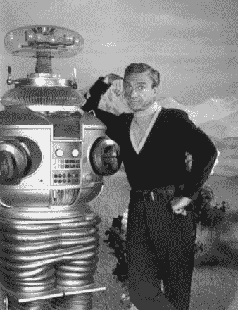
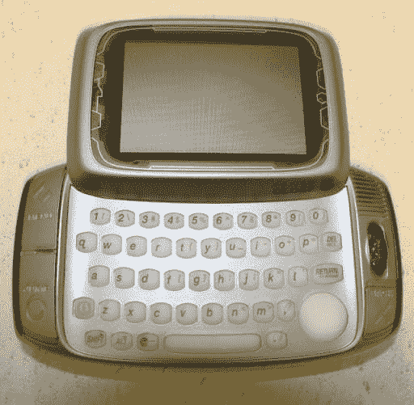
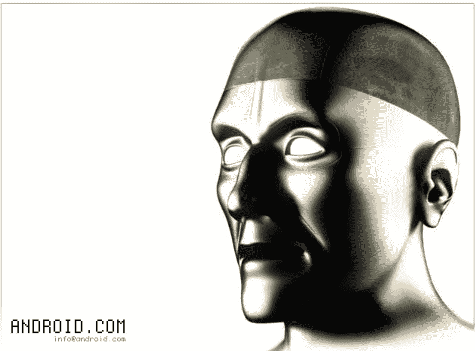
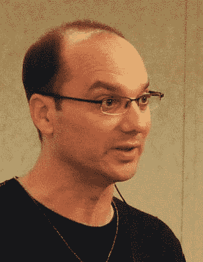
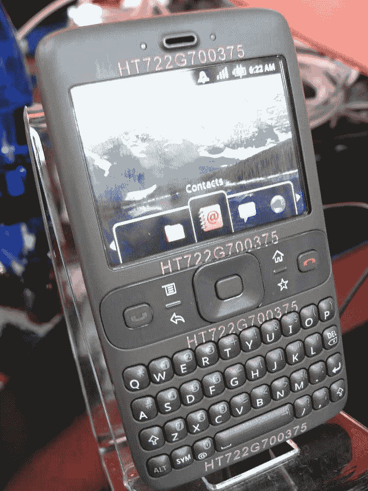
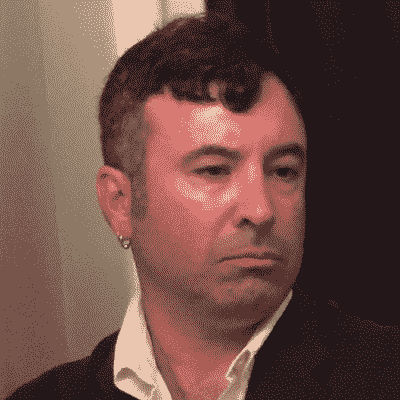
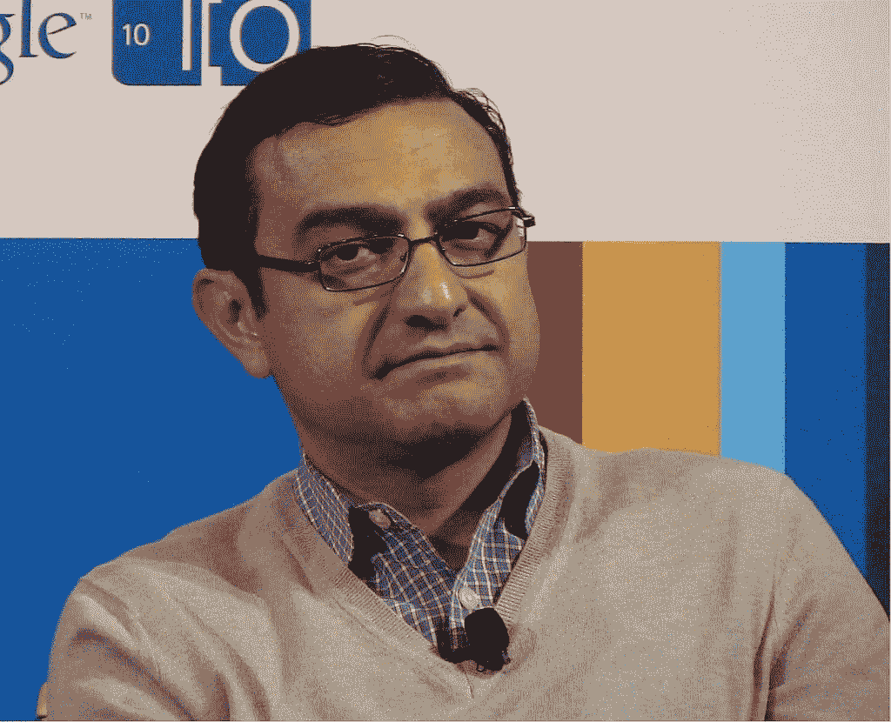
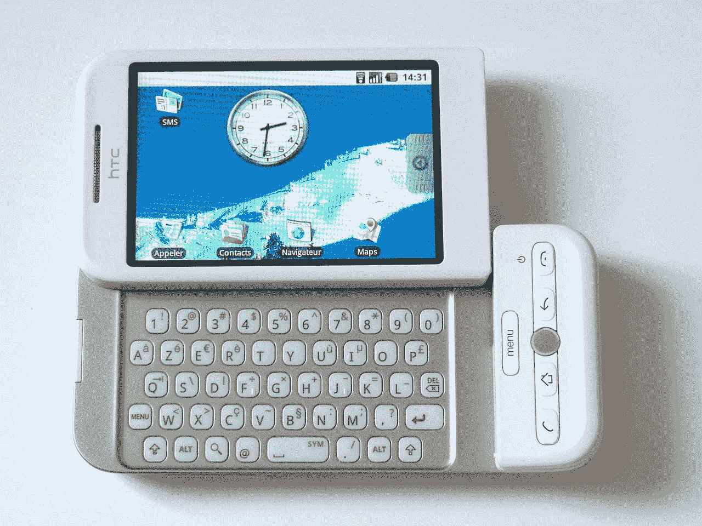

# 互联网的历史:第十五部分——安卓的诞生

> 原文:[https://simple programmer . com/history-internet-part-15-Android/](https://simpleprogrammer.com/history-internet-part-15-android/)

拥有超过 20 亿用户的 Android 是世界上使用最广泛的智能手机操作系统。但是这种成功曾经看起来很渺茫。在这里，我们将看看谷歌智能手机从苹果的阴影下崛起到市场顶端的不可思议的过程。

故事开始于 20 世纪末的帕洛阿尔托，当时安迪·鲁宾、乔·布里特和马特·赫申森成立了一家专门从事手机技术的公司 [Danger](https://en.wikipedia.org/wiki/Danger_Inc.) 。安迪·鲁宾是机器人的超级粉丝，并以《迷失太空》中*的[机器人](https://en.wikipedia.org/wiki/Robot_(Lost_in_Space))的流行语命名了他的公司。*

“危险，威尔·罗宾逊！”乔纳森·哈里斯扮演史密斯博士，并和机器人一起宣传迷失在太空中的 T2

他们在 2002 年推出了危险的智能手机(也被称为 T-Mobile Sidekick)。它的 DangerOS 操作系统很大程度上是基于 Sun Microsystems 的 Java。这款手机的屏幕是单色的，但是它提供了可下载的游戏和网络浏览。

危险臀部。大卫·穆勒拍摄的照片

2003 年，Danger 董事会决定接替鲁宾担任首席执行官，不久后鲁宾决定创办一家新公司。在 Danger 的经历给了安迪·鲁宾商业关系、信心和灵感，让他与富有的矿工 T2、尼克·西尔斯和克里斯·怀特一起创建了安卓公司。

## 安卓公司。

从[时光倒流机](https://web.archive.org/web/20050207081713/http://www.android.com:80/)中捕获 android.com，2005 年 2 月

Android Inc .成立后，所有员工都悄悄地秘密工作，只透露自己是做手机软件的。他们是一个小团队，所以为了更快地开发，他们采用了他们能找到的最好的开源软件，包括 Java 平台。

到 2005 年，鲁宾有意与一家大公司合作，试图主导智能手机行业。他后来讲述了自己在首尔向三星推销的经历:

> “我向他们推销整个 Android 愿景，就像他们是风险投资家一样。到最后，我喘不过气来，整个事情都摆了出来……一片寂静。字面上的沉默，就像房间里有蟋蟀。然后我听到有人用一种非本地语言窃窃私语，其中一名中尉在与首席执行官窃窃私语后说，“你在做梦吗？”我提出的整个愿景，他们的反应是‘你和什么军队要去创造这个？你有六个人。“你嗑药了吗，”基本上就是他们说的。"

安卓创始人安迪·鲁宾。照片由秋山洋一郎拍摄， [CC BY-SA 2.0](https://commons.wikimedia.org/w/index.php?curid=4296541)

鲁宾的失望并没有持续很久，因为两周后 Android Inc .被谷歌收购，金额未披露，据信至少为 5000 万美元。

尽管这次收购几乎没有引起媒体的注意，本·埃尔金还是为《商业周刊》撰写了一篇文章，并要求谷歌对此发表评论。一位发言人只是回答说“我们收购 Android 是因为有才华的工程师和伟大的技术。他们的到来让我们激动不已。”除了三星，谷歌的所有商业竞争对手，以及普通大众，都被蒙在鼓里，不知道 Android 到底是什么。

Android 到底是什么？鲁宾最初的设想是一个底层软件平台，手机厂商可以在这个平台上进行开发。施密特同意只做软件，但考虑把软件建成一个全功能的操作系统。另一方面，佩奇希望谷歌开发自己的手机。因此，即使在谷歌内部，也需要时间、多次会议和多次迭代才能完全理解项目的目标。

Android Inc .成为全资子公司，但在收购过程中保留了关键员工。鲁宾带领一个新团队开发了一个由 Linux 内核驱动的移动设备平台。谷歌花费了数千万美元购买 Android 使用的许多开源软件的许可证，但它无法与 Sun Microsystems 就条款达成一致，Sun Microsystems 认为谷歌对他们的 Java 平台做了太多修改。

## “更快”的原型

鲁宾的团队在谷歌 44 号大楼一楼的一个角落里工作，周围都是谷歌的广告代表，很快就发展到了 40 多名工程师。在与 HTC 的合作中，他们一起开发了“更快”的原型，这很像非常流行的黑莓手机。它有一个硬件键盘和小屏幕。

HTC 安卓手机 HT722G700375，又名“更快”。照片由来自英国伦敦的凯·亨德利拍摄

在第 13 部分中，我们了解到谷歌是苹果的重要合作伙伴，并帮助 iPhone 取得了巨大成功。

帮助苹果开发 iPhone 的谷歌团队没有向在不同大楼工作的安卓团队透露 iPhone 的秘密。对于 Android 团队来说，乔布斯在 Macworld 上发布 iPhone 的消息令人震惊。

Android 团队意识到他们需要大幅改变方向。谷歌工程师 Chris DeSalvo 反思了 iPhone 发布对 Android 的影响。“我们所拥有的突然看起来就像……90 年代。这只是你看到的那些显而易见的事情之一。”

迪沙佛明白 iPhone 是 Android 的一个重大转折点。

安迪·鲁宾看着 iPhone 的发布，完全不相信。想象着难看的 HTC 原型机，他说“天哪，我猜我们不会推出那款手机了。”

除了震惊于 iPhone 看起来有多好，Android 团队还震惊于看到他们自己的 CEO 在台上吹捧他们竞争对手的产品。“史蒂夫，我祝贺你。这款产品将会大受欢迎。”

这两种冲击结合在一起造成了团队内部的士气问题。他们真的能对抗苹果的 iPhone 并取得胜利吗？但他们也受到了乔布斯在发布会上所说的话的激励:苹果在手机上拥有“第一个完全可用的”互联网浏览器。对于前 Danger 员工来说，这是对 Danger Hiptop 记忆的侮辱。鲁宾称苹果是“网络标准的第二个采用者”

施密特、布林和佩奇告诉鲁宾，他们仍然致力于 Android 项目，并敦促他雇佣更多员工，提高进度。布林和佩奇都拥有 iPhone，每当他们看到与 iPhone 体验不匹配的功能时，他们都会批评 Android 团队。佩奇要求所有 Android 屏幕在 200 毫秒内加载完毕，并且用户界面易于单手操作。

尽管首先将一种新产品推向市场有很多好处，但有些情况下晚些时候发布会更有利。对谷歌来说，更多地了解竞争对手给了他们一个战略优势。苹果公司授予美国电话电报公司在美国四年的独家权利。这意味着所有其他网络运营商都被排除在苹果的商业计划之外，因此谷歌将不得不寻找新的合作公司。

然而，随着 iPhone 从炒作变成真正的成功故事，Android 团队的压力越来越大。这种压力部分来自谷歌内部正在形成的政治。谷歌聘请了微软平台推广部总经理维克·冈多特拉，让他负责将谷歌软件移植到手机上。

自从 11 岁第一次使用 Apple II 以来，冈多拉就一直是苹果产品的粉丝，他自豪地承认“即使我在微软为比尔·盖茨工作了 15 年，我也非常钦佩史蒂夫和苹果公司的产品。”

冈多特拉相信苹果的 iPhone 是如此之好，以至于它注定会成为销量第一的手机。他认为其他手机的销售在很大程度上注定要失败，因此停止了谷歌对许多黑莓和 Windows Media 手机的支持。一些员工非常愤怒，辞职以示抗议。尽管 Android 项目尚未受到任何直接威胁，但冈多特拉对 iPhone 的支持导致紧张局势加剧。

尽管维克·冈多特拉有微软和谷歌的背景，但他是 iPhone 的信徒。
朱莉·奥戴尔的照片， [CC BY 2.0](https://commons.wikimedia.org/w/index.php?curid=20055967)

冈多拉和乔布斯关系很好，他怀疑 Android 项目会毁掉这种关系。他问安卓团队，“让我相信这个(安卓)是我们(谷歌)应该相信的东西。”谷歌的整个移动业务战略引发了争议。

2007 年，媒体开始谈论谷歌生产一款与 iPhone 竞争的设备，他们称之为“gPhone”。谷歌高管数月来一直回避媒体的要求，直到他们准备好发言。

第一篇重要新闻文章是约翰·马克夫为《纽约时报》写的，“我是机器人:谷歌手机背后的男人”，标题引起了一些混乱。谷歌自己并没有制造手机，而是依靠合作伙伴为他们制造手机。

尽管 Markoff 没有多少关于 Android 的已知细节可以分享，但他非常有先见之明地预见到,“尽管谷歌在这个领域不处于主导地位，但它可能会重演微软在 20 世纪 90 年代中期推平网景的策略。正如微软通过将浏览器作为 Windows 操作系统的一部分免费赠送而成功“切断”了网景的空中供应一样，如果谷歌手机被赠送给手机制造商，谷歌可能会将 Windows Mobile 推到一边。

## 开放手机联盟

2007 年 11 月 5 日，开放手机联盟[宣布成立](https://www.openhandsetalliance.com/android_overview.html)。Android 工程师解释说，没有单一的“gPhone”，但他们正在开发软件，使许多不同的手机制造商能够生产更好的手机。该财团包括 HTC、摩托罗拉和三星等设备制造商；像 Sprint 和 T-Mobile 这样的无线运营商；以及芯片组制造商，如高通和德州仪器。他们一起被称为开放手机联盟。

这一宣布并没有像 iPhone 那样让人兴奋。

诺基亚、RIM 和微软等主要移动电话公司拒绝了成为该财团一部分的现金邀请，并对这一想法嗤之以鼻。诺基亚驳斥了这一声明，称“我们不认为这是一种威胁”，微软 Windows Mobile 团队的一名成员表示“我不明白他们会有什么影响。”

## Android 演示

接下来的一周，布林和工程总监史蒂夫·霍洛维茨[在 YouTube 上向全世界介绍并演示了 Android](https://www.youtube.com/watch?v=_avwGFsv60U) ，包括一个大型触摸屏的演示。

基本的用户界面在很大程度上增强了乔布斯的说法，即 iPhone 比其他任何东西都要领先几年，但 Android 对 OpenGL ES T1 硬件加速的使用意味着像 T2 地震 T3 这样的游戏可以在手机上流畅运行。布林在宣布结束时提供了 1000 万美元奖励开发出最好的新 Android 应用程序的开发者。

当天晚些时候，一名要求匿名的苹果员工声称接到了乔布斯愤怒的电话:“你看到视频了吗？一切都是对我们正在做的事情的剽窃。”

## 谷歌和苹果的“合作”

施密特早在 1993 年就开始与乔布斯建立业务关系，当时乔布斯向施密特工作的太阳微系统公司推销 Objective-C 的好处。

2006 年谷歌首席执行官施密特被任命为苹果董事会成员时，施密特和乔布斯已经是老朋友了。当时，他告诉乔布斯，谷歌内部正在进行一个早期阶段的手机项目，他们同意监督这一情况。

乔布斯也是布林和佩奇的朋友。早在 2000 年，当谷歌的投资者要求布林和佩奇聘请一位新的首席执行官时，他们说他们想雇佣乔布斯。尽管乔布斯永远不可能离开苹果转投谷歌，但他们的赞美让布林和佩奇对乔布斯青睐有加。

苹果和谷歌达成了一项秘密的非法协议，限制他们从对方雇佣员工，该协议于 2005 年 3 月 6 日生效。尽管该交易在第二年扩大到包括许多其他技术公司，如 Adobe、戴尔、微软、Ebay 和 IBM，[电子邮件证据](https://pando.com/2014/03/22/revealed-apple-and-googles-wage-fixing-cartel-involved-dozens-more-companies-over-one-million-employees/)表明，苹果和谷歌之间的密切关系最初导致了这些可疑的商业行为。

到 2007 年，谷歌和苹果的融资和运营方式已经不清楚他们在多大程度上是合作伙伴还是竞争对手。

除了施密特之外，[亚瑟·莱文森](https://en.wikipedia.org/wiki/Arthur_D._Levinson)也是两家公司的董事会成员，另外两个苹果董事会席位属于比尔·坎贝尔和[阿尔·戈尔](https://en.wikipedia.org/wiki/Al_Gore)，他们都是谷歌的顾问。

施密特将谷歌和苹果的合作关系比作国际外交:“各国之间可以有一长串的不满，但找到合作的方式符合双方的最佳利益。另一种选择——缺乏关系或战争——对每个人都是破坏性的。例如，中国和美国有许多问题，但两国之间有如此多的贸易，尽管我们有分歧，但我们必须找到维持和建立关系的方法。”

虽然乔布斯最初被他看到的 Android 演示激怒了，但施密特、布林和佩奇向乔布斯保证，谷歌不会制造自己的手机，Android 不会成为 iPhone 的直接竞争对手。施密特告诉乔布斯，对谷歌来说，支持 iPhone 比安卓项目更重要。一位苹果高管说，乔布斯“基本上是对我说，‘我相信我和这些家伙(布林和佩奇)的关系，他们告诉我正在发生的事情是真实的。’"

然后在 2008 年春天，关于重新谈判谷歌搜索和谷歌地图协议的谈判变得不欢而散。冈多特拉参观了苹果的园区，并与席勒就谷歌应该向苹果支付多少费用以及应该接收多少数据位置数据展开了激烈的争论。除了纬度和经度，Google 还想知道连接类型和手机信号塔信息。席勒拒绝了，称这将侵犯用户的隐私。这种分歧有助于让冈多特拉相信，Android 将是谷歌的未来。

为了避免与苹果的法庭大战，谷歌让他们的工程主管阿兰·尤斯塔斯回答乔布斯关于安卓的任何问题。但是到了 2008 年夏天，乔布斯得出结论，谷歌试图拖住他。

阿兰·尤斯塔斯。照片由 Rico Shen 拍摄， [CC BY-SA 3.0](https://commons.wikimedia.org/w/index.php?curid=36375110)

乔布斯和福斯特一起去了谷歌总部，看他能否说服他们停止 Android 项目。他威胁说，如果他们抄袭任何 iPhone 功能，并在 iPhone 主屏幕上给他们提供一两个图标，“如果我们关系良好的话。”

谷歌辩称，尽管苹果是第一家成功发明多点触控智能手机的公司，但他们并没有发明多点触控或 iPhone 中的大多数其他技术。

由于担心昂贵且有损品牌的诉讼，施密特、布林和佩奇做出让步，同意从第一款 Android 手机中删除 pinch to zoom 等功能。许多谷歌员工对这种投降表示不满，尤其是鲁宾，他曾考虑离开公司，并在自己的办公室挂了一块牌子，上面写着“史蒂夫·乔布斯偷了我的午餐钱。”

尽管谷歌输掉了第一场战斗，但这只是一场战争的开始。

## 公关战

Eucalyptus 电子书阅读器应用程序为用户提供了数千本公共领域的经典书籍，但在 2009 年 5 月被苹果应用商店拒绝，理由是该应用程序的用户可能会下载《爱经》，因为它认为“包含不适当的性内容”。苹果随后撤回并批准了该应用，但这并没有阻止《卫报》给苹果贴上“[老大哥](https://www.theguardian.com/media/2009/jun/14/iphone-apps-steve-jobs-apple)的标签

2009 年 7 月 28 日，当谷歌宣布苹果已经从应用商店拒绝了他们的应用时，苹果的形象受到了极大的损害。

谷歌在 2007 年收购了电话服务公司 GrandCentral。它就像 Skype 一样，提供网络通话。谷歌利用这项技术为 Android 和 iPhone 创建了一个谷歌语音应用程序。该应用程序提供了 iPhone 上尚未提供的功能，并从本质上把 iPhone 的核心通信功能从苹果转移到了谷歌的云上。

2009 年 7 月 31 日，联邦通信委员会写信给苹果公司，询问苹果公司为什么拒绝允许谷歌语音应用程序出现在其应用商店中。其中一个问题是“苹果决定拒绝谷歌语音应用和相关应用是单独行动，还是与美国电话电报公司协商？”

苹果回复道“与已发表的报道相反，苹果并没有拒绝谷歌语音应用，并在继续研究它。该应用尚未获得批准，因为在提交审查时，它似乎改变了 iPhone 独特的用户体验，用自己的电话、短信和语音邮件用户界面取代了 iPhone 的核心移动电话功能和苹果用户界面。

苹果在其应用商店上批准谷歌语音后，谷歌取得了对他们的双重胜利:它制造了一场损害苹果品牌的争议，并免费宣传了他们的应用，然后它获准将其应用程序放在 iPhone 上，并开始引诱消费者放弃苹果的功能，转而使用自己的功能。

尽管有负面的新闻报道，苹果公司继续享受着强劲和不断增长的 iPhone 销售。谷歌和他们的合作伙伴知道，要想有任何赶超的希望，他们需要生产出和产品领导者一样受欢迎的手机。第一次尝试没有达到这个最终目标，但是很受欢迎，足以被宣布为一个成功的开始。

## HTC 梦想

照片由阿克拉·NDE 拍摄-[CC BY-SA 3.0](https://commons.wikimedia.org/w/index.php?curid=6680413)

第一款 Android 手机是 HTC Dream(在美国和欧洲部分地区也被称为 T-Mobile G1，在波兰被称为 Era G1)。它的评论褒贬不一，最初的 Android 操作系统由于缺乏多点触摸手势和虚拟键盘等功能，通常被认为不如 iOS，但它显示了未来的前景。

Android 1.1 更新于 2009 年 2 月 9 日发布，修复了一些错误，并增加了一些小功能，如在消息中保存附件的功能。

Android 的第一个重大改进是 [1.5 版本](https://www.youtube.com/watch?v=YJGwmzXzMfw)，俗称“纸杯蛋糕”。这包括一系列新功能和增强功能，如支持第三方虚拟键盘、支持小工具、视频录制和回放、网络浏览器中的复制和粘贴功能、自动旋转选项，以及将视频上传到 YouTube 或将照片上传到 Picasa 的能力。

要了解 Android 是如何从纸杯蛋糕的发布演变而来的，请看 YouTubers 助手”的视频。

2009 年 4 月，T-Mobile 宣布其在美国销售了超过 100 万部 G1，占其 3G 网络设备的三分之二。

它不是 iPhone 杀手，但它足够成功，为更复杂的型号铺平了道路。

## Android 追赶 iPhone

在本文中，我们介绍了 Android 的早期。它是在苹果 iPhone 取得巨大成功的阴影下推出的，但 Android 提供了独特的优势，让它有机会在未来取得巨大成功。

Android 的故事还有很多要讲。在我们系列的下一集，我们将看到智能手机霸权之战如何加剧，无论是在产品创新还是在法庭上。