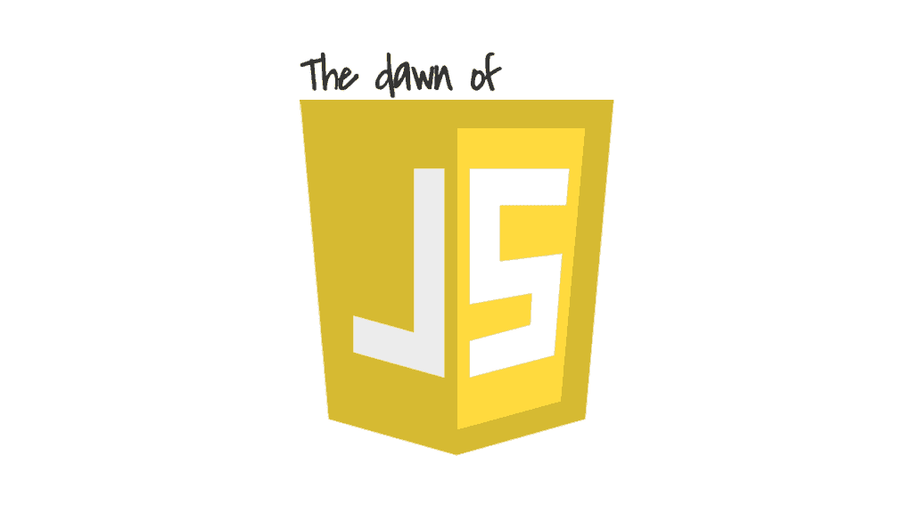

# 互联网的历史:第三部分——网景的统治

> 原文：<https://simpleprogrammer.com/history-of-the-internet-3/>

欢迎来到我们穿越时空之旅的第三部分，在这里我们将了解互联网是如何发展的，并记住它对我们生活的影响。

在第二部分中，我们重温了互联网历史上最大的革命:万维网的诞生。

1994 年圣诞节结束时，微软、网景公司和太阳微系统公司都在争夺这个革命性新市场的最大份额。

网景公司刚刚推出了 Navigator 1.0 浏览器，并开始受到欢迎。它还与太阳微系统公司达成了一项非正式协议，分享产品分销和技术交流。

由于太阳微系统公司的优势是因特网服务器，而网景公司的优势是万维网浏览器，两家公司都认识到它们可以互补。

在这一部分中，我们将看到网景公司和太阳微系统公司远远领先于微软公司，成为开拓性互联网技术的主导公司。

## One thousand nine hundred and ninety-five

微软今年开始计划许可 Netscape Navigator，并将其与新的操作系统 Windows 95 一起发运。

然而，网景公司的新任首席执行官詹姆斯·巴克斯代尔很谨慎，这些提议落空了。

相反，微软与 Spyglass Incorporated 签署了一项协议，Netscape 与康柏合作销售预装了 Netscape Navigator 的个人电脑。

## JavaScript 的黎明

他们打电话给布伦丹·艾希，让他再次和他们一起工作。

Netscape 吸引 Brendan 的主要原因是有机会在浏览器中实现 [Scheme 语言](https://en.wikipedia.org/wiki/Scheme_(programming_language))。

当他开始工作时，他听说网景公司刚刚与太阳微系统公司达成了在浏览器中开发 Java 的协议，所以在浏览器中开发 T2 方案的想法现在受到了质疑。他从 4 月到 5 月从事 HTTP 1.1 的工作，5 月初转到 Netscape 客户团队。

今年 5 月，他开发了 JavaScript 的原型 Mocha 引擎。

在 *[JavaScript Air](https://javascriptair.com)* 播客的试播集中，布伦丹·艾希讲述了他第一次开始使用 JavaScript 的时候。(然而，他不仅仅回忆过去；他还谈到了 JavaScript 的现在和未来。你可以把它下载成 MP3 或者观看 YouTube 上的[视频](https://www.youtube.com/watch?v=fg4e-2lBw5E)。)

他开玩笑说，“我在 1995 年疯狂地创作了 JavaScript，从那以后我一直在弥补它！”他后来谦虚地回忆说，“显然有错误:我工作了 10 天没有睡多少觉，”并补充说“所有的语言都有错误。”

当被问及他是否知道这将是一个大事件时，他说，“我知道这很重要，因为时机就是生命中的一切……我知道这是正确的时间和正确的地点……毅力很重要。”

虽然 Mocha 受到 Scheme 的影响，但这并不是 Brendan 热衷于实现的“在浏览器中实现 Scheme”的最初想法。Mocha 的语法被精心设计成看起来与 Java 相似，这种改变主要是由于 Netscape 正在与 Sun Microsystems 谈判一项交易。

太阳微系统公司的比尔·乔伊和网景公司的马克·安德森同意在网景导航器中加入 Mocha 的想法，但他们的市场部很快将其重命名为 LiveScript。

最初的 JavaScript 对于 Java 就像 Visual Basic 对于 Visual C++一样。这是一种更容易理解和简化的语言，是为包括设计师和业余程序员在内的广大受众重新设计的。

## 爪哇的黎明

在 1995 年 5 月 23 日的 SunWorld 大会上， [Sun Microsystems 推出 Java 1.0](http://tech-insider.org/java/research/1995/0523.html) 。小应用程序第一次可以通过互联网在计算机之间直接发送，并直接在网页内运行，即使这些计算机有不同的操作系统。

Java 立即获得了网景公司的许可，可以包含在下一个版本的 Navigator 中。业界开始猜测这种发展是否会严重侵蚀像微软这样的收缩包装软件供应商的利润。

## 互联网浪潮

5 月 26 日，比尔·盖茨给员工写了一份长长的备忘录，上面标着“机密”。主题是“[互联网浪潮](https://www.justice.gov/sites/default/files/atr/legacy/2006/03/03/20.pdf)”，他开始解释说，过去的 20 年都是关于桌面计算能力的巨大进步。

他认为未来 20 年的进步将主要归功于计算机之间更好的交流，互联网将改变世界。

在第二部分中，我们看到了 j·阿拉德是如何让比尔·盖茨更认真地对待互联网的。在这份备忘录中，比尔说他“经历了几个阶段来增加我对它的重要性的看法。现在，我认为互联网是最重要的。”他接着把互联网描绘成“自 IBM 个人电脑以来最重要的单一发展”。

比尔总结了 1995 年互联网使用的技术，并做出了 3D 虚拟现实购物和社交等预测。

他赞扬了网景公司和 Sun 公司的成就，还有 Lotus 和雅虎，后者是两个月前成立的提供互联网搜索服务的公司。

比尔认为 Novell 公司和他们即将推出的 T2 目录服务产品是一个主要威胁。他还把基于 UNIX 的技术归功于 Sun Microsystems，这种技术在支持互联网方面领先于 Windows NT。

网景公司被准确地描述为互联网上诞生的新竞争者，比尔将其浏览器的市场支配地位归功于它。比尔对未来低成本电脑主要用于网络浏览的前景感到恐惧——这一未来将威胁到微软等桌面操作系统公司的生存。

设想一个几乎每台电脑都连接到互联网的世界，他为他的公司设定了一个新的路线。

该策略涵盖了服务器和客户端上的新计划。它还追求开发自己的搜索引擎。

比尔将未来描述为一个“新时代”，并说“未来几年互联网的发展将在很长一段时间内确定我们行业的发展方向。”

当员工们读到这份备忘录时，他们可以肯定:微软决心迎头赶上并取得胜利。

## 文学魔术

当浏览器大战还处于初期阶段时，另一家互联网技术公司诞生了，它的前景非常光明。

商业企业家杰夫·贝索斯决定为他的公司找一个新名字，因为一名律师将它的原名“Cadabra”误听成了“尸”

他打开一本字典，快速翻阅着。“亚马逊”这个词跃入他的眼帘:一个“充满异国情调和与众不同”的地方，就像他希望他的商店那样。亚马逊河是世界上最大的河流，符合他创建世界上最大的书店的雄心。

他在 7 月推出了《Amazon.com 》,并销售了其第一本书，道格拉斯·霍夫施塔特的《流动的概念和创造性的类比》 。

## 淘金热开始了

詹姆斯·巴克斯代尔认为是网景上市的时候了，他在 8 月 9 日举行了首次公开募股。这是有史以来最大的一笔交易:在交易结束时，3800 万股股票被买走，该公司突然价值 44 亿美元。

此时此刻，网景公司正享受着历史性的成功，如果微软真的想像比尔·盖茨强调的那样在这个新兴市场取得胜利，他们还有一座山要爬。

整个 1995 年，比尔·盖茨一直在写一本名为《未来之路》的新书，书中包含了许多关于互联网将会变成什么样子的预测。

他到底得到了什么正确的答案？他完全弄错了什么？

加入我们这个系列的第四部分，在那里我们将回顾这本书，并对过去、现在和未来有更深的理解。