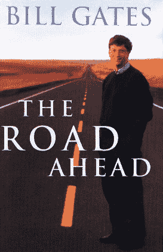
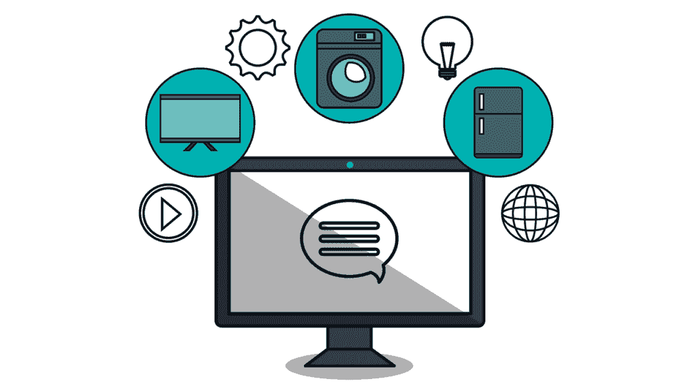
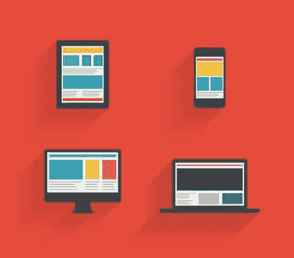

# 互联网的历史:第四部分——回到前面的路

> 原文:[https://simple programmer . com/history-of-the-internet-part-4/](https://simpleprogrammer.com/history-of-the-internet-part-4/)

欢迎来到我们穿越时空之旅的第四部分，了解互联网是如何发展的，并记住它对我们生活的影响。

我们在 1995 年末结束了第三部分，网景主导了这个新行业。

但是微软也在忙于工作，1995 年 11 月，比尔·盖茨发布了的《未来之路》，这本书描述了一个被新兴的全球信息高速公路深刻改变的未来，或者，正如我们今天更普遍地称之为互联网！

有了一百万美元的宣传预算，他开始了为期五天的洛杉矶、旧金山、纽约、华盛顿、伦敦和巴黎之旅。

*前路*连续七周占据《纽约时报》畅销书排行榜*榜首，售出 250 万册。*

在这本书上，比尔·盖茨与著名的合著者纳森·梅尔沃德和 T2 的彼得·林纳森一起工作了一整年。为了简洁起见，我们将只提到比尔，但不要怀疑内森和彼得的贡献也有助于使这本书成为今天的经典。

在本系列的这一部分中，我们将根据预测的主要变化来回顾这项工作，并检查哪些已经实现。

在袖子里面，比尔问了几个大问题:

*   什么是信息高速公路？
*   新技术将如何改变我们的生活？
*   我必须学会使用电脑吗？
*   我的工作会过时吗？

他在前言中写道:

“这应该是一本严肃的书，尽管十年后它可能不会出现。我说的话如果被证明是对的，将会被认为是显而易见的，而错误的将会被认为是幽默的。”

## 一场革命开始了

这本书以盖茨早期生活和职业生涯的简短自传开始。

比尔·盖茨意识到英特尔的微处理器技术将为运行在新芯片上的软件创造一个利润丰厚的产业，于是他和他的校友保罗·艾伦一起创立了微软。该公司的愿景源于这样一个问题:“如果计算近乎免费会怎样？”

他的使命是让“每张桌子和每个家庭都有一台电脑”，这在当时是一个大胆的想法，当他写这本书时，他想象着另一场革命即将开始。

他预测，所有人类活动都将发生在网上，我们将有更广泛的选择来决定谁是我们的朋友，以及我们如何与他们共度时光。

他认为教育以及“受教育”的含义将会改变，他预见到我们的身份感——我们是谁，我们属于哪里——将会开放。

比尔预见到新技术会激励我们达到新的创造高度。

他想象被盗设备会指引我们找到它们的位置，他还设想有能力提出任何问题并立即得到答案。

## 信息时代的开始

1995 年，技术开始改变我们处理信息的方式。

比尔呼应了戈登·摩尔自 1965 年以来一直被证实的预测，即计算能力大约每 18 个月翻一番。这一预测被称为摩尔定律。

《未来之路》中的一个错误是预测摩尔定律还将持续 20 年，到 2015 年，计算速度将会快 10，000 多倍。

这没有发生；虽然，从 1965 年开始，这种情况持续了大约 17 年。为了增加计算能力，有必要在微芯片上安装更多的晶体管。近年来，高效制造更小的晶体管变得更加困难。生产它们所需的设备极其昂贵，这就是为什么今天只有少数几家芯片制造商存活下来。

## 来自计算机行业的教训

比尔·盖茨从微软及其竞争对手所犯的错误中学到了一些宝贵的经验。

比尔认为，一家获得良好业绩的公司可能会吸引许多其他好东西，例如对公司的更大投资和希望为他们工作的顶级人才。相反，每当负面气氛占据上风，留住最有才华的员工就变得更加困难，媒体很可能会继续写负面报道。

比尔提到了一些竞争对手失败的故事，最著名的是 IBM，他们在 20 世纪 70 年代取得了巨大的成功，但在 80 年代低估了操作系统市场的商业价值。与微软的合作让 IBM 获得了 MS-DOS 的许可，这一决定最终让微软比 IBM 受益更多。

当时，MS-DOS 是一个功能强大但价格低廉的操作系统，帮助销售了更多的 IBM 个人电脑。但是 IBM 同意了一项低成本的许可协议，这使得微软可以像跳板一样自由使用它们，将它们的操作系统卖给其他电脑公司。

他们还通过提供两种高价操作系统来对冲赌注，并且缺乏小公司所拥有的专注，这意味着更难快速创新。

比尔说，IBM 没有想到他们的个人电脑会蚕食他们的商业系统，犯下了为了保护他们的高端产品而阻碍个人电脑创新的错误。

施乐公司也受到了比尔的批评，他指责施乐公司没有利用他们在图形用户界面方面的开创性研究的商业优势。

微软并不羞于从施乐(或者在某种程度上从苹果电脑)那里借鉴创意，并从微软视窗系统中赚了一大笔钱。

比尔希望我们在这里学到的关键一课是避免自满。比尔警告说，当你的业务健康时，很难识别危机，但新的机会和威胁总是会出现。

他敏锐地意识到，尽管微软过去是、现在仍然是一家大公司，但他们的规模并不能保证在互联网业务中取得成功。

## 应用和设备

比尔想象着互联网将结束每周特定时间和特定日期观看你最喜欢的电视节目的时代。20 世纪 80 年代给了我们盒式录像机，它提供了一些灵活性，比尔设想了一个互联网大大超越这项技术的世界。

他预测电视将会连接到互联网上。他怀疑它们不会看起来像电脑，也没有键盘，而是在电视内部或顶部有电子设备，有点像个人电脑。

VHS 将被类似于 CD 的光盘所取代，他说这些将被在线视频点播所取代。他还推测，“高清电视可能仍然会流行。”

比尔预测，几乎每个美国家庭都会有一台连接互联网的电脑。他还预测了彩色屏幕的袖珍电脑以及对这项技术态度的重大变化。没有人会说“哇！你有一台电脑！”再也不会了。

他把这些口袋大小的电脑称为“钱包电脑”，并说它们将有相机、电话、地址簿、地图、指南针、计算器、照片等等。

当在你的“钱包电脑”中使用 GPS 时，比尔相信它能让你追踪你的位置并提供导航服务。他还正确预测了数字货币，使用数字货币轻松支付商品的能力，使用生物识别技术提高安全性的能力，以及在你开车时有人为你读出方向的能力。

比尔的“钱包电脑”的预言还没有实现，它是用来在机场大门验证一个人的身份的。打印护照仍然是我们今天的标准，在任何计算设备被认为是更安全的选择之前，必须克服重大的安全挑战。

更先进的是能够与你的电脑对话。尽管比尔乐观地预测到 2005 年计算机将能够破译任意的句子，但从长远来看，他的设想无疑是准确的。

更乐观的预测是，计算机将有能力回答复杂的查询，例如:

“哪个主要城市观看摇滚视频和定期阅读国际贸易信息的人比例最高？”

即使在 2017 年，计算机也在这种复杂程度上挣扎。Wolfram Alpha 根本无法理解这个问题。谷歌提供的结果与问题没有太大关系，而必应给出了答案，但它没有提供任何信息来证实答案是否正确。

然而，更简单的查询，如“今天天气如何？”多年来都得到了有效回答。

## 通往公路的小路

比尔解释了建设信息高速公路所需的巨额投资:仅在美国就达 1200 亿美元。他预计，随着新的服务器和交换机增加成本，光纤电缆将进入每一个街区。

他指出，1995 年的 28.8k 调制解调器不能提供完整的音频和视频所需的带宽，但更新的技术如 ISDN 会改变这一点。

他重复了他在 1995 年 5 月给员工的关键信息:自 1981 年 IBM 个人电脑问世以来，互联网是计算世界最重要的单一发展。

比尔讲述了互联网黑帽罗伯特·莫里斯的故事，以及他在 1988 年用第一个网络蠕虫引起的混乱，但他断言互联网是数百万人可靠的交流渠道。

比尔自己小时候就对破译密码的艺术着迷。他讨论了互联网安全、单向函数，以及 Rivest、Shamir 和 Adelman 认为 129 位数字永远不会被破解的天真想法。

破解一个数字所需的时间随着位数的增加呈指数增长。1993 年，一群学者和业余爱好者接受了破解 RSA 129 这个数字的挑战，一年后[成功了](https://en.wikipedia.org/wiki/RSA_Factoring_Challenge)。

比尔警告说，“任何人都不应该对加密的安全性过于自信”，但他接着指出，“今天的数学家认为，两个素数的 250 位数长的乘积需要数百万年才能用任何可预见的计算能力来计算。”

## 内容革命

*前路*第六章的主要预测是数字内容取代印刷内容。比尔承认，杂志和其他印刷文件比它们的数字等价物有明显的优势，但他认为一旦人们有了专门的、轻便的电子书阅读器，这些优势就会减弱。

比尔说，小说不会从电子组织中受益，因为它们被设计成从头到尾线性阅读。这与事实类书籍不同，后者往往在书后有索引，可以用多种非线性方式阅读。

他还预测了个性化报纸和在线百科全书，但他做出的最鼓舞人心的预测是，更新的技术将为艺术家和科学家的创造性表达提供新的令人兴奋的机会。

## 对商业的影响

比尔预计，互联网将提供新的协作方式和机会，把人们从通常固定的办公桌前解放出来，结果是企业将变得更有效率，而且往往规模更小。

1995 年，对大企业来说，协调信息的成本是巨大的，但比尔预测这些问题将因互联网技术而大大简化。

比尔描述了表情符号在电子邮件中的使用，但他说它们“可能无法在电子邮件转变为允许音频和视频的媒介后存活下来。”

他讨论了自己在微软的业务，透露他每天花几个小时阅读和回复电子邮件。他描述了人们知道他的电子邮件地址时他遇到的一些问题:索要钱财、锁子甲，以及威胁要讲关于袒胸女服务员的淫秽故事。

## 教育:最好的投资

比尔描绘了一个比我们通常看到的 2017 年更加光明的未来。然而，这项可能在 2017 年投入使用的技术与他在 1995 年描述的并没有太大的不同。

奇怪的是，比尔把万维网描述为信息高速公路的前身。从 2017 年的观点来看，万维网几乎就是高速公路本身。

1995 年的万维网比现在简单得多，人们可能觉得它更像是一种权宜之计，而不是一种持久的技术。术语“信息高速公路”和“信息高速公路”用来指与高速互联网接入相关的一切。

近年来,“信息高速公路”一词已经完全不再使用，而万维网不仅幸存下来，而且蓬勃发展。

## 在家插上电源

比尔证明了无处不在的互联网接入不会导致我们的社会孤立。

这仍然是一个见仁见智的问题，当然有很多例子表明，由于互联网的存在，我们变得越来越不社会化。几乎所有关于在线社交网络兴起的描述都变成了现实，多人在线游戏也是如此。

关于技术如何影响建筑的预言才刚刚开始成为现实。我们已经看到了一些早期版本的产品，它们可能会成为未来“智能家居”的标准组成部分。我们放置书籍、传真机和文件抽屉等实物所需的空间已经减少了。

## 争夺金牌

与 1995 年最相关的章节是“淘金热”，比尔在其中讨论了万维网创造的新淘金热氛围。

比尔透露，微软每年在研发上的投资超过 1 亿美元，但后来又补充说，“没有人愿意承认不确定性”，并将巨额投资比作盲人摸象的故事！

正如我们将在本系列的下一集看到的那样，他关于许多公司将倾家荡产的预测将被证明是正确的。

1995 年，世界各国政府对互联网表达了截然不同的态度。比尔赞扬了英国、法国、德国和新加坡持续的技术进步和互联网的采用。就中国而言，我们听说过控制数据流入的“管理措施”。

比尔写道，由于日本的商业、学校和家庭相对缺乏个人电脑，很难预测日本会发生什么。他正确地预见到日本电话公司 NTT 将“发挥领导作用”,并指出互联网的教育优势将继续推动南韩的增长。

对于有多少处理将在客户机和服务器上执行的不同观点，也有一些评论。比尔在这里的意见是这项工作应该平均分配。

Bill 特别准确地指出“软件架构之间的斗争将会持续很长一段时间，并且可能会涉及到那些尚未表明兴趣的潜在竞争者。”

## 关键问题

最后一章“关键问题”讨论了 1995 年后互联网可能给社会带来的变化。

“几乎免费的通信和计算的可用性将改变国家之间的关系，以及国家内部社会经济群体之间的关系。数字技术的力量和多功能性将引发人们对个人隐私、商业机密和国家安全的新担忧。”

比尔告诫不要仓促决定，建议我们在达成一致意见之前花时间考虑所有的利弊。

1995 年，普通人最关心的既不是隐私，也不是国家安全。这是互联网对他们工作保障的影响。比尔警告说，整个职业和行业将陷入衰退，但同时会有新的行业和工作岗位产生。

有人举了工业革命和个人电脑革命的例子，认为每一个不必要的工作都会解放工人，让他们实现更大更好的目标。

从 2017 年的角度来看，我们可以看到互联网和万维网的发展确实创造了比它带走的更多的工作和机会。全球电子商务市场现在估计有 22 万亿美元，这个数字几乎肯定会继续上升。

还讨论了对计算机变得如此“智能”以致不再需要人类的恐惧。比尔认为这在他有生之年不太可能发生。

尽管计算机已经在某些领域取代了人类，但它们不像人类那样拥有智力。

今天，被计算机超越的前景仍然是一些人的担忧，杰里·卡普兰的 *[人类不需要应用](http://www.amazon.com/exec/obidos/ASIN/0300223579/makithecompsi-20)* 和雷·库兹韦尔的 *[奇点临近](https://en.wikipedia.org/wiki/The_Singularity_Is_Near)* 等书更详细地讨论了这一前景。

比尔还提到了计算领域的性别失衡:“今天的女孩比二十年前更加积极地使用计算机，但从事技术职业的女性仍然少得多。通过确保女孩和男孩在很小的时候就熟悉计算机，我们可以确保他们在所有受益于计算机专业知识的工作中发挥应有的作用。”

比尔认识到，互联网将使各国更加相似，并降低国界的重要性。

他谈到了失去互联网接入的主要风险，并将其与 1965 年和 1977 年的纽约大停电相提并论。比尔认为计算机安全有着良好的记录，而入侵的主要原因是人类的粗心大意。

## 隐私

隐私的丧失是讨论的另一个威胁，比尔预测政府将制定新的隐私和信息获取政策。他说，他发现“记录生活的前景有点令人不寒而栗，”但他表示，如果你被错误地指控犯罪，这可能是一个有用的不在场证明。理查德·尼克松被用作推论的例子。

比尔说，未来的隐私等级将取决于哪种恐惧更大:对监视的恐惧还是对犯罪的恐惧？

他指出，在 1995 年，大多数公民都希望保护自己的隐私，但在书中最悲观的部分，他推测，“可能只需要再发生几起类似美国境内俄克拉荷马城爆炸案的事件，人们对强烈保护隐私的态度就会发生转变。如果其他选择任由恐怖分子和犯罪分子摆布，今天看起来像数字老大哥的东西有一天可能会成为规范。”

比尔讨论了加密算法，国家安全局的担忧，以及阻止出口加密软件的立法。还提到了互联网对政治的影响，比尔认为电子投票的欺诈风险较低。

他反对所有问题都付诸表决的“直接民主”，称选民可能不理解长期成功所需的所有权衡。

比尔对互联网技术的未来感到乐观的原因之一是他收到了一封来自一位客户的感人的信:

“盖茨先生，我是一个有阅读障碍的诗人，这基本上意味着我根本不会拼写，如果没有这个电脑拼写检查，我永远也不会有希望出版我的诗歌或小说。作为一名作家，我可能会失败，但多亏了你，我会成功或失败，因为我有天赋，或缺乏天赋，而不是因为我的残疾。”

## 在很大程度上，比尔是对的

虽然不是书中的每一个预言都实现了，但大多数都实现了。总的来说，这是我自上世纪 90 年代以来在互联网上找到的最有见地的读物。

这篇文章只涵盖了本书所涵盖主题的一小部分。我发现它解决了许多对我们今天仍然相关和重要的问题。

虽然这本书已经绝版，但可以很便宜地买到二手货。

在下一集，我们将回到网景公司和微软公司之间的战争，这就是著名的第一次浏览器战争。