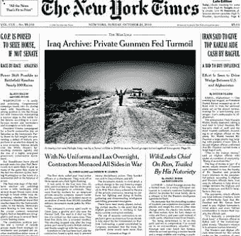
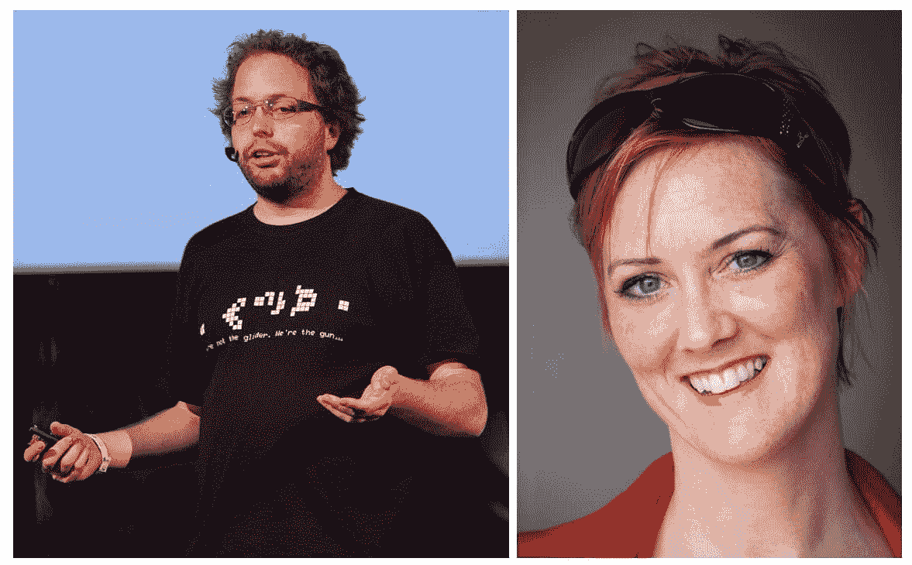
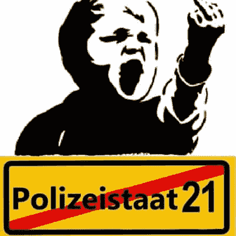

# 互联网的历史:第 22 部分-维基解密电缆门

> 原文：<https://simpleprogrammer.com/history-of-the-internet-wikileaks-cablegate/>

在第 21 部分，我们讲述了维基解密的早期和它的创始人朱利安·阿桑奇。2010 年初，阿桑奇从一等兵曼宁那里获得了大量信息。这包括同年出版的有争议的[阿富汗战争日志](https://en.wikipedia.org/wiki/Afghan_War_documents_leak)和[伊拉克战争日志](https://en.wikipedia.org/wiki/Iraq_War_documents_leak)。

阿桑奇在被指控包括强奸在内的性犯罪后，成为了一个更有争议的人物，对此他予以否认。2010 年 9 月底，他飞往英国，开始了迄今为止最大规模的活动。

Cablegate 是一个媒体术语，指基于 180 个国家的 280 个大使馆和领事馆撰写的 251，287 份美国国务院通信的出版和后续故事。

## Cablegate 出版(Dis)协议

对于即将到来的发行，达成了一项协议，授予《卫报》*、《明镜周刊》*和《纽约时报》(NYT)*限时独家访问权。*

*但是 2010 年 10 月的文章中的[维基解密创始人在逃，臭名昭著](https://www.nytimes.com/2010/10/24/world/24assange.html)，激怒了阿桑奇。他曾经钦佩 *NYT* 出版五角大楼文件，他提供给他们的军事文件使 *NYT* 写了许多重要的故事，包括一个在同一天的同一头版。*

**

*2010 年 10 月 24 日纽约时报的封面*

*感觉被背叛了，他给它贴上了一个错误百出的低级畅销品的标签，现在希望 NYT 被冻结在交易之外。他开始与*《华盛顿邮报》*就给他们独家新闻而不是*《NYT》*进行谈判，但没有与他们达成协议。*

*国家电报的公布不仅对维基解密，而且对他们的来源一等兵曼宁也有进一步法律问题的风险，所以阿桑奇至少在 2010 年 11 月之前不想公布。*

*另一个复杂的情况是，维基解密内部似乎有泄漏！前维基解密程序员 [Smári McCarthy](https://en.wikipedia.org/wiki/Sm%C3%A1ri_McCarthy) 是“大约十几个”维基解密自愿弃船者之一，据 *NYT、*和麦卡锡带着一份电报副本离开。根据阿桑奇的说法，麦卡锡也给了一份拷贝给英美记者和维基解密的捍卫者[希瑟·布鲁克](https://en.wikipedia.org/wiki/Heather_Brooke)。*

**

*左:爱尔兰-冰岛程序员 Smári McCarthy。右图:记者希瑟·布鲁克*

*阿桑奇也给了丹尼尔·埃尔斯伯格一份电报的加密副本，最初是为了制造一个宣传噱头，他把副本给了 NYT，从而把 Cablegate 和五角大楼的文件联系起来。*

*没有人能确定没有更多的拷贝被分享。维基解密和三家报纸意识到，如果他们不能很快达成协议，他们就有可能在其他地方看到新闻，这完全超出了他们的控制。*

*2000 年 11 月 1 日,《卫报》同意在他们的办公室接待阿桑奇，讨论相关安排。记者们对他和他的律师一起出现感到不快，并匆忙安排他们自己的律师尽快赶到那里。*

*两瓶夏布利葡萄酒的到来缓和了激烈的讨论，但讨论一直持续到深夜。《卫报》的编辑和《T2》的编辑在电话中同意,《NYT》的编辑会考虑发表阿桑奇对他们文章的回应，而不会发表“低俗的热门文章”。*

**

*伦敦卫报总部，国王广场。艾伦·斯坦顿的照片*

*阿桑奇要求对新闻片段进行组织，以便它们不会给人以反美的印象:“其他国家、这些糟糕的阿拉伯国家或俄罗斯的安全曝光和滥用行为……将决定这一材料的最初味道。例如，我们不应该在最初的几个星期里暴露以色列。先把整体框架定下来。这些其他不良国家的曝光将为美国的舆论定下基调。”*

*尽管这种想法是善意的，但它表明了报业的天真:大多数读者对俄罗斯或中东的丑闻不太感兴趣，甚至认为那里存在一些腐败是新闻。读者最感兴趣的是揭露他们自己国家的腐败。*

*阿桑奇还想引进西班牙语和法语报纸《国家报》和《T2 世界报》，这样这些报道会有更大的全球影响力。《卫报》的工作人员被这个要求吓了一跳，但还是同意了。*

*大多数电报都是非机密的。101，748 份电报(40%)被列为机密，16，652 份(6%)被列为秘密。没有一个是最高机密。这仍然是大量的机密信息。*

*各家报纸通过 Skype 相互合作，但设计了一个避免提及任何机密细节的交流系统。他们把写有数字的纸片举到网络摄像机前。这些是电缆的参考号。*

*美国政府官员在发布前不久联系了这些报纸，称出于安全考虑，并询问将会发布哪些内容。记者们所做的部分工作是编辑那些他们能预见到的可能危及任何人的信息。*

*NYT 编辑比尔·凯勒说:“白宫官员虽然质疑我们从材料中得出的一些结论，但感谢我们小心处理这些文件。”*

*阿桑奇对政府的说法更加怀疑，他写信给美国驻伦敦大使馆，邀请大使“私下提名”一些例子，在这些例子中，公布一份电报可能会使个人“面临重大伤害风险”*

*在国务院的法律顾问回信声称该信息的发布“将无数个人的生命置于危险之中”后，阿桑奇回信说“我理解美国政府不希望公开这些信息，也不赞成公开。也就是说，要么有风险，要么没有。你选择的反应方式使我得出结论，这种风险完全是幻想出来的，相反，你只关心压制侵犯人权和其他犯罪行为的证据。”*

*2010 年 11 月 10 日，阿桑奇被提名为 2010 年《时代》年度人物的 25 名候选人之一，尽管他的文章远不如其他候选人如[史蒂夫·乔布斯](http://content.time.com/time/specials/packages/article/0,28804,2028734_2028733_2028732,00.html)热情，更接近于[马克·扎克伯格](http://content.time.com/time/specials/packages/article/0,28804,2028734_2028733_2028723,00.html)。*

*在公布这些电报故事的一周前，阿桑奇因涉嫌强奸、性骚扰和非法胁迫而被国际逮捕令通缉。*

*在发布的前一天，美国国务院写信给维基解密用来接受捐款的 PayPal。美国国务院告诉贝宝，维基解密在美国被认为是非法的。*

## *莫斯科的关系？*

*阿桑奇与瑞典电影制作人约翰尼斯·瓦尔斯特伦(Johannes Wahlströ)有业务往来。瓦尔斯特伦的父亲，俄罗斯出生的瑞典作家[伊斯雷尔·沙米尔](https://en.wikipedia.org/wiki/Israel_Shamir)拜访了阿桑奇，并被说服给了一份与俄罗斯有关的电报副本。[据*卫报*](https://www.theguardian.com/commentisfree/andrewbrown/2010/dec/17/wikileaks-israel-shamir-russia-scandinavia) 报道，沙米尔介绍自己叫“亚当”，这是他的化名之一，维基解密发言人克里斯汀·赫拉芬森证实，沙米尔是他们在俄罗斯的代表。*

*沙米尔随后前往莫斯科，据《生意人报》 报道，他提出以 1 万美元的价格出售基于这些电报的文章。沙米尔还为 *Counterpunch* 写了一些[离奇](https://www.counterpunch.org/2010/12/31/the-minsk-election-in-a-wikileaks-mirror/) [的文章](https://www.counterpunch.org/2010/11/29/assange-in-the-entrails-of-empire/)，将阿桑奇与《黑客帝国》系列电影中的尼奥相提并论。*

*阿桑奇后来试图向记者否认自己与沙米尔的关系:“维基解密与来自世界不同地区的数百名记者合作。所有人都需要签署保密协议，通常只能有限地查看与他们所在地区相关的材料。”*

*在 Cablegate 即时报道的混乱中，有一件事基本上被忽略了，那就是美国对俄罗斯的电报。他们认为，俄罗斯政府非常腐败，其工作与有组织犯罪团伙几乎没有区别，估计俄罗斯的政治贿赂总额为每年 3000 亿美元。*

*尽管如此，或者可能正因为如此，在伦敦圆形大厅餐厅的 Cablegate 发布会上，他告诉记者，他正在考虑去俄罗斯。他永远不会有机会这样做。*

## *混乱的有线电视发射*

*报纸同意在 2010 年 11 月 28 日格林威治时间 21:30 同时发行。然而,*明镜周刊*的一辆配送车意外提前一天出发前往瑞士，一批 40 份*明镜周刊*于凌晨抵达巴塞尔站。*

*这被一个名为 [Freelancer_09](https://twitter.com/Freelancer_09) 的匿名推特用户注意到了，他开始向全世界发布该杂志的内容。惊慌失措的*明镜*记者试图联系这位神秘的推特用户，让他停止发帖，但他置之不理。*

**

*一名瑞士无政府主义者在推特上泄露了对“警察国家”的愤怒，导致发射计划脱轨*

*下午 6 点，报纸一致认为先前约定的禁运时间实际上已经结束，并开始发布:*

*   **卫报*:[美国电报泄露引发全球外交危机](http://web.archive.org/web/20101128223522/http://www.guardian.co.uk/)*
*   **NYT*:[泄密揭开美国外交](http://web.archive.org/web/20101128193022/http://www.nytimes.com/)*
*   **国家报*:[克林顿询问阿根廷总统的身心健康状况](http://web.archive.org/web/20101129222349/http://www.elpais.com/)【trans。]*
*   **世界报*:[维基解密揭露美国外交幕后](http://web.archive.org/web/20101128183630/https://www.lemonde.fr/)【trans。]*
*   **明镜周刊*:[秘密存款揭露美国世界观](http://web.archive.org/web/20101129002641/http://www.spiegel.de/)【trans。]*

*《卫报》和*【NYT】*刊登的两个最重要的新闻是，阿拉伯领导人一直在敦促对伊朗进行空袭，美国官员被指示对联合国领导层进行间谍活动，这违反了联合国的三个创始条约。*

*《卫报》和*【NYT】*刊登的两个最重要的新闻是，阿拉伯领导人一直敦促对伊朗进行空袭，美国官员被指示监视联合国领导层，违反了联合国的三个创始条约。*

*   *11 月 30 日:“[华盛顿如何看待法国的反恐斗争。] ( *世界报*)](http://web.archive.org/web/20101130043208/http://www.lemonde.fr/)*
*   *12 月 1 日:“[西班牙人不反对中情局秘密航班](http://web.archive.org/web/20101202042320/http://www.elpais.com/articulo/espana/espanoles/ponen/reparos/vuelos/secretos/elpepuesp/20101201elpepunac_36/Tes)”。] ( *国家报**
*   *12 月 1 日:“[美国如何努力让三名士兵摆脱摄影师之死](https://elpais.com/elpais/2010/12/01/inenglish/1291184454_850210.html)”。] ( *国家报**
*   *12 月 2 日:“[美国大使馆电报证实利特维年科谋杀指控](http://web.archive.org/web/20101203053137/http://www.guardian.co.uk/world/2010/dec/02/us-embassy-cables-itvinenko-putin)”(*《卫报》*)*
*   *12 月 2 日:“[撇清:美国军队对阿富汗捐款收费。] ( *明镜*)](https://www.spiegel.de/international/world/skimming-off-the-top-us-army-charged-germany-fees-for-afghanistan-donations-a-732589.html)*
*   *12 月 2 日:“[美国外交官分析了北极熊布鲁诺的死因。] ( *明镜*)](http://web.archive.org/web/20101203202732/http://www.spiegel.de/international/germany/0,1518,732532,00.html)*
*   *12 月 3 日:“[美国大使寻求限制电报辐射。](《明镜周刊》)](http://web.archive.org/web/20101206034114/http://www.spiegel.de/international/germany/0,1518,732777,00.html)*
*   *12 月 3 日:“[保守派承诺运行‘亲美政权’](https://www.theguardian.com/politics/2010/dec/03/wikileaks-cables-us-special-relationship)”(*《卫报》*)*
*   *12 月 3 日:“[电报描绘阿富汗贪污，从顶部开始](https://www.nytimes.com/2010/12/03/world/asia/03wikileaks-corruption.html)”(*NYT*)*
*   *12 月 4 日:“[维基解密电报指责中国政府对谷歌黑客攻击](http://www.guardian.co.uk/technology/2010/dec/04/wikileaks-cables-google-china-hacking)”(*《卫报》*)*
*   *12 月 4 日:“[不要看，不要读:政府警告其工作人员远离维基解密文件](https://www.nytimes.com/2010/12/05/world/05restrict.html)”(*NYT**
*   *12 月 5 日:“[害怕网络的中国大规模黑客攻击](https://www.nytimes.com/2010/12/05/world/asia/05wikileaks-china.html)”(*NYT**

*阿桑奇做了一个[现场 Q & A](https://www.theguardian.com/world/blog/2010/dec/03/julian-assange-wikileaks) 回答了关于他的澳大利亚国籍、不明飞行物(显然在 Cablegate 档案中有提到它们)、对他生命的威胁(呼吁煽动谋杀指控)以及曼宁的问题，他称曼宁为“无与伦比的英雄”*

*一位前英国外交官指责他破坏了整个外交进程，认为“没有谨慎和对消息来源的保护，外交就无法运作。这不仅适用于美国，也适用于英国和联合国。”阿桑奇只是将此斥为“一封巨大的社论信”。*

## *维基解密有线电视门反弹*

*美国国务院谴责部分电报的泄露是“鲁莽和危险的行为”乔·克莱恩为《时代》杂志撰写文章，宣布“阿桑奇是一名罪犯”*

*前美国副总统候选人莎拉·佩林称阿桑奇“像追捕基地组织和塔利班领导人一样被紧迫追捕”*

*共和党国会议员也表达了暴力报复的愿望:纽约州国会议员[彼得·金](https://en.wikipedia.org/wiki/Peter_T._King)建议将维基解密指定为“外国恐怖组织”，[密歇根州的皮特·霍克斯特拉](https://en.wikipedia.org/wiki/Pete_Hoekstra)提出“如果我们追捕他们，并能够以叛国罪定罪，那么死刑就开始生效”，麦克·罗杰斯说“我认为这里显然应该考虑死刑。”*

*尽管美国国务卿希拉里·克林顿在当年早些时候倡导全球互联网自由，包括批评政府而不用担心报复的自由，但她对维基解密采取了不同的态度，认为“像这样的披露破坏了负责任政府的正常职能。”阿桑奇后来同意了这一点，但没有表示后悔，声称“克林顿提到的‘织物’是由谎言编织而成的。”*

*NYT 回应了越来越多的批评，称“不顾官方的反对发表这样的材料是令人生畏的，但得出美国人无权知道以他们的名义在做什么的结论是冒昧的。”*

*联合国特别报告员胡安·门德斯为阿桑奇辩护说，披露前总统乔治·w·布什执政期间的酷刑应该是奥巴马政府的主要关注点。*

*正在出现的不仅仅是一场口水战，而是跨越网络空间的战争。赛尔夫称“黑客行动主义者为好”[小丑](https://twitter.com/th3j35t3r)显然搞垮了维基解密网站，并在推特上写道“【www.wikileaks.org】T2——探戈下来——企图危及我们军队的生命，“其他资产”&外交关系。”*

*阿桑奇将主要网站转移到亚马逊的 EC2 弹性云计算服务上。这项服务允许服务器的数量随着网站需求的增加而增加，从而使维基解密能够抵御对其网站的持续拒绝服务攻击。*

*公司 [EasyDNS](https://en.wikipedia.org/wiki/EveryDNS#Wikileaks.org_Controversy) 提供了将维基解密服务器的 IP 地址翻译成人类可读的 www.wikileaks.org[的服务，但终止了这项服务。维基解密随后将其地址改为](http://www.wikileaks.org) [www.wikileaks.ch](http://www.wikileaks.ch) 在瑞士注册，托管在瑞典的一个核掩体中。瑞典托管公司 [PRQ](https://prq.se/) 说“如果它在瑞典是合法的，我们将托管它，并且不管任何压力都要把它关闭。”*

*维基解密融资也被憋死了。由于“违反了贝宝可接受的使用政策”，贝宝暂停了维基解密的账户。万事达和 Visa 也切断了对该组织的服务，PostFinance 关闭了阿桑奇的银行账户，理由是他没有住在日内瓦。*

*“黑客行动主义者”组织 Anonymous 随后发起了“为阿桑奇报仇行动”，并鼓励对它认为虐待过阿桑奇的组织进行拒绝服务攻击。该组织随后对 PayPal、PostFinance、EveryDNS、Visa、Mastercard 以及美国参议员乔·利伯曼的网站进行了网络攻击。*

*维基解密的推特账户引用了网络自由活动家[约翰·佩里·巴洛](https://en.wikipedia.org/wiki/John_Perry_Barlow):[第一场严重的信息战正在进行。战场是维基解密。你是军队。](https://twitter.com/wikileaks/status/10636112787677184)*

*两名青少年因非法使用[低轨道离子炮](https://en.wikipedia.org/wiki/Low_Orbit_Ion_Cannon)在荷兰被捕，但很可能大多数肇事者从未被抓获。*

## *阿桑奇被捕*

*2010 年 12 月 6 日上午，在听到国际刑警组织对他的性犯罪逮捕令后，阿桑奇同意会见伦敦警察厅引渡小组。警察逮捕了他，解释说他们是代表瑞典当局行事。*

*阿桑奇为周末澳大利亚人写的文章[不要因为透露令人不快的真相而射杀信使](https://www.theaustralian.com.au/in-depth/wikileaks/dont-shoot-messenger-for-revealing-uncomfortable-truths/news-story/43b912ca277c90355fab12cc83cd4e69)在第二天晚上发表。他列举了对他和他儿子的各种威胁，并批评澳大利亚和美国政府说，他们不希望真相被揭露。*

*在伦敦威斯敏斯特市地方法院，法官里德尔向法庭解释说，该案件与维基解密无关，而是关于瑞典涉嫌的性犯罪。阿桑奇表示，他不同意引渡到瑞典。*

*当被问到他的地址时，他回答说“邮政信箱 4080 号”,逗乐了画廊，却没有逗乐法官。里德尔拒绝保释，理由是他可能逃跑，阿桑奇被放进一辆货车，带到女王陛下的旺兹沃斯监狱。阿桑奇之前曾将自己与他的英雄[亚历山大·巴甫洛夫·索尔仁尼琴](https://en.wikipedia.org/wiki/Aleksandr_Solzhenitsyn)相提并论，现在他终于与他有了共同点:在监狱里度过的时光。*

*关于阿桑奇的被捕，美国国防部长盖茨告诉记者，“对我来说，这听起来是个好消息。”瑞典的检察官表示，他们“没有受到任何压力，无论是政治压力还是其他压力”，但阿桑奇的律师马克·斯蒂芬斯推测，“许多人认为起诉是出于政治动机”，并暗示(没有证据)阿桑奇是某种设置的受害者。*

*与此同时，Cablegate 的新闻报道不断涌现:*

*   *12 月 6 日:“[维基解密电报声称半岛电视台改变了报道以适应卡塔尔外交政策](https://www.theguardian.com/world/2010/dec/05/wikileaks-cables-al-jazeera-qatari-foreign-policy)”(*《卫报》*)*
*   *12 月 6 日:“[这就是美国对他们的看法。] ( *国家报*](http://www.elpais.com/articulo/espana/Zapatero/lleva/mal/le/den/clases/algo/elpepuesp/20101205elpepunac_14/Tes)*
*   *12 月 7 日:“[美国竭力阻止武器流动](https://www.nytimes.com/2010/12/07/world/07wikileaks-weapons.html)”(*NYT*)*
*   *12 月 7 日:“[美国外交官指出本·阿里在突尼斯的“僵化”政权。] ( *世界报*)](http://web.archive.org/web/20101208045258/http://www.lemonde.fr/documents-wikileaks/article/2010/12/07/wikileaks-les-diplomates-americains-pointent-le-regime-sclerose-de-ben-ali-en-tunisie_1450406_1446239.html#ens_id=1446739)*
*   *12 月 7 日:“[华盛顿努力重建受损的声誉](https://www.spiegel.de/international/world/outrage-and-apologies-washington-fights-to-rebuild-battered-reputation-a-733088.html)”。] ( *明镜*)*
*   *12 月 8 日:“[美国试图影响世界气候机构](http://www.spiegel.de/international/world/0,1518,733273,00.html)”。] ( *明镜*)*
*   *12 月 9 日:“[辉瑞‘用卑鄙手段逃避临床试验支出’](http://www.guardian.co.uk/business/2010/dec/09/wikileaks-cables-pfizer-nigeria)”(*《卫报》*)*
*   *12 月 10 日:“[塞尔维亚怀疑俄罗斯帮助逃犯拉特科·姆拉迪奇](https://www.theguardian.com/world/2010/dec/09/wikileaks-serbia-russia-ratko-mladic)”(*《卫报》*)*
*   *12 月 13 日:“[打击伊斯兰主义者的行动进展甚微](http://www.guardian.co.uk/world/2010/dec/13/wikileaks-cables-uk-muslim-communities)”(*《卫报》*)*
*   *12 月 15 日:“[维基解密:酷刑和极权主义，厄立特里亚的日常生活，一个漂泊不定的国家。] ( *世界报*)](http://www.lemonde.fr/documents-wikileaks/article/2010/12/15/wikileaks-l-erythree-une-pays-a-la-derive_1453983_1446239.html)*
*   *12 月 16 日:“[印度被指控在克什米尔系统地使用酷刑](https://www.theguardian.com/world/2010/dec/16/wikileaks-cables-indian-torture-kashmir)”(*《卫报》*)*
*   *12 月 17 日:“[美国施压意大利影响司法](https://www.spiegel.de/international/europe/cia-rendition-case-us-pressured-italy-to-influence-judiciary-a-735268.html)”。] ( *明镜*)*

*2010 年 12 月 11 日，*《每日电讯报》*称阿桑奇
为世界上最危险的人，并引用了最高调的维基解密自愿放弃该组织的丹尼尔·多姆沙伊特·伯格的话。*

*Domscheit-Berg 说“我觉得他背叛了维基解密应该代表的东西。围绕阿桑奇和该组织的政治冲突有太多的炒作，而围绕出版内容的炒作较少。该组织的基本理念最初是公众和媒体获取信息。但是维基解密在决定哪部分媒体获得信息时，主观地站在了哪一边。它创造了一个金钱易手的市场。”*

## *阿桑奇保释了*

*阿桑奇于 12 月 14 日第二次出庭，他的律师杰弗里·罗伯逊告诉法庭，他在获准保释后试图逃跑的想法是荒谬的。*

*皇家检察院对保释提出上诉，并提交给高等法院，高等法院听说阿桑奇可能不会逃离该国，而只是在英国消失。罗伯逊嘲笑这种想法:“难道真的认为迈克尔·摩尔先生会戴着棒球帽蒙混过关，半夜去诺福克，计划把这位我们不知道的先生带到哪里？”*

**

*在阿桑奇逃跑前不久，迈克尔·摩尔和他的棒球帽的形象被用来嘲笑阿桑奇逃跑的想法。
[照片由法国巴黎的尼古拉斯·格宁拍摄，CC BY-SA 2.0](https://commons.wikimedia.org/w/index.php?curid=8469812)*

*12 月 16 日，在支付了 240，000 英镑的现金和担保后，阿桑奇被保释出狱，条件是他必须居住在诺福克郡的艾林厄姆庄园。罗伯逊开玩笑地称之为“豪宅逮捕”，因为他的住所即将被大幅升级为[格鲁吉亚豪宅](https://www.cbsnews.com/news/just-where-is-wikileaks-founder-julian-assanges-mansion-arrest/)。*

*几个支持者为他提供了担保，包括沃恩·史密斯，一个非常了解危险生活的人。他曾是掷弹兵卫队的队长，后来成为前线电视台的自由录像记者。史密斯在科索沃拍摄时被枪击中两次，多亏他随身携带的手机挡住了狙击手的子弹，他才幸免于难。*

*史密斯解释了他帮助阿桑奇的决定:“上周看着他向英国司法系统自首，我决定不惜一切代价确保他不会因为他激怒的强大势力的愤怒而被剥夺基本权利。”*

*虽然法庭听证会正在考虑引渡到瑞典，澳大利亚记者和阿桑奇的支持者约翰·皮尔格警告说“我们不应该太关注引渡到瑞典，而是美国。这是这种情况下最大的潜台词。我们都知道的幽灵是，他可能会在美国某个最高安全级别的监狱里结束自己的一生。”阿桑奇甚至更加悲观，他告诉记者“我在美国被杀的几率很高。鉴于资深和有影响力的美国政客不断呼吁谋杀我，杰克·鲁比式的监狱系统。”*

*2010 年 12 月 14 日，美国司法部对曼宁、琼斯多蒂尔、阿桑奇以及程序员[罗普·贡格里普](https://en.wikipedia.org/wiki/Rop_Gonggrijp)和[雅各布·阿佩尔鲍姆](https://en.wikipedia.org/wiki/Jacob_Appelbaum)的推特账户发出秘密传票。*

*应 Twitter 律师的要求，2011 年 1 月 5 日的一项法庭命令启封了传票，不久之后， *NYT* [发表了这个故事](https://www.nytimes.com/2011/01/09/world/09wiki.html)。维基解密暗示谷歌和脸书可能也收到了传票。脸书拒绝置评，谷歌也没有立即回应 T4 NYT 的询问。*

*2011 年，当阿桑奇的法律上诉正在进行时，他决定与今日俄罗斯签署一项电视协议。朱利安·阿桑奇的节目将自己描述为“寻求革命思想”，采访了来自世界各地的各种嘉宾，讨论政治问题。*

## *完全未编辑的泄漏*

*为了保护美国外交官的线人，电报的报道包括了编辑。但是到了 2011 年 8 月，一系列的失误导致了全部未经编辑和删节的电报被公开，包括了来自伊朗、中国、阿富汗和阿拉伯世界的敏感名字。*

*阿桑奇最初给了《卫报》的伊恩·特雷纳一个密码，用于解密这些电报。阿桑奇还将加密数据存储在维基解密服务器上的一个隐藏数据文件中。在《朱利安·阿桑奇保密战内幕》一书中，大卫·利和卢克·哈丁描述了阿桑奇在一张餐巾纸上递出一个密码:*

*阿桑奇漫不经心地在利奥波德酒店的餐巾纸上圈出了几个单词和酒店的标志，并添加了短语“无空格”。这是密码。在角落里，他潦草地写了三个简单的字母:GPG。GPG 指的是他用于临时网站的加密系统。这条餐巾的触感非常完美，配得上约翰·勒·卡雷的惊悚片。”*

*2011 年 8 月，关于隐藏文件和密码的信息被公布在一个在线论坛上。阿桑奇指责《卫报》和他的前同事丹尼尔·多姆沙伊特·伯格，声称“到 8 月中旬，我们发现一名前德国雇员——我在 2010 年暂停了他的职务——通过在加密文件的位置周围购物，与密码在书中的位置配对，与各种组织和个人建立了业务关系。按照信息传播的速度，我们估计两周内大多数情报机构、承包商和中间人将会掌握所有的电报，但公众不会。”*

*阿桑奇决定公布全部未经编辑的电报，并提前通知国务院他的新计划。维基解密的莎拉·哈里森给国务院前台打电话，告诉接线员阿桑奇想和希拉里·克林顿通话。虽然克林顿从未接电话，但维基解密最终联系到了她的高级法律顾问。*

*维基解密的推特账户随后呼吁用户使用标签“WLVoteYes”或“WLVoteNo”投票决定是否同意公布未经编辑的电报。*

*电报全文公布后，卫报反驳了阿桑奇对他们的指责，称“这本书出版时没有人表示担心，如果维基解密的任何人认为这危及安全，他们有七个月的时间删除文件。”*

*在对未经编辑的完整出版物进行评论时，*明镜周刊总结道:“一连串粗心的错误、巧合、轻率和混乱现在意味着没有潜在的举报者会对现在求助于一个泄漏的平台感到舒服。他们似乎失去了控制。”【反。]**

## **阿桑奇违反保释**

**2012 年，英国最高法院裁定，阿桑奇应被引渡到瑞典，面临性侵犯指控。阿桑奇最后的上诉选项是向斯特拉斯堡的欧洲人权法院提出申请，但阿桑奇决定反对这一点，并采取了另一项几乎没有人预料到的行动。**

**2012 年 6 月 19 日，厄瓜多尔外交部长里卡多·帕蒂尼奥宣布，阿桑奇已经申请政治庇护，厄瓜多尔政府正在考虑这一请求，阿桑奇目前在厄瓜多尔驻伦敦大使馆。**

**英国警方的任务是逮捕阿桑奇，但根据维也纳公约，他们不得进入大楼逮捕他，只能给他发一封信，要求他离开大楼并向警察局报告。**

**阿桑奇拒绝遵守这一点，8 月，当阿桑奇获得政治庇护时，英国和厄瓜多尔的关系进一步紧张。厄瓜多尔宣称“由于阿桑奇坚决捍卫言论自由和新闻自由……在任何特定时刻，他的生命、安全或个人完整性都可能面临危险。”**

****

**2012 年 8 月，阿桑奇在厄瓜多尔驻伦敦大使馆的阳台上。照片由来自英国伦敦的 Snapperjack 拍摄。 [CC BY-SA 2.0](https://commons.wikimedia.org/w/index.php?curid=23276227)**

**2012 年 8 月 19 日，阿桑奇在大使馆的阳台上发表了一个胜利的公开演讲，称言论自由受到了威胁，并告诉奥巴马总统“放弃对维基解密的政治迫害”**

**在这一集里，我们报道了 2010 年到 2012 年间维基解密的故事。在此期间，以及随后的几年里，直到今天，人们对阿桑奇是否有罪仍存在分歧，并对言论自由和国家安全提出了许多问题。**

**在下一集，我们将报道 2013 年最大的新闻，爱德华·斯诺登。**